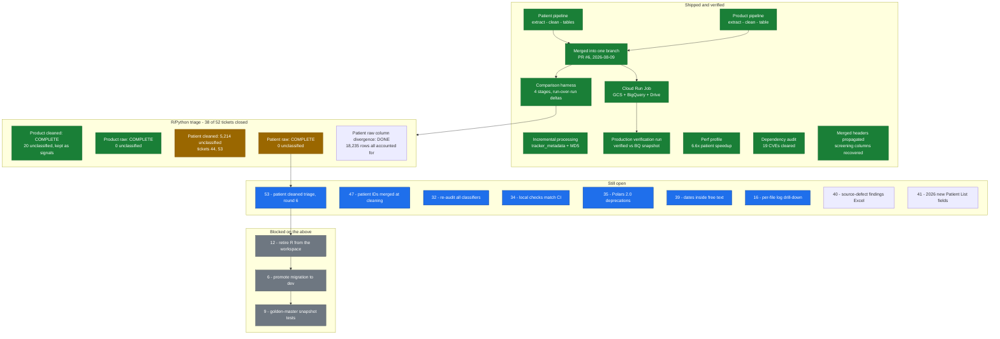

# Migration: R to Python data pipeline (`migration` -> `dev`, PR #2)

Replaces the R implementation of the A4D medical tracker pipeline with a Python
one covering both arms (patient + product), plus deployment, state management,
and an R/Python comparison harness used to verify the migration cell by cell.

240 commits, 335 files, +37,949 / -701. CI green on `migration` HEAD
(run `31841680157`). 664 tests.

**This MR is not ready to merge yet** — see "Still open" at the end. It is
posted so the state is reviewable while the remaining verification work runs.

> Keep this document current: update it at the end of every working session,
> alongside [docs/wayfinder/map.md](../wayfinder/map.md).

---

## Treasure map



---

# Part 1 — The `a4d` package

## What it does

Reads A4D clinic Excel trackers (one workbook per clinic per year, one sheet
per month) and produces analysis-ready BigQuery tables. Two independent arms
run over the same workbooks:

- **patient** — the per-month patient sheets plus the `Patient List` sheet
- **product** — the `INV` / stock section (insulin and supply movements)

```
GCS bucket                Excel trackers            per-tracker parquet          tables            BigQuery
a4dphase2_upload   -->    <clinic>/<year>_...  -->  patient_data_raw/       -->  patient_static    -->  tracker.*
Google Drive              .xlsx                     patient_data_cleaned/        patient_monthly
clinic_data.xlsx                                    product_data_raw/            patient_annual
                                                    product_data_cleaned/        product_data
                                                    logs/                        clinic_data_static
                                                                                 table_logs
                                                                                 table_errors
                                                                                 tracker_metadata
```

`clinic_id` is the tracker's parent folder name. The tracker year comes from
sheet names (`Jan24` -> 2024) or the filename.

## Module map

| Module | Purpose |
|---|---|
| `extract/patient.py` | Excel -> raw patient parquet (openpyxl, multi-sheet, two-row header merge) |
| `extract/product.py` | Excel -> raw product parquet (month sheets, stock section) |
| `extract/wide_format.py` | Mandalay wide-format handling (column expansion 2020-21, cell splitting 2017-19) |
| `clean/patient.py` | Type conversion, validation, transformations -> cleaned parquet |
| `clean/product.py` | Product cleaning (R steps 2.0-2.21), running balance, chronological sort |
| `clean/schema.py` / `schema_product.py` | 83-column patient and 20-column product meta schemas |
| `clean/converters.py` | Safe type conversion with `ErrorCollector` |
| `clean/validators.py` | Allowed-value validation, canonical labels + alias map |
| `clean/transformers.py` | Regimen extraction, BP splitting, FBG conversion |
| `clean/date_parser.py` | Flexible date parsing (Excel serials, DD/MM/YYYY, month-year, typo rescue) |
| `tables/*.py` | Aggregate cleaned parquets into the final tables (patient, product, clinic, logs, metadata) |
| `pipeline/*.py` | Per-tracker and per-arm orchestration, parallel workers, result dataclasses |
| `gcp/*.py` | GCS download/upload, BigQuery load, Drive download, production-run verification |
| `reference/*.py` | Column synonyms, product categories, province validation (YAML in `reference_data/`) |
| `validate/*.py` | Source-vs-output reconciliation |
| `migration/compare.py` | R/Python comparison engine (Part 2) — dies with R's retirement |
| `state/*.py` | Incremental processing: manifest, MD5 filter, source resolution |
| `config.py` | Pydantic settings from `.env` / `A4D_*` env vars |
| `cli.py` | Typer CLI |

Row-level data-quality problems never raise: `ErrorCollector` accumulates them
and they land in `table_errors` / `table_logs` with an `error_code`. Sentinels
for unusable values are numeric `999999`, string `"Undefined"`, date
`"9999-09-09"` — matching R's constants.

## Configuration

Everything is a Pydantic setting, overridable via `.env` or `A4D_*` env vars:

| Setting | Default |
|---|---|
| `A4D_DATA_ROOT` | the local tracker directory |
| `A4D_OUTPUT_DIR` | `output` (relative to `data_root`) |
| `A4D_PROJECT_ID` / `A4D_DATASET` | `a4dphase2` / `tracker` |
| `A4D_DOWNLOAD_BUCKET` / `A4D_UPLOAD_BUCKET` | `a4dphase2_upload` / `a4dphase2_output` |
| `A4D_MAX_WORKERS` | `4` |
| `A4D_ERROR_VAL_NUMERIC` / `_CHARACTER` / `_DATE` | `999999` / `Undefined` / `9999-09-09` |
| `A4D_MIN_TRACKER_YEAR` / `_MAX_TRACKER_YEAR` | `2017` / `2030` |

## CLI

Commands are grouped by *process*, not by the object they act on:

```bash
uv run a4d run                    # full end-to-end: Drive + GCS download, both arms, tables, GCS + BigQuery upload
uv run a4d run patient            # patient arm only, local
uv run a4d run product            # product arm only, local

uv run a4d create tables          # rebuild all tables from existing cleaned parquets
uv run a4d create logs            # rebuild only the logs table from existing log files

uv run a4d upload tables          # -> BigQuery (--only patient|product|clinic|logs|errors|metadata)
uv run a4d upload output          # -> GCS

uv run a4d download trackers      # <- GCS
uv run a4d download clinic-data   # <- Google Drive
```

Key flags on `run`: `--file` (single tracker), `--workers/-w`, `--skip-download`,
`--skip-upload`, `--skip-drive-download`, `--skip-patient`, `--skip-product`,
`--skip-tables`, `--incremental`, `--force`.

`--incremental` skips trackers whose MD5 and completion state match the previous
run's manifest (BigQuery -> local parquet -> empty fallback); both arms see the
same filtered queue. `--force` wipes prior local outputs first and overrides
`--incremental`.

## Usage scenarios

```bash
# 1. First-time setup
uv sync && just hooks

# 2. Debug one tracker end to end (no GCS, no upload)
just run-file "/path/to/2024_Mahosot Hospital A4D Tracker.xlsx"
just run-file-product "/path/to/2024_Mahosot Hospital A4D Tracker.xlsx"

# 3. Full local run over everything in data_root, both arms, no cloud
uv run a4d run --skip-download --skip-upload --skip-drive-download

# 4. Reprocess everything from scratch (what triage sessions use before comparing)
uv run a4d run patient --force
uv run a4d run product --force

# 5. Pull the current production trackers down, process locally, upload nothing
just run-download

# 6. Cheap daily-style run: only trackers that actually changed
uv run a4d run --incremental

# 7. Tables only, from parquets already on disk
just create-tables

# 8. Production -- see "Running in production" below
```

## Development commands

```bash
just ci            # format-check + lint + type-check + test, the same set CI runs
just test          # unit tests (skips slow/integration)
just test-fast     # no coverage, fail fast
just test-all      # everything including slow + integration
just format / fix / lint / check
just sync / update / info / clean
just docker-build / docker-smoke / docker-push / docker-list / docker-clean
just job-settings  # current Cloud Run CPU/memory/timeout/parallelism
```

## Running in production (GCP)

The pipeline is **already deployed and running** in Google Cloud as a Cloud Run
Job — a one-shot container that downloads trackers from GCS, processes both
arms, uploads output to GCS and loads it into BigQuery, then exits. It has been
executed for real against production and verified against a pre-run snapshot.

Everything lives in **`asia-southeast2` (Jakarta)** — Artifact Registry, the
Cloud Run Job, both GCS buckets and the BigQuery dataset. This is a data
residency requirement: patient data must not be processed or stored in the EU.
Bucket and dataset locations are fixed at creation time.

| | |
|---|---|
| Job | `a4d-pipeline` (Cloud Run Job, `asia-southeast2`) |
| Image | `asia-southeast2-docker.pkg.dev/a4dphase2/a4d/pipeline:latest`, also tagged per git SHA |
| Resources | 8 vCPU, 8 GiB, 3600s task timeout, `A4D_MAX_WORKERS=8` |
| Service account | `a4d-pipeline@a4dphase2.iam.gserviceaccount.com` — `storage.objectViewer` on `a4dphase2_upload`, `storage.objectCreator` on `a4dphase2_output`, `bigquery.jobUser` + `bigquery.dataEditor` project-level |
| Storage | `A4D_DATA_ROOT=/tmp/data`, ephemeral in-container — nothing persists between executions |
| Base image | `python:3.14-slim`, `uv sync --frozen --no-dev`, default `CMD` is `a4d run` |
| Scheduling | Cloud Scheduler is **not** enabled yet; runs are triggered manually |

Start, monitor, verify, roll back:

```bash
just backup-bq        # snapshot BigQuery tables (7-day expiry) -- the rollback point
just deploy           # build, push, point the job at the new image
just run-job          # trigger an execution
just logs-job         # stream logs from the running execution
just job-settings     # current CPU / memory / timeout / parallelism
just rollback abc1234 # revert the job to a previous git SHA
uv run python scripts/verify_production_run.py   # live BigQuery tables vs the snapshot

just deploy && just run-job   # redeploy + run after a code change
```

`verify_production_run.py` (+ `src/a4d/gcp/verify.py`, unit-tested) compares row
counts, distinct clinic counts and schema against the `backup-bq` snapshot. The
first combined patient+product production execution passed it cleanly — all
four tables grew, 51 -> 53 clinics, no anomalies.

Full instructions — one-time infrastructure setup (service account, IAM grants,
Artifact Registry, job creation), the three levels of local image testing before
deploying, and the optional Cloud Scheduler wiring — are in
[SETUP.md](../../SETUP.md).

---

# Part 2 — The R/Python comparison harness

The single most important tool in this migration. It is how "is the Python
pipeline right?" was turned into a number that goes down each session.

Migration-only, deliberately **not** wired into `a4d.cli`: it has a defined
end of life at R's retirement (ticket 12). Engine in
`src/a4d/migration/compare.py` (pure, unit-tested), thin CLI in
`scripts/compare_outputs.py`.

## How to run it

```bash
just compare-outputs \
  "/Volumes/USB SanDisk 3.2Gen1 Media/a4d/output_r" \
  "/Volumes/USB SanDisk 3.2Gen1 Media/a4d/output_python" \
  output/comparison

# equivalently
uv run python scripts/compare_outputs.py \
  --r-dir  ".../output_r" \
  --py-dir ".../output_python" \
  --output-dir output/comparison \
  --only-mismatches      # print only files with at least one measure flagged
```

It takes two *existing* output directories and diffs them — it never runs
either pipeline. The R side is a frozen baseline on the test-data drive; R is
not re-run (one deliberate exception, when the tracker set grew, framed as the
final capture before R is retired).

## What it compares

Four stages, each producing its own workbook, so a divergence can be localised
to extraction vs. cleaning:

| Stage | Directory | Row-alignment key |
|---|---|---|
| Patient (raw) | `patient_data_raw/` | `patient_id` + `sheet_name`, ordinal tie-break |
| Patient (cleaned) | `patient_data_cleaned/` | `patient_id` + `sheet_name`, ordinal tie-break |
| Product (raw) | `product_data_raw/` | ordinal position within `(clinic_id, sheet)` |
| Product (cleaned) | `product_data_cleaned/` | ordinal position within `(clinic_id, sheet)` |

Product has no natural identity key — `product_entry_date` is null on many rows
and collapsed the join, so `add_row_ordinal()` computes a positional key at
comparison time instead (never stored: the frozen R baseline cannot be re-run
to pick up a new column).

Patient does have one, and keeps it: rows pair only when they are the same
patient on the same monthly sheet. The same ordinal breaks ties in the handful
of sheets that list a patient twice — by **content, not position**, since
cleaning reorders the copies. `RowAlignment.IDENTITY` vs
`RowAlignment.POSITIONAL` names which arm does which.

Seven measures per file, coarse to fine:

| Measure | What it answers |
|---|---|
| Shape match | same row count? Structural only. |
| ID divergence | patients/products present on only one side. Independent of the row key. |
| Column divergence | columns only on one side, plus dtype differences. |
| Categorical divergence | label values appearing on one side but never the other. |
| Totals divergence | numeric columns whose column-sum differs beyond tolerance. |
| Row-key divergence | rows that found no partner at all. **Read this before Cell divergence** — 0 cell mismatches can mean "everything agreed" or "nothing was paired". |
| Cell divergence | matched rows diffed value by value. |

## Normalisation, before anything is called a mismatch

Representation differences are not divergences, and they used to drown
everything else. Three normalisers run per stage, on columns declared in the
`STAGES` table:

- `normalize_date_column` — R stores unparsed Excel serials as strings, Python
  stores parsed dates. Both sides go through the pipeline's own
  `parse_date_flexible`. *Product raw `product_entry_date`: 65,743 -> 91.
  Patient raw overall: 564,096 -> 46,788.*
- `normalize_numeric_column` — R and Python round float-to-string differently.
  Parse both back to `float` so the tolerance applies. On the patient raw
  stage the target columns come from each frame itself, not the cleaned
  schema, which cannot name the Patient List join's `.static` copies or a
  measurement column typed as a string. *434 mismatches -> 0.*
- `normalize_whitespace_column` — readxl's `trim_ws=TRUE` strips what openpyxl
  keeps, and represents an embedded line break as `\r\n` vs `\n`. On the
  patient raw stage its target columns come from each frame itself, for the
  same reason as the numeric list: the cleaned schema cannot name a raw-only
  column (`dm_complications`) and types as `Float64` columns the raw stage
  still holds as text (`insulin_injections`, `hba1c_updated`). *40 mismatches
  -> 0.*
- `normalize_boolean_literal_column` — readxl writes an Excel boolean as
  `FALSE`, openpyxl as `False`. Only the exact literals are folded. Raw stage
  only; cleaning already canonicalizes both. *20 mismatches -> 0.*

## Cause classifiers

Every cell mismatch is run through a per-column registry and labelled with a
cause, or left `unclassified`. ~20 classifiers exist, each named after the
*mechanism* it identifies, e.g.:

`r_extraction_gap`, `r_non_latin_header_miss`, `r_category_lookup_miss`,
`r_insulin_dedup_drop`,
`r_join_suffix_collision`, `r_ifelse_na_propagation`, `r_date_error_sentinel`,
`r_numeric_error_sentinel`, `row_order_divergence`,
`derived_running_total_row_order`, `buddhist_era_typo`,
`python_canonical_label`, `python_future_date_sentinel`,
`stray_date_zeroed`, `wide_format_fragment`, `r_drops_richtext_space`,
`python_trims_merged_subvalue`, `r_ymd_first_misparse`,
`python_rejects_beyond_tracker_year`, `r_unicode_sanitizer_rejects_accent`.

**`unclassified` is the number that matters.** A classifier records that a
difference is *understood*, not that Python won. Where a difference is
genuinely undecidable, or the source file itself is corrupt, that is recorded
as the answer rather than papered over with a label.

## What a run writes

```
output/comparison/2026-08-16T231826Z/          # one self-contained folder per run
├── compare_report_patient_data_raw.xlsx
├── compare_report_patient_data_cleaned.xlsx
├── compare_report_product_data_raw.xlsx
├── compare_report_product_data_cleaned.xlsx
└── snapshot_<stage>.json                      # per-column / per-cause counts
```

Each workbook carries summary sheets (per-column and per-cause mismatch counts,
files only in R, files only in Python) and one detail sheet per measure:
`column_divergence`, `id_overlap`, `categorical_overlap`, `row_key_overlap`,
`totals`, `cell_mismatches`. Excel rather than HTML on purpose — triage means
loading the result as a dataframe, filtering, sorting and adding columns.

The console prints the same summary plus a **run-over-run delta** (red/green)
against the previous run folder's snapshot for that stage, so a fix's effect is
visible by count without needing a classifier to prove it worked.

## How it was actually used

The loop each session:

1. `just compare-outputs ...` -> pick the largest `unclassified` population in
   the `cell_mismatches` sheet.
2. Filter that column in Excel, look for the shape of the difference
   (R-null vs Python-has-value? sentinel? ordering?).
3. **Open the real source Excel workbook** and read the cell. This is the step
   that mattered — a shape-matching heuristic is not a diagnosis. Nearly every
   real bug in the table below was found here, not in the report.
4. Also read R's own source in `r-archive/` when the mechanism lives there.
5. Then either: fix Python (most sessions), or add a named classifier
   explaining the mechanism, or record it as an open question.
6. Re-run the pipeline (`a4d run patient --force`) and the comparison; the
   delta shows the effect.
7. Whatever did not converge is split into a new ticket rather than left
   sprawling.

Rules that made it work, learned the hard way:

- **Triage means deciding, not labelling.** Two bars: explain the actual
  mechanism, and say what you checked.
- **Not 1:1 R parity.** R can be wrong and often is. The arbiter is the source
  workbook, not R's output.
- **A corrupt source is a valid terminal answer** — "this tracker needs human
  inspection" is a finding, not a failure.
- **Split rather than sprawl.** 39 tickets exist because sessions ended by
  handing the residual forward with its numbers attached.

Ticket 32 exists to re-audit every classifier written before that bar was set.

---

# Part 3 — Results

## Real defects found and fixed

Triage was overwhelmingly a bug-hunt, not a labelling exercise. The ones that
changed production output:

| Fix | Effect |
|---|---|
| `_fix_t1d_diagnosis_age` recomputed from dates, discarding recorded ages | 25,968 -> 4,807 mismatches |
| `merge_headers` left the 2022 template's `Updated 2022` header unmapped | recovered 7,165 blood-pressure / education dates |
| `_apply_type_conversions` split on the first space; dateutil then completed from *today* | non-deterministic output, real dates destroyed |
| `parse_date_flexible` deleted the 4th letter of month names (`March` -> `Marh`) | every full month name was unparseable |
| Date path knew 4 missing-value markers where the numeric path knew 11 | sentinel-stamped date cells 6,186 -> 1,994 |
| `extract_regimen` lowercased every unmatched value (`NPH` -> `nph`) | live data corruption |
| `validate_allowed_values` picked the last of two identically-sanitising spellings | now a loud config error; canonical labels declared in config |
| `remove_header_rows` missed rows blank except one formula-emptied cell | row insertion/shift across product raw |
| `read_patient_rows` accepted a row on its ID alone, turning a stray list of patient IDs below the data block into records | 24 invented patient-months, now 0 |
| Inconsistent whitespace trimming across both arms | recovered 72 rows of patient `sex` |
| `find_data_start_row` was O(n^2) on read-only worksheets | 6.6x speedup, 145.8s -> 22.0s |
| `clean_product_data` crashed on pre-product-tracking trackers | 4 trackers now yield empty schema-conformant output |
| `run-pipeline` aborted the whole run on one patient tracker failure | soft-fail-and-continue, both arms |
| Columns with data under an empty header cell were dropped silently | 17 sites recovered from the sheets that label them; 194 insulin-regimen rows back on one tracker |
| `rename_columns` kept only the first of several source columns sharing a canonical name | 2,489 recorded screening values recovered across 27 trackers |
| Glucose recorded in mmol/L under an mg/dL header, and no analytical bounds on any FBG column | 29 columns corrected, 5,673 readings flagged, 832 impossible readings rejected |
| A tracker changing shape mid-year was invisible | `tracker_layout_changed` flags it: 37 trackers, 284 positions, incl. one clinic's baseline FBG silently dropped for 5 months |
| `read_patient_rows` returned openpyxl's datetime for a number typed into a date-formatted cell, which the numeric conversion then sentinelled | 24 real systolic readings were reaching BigQuery as 999999; now recovered from the Excel serial |
| A header merged across a block never reached the sub-headers past a blank column, and blank-header recovery then filed a screening selection under `observations` | complication-screening results and dates recovered (11 -> 0 and 31 -> 0 mismatches); merged spans read from the sheet XML, so no read-write workbook load |

Also added: a `balance_reconciliation` error code that fires when the computed
closing stock contradicts the tracker's own recorded total (113 groups across
21 files), and a `blank_header_with_data` error code for columns holding real
values under an empty header cell — a clinician's slip that silently costs the
column (26 trackers, the clearest being 194 insulin-regimen rows in
`2021_Kantha Bopha`). Where the tracker's other month sheets unanimously label
that column, `recover_blank_headers` takes the name from them and the data
survives; where they don't, the site is reported for correction in the source
workbook, which is what the planned source-defect report (ticket 40) exists to
drive.

Alongside it, `tracker_layout_changed` flags any position whose meaning is not
stable across a tracker's month sheets — a tracker is one workbook for one
clinic-year and should not change shape partway through. Of the 359 disagreeing
positions, 75 are pure renames the synonym file already absorbs; the other 284
(37 trackers) change the canonical column. This is also why deriving a single
header set per tracker and applying it positionally was rejected: `2018_CDA`'s
April sheet is missing the `Insulin Regimen` column entirely, shifting seven
columns left for that month.

## Where verification stands

Current baseline: `output/comparison/2026-08-17T212151Z`, 254 trackers.
Earlier counts on the wayfinder map were measured against smaller tracker sets
and should be read as historical.

| Stage | Mismatches | Unclassified |
|---|---|---|
| Product (raw) | 112 | **0** |
| Product (cleaned) | 22,716 | **20** (kept on purpose as signals) |
| Patient (cleaned) | 113,385 | 7,967 |
| Patient (raw) | 26,171 | **0** (from 14,844) |

Three of the four stages are fully triaged. Patient's cleaned stage is down
88% and is the remaining body of work.

---

# Still open

Nothing here blocks review of the code — it blocks the merge.

**Frontier (takeable now)**

- **44 — cleaned-stage FBG cells where R has nothing.** 2,842 rows, 98.3%
  measured to be in files whose column the new unit resolution corrected;
  understood but not yet classifiable per-cell.
- **53 — patient cleaned triage, round 6.** 2,278 in-scope cells left after
  round 5, excluding the FBG population ticket 44 already owns.
  `hospitalisation_date` (546) is now the largest shape, most of it parse
  failures where Python refused the source and R guessed; part of that
  population is ticket 39's open question about dates buried in clinical notes.
  Blood pressure (491), the 298 diagnosis-age cells that did not trace to a
  bare year, `height` (114) and `fbg_updated_mg` (113) are the rest.

  Round 5 broke the pattern of the four rounds before it: its largest shape
  was not a divergence to explain but **two real Python bugs to fix**, both
  live in production BigQuery. A bare four-digit year typed into a date cell
  (590 `dob` cells, 425 `t1d_diagnosis_date` cells, nine trackers) was read as
  an Excel serial and became a 1905 date, driving `age` to the 999999 sentinel
  and `t1d_diagnosis_age` to -95; and the diagnosis-age derivation emitted
  negative ages where a workbook records a diagnosis before the birth date.
  The cleaned output now holds zero pre-1930 birth dates and zero negative
  diagnosis ages, where it held 590 and 264. Fixing the date parser alone was
  not enough — it left the one file whose D.O.B. column is date-formatted
  unrecovered, and the 163-cell raw-stage regression that exposed is what
  located the second half of the bug in `read_patient_rows`.

- **47 — four trackers where cleaning merges several patients into one ID.**
  `KH_NPH026`–`029` all arrive at the cleaned stage as `KH_NPH02`; 4 files lose
  9 identities in total, row counts preserved. R does the same, so the
  comparison never flagged it — found while chasing why the cleaned stage had
  two duplicate-key files the raw stage did not.
- **32 — re-audit every cause classifier.** ~20 exist. Each was source-verified
  when written, but the decision bar was tightened partway through; this
  re-checks that none merely labels a diff it never explained.
- **34 — make the local pre-push checks match CI.** CI was red for four days
  unnoticed because the locally-run check set was a strict subset.
- **35 — 17 Polars 2.0 deprecation warnings.** Each asks about a behaviour
  change; they need decisions, not silencing.
- **39 — dates buried in clinical notes.** 487 cells where R parses a date out
  of free text and Python does not. Open question: recover or discard.
- **16 — per-file log drill-down.** Replaces `LogViewerA4D`'s job. Not yet
  decided whether it gates rollout or is a nice-to-have.
- **40 — one Excel of every source-tracker defect** (file, sheet, patient, row,
  finding), so the workbooks themselves get corrected rather than the pipeline
  guessing. Inherits a backlog of already-verified findings; may turn out to be
  the same deliverable as 16.
- **41 — the 2026 template's five new Patient List fields** (`Phone Number`,
  `Insurance Card Status`, `Current Insulin Regimen`, `BGM A4D`, `Insulin A4D`).
  Neither pipeline carries them forward. Left for the data owner to decide
  after looking at the new trackers.

**Blocked**

- **12 — retire R from the workspace** (`r-archive/`, stray R scripts). Blocked
  on 50: triage has repeatedly needed to read R's actual source to root-cause a
  mismatch, not just diff its output — ticket 49 had to *run* R's own
  `sanitize_str` against a real header to confirm its Unicode behaviour.
- **6 — promote `migration` into `dev`** (this PR). Blocked on 12.
- **9 — golden-master/snapshot regression tests.** Deliberately deferred until
  after promotion.

**Known and accepted**

- The frozen R baseline covers 254 trackers via a documented, reversible rename
  map; new clinics added after the last R run have no R counterpart and show as
  Python-only.
- `compare_columns` deliberately flags every dtype difference, including
  harmless representation artifacts (R `Float64` vs Python `Int32` on integer
  columns); these are documented rather than normalised away.
- A local, untracked `a4d-python/` directory at the repo root is a stale copy
  predating the current `src/` layout — not in git, pending a decision to delete.

Full history, per-ticket evidence and every decision:
[docs/wayfinder/map.md](../wayfinder/map.md).
