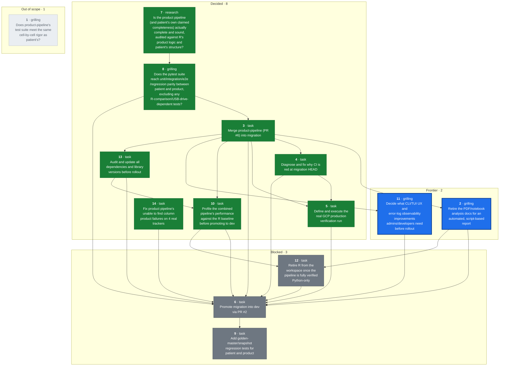
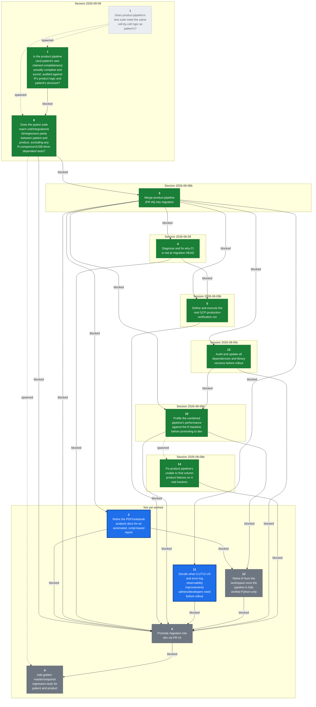

## Destination

`product-pipeline` (PR #6) merged into `migration` with conflicts resolved; the
combined pipeline (patient + product + state management) run for real against
the GCP production bucket, with output landed in BigQuery; every Python/R
difference documented and explicitly decided; CI green; performance
re-profiled against the R baseline now that the merge has landed; the
CLI/TUI's admin/developer UX and error-log observability judged good enough to
operate the pipeline day to day; R retired from the workspace (`r-archive/`,
`tools/LogViewerA4D`, stray R scripts) now that the pipeline is fully verified
Python-only; all dependencies and library versions audited and updated; and
`migration` merged into `dev` (PR #2).
This prevents promoting a merge that looks clean but was never exercised as a
whole, prevents documenting or promoting based on claims ("the intern says it
works") rather than verified fact, and prevents rolling out something that
runs correctly but nobody can operate or debug confidently — the migration is
large enough, and detail-sensitive enough, that things get missed unless
checked cell-by-cell.

**Destination redrawn 2026-08-09** (mid-[ticket 5](tickets/05-production-verification-run.md)
session): performance re-profiling, CLI/UX + observability, retiring R from
the workspace, and a dependency/library audit were added after the user
confirmed each belongs to "are we really ready to roll out", not separate
follow-on efforts. Originally the destination stopped at CI green + a
validated production run + promotion to `dev`.

## The tickets

<!-- graph:start -->

<!-- graph:end -->

## Notes

- **This map carries execution** (overrides wayfinder's plan-only default): once
  a ticket's decision is made — or immediately, for Task-type tickets — the
  same session also implements it, using `tdd` / `systematic-debugging` /
  `executing-plans` (the superpowers skills) where applicable, rather than
  stopping at the decision.
  - Guardrail: commits/pushes to any branch are fine, fully revertable.
  - Guardrail: merging a pull request is a human-only action, never the agent's
    — prepare the merge, stop short of clicking it.
  - Guardrail: triggering the real production GCP run / spending GCP budget is
    the user's job. Read-only GCP access (logs, BigQuery, GCS listings) and
    sandbox/POC runs are fine.
  - Guardrail: the cloud routine's checkout has no GCP credentials and no
    access to the real tracker files (patient/clinic data — sensitive, not
    committed to the repo, not shared with the cloud sandbox). It must work
    only with what's already in the repo (code, fixtures, synthetic test
    data). If a ticket turns out to need real trackers or live GCP auth to
    proceed, it stops and hands that specific piece back to the user to run
    locally — it never fabricates substitute data or asks for real patient
    data to be pasted into the session.
- A daily cloud routine (`a4d-migration-wayfinder-daily`, 9am Europe/Berlin)
  works this map one session at a time — claims the top frontier ticket, does
  what it can autonomously, and posts findings/questions for HITL tickets
  rather than answering them itself. Kept on cloud rather than local
  `launchd` deliberately: it only needs to fetch code and run it, not touch
  sensitive data or production GCP — see guardrails above.
- Domain: A4D medical tracker data pipeline, R-to-Python migration. See
  [CLAUDE.md](../../CLAUDE.md) and [docs/CLAUDE.md](../CLAUDE.md) for the
  codebase map, and [MIGRATION_GUIDE.md](../migration/MIGRATION_GUIDE.md) for
  the migration's own history (note: the copy on `migration` is stale relative
  to `product-pipeline`'s copy, which claims Phases 0-9 complete — that claim
  is unverified, which is exactly what this map exists to check).
- Standing preference: no notebooks for analysis, ever — write scripts.
  Analysis/reports should be automated and stay in sync with the code, not
  hand-written documents (PDFs, notebooks) that go stale.
- Standing preference: verification means cell-by-cell (shape, columns, exact
  values), not spot-checks — this is why the patient pipeline validation took
  as long as it did (174 trackers), and the product pipeline is held to the
  same bar.
- Standing preference (decided in the [test-rigor](tickets/01-product-pipeline-test-rigor.md)
  session): the migration is not 1:1 R-parity. Python may correctly diverge
  from R — R can be wrong. Judge divergence against the original source Excel
  trackers (`a4dphase2_upload` on the test-data drive), not against R's output
  alone. R-vs-Python comparison is *analysis* (a judgment call), not a pytest
  concern — pytest covers unit/integration/e2e/regression only.
- User sequencing preference: make `product-pipeline` ready first, then merge,
  then make `migration` ready, then promote. Tickets are blocked accordingly
  even where the underlying dependency is looser than the sequencing implies.
  "Ready" for the merge means tests green (ticket 8) plus ordinary pre-merge
  hygiene (code style, an implementation review confirming R's steps are
  actually migrated, doc alignment with patient) — **not** R/Python output
  parity. The comparison script (ticket 2) is explicitly post-merge: it only
  makes sense once patient and product share one branch, and the user judges
  green tests + a clean review sufficient grounds to merge without it
  (corrected mid-session on 2026-08-08, after ticket 2 had originally been
  wired as a merge blocker).
- Redraw command: `~/.claude/skills/wayfinder/scripts/render-map.sh docs/wayfinder`

## Where this map stands

Three tickets resolved. [Does product-pipeline's test suite meet the same
cell-by-cell rigor as patient's?](tickets/01-product-pipeline-test-rigor.md)
was superseded — it presupposed R-parity was the goal and that patient's
exception-dict pytest pattern was the bar to replicate for product; the user
rejected both, and it split into tickets 7 and 8. [Is the product pipeline
(and patient's own claimed completeness) actually complete and sound, audited
against R's product logic and patient's structure?](tickets/07-pipeline-completeness-audit.md)
is decided (research, read-only): R-logic coverage is essentially
complete on both pipelines, but product has real structural test gaps
(no integration/e2e tests, no coverage of `wide_format.py`, no
`test_tables/test_product.py`) and patient's "174 trackers validated" claim
has no committed record of an actual passing run. Full detail:
[research/07-pipeline-completeness-audit.md](research/07-pipeline-completeness-audit.md).
[Does the pytest suite reach unit/integration/e2e/regression parity between
patient and product, excluding any R-comparison/USB-drive-dependent
tests?](tickets/08-pytest-suite-parity.md) is now decided: parity means an
85%+ coverage floor enforced in CI plus product gaining the three
integration/e2e files it's missing (mirroring patient's existing
fixture/skip-if-missing convention) and `test_tables/test_product.py`;
`test_r_validation.py` leaves pytest entirely, with no product equivalent.
Mid-session the user clarified "regression test" means golden-master/snapshot
testing (fixed input, output snapshotted per stage, diffed on future
changes) rather than R-comparison or edge-case testing — that work doesn't
need real/sensitive data and was split off into [Add golden-master/snapshot
regression tests for patient and product](tickets/09-snapshot-regression-tests.md),
which the user wants deferred until both pipelines' other test suites are in
place and green.

**Four tickets resolved.** [Merge product-pipeline (PR #6) into
migration](tickets/03-merge-product-pipeline.md) is done: ticket 8's test
files, the product-only coverage gate, `test_r_validation.py` removal, a
repo-wide ruff/ty cleanup, an implementation review that found and fixed two
real logging-parity gaps (product never populated `TrackerResult.data_errors`
or created a logs/errors table, unlike patient), and doc alignment (verified,
no changes needed) are all implemented and pushed to `product-pipeline`. PR
#6's conflicts (`gcp/bigquery.py`, `cli.py`) are resolved — it is now
`mergeable: MERGEABLE`. Landing it is left to the user (human-only merge
guardrail). Full detail: [ticket 3](tickets/03-merge-product-pipeline.md).

**Ticket 2 was re-sequenced** (same session ticket 3 closed in — the user
corrected this): it no longer blocks the merge, since the comparison script
only makes sense once patient and product share a branch, and green tests +
a clean review is judged sufficient trust to merge without it first. Ticket 2
is blocked on ticket 3 instead of the reverse (`blocked_by: [3]`) — and since
ticket 3 is now closed, ticket 2 is unblocked.

**Five tickets resolved.** [Diagnose and fix why CI is red at migration
HEAD](tickets/04-fix-migration-ci.md) is done: root cause was Typer's
`FORCE_TERMINAL` freezing to `True` at import time because GitHub Actions
always sets `GITHUB_ACTIONS=true`, which forces colorized `--help` output
that splits options like `--file` into separate ANSI spans and breaks
plain substring assertions — independent of the `NO_COLOR`/`COLUMNS`
overrides already in place. `tests/conftest.py` on `product-pipeline` now
sets Typer's own `_TYPER_FORCE_DISABLE_TERMINAL` escape hatch before
`typer.rich_utils` is first imported. Pushed as `b970cf6`; PR #6's CI is
green (428 tests), and PR #6 is `mergeable: MERGEABLE`. Full detail:
[ticket 4](tickets/04-fix-migration-ci.md).

**PR #6 was merged by the user** (2026-08-09, merge commit `7713fea`,
human-only action per this map's guardrails). `migration` now contains the
combined patient + product pipeline; CI on the merge commit is green
(`gh run list --branch migration` — run `31286057254`, `conclusion:
success`). PR #2 (`migration` -> `dev`) is `mergeable: MERGEABLE`. This
closes out the "make `product-pipeline` ready, then merge" half of the
user's sequencing preference; what remains before ticket 6 (promotion) is
"make `migration` ready" — tickets 2 and 5.

Key facts already gathered while charting (verified via `git`/`gh`, not
assumed): PR #2 (`migration` -> `dev`) is open and mergeable, but CI has
failed on `migration` HEAD for its last 3 runs (ticket 4's target).
`source_vs_output_product.py` is deliberately group-granularity only ("v1"),
not cell-by-cell, per its own docstring. `PYTHON_IMPROVEMENTS.md`'s parity
claims cite a notebook (`Ali_internship/residual_dig.ipynb`, not in the
tracked tree) and a patient-only comparison script — i.e. one-off analysis,
not a repeatable test. Its two PDF reports haven't been read yet — ticket 2's
remit.

**Six tickets resolved.** [Define and execute the real GCP production
verification run](tickets/05-production-verification-run.md) is done: the
combined patient + product pipeline ran for the first time as one execution
via the existing `a4d-pipeline` Cloud Run Job against real production
GCS/BigQuery, preceded by a `just backup-bq` snapshot, and verified clean
against that snapshot (row counts, distinct clinics, schema — not R, which
the user decided is out of this ticket's scope). Full detail: [ticket
5](tickets/05-production-verification-run.md).

**Four tickets were added mid-session, none resolved**: [Profile the
combined pipeline's performance against the R baseline before promoting to
dev](tickets/10-performance-profiling.md) — the user's standing understanding
that Python is much faster than R predates this merge's additions and hasn't
been re-checked; [Decide what CLI/TUI UX and error-log observability
improvements admins/developers need before rollout](tickets/11-cli-ux-observability.md),
graduated from fog once the user confirmed it's in this map's scope; [Retire
R from the workspace once the pipeline is fully verified
Python-only](tickets/12-retire-r-workspace.md) — `r-archive/`,
`tools/LogViewerA4D` (an R Shiny log viewer another developer wrote, now
confirmed removable outright with no Python replacement needed), and a stray
root `test_full_pipeline_debug.R`, gated on tickets 2 and 10 since both still
need R as a live reference; and [Audit and update all dependencies and
library versions before rollout](tickets/13-dependency-audit.md), wired ahead
of ticket 10 so profiling doesn't run against a soon-to-change dependency
set. All four are new blockers on ticket 6. **The destination itself was
redrawn** to name all four concerns explicitly (see Destination section) —
this map now covers operational rollout readiness, not just "merge, verify,
promote."

**Seven tickets resolved.** [Audit and update all dependencies and library
versions before rollout](tickets/13-dependency-audit.md) is done: see the
Decisions-so-far entry above for detail. This unblocks [ticket
10](tickets/10-performance-profiling.md) (performance re-profiling against
the R baseline), since its other blocker (ticket 3) was already closed.

**Eight tickets resolved.** [Profile the combined pipeline's performance
against the R baseline before promoting to dev](tickets/10-performance-profiling.md)
is done — retitled in substance mid-session: the user dropped the R-baseline
comparison entirely (R's already known to be slower; re-confirming that
teaches nothing) and reframed it as a function-level performance/robustness
profile of the Python pipeline itself, run with `pyinstrument` against the
full 177-tracker real dataset (from the USB drive, at the user's suggestion,
since current production trackers aren't available locally). That profile
found `find_data_start_row` (`src/a4d/extract/patient.py`) was O(n^2) on
read-only worksheets — each `.cell()` call re-parses a sheet's XML from row
1 — and fixed it with a single sequential scan: 6.6x speedup on the full
patient arm (145.8s -> 22.0s, 171 real trackers, 4 workers, identical
output), pushed as `97479f8` with a regression test. Full combined
patient+product run: 73.86s wall, ~556MB peak RSS (rough floor, not
exhaustive). Also surfaced 4 product trackers failing outright
("unable to find column \"product\"") — unrelated to the performance fix,
not previously documented anywhere on this map — spawned as [ticket
14](tickets/14-product-column-detection-failures.md) rather than fixed
inline, now also blocking ticket 6. Full detail: [ticket
10](tickets/10-performance-profiling.md).

**Nine tickets resolved.** [Fix product pipeline's "unable to find column
product" failures on 4 real trackers](tickets/14-product-column-detection-failures.md)
is done: confirmed legitimate (2018-2020 KBH and 2020 JVM trackers predate
product/stock tracking entirely — no "product" keyword and no `INV` sheet
anywhere in any of their month sheets, verified directly against the real
files on the USB drive; product tracking starts with KBH's 2021 `INV`
sheet), not a synonym gap or regression. The actual bug was in
`clean_product_data` (`src/a4d/clean/product.py`): it assumed a `"product"`
column always exists and crashed on the fully columnless frame extraction
correctly hands back for these trackers, because `apply_schema` invents a
spurious 1-row output from a columnless input instead of preserving 0 rows.
Fixed with an early return to an empty, schema-conformant (0, 20) DataFrame
when the raw frame has no columns. Reproduced the original crash and the fix
against the real files; all 4 now process successfully with 0-row output.
One regression test added; full suite (490 tests), ruff, `ty check` all
pass. Full detail: [ticket 14](tickets/14-product-column-detection-failures.md).

**The frontier is now tickets 2 and 11**: [Retire the PDF/notebook analysis
docs for an automated, script-based report](tickets/02-documentation-strategy.md)
and [Decide what CLI/TUI UX and error-log observability improvements
admins/developers need before rollout](tickets/11-cli-ux-observability.md).
Ticket 12 is still blocked on ticket 2 (its other blocker, ticket 10, is
closed). Ticket 6 (promote to `dev`) is `blocked_by: [8, 2, 3, 4, 5, 10, 11,
12, 13, 14]` — tickets 3, 4, 5, 8, 10, 13, 14 are closed; tickets 2, 11, 12
are what remain. The user has said they intend to keep working this map
session by session on `migration` until confident enough to roll out, rather
than promoting early.

Also noted, not yet acted on: a local, untracked `a4d-python/` directory at
the repo root (stale leftover copy predating the current `src/` layout, not
in git) — the user hasn't yet said whether to delete it; separate from
ticket 12's git-tracked R cleanup.

## Decisions so far

- [Diagnose and fix why CI is red at migration HEAD](tickets/04-fix-migration-ci.md)
  — decided and implemented: CI was red because GitHub Actions sets
  `GITHUB_ACTIONS=true` for every job, and Typer reads that at import time
  to force full-color `--help` rendering, which splits options like
  `--file` into separate ANSI spans and breaks the tests' plain substring
  assertions — regardless of the `NO_COLOR`/`COLUMNS` overrides the tests
  already set. The original lead (`cli.py`'s module-level `console` object)
  was investigated and ruled out: Rich re-reads `COLUMNS` live rather than
  caching it, and `--help` is rendered by Typer's own internal console, not
  `cli.py`'s. Fix: `tests/conftest.py` on `product-pipeline` sets Typer's
  own `_TYPER_FORCE_DISABLE_TERMINAL` escape hatch before `typer.rich_utils`
  is first imported. Pushed as `b970cf6`; PR #6's CI is green
  (all 428 tests), coverage gate holds, PR #6 is `mergeable: MERGEABLE`.
  Full detail: [ticket 4](tickets/04-fix-migration-ci.md).

- [Does product-pipeline's test suite meet the same cell-by-cell rigor as
  patient's?](tickets/01-product-pipeline-test-rigor.md) — superseded: R-parity
  isn't the goal (source trackers are the arbiter, not R's output);
  R-vs-Python comparison is analysis, not pytest; neither pipeline's
  completeness has actually been audited yet. Split into tickets 7 and 8;
  ticket 2 now owns the analysis-report side.
- [Is the product pipeline (and patient's own claimed completeness) actually
  complete and sound, audited against R's product logic and patient's
  structure?](tickets/07-pipeline-completeness-audit.md) — decided: R-logic
  coverage is essentially complete function-for-function on both pipelines
  (one diagnostic-only R gap on product); product has real structural test
  gaps (no integration/e2e tests, no `wide_format.py` coverage, no
  `test_tables/test_product.py`, group-granularity-only source-vs-output
  check); patient's "174 trackers validated" claim has genuine test
  infrastructure but no committed record of an actual passing run (CI
  excludes it, USB-drive-gated). Full inventory and gap lists:
  [research/07-pipeline-completeness-audit.md](research/07-pipeline-completeness-audit.md).
- [Does the pytest suite reach unit/integration/e2e/regression parity between
  patient and product, excluding any R-comparison/USB-drive-dependent
  tests?](tickets/08-pytest-suite-parity.md) — decided: parity = 85%+ coverage
  enforced in CI, product gets the three missing integration/e2e files built
  on patient's existing fixture/skip-if-missing convention plus
  `test_tables/test_product.py`; `test_r_validation.py` leaves pytest
  entirely with no product equivalent. "Regression test" was reframed
  mid-session to mean golden-master/snapshot testing (not R-comparison or
  edge-case testing) and split off into
  [Add golden-master/snapshot regression tests for patient and
  product](tickets/09-snapshot-regression-tests.md), deferred until both
  pipelines' other test suites are green.
- [Merge product-pipeline (PR #6) into migration](tickets/03-merge-product-pipeline.md)
  — decided and implemented: ticket 8's tests written (85%+ coverage
  narrowed to product-only code, per a mid-session user correction —
  repo-wide coverage was 73%, not close to 85%, and most of the gap is
  patient/CLI code unrelated to product parity), `test_r_validation.py`
  removed, repo-wide ruff/ty cleanup (blocking, since CI runs both
  unscoped), an implementation review that found and fixed two real
  logging-parity gaps (product never populated `TrackerResult.data_errors`
  or created a logs/errors table, unlike patient — both now mirror patient
  exactly), and doc alignment verified with no changes needed. PR #6's
  merge conflicts resolved; it is now `mergeable: MERGEABLE`. CI still
  fails on 7 `--help`-rendering tests unrelated to product code — handed to
  ticket 4 with a concrete lead rather than fixed here.

- [Define and execute the real GCP production verification run](tickets/05-production-verification-run.md)
  — decided and executed: ran the combined patient + product pipeline for the
  first time as one execution, via the existing `a4d-pipeline` Cloud Run Job
  against real production GCS/BigQuery (execution `a4d-pipeline-8mxls`,
  succeeded). Preceded by a `just backup-bq` snapshot as the rollback point.
  Verified with a new script (`scripts/verify_production_run.py` +
  `src/a4d/gcp/verify.py`, unit-tested) comparing row counts, distinct clinic
  counts, and schema against that snapshot — not against R, which the user
  decided has no role in this ticket's check (R-vs-source comparison stays
  ticket 2's job). All four tables grew cleanly (51 -> 53 clinics), no
  anomalies. Confirmed along the way that Cloud Scheduler isn't enabled on the
  project yet. Full detail: [ticket 5](tickets/05-production-verification-run.md).

- [Audit and update all dependencies and library versions before
  rollout](tickets/13-dependency-audit.md) — decided and implemented:
  `uv lock --upgrade` moved every dependency to current latest (three
  majors — `pandera` 0.26->0.32, `pytest` 8->9, `typer` 0.19->0.27, `rich`
  came along transitively 14->15); resolved all 19 known vulnerabilities
  `pip-audit` found in the prior lock; `Dockerfile`'s `python:3.14-slim`
  floating tag checked and already current, no change needed. `ty` (dev
  type checker) jumped 0.0.1a23 -> 0.0.69 and surfaced two real `src/`
  gaps the old alpha missed — `gcp/storage.py`'s unguarded `blob.name`
  (`str | None` per stubs) and `validate/common.py`'s `emit_finding`
  `error_code` param (typed `str` behind a dead mypy-style ignore `ty`
  never honored) — both fixed. Full suite (488 tests), ruff, `ty check
  src/`, and the product-only coverage gate all pass; pushed as `c4721ad`.
  This unblocks [ticket 10](tickets/10-performance-profiling.md) (its
  other blocker, ticket 3, was already closed). Full detail: [ticket
  13](tickets/13-dependency-audit.md).

- [Profile the combined pipeline's performance against the R baseline before
  rollout](tickets/10-performance-profiling.md) — decided and executed: R
  comparison dropped (already known slower); reframed as a `pyinstrument`
  function-level profile of the Python pipeline against the full 177-tracker
  real dataset. Found and fixed an O(n^2) bug in `find_data_start_row`
  (per-row `.cell()` calls each re-parse a read-only worksheet's XML from
  row 1) — 6.6x speedup on the full patient arm (145.8s -> 22.0s), pushed as
  `97479f8` with a regression test. Full combined run: 73.86s wall, ~556MB
  peak RSS. Also surfaced 4 product trackers failing outright, spawned as
  [ticket 14](tickets/14-product-column-detection-failures.md). Full detail:
  [ticket 10](tickets/10-performance-profiling.md).

- [Fix product pipeline's "unable to find column product" failures on 4 real
  trackers](tickets/14-product-column-detection-failures.md) — decided and
  implemented: confirmed legitimate (pre-product-tracking tracker years for
  2 clinics, verified directly against the real files), not a synonym gap or
  regression; fixed a real bug where `clean_product_data` crashed on the
  columnless raw frame extraction correctly produces for these trackers,
  instead returning an empty schema-conformant result. Full detail: [ticket
  14](tickets/14-product-column-detection-failures.md).

- **Destination redrawn**: performance re-profiling, CLI/UX + observability,
  retiring R from the workspace, and a dependency/library version audit are
  all in this map's scope, not a separate effort — the user confirmed each
  belongs to "are we really ready to roll out" (2026-08-09, mid-ticket-5
  session). Spawned [ticket 10](tickets/10-performance-profiling.md), [ticket
  11](tickets/11-cli-ux-observability.md) (graduated from fog), [ticket
  12](tickets/12-retire-r-workspace.md), and [ticket
  13](tickets/13-dependency-audit.md); all four now block [ticket
  6](tickets/06-promote-migration-to-dev.md). `CLAUDE.md`'s current "do not
  modify `r-archive/`" instruction is a known conflict ticket 12 will need to
  resolve, not before. Ticket 13 was also wired ahead of ticket 10
  (`blocked_by: [3, 13]`) since profiling against dependencies that are about
  to change would produce stale numbers.

## Assumptions in force

(none currently — the one assumption this map carried, patient's completeness
being unverified, was confirmed rather than overturned by
[the completeness audit](tickets/07-pipeline-completeness-audit.md) and is now
folded into Decisions so far above.)

## Not yet specified

- Whether the R pipeline (`r-archive/`) gets formally retired/archived-further
  once `migration` reaches `dev`/`main`, and what "official migration"
  communication or cutover steps that implies — out of this map's current
  resolution but likely to surface once the promotion ticket is close.
- Cloud Scheduler / production scheduling cutover (mentioned in the Migration
  Guide's state-management open item) — not yet sharp enough to ticket; may
  turn out to be a separate map entirely once `dev` is reached. Confirmed
  during [ticket 5](tickets/05-production-verification-run.md) (executed:
  `gcloud scheduler jobs list` fails with `SERVICE_DISABLED`) that the Cloud
  Scheduler API isn't even enabled on `a4dphase2` yet — the Migration Guide's
  claim that this is still open is accurate, not stale.
- Patient's own gaps from the completeness audit (no committed record of an
  actual 174-tracker passing run; `PYTHON_IMPROVEMENTS.md` undercounting
  known divergences; no `pipeline/patient.py` unit test) aren't ticketed yet
  — they don't block the merge/promotion path the way product's gaps do, but
  will need a home before the map can call itself done.

## Out of scope

(none yet)

### The route actually walked

Sessions top to bottom, oldest first. `spawned` and `closed` are causal — what a
decision did to the rest of the map — and are where the real structure lives.

<!-- route:start -->

<!-- route:end -->
