## Destination

`product-pipeline` (PR #6) merged into `migration` with conflicts resolved; the
combined pipeline (patient + product + state management) run for real against
the GCP production bucket, with output landed in BigQuery; every Python/R
difference documented and explicitly decided; CI green; performance
re-profiled against the R baseline now that the merge has landed; the
CLI/TUI's admin/developer UX and error-log observability judged good enough to
operate the pipeline day to day; R retired from the workspace (`r-archive/`,
`tools/LogViewerA4D`, stray R scripts) now that the pipeline is fully verified
Python-only; all dependencies and library versions audited and updated; and
`migration` merged into `dev` (PR #2).
This prevents promoting a merge that looks clean but was never exercised as a
whole, prevents documenting or promoting based on claims ("the intern says it
works") rather than verified fact, and prevents rolling out something that
runs correctly but nobody can operate or debug confidently — the migration is
large enough, and detail-sensitive enough, that things get missed unless
checked cell-by-cell.

**Destination redrawn 2026-08-09** (mid-[ticket 5](tickets/05-production-verification-run.md)
session): performance re-profiling, CLI/UX + observability, retiring R from
the workspace, and a dependency/library audit were added after the user
confirmed each belongs to "are we really ready to roll out", not separate
follow-on efforts. Originally the destination stopped at CI green + a
validated production run + promotion to `dev`.

## The tickets

```mermaid
flowchart TD
  subgraph FRONTIER["Frontier · 9"]
    direction TB
    T16["<b>16</b> · grilling<br/>Build a drill-down log<br/>analyzer for admins to<br/>inspect a specific tracker<br/>file's errors/logs"]
    T31["<b>31</b> · task<br/>Triage the residual<br/>patient raw-stage column<br/>mismatches (round 2)"]
    T32["<b>32</b> · task<br/>Re-audit every existing<br/>cause classifier — is<br/>Python actually right, or<br/>was the diff merely<br/>labelled?"]
    T34["<b>34</b> · grilling<br/>Make the local pre-push<br/>check set actually match<br/>CI, and make running it<br/>automatic"]
    T35["<b>35</b> · task<br/>Resolve the Polars 2.0<br/>deprecation warnings —<br/>decide the behaviour each<br/>one is asking about"]
    T39["<b>39</b> · grilling<br/>Decide whether a date<br/>buried inside a clinical<br/>note should be recovered<br/>or discarded"]
    T40["<b>40</b> · task<br/>Produce one Excel of every<br/>source-tracker defect, so<br/>the trackers themselves<br/>can be corrected"]
    T41["<b>41</b> · grilling<br/>Decide whether the 2026<br/>template's five new<br/>Patient List fields enter<br/>the pipeline"]
    T42["<b>42</b> · grilling<br/>Decide how FBG unit<br/>headers are resolved, and<br/>what to do about<br/>physiologically<br/>implausible mmol values"]
  end
  subgraph BLOCKED["Blocked · 3"]
    direction TB
    T6["<b>6</b> · task<br/>Promote migration into dev<br/>via PR #2"]
    T9["<b>9</b> · task<br/>Add golden-master/snapshot<br/>regression tests for<br/>patient and product"]
    T12["<b>12</b> · task<br/>Retire R from the<br/>workspace once the<br/>pipeline is fully verified<br/>Python-only"]
  end
  subgraph DECIDED["Decided · 29"]
    direction TB
    T2["<b>2</b> · grilling<br/>Retire the PDF/notebook<br/>analysis docs for an<br/>automated, script-based<br/>report"]
    T3["<b>3</b> · task<br/>Merge product-pipeline (PR<br/>#6) into migration"]
    T4["<b>4</b> · task<br/>Diagnose and fix why CI is<br/>red at migration HEAD"]
    T5["<b>5</b> · task<br/>Define and execute the<br/>real GCP production<br/>verification run"]
    T7["<b>7</b> · research<br/>Is the product pipeline<br/>(and patient's own claimed<br/>completeness) actually<br/>complete and sound,<br/>audited against R's<br/>product logic and<br/>patient's structure?"]
    T8["<b>8</b> · grilling<br/>Does the pytest suite<br/>reach unit/integration/e2e<br/>/regression parity between<br/>patient and product,<br/>excluding any<br/>R-comparison/USB-drive-<br/>dependent tests?"]
    T10["<b>10</b> · task<br/>Profile the combined<br/>pipeline's performance<br/>against the R baseline<br/>before promoting to dev"]
    T11["<b>11</b> · grilling<br/>Decide what CLI/TUI UX and<br/>error-log observability<br/>improvements<br/>admins/developers need<br/>before rollout"]
    T13["<b>13</b> · task<br/>Audit and update all<br/>dependencies and library<br/>versions before rollout"]
    T14["<b>14</b> · task<br/>Fix product pipeline's<br/>unable to find column<br/>product failures on 4 real<br/>trackers"]
    T15["<b>15</b> · task<br/>Build and run the R/Python<br/>output comparison script,<br/>then triage every flagged<br/>difference"]
    T17["<b>17</b> · task<br/>Fix the product<br/>comparison's row-alignment<br/>key, then triage every<br/>flagged R/Python<br/>difference"]
    T18["<b>18</b> · task<br/>Triage every flagged<br/>R/Python difference for<br/>both arms, and resolve the<br/>189-vs-155-tracker<br/>discrepancy"]
    T19["<b>19</b> · task<br/>Persist comparison run<br/>history and show run-over-<br/>run deltas"]
    T20["<b>20</b> · task<br/>Normalize the raw-stage<br/>product_entry_date<br/>comparison so it stops<br/>flagging near-universal<br/>false mismatches"]
    T21["<b>21</b> · task<br/>Triage the remaining<br/>product cleaned-stage<br/>column mismatches<br/>(balance, received_from,<br/>released_to, remarks,<br/>units_received, product)"]
    T22["<b>22</b> · task<br/>Triage the remaining<br/>product raw-stage column<br/>mismatches"]
    T23["<b>23</b> · task<br/>Triage every flagged<br/>R/Python difference for<br/>the patient arm (raw and<br/>cleaned)"]
    T24["<b>24</b> · task<br/>Triage the residual produc<br/>t_units_received/product_u<br/>nits_released/product_rece<br/>ived_from raw-stage<br/>mismatches"]
    T25["<b>25</b> · task<br/>Triage the<br/>product_units_released<br/>cleaned-stage column<br/>mismatches"]
    T26["<b>26</b> · task<br/>Triage the product<br/>pipeline's column-<br/>existence and dtype<br/>divergence (Column<br/>divergence)"]
    T27["<b>27</b> · task<br/>Triage the residual<br/>patient raw-stage column<br/>mismatches after date<br/>normalization"]
    T28["<b>28</b> · task<br/>Triage the patient<br/>cleaned-stage column<br/>mismatches"]
    T29["<b>29</b> · task<br/>Triage the residual<br/>patient cleaned-stage<br/>column mismatches"]
    T30["<b>30</b> · task<br/>Triage the patient<br/>pipeline's raw-stage<br/>column-existence<br/>divergence"]
    T33["<b>33</b> · task<br/>Fix red CI — ruff format<br/>--check fails on Python<br/>snippets inside markdown<br/>docs"]
    T36["<b>36</b> · task<br/>Triage the product<br/>cleaned-stage mismatches<br/>no ticket owns<br/>(product_balance,<br/>sheet_name, entry_date,<br/>units_received, file_name)"]
    T37["<b>37</b> · task<br/>Triage the residual<br/>patient cleaned-stage<br/>mismatches (round 2)"]
    T38["<b>38</b> · task<br/>Triage the patient<br/>cleaned-stage date-column<br/>family (round 3)"]
  end
  subgraph DROPPED["Out of scope · 1"]
    direction TB
    T1["<b>1</b> · grilling<br/>Does product-pipeline's<br/>test suite meet the same<br/>cell-by-cell rigor as<br/>patient's?"]
  end

  T2 --> T15
  T3 --> T2
  T3 --> T4
  T3 --> T5
  T3 --> T6
  T3 --> T10
  T3 --> T11
  T3 --> T13
  T4 --> T5
  T4 --> T6
  T5 --> T6
  T6 --> T9
  T7 --> T8
  T8 --> T3
  T8 --> T6
  T10 --> T6
  T11 --> T6
  T12 --> T6
  T13 --> T6
  T13 --> T10
  T14 --> T6
  T20 --> T6
  T20 --> T12
  T21 --> T6
  T21 --> T12
  T22 --> T6
  T22 --> T12
  T23 --> T6
  T23 --> T12
  T24 --> T12
  T25 --> T12
  T26 --> T12
  T28 --> T12
  T30 --> T12
  T31 --> T12

  classDef frontier fill:#1f6feb,stroke:#0b3d91,stroke-width:3px,color:#ffffff
  class T16,T31,T32,T34,T35,T39,T40,T41,T42 frontier
  classDef blocked fill:#6e7781,stroke:#424a53,stroke-width:1px,color:#ffffff
  class T6,T9,T12 blocked
  classDef decided fill:#1a7f37,stroke:#116329,stroke-width:1px,color:#ffffff
  class T2,T3,T4,T5,T7,T8,T10,T11,T13,T14,T15,T17,T18,T19,T20,T21,T22,T23,T24,T25,T26,T27,T28,T29,T30,T33,T36,T37,T38 decided
  classDef dropped fill:#eaeef2,stroke:#afb8c1,stroke-width:1px,color:#57606a
  class T1 dropped
```

<!-- graph:start -->

<!-- graph:end -->

## Notes

- **This map carries execution** (overrides wayfinder's plan-only default): once
  a ticket's decision is made — or immediately, for Task-type tickets — the
  same session also implements it, using `tdd` / `systematic-debugging` /
  `executing-plans` (the superpowers skills) where applicable, rather than
  stopping at the decision.
  - Guardrail: commits/pushes to any branch are fine, fully revertable.
  - Guardrail: merging a pull request is a human-only action, never the agent's
    — prepare the merge, stop short of clicking it.
  - Guardrail: triggering the real production GCP run / spending GCP budget is
    the user's job. Read-only GCP access (logs, BigQuery, GCS listings) and
    sandbox/POC runs are fine.
  - Guardrail: the cloud routine's checkout has no GCP credentials and no
    access to the real tracker files (patient/clinic data — sensitive, not
    committed to the repo, not shared with the cloud sandbox). It must work
    only with what's already in the repo (code, fixtures, synthetic test
    data). If a ticket turns out to need real trackers or live GCP auth to
    proceed, it stops and hands that specific piece back to the user to run
    locally — it never fabricates substitute data or asks for real patient
    data to be pasted into the session.
- A daily cloud routine (`a4d-migration-wayfinder-daily`, 9am Europe/Berlin)
  works this map one session at a time — claims the top frontier ticket, does
  what it can autonomously, and posts findings/questions for HITL tickets
  rather than answering them itself. Kept on cloud rather than local
  `launchd` deliberately: it only needs to fetch code and run it, not touch
  sensitive data or production GCP — see guardrails above.
- Domain: A4D medical tracker data pipeline, R-to-Python migration. See
  [CLAUDE.md](../../CLAUDE.md) and [docs/CLAUDE.md](../CLAUDE.md) for the
  codebase map, and [MIGRATION_GUIDE.md](../migration/MIGRATION_GUIDE.md) for
  the migration's own history (note: the copy on `migration` is stale relative
  to `product-pipeline`'s copy, which claims Phases 0-9 complete — that claim
  is unverified, which is exactly what this map exists to check).
- Standing preference: no notebooks for analysis, ever — write scripts.
  Analysis/reports should be automated and stay in sync with the code, not
  hand-written documents (PDFs, notebooks) that go stale.
- Standing preference: verification means cell-by-cell (shape, columns, exact
  values), not spot-checks — this is why the patient pipeline validation took
  as long as it did (174 trackers), and the product pipeline is held to the
  same bar.
- Standing preference (decided in the [test-rigor](tickets/01-product-pipeline-test-rigor.md)
  session): the migration is not 1:1 R-parity. Python may correctly diverge
  from R — R can be wrong. Judge divergence against the original source Excel
  trackers (`a4dphase2_upload` on the test-data drive), not against R's output
  alone. R-vs-Python comparison is *analysis* (a judgment call), not a pytest
  concern — pytest covers unit/integration/e2e/regression only.
- User sequencing preference: make `product-pipeline` ready first, then merge,
  then make `migration` ready, then promote. Tickets are blocked accordingly
  even where the underlying dependency is looser than the sequencing implies.
  "Ready" for the merge means tests green (ticket 8) plus ordinary pre-merge
  hygiene (code style, an implementation review confirming R's steps are
  actually migrated, doc alignment with patient) — **not** R/Python output
  parity. The comparison script (ticket 2) is explicitly post-merge: it only
  makes sense once patient and product share one branch, and the user judges
  green tests + a clean review sufficient grounds to merge without it
  (corrected mid-session on 2026-08-08, after ticket 2 had originally been
  wired as a merge blocker).
- **Standing preference — triage means deciding, not labelling** (set by the
  user 2026-08-12g, after [ticket 27](tickets/27-triage-patient-raw-residual.md)
  had to be reopened for exactly this). Every flagged R/Python difference
  has to clear two bars, not one:
  1. **Explain the diff** — the actual mechanism, traced to source Excel or
     to R's/Python's own code, not a shape-matching heuristic.
  2. **Decide whether Python is doing the right thing** — and say so
     explicitly, with what was checked.

  **Refined by the user 2026-08-13**: the bar is a clear *understanding*,
  not a verdict on which pipeline is right. Deciding R-vs-Python correctness
  is not this phase's job. Where the evidence shows the **source file
  itself is corrupt**, "the source is wrong, this tracker needs human
  inspection" is a legitimate final conclusion — and a valuable finding in
  its own right, not a failure to converge.

  **Scoped by the user 2026-08-15**: the current tracker template is the
  golden rule. A column that appears in one year and is gone the next was
  very likely a test that did not survive, so triage effort goes to the core
  fields that run through every year. Where a divergence traces to a human
  error in the source workbook, the right fix is the workbook, not inference
  in the pipeline -- so such findings are detected and reported (see [ticket
  40](tickets/40-source-defect-findings-report.md)) rather than guessed at.

  Observing "Python has A where R has B" and adding a named classifier is
  **not** a decision in favour of A. A classifier records that a difference
  is understood; it says nothing about whether Python is correct, and
  writing one is not permission to stop. Where Python turns out to be
  wrong, or to be losing information the source file carried, the pipeline
  gets fixed — ticket 27's precedent: what looked like a labelling job was
  really extraction silently discarding data, and the classifier would have
  cemented the bug as "explained". A cause that is genuinely undecidable
  from the evidence available is recorded as an open question, not closed
  with a label.
- Redraw command: `~/.claude/skills/wayfinder/scripts/render-map.sh docs/wayfinder`

## Where this map stands

Three tickets resolved. [Does product-pipeline's test suite meet the same
cell-by-cell rigor as patient's?](tickets/01-product-pipeline-test-rigor.md)
was superseded — it presupposed R-parity was the goal and that patient's
exception-dict pytest pattern was the bar to replicate for product; the user
rejected both, and it split into tickets 7 and 8. [Is the product pipeline
(and patient's own claimed completeness) actually complete and sound, audited
against R's product logic and patient's structure?](tickets/07-pipeline-completeness-audit.md)
is decided (research, read-only): R-logic coverage is essentially
complete on both pipelines, but product has real structural test gaps
(no integration/e2e tests, no coverage of `wide_format.py`, no
`test_tables/test_product.py`) and patient's "174 trackers validated" claim
has no committed record of an actual passing run. Full detail:
[research/07-pipeline-completeness-audit.md](research/07-pipeline-completeness-audit.md).
[Does the pytest suite reach unit/integration/e2e/regression parity between
patient and product, excluding any R-comparison/USB-drive-dependent
tests?](tickets/08-pytest-suite-parity.md) is now decided: parity means an
85%+ coverage floor enforced in CI plus product gaining the three
integration/e2e files it's missing (mirroring patient's existing
fixture/skip-if-missing convention) and `test_tables/test_product.py`;
`test_r_validation.py` leaves pytest entirely, with no product equivalent.
Mid-session the user clarified "regression test" means golden-master/snapshot
testing (fixed input, output snapshotted per stage, diffed on future
changes) rather than R-comparison or edge-case testing — that work doesn't
need real/sensitive data and was split off into [Add golden-master/snapshot
regression tests for patient and product](tickets/09-snapshot-regression-tests.md),
which the user wants deferred until both pipelines' other test suites are in
place and green.

**Four tickets resolved.** [Merge product-pipeline (PR #6) into
migration](tickets/03-merge-product-pipeline.md) is done: ticket 8's test
files, the product-only coverage gate, `test_r_validation.py` removal, a
repo-wide ruff/ty cleanup, an implementation review that found and fixed two
real logging-parity gaps (product never populated `TrackerResult.data_errors`
or created a logs/errors table, unlike patient), and doc alignment (verified,
no changes needed) are all implemented and pushed to `product-pipeline`. PR
#6's conflicts (`gcp/bigquery.py`, `cli.py`) are resolved — it is now
`mergeable: MERGEABLE`. Landing it is left to the user (human-only merge
guardrail). Full detail: [ticket 3](tickets/03-merge-product-pipeline.md).

**Ticket 2 was re-sequenced** (same session ticket 3 closed in — the user
corrected this): it no longer blocks the merge, since the comparison script
only makes sense once patient and product share a branch, and green tests +
a clean review is judged sufficient trust to merge without it first. Ticket 2
is blocked on ticket 3 instead of the reverse (`blocked_by: [3]`) — and since
ticket 3 is now closed, ticket 2 is unblocked.

**Five tickets resolved.** [Diagnose and fix why CI is red at migration
HEAD](tickets/04-fix-migration-ci.md) is done: root cause was Typer's
`FORCE_TERMINAL` freezing to `True` at import time because GitHub Actions
always sets `GITHUB_ACTIONS=true`, which forces colorized `--help` output
that splits options like `--file` into separate ANSI spans and breaks
plain substring assertions — independent of the `NO_COLOR`/`COLUMNS`
overrides already in place. `tests/conftest.py` on `product-pipeline` now
sets Typer's own `_TYPER_FORCE_DISABLE_TERMINAL` escape hatch before
`typer.rich_utils` is first imported. Pushed as `b970cf6`; PR #6's CI is
green (428 tests), and PR #6 is `mergeable: MERGEABLE`. Full detail:
[ticket 4](tickets/04-fix-migration-ci.md).

**PR #6 was merged by the user** (2026-08-09, merge commit `7713fea`,
human-only action per this map's guardrails). `migration` now contains the
combined patient + product pipeline; CI on the merge commit is green
(`gh run list --branch migration` — run `31286057254`, `conclusion:
success`). PR #2 (`migration` -> `dev`) is `mergeable: MERGEABLE`. This
closes out the "make `product-pipeline` ready, then merge" half of the
user's sequencing preference; what remains before ticket 6 (promotion) is
"make `migration` ready" — tickets 2 and 5.

Key facts already gathered while charting (verified via `git`/`gh`, not
assumed): PR #2 (`migration` -> `dev`) is open and mergeable, but CI has
failed on `migration` HEAD for its last 3 runs (ticket 4's target).
`source_vs_output_product.py` is deliberately group-granularity only ("v1"),
not cell-by-cell, per its own docstring. `PYTHON_IMPROVEMENTS.md`'s parity
claims cite a notebook (`Ali_internship/residual_dig.ipynb`, not in the
tracked tree) and a patient-only comparison script — i.e. one-off analysis,
not a repeatable test. Its two PDF reports haven't been read yet — ticket 2's
remit.

**Six tickets resolved.** [Define and execute the real GCP production
verification run](tickets/05-production-verification-run.md) is done: the
combined patient + product pipeline ran for the first time as one execution
via the existing `a4d-pipeline` Cloud Run Job against real production
GCS/BigQuery, preceded by a `just backup-bq` snapshot, and verified clean
against that snapshot (row counts, distinct clinics, schema — not R, which
the user decided is out of this ticket's scope). Full detail: [ticket
5](tickets/05-production-verification-run.md).

**Four tickets were added mid-session, none resolved**: [Profile the
combined pipeline's performance against the R baseline before promoting to
dev](tickets/10-performance-profiling.md) — the user's standing understanding
that Python is much faster than R predates this merge's additions and hasn't
been re-checked; [Decide what CLI/TUI UX and error-log observability
improvements admins/developers need before rollout](tickets/11-cli-ux-observability.md),
graduated from fog once the user confirmed it's in this map's scope; [Retire
R from the workspace once the pipeline is fully verified
Python-only](tickets/12-retire-r-workspace.md) — `r-archive/`,
`tools/LogViewerA4D` (an R Shiny log viewer another developer wrote, now
confirmed removable outright with no Python replacement needed), and a stray
root `test_full_pipeline_debug.R`, gated on tickets 2 and 10 since both still
need R as a live reference; and [Audit and update all dependencies and
library versions before rollout](tickets/13-dependency-audit.md), wired ahead
of ticket 10 so profiling doesn't run against a soon-to-change dependency
set. All four are new blockers on ticket 6. **The destination itself was
redrawn** to name all four concerns explicitly (see Destination section) —
this map now covers operational rollout readiness, not just "merge, verify,
promote."

**Seven tickets resolved.** [Audit and update all dependencies and library
versions before rollout](tickets/13-dependency-audit.md) is done: see the
Decisions-so-far entry above for detail. This unblocks [ticket
10](tickets/10-performance-profiling.md) (performance re-profiling against
the R baseline), since its other blocker (ticket 3) was already closed.

**Eight tickets resolved.** [Profile the combined pipeline's performance
against the R baseline before promoting to dev](tickets/10-performance-profiling.md)
is done — retitled in substance mid-session: the user dropped the R-baseline
comparison entirely (R's already known to be slower; re-confirming that
teaches nothing) and reframed it as a function-level performance/robustness
profile of the Python pipeline itself, run with `pyinstrument` against the
full 177-tracker real dataset (from the USB drive, at the user's suggestion,
since current production trackers aren't available locally). That profile
found `find_data_start_row` (`src/a4d/extract/patient.py`) was O(n^2) on
read-only worksheets — each `.cell()` call re-parses a sheet's XML from row
1 — and fixed it with a single sequential scan: 6.6x speedup on the full
patient arm (145.8s -> 22.0s, 171 real trackers, 4 workers, identical
output), pushed as `97479f8` with a regression test. Full combined
patient+product run: 73.86s wall, ~556MB peak RSS (rough floor, not
exhaustive). Also surfaced 4 product trackers failing outright
("unable to find column \"product\"") — unrelated to the performance fix,
not previously documented anywhere on this map — spawned as [ticket
14](tickets/14-product-column-detection-failures.md) rather than fixed
inline, now also blocking ticket 6. Full detail: [ticket
10](tickets/10-performance-profiling.md).

**Nine tickets resolved.** [Fix product pipeline's "unable to find column
product" failures on 4 real trackers](tickets/14-product-column-detection-failures.md)
is done: confirmed legitimate (2018-2020 KBH and 2020 JVM trackers predate
product/stock tracking entirely — no "product" keyword and no `INV` sheet
anywhere in any of their month sheets, verified directly against the real
files on the USB drive; product tracking starts with KBH's 2021 `INV`
sheet), not a synonym gap or regression. The actual bug was in
`clean_product_data` (`src/a4d/clean/product.py`): it assumed a `"product"`
column always exists and crashed on the fully columnless frame extraction
correctly hands back for these trackers, because `apply_schema` invents a
spurious 1-row output from a columnless input instead of preserving 0 rows.
Fixed with an early return to an empty, schema-conformant (0, 20) DataFrame
when the raw frame has no columns. Reproduced the original crash and the fix
against the real files; all 4 now process successfully with 0-row output.
One regression test added; full suite (490 tests), ruff, `ty check` all
pass. Full detail: [ticket 14](tickets/14-product-column-detection-failures.md).

**Ten tickets resolved.** [Retire the PDF/notebook analysis docs for an
automated, script-based report](tickets/02-documentation-strategy.md) is
decided (design only, not built): the R baseline is the already-frozen
`/Volumes/USB SanDisk 3.2Gen1 Media/a4d/output_r/` (dated 2025-11-14, same
still-unchanged trackers, covers both patient and product) — no R re-run,
ever. The comparison script (`scripts/compare_outputs.py` + `just
compare-outputs`, not `a4d.cli`, since it's migration-only tooling that dies
with R's retirement) is decoupled from pipeline execution — it diffs two
existing output directories — and runs four layered checks (shape, totals,
columns, cell-by-cell), with an extensible cause-classifier registry seeded
from the four causes already known from the parity-presentation PDF, output
as an HTML report. Docs cleanup done inline: the unrelated dashboarding PDF
deleted, the parity-presentation PDF kept (holds the real numbers needed to
validate the new script; removed only once superseded), and
`PYTHON_IMPROVEMENTS.md`'s dead notebook citation fixed to point at that PDF.
`test_r_validation.py` was confirmed already gone from pytest (removed in the
ticket 3/8 merge). Actually building the script and triaging the flagged
differences (the bulk of the real work — most causes aren't known ahead of
time) was explicitly deferred, spawning [ticket
15](tickets/15-build-and-run-comparison-script.md). Full detail: [ticket
2](tickets/02-documentation-strategy.md).

Closing ticket 2 also required correcting two other tickets whose premises
assumed R needed to stay live in this repo for ticket 2's work: [ticket
12](tickets/12-retire-r-workspace.md) is now `blocked_by: [15]` instead of
`[2, 10]` (retiring `r-archive/` was never going to touch the frozen
USB-drive baseline, so the real remaining reason to wait is ticket 15's
investigative work possibly needing one more look at R's behavior, not the
archive itself), and [ticket 6](tickets/06-promote-migration-to-dev.md)'s
`blocked_by` swaps `2` for `15`, since the destination's requirement that
"every Python/R difference [be] documented and explicitly decided" isn't met
until ticket 15 actually runs the comparison, not just designs it.

**Eleven tickets resolved.** [Decide what CLI/TUI UX and error-log
observability improvements admins/developers need before
rollout](tickets/11-cli-ux-observability.md) is decided and implemented, for
its CLI/UX half: `run-pipeline` (the actual production entry point behind
the Cloud Run Job) was found to never render any of the rich per-arm summary
tables `process-patient`/`process-product` already have — it only printed a
one-line count per arm, with no cross-arm view. Demonstrated the gap with a
real synthetic-data run rather than reasoning about it, then built and
shipped `_render_combined_run_summary()`: a combined patient+product view
crossing each file's outcome into four buckets (both ok / patient failed
only / product failed only / lost entirely) plus a merged per-file error
count. That exposed a real behavior bug — `run-pipeline` aborted the entire
run on any single patient tracker failure, before the product arm even ran,
which made "patient-only failed" structurally unobservable — fixed by
switching the patient arm to the same soft-fail-and-continue posture the
product arm already used. Fixing that in turn exposed a real test-isolation
bug: two `run-pipeline` CLI tests mocked only `run_patient_pipeline`, so
`run_product_pipeline` silently processed 185 real local tracker files as a
side effect once soft-fail let execution reach it; fixed by mocking both
arms in every `run-pipeline` test. Full suite (494 tests), ruff, `ty check
src/` all pass; pushed as `33694b4`. The error-log observability half (a
drill-down view into one specific file's full detail, replacing
`LogViewerA4D`'s job) was explicitly split off rather than answered here —
spawned as [ticket 16](tickets/16-log-analyzer-drill-down.md), including its
own open question of whether it's needed before promotion or is a
nice-to-have outside the promotion path. Full detail: [ticket
11](tickets/11-cli-ux-observability.md).

**Twelve tickets resolved.** [Build and run the R/Python output comparison
script, then triage every flagged difference](tickets/15-build-and-run-comparison-script.md)
is done for its infrastructure half: `src/a4d/migration/compare.py` (four
pure, unit-tested layers — shape, totals, columns, cell-by-cell — plus the
seeded cause classifier and HTML report renderer, 23 tests, TDD'd) and
`scripts/compare_outputs.py` + `just compare-outputs` were built per ticket
2's design. A fresh Python pipeline pass ran against `a4dphase2_upload`
(both arms), landing on the USB drive next to the frozen `output_r/`
(replacing a stale 2025-11-15 copy) — 174/174 patient and 174/174 product
trackers succeeded. Running the comparison found the **patient row-alignment
key is sound** (`patient_id` + `sheet_name`, duplicate keys in only 5/172
files) but the **product row-alignment key is broken**: `product_entry_date`
being null on many rows collapses the key onto far fewer distinct values
than rows exist (one file: 154 distinct keys for 1,194 rows, up to 35-way
duplication), which both inflates reported mismatches by orders of magnitude
via join fan-out and silently excludes `product_entry_date` — the PDF's
largest single divergence column — from classification entirely, since it's
one of the join keys. Building a corrected alignment strategy and actually
triaging the flagged differences (for both arms) was split off into [ticket
17](tickets/17-fix-product-row-alignment-and-triage.md), per ticket 15's own
pre-authorization to split if triage didn't converge in one session. Full
detail: [ticket 15](tickets/15-build-and-run-comparison-script.md).

**Same session, continued past ticket 15's closure** (recorded in its
[addendum](tickets/15-build-and-run-comparison-script.md#addendum-same-session-after-closure)
rather than as a new ticket, since it's the same deliverable maturing, not a
new decision): the comparison tool was substantially hardened at the user's
direction. HTML output was dropped entirely in favor of Excel (triage means
loading results as a dataframe, filtering, sorting, adding columns — a
static HTML page doesn't support that); `compare_id_overlap` and
`compare_categorical_overlap` were added (identity/label-set checks
independent of the row-alignment key, which confirmed product *names* match
100% between R and Python even where cell comparison is meaningless);
`compare_row_key_overlap` was added after the user noticed cell-mismatch
counts near 0 for raw product files didn't add up — it measures, per file,
how many rows found *no partner at all* via the full row-alignment key, and
confirmed those near-0 cell counts meant "nothing was paired to compare,"
not agreement (one file: 560/560 rows unmatched). Raw pipeline output
(`patient_data_raw`/`product_data_raw`) is now compared alongside cleaned,
one report per stage, so a divergence can be localized to extraction vs.
cleaning. All display names were made consistent ("X divergence" for every
count-based check). [Ticket 17](tickets/17-fix-product-row-alignment-and-triage.md)
inherits this more capable tool — its premise was updated to note
`RowKeyOverlap.matched` can validate a proposed alignment fix directly.

**Thirteen tickets resolved.** [Fix the product comparison's row-alignment
key, then triage every flagged R/Python difference](tickets/17-fix-product-row-alignment-and-triage.md)
is done for its row-alignment-key half: the old equi-join key (`clinic_id`,
`product`, `product_sheet_name`, `product_entry_date`) is replaced by
`add_row_ordinal()` (`src/a4d/migration/compare.py`) — ordinal position
within `(clinic_id, product_sheet_name)`, computed at comparison time
(never stored, since R's frozen baseline can't be re-run to pick up a new
column), with whitespace-normalized group keys so a divergence like R's
un-trimmed sheet names still surfaces as an ordinary cell mismatch instead
of breaking alignment. Along the way, found R's own `index` helper
(`clean/product.py` step 2.5) resets per-sheet while Python's is a single
global counter across the whole file — a real, previously undocumented
divergence between the two pipelines, though not one this ticket needed to
fix in the pipeline itself. Validated directly against the real R/Python
output pair on the USB drive: row-key match on cleaned product jumped from
near-0% to 97.2% (46,314/47,644), with the remaining 2.8% isolated entirely
to one clinic — R's frozen output has `clinic_id = "NGH"` for North
Okkalapa General Hospital across all three of its tracker years, where
Python (matching the tracker's actual folder name) correctly has `"NOH"`.
`product_sheet_name`'s mismatch count (201) now reproduces the
parity-presentation PDF's number exactly, the strongest available
confirmation the new key is sound. Actually triaging the flagged
differences did not converge in this session — initial per-column counts
are still far larger than the PDF's even with alignment fixed
(`product_category`: 13,638 vs 214; `product_entry_date`: 10,424 vs 559),
and a first look found `product_category` mismatches are systematically
`r_value=None` where Python has a real value, an unexplained pattern rather
than a diagnosis — so that work, plus patient-arm triage and the
still-unreconciled 189-vs-155-tracker discrepancy (confirmed unchanged by
this ticket's fix — the currently-frozen `output_r/` genuinely has 155
files/47,644 rows), split into [ticket
18](tickets/18-triage-comparison-flagged-differences.md). Full detail:
[ticket 17](tickets/17-fix-product-row-alignment-and-triage.md).

**Fourteen tickets resolved.** [Persist comparison run history and show
run-over-run deltas](tickets/19-compare-run-history-deltas.md) is done,
spawned and closed in the same session as ticket 17: a same-session
conversation about how to work ticket 18 settled that cell-mismatch causes
should be classified opportunistically (start `unclassified`, name a cause
the moment a real pattern is noticed, drop it if it doesn't earn its keep)
rather than pre-built into a taxonomy, and that a fix's actual effect should
be visible by count rather than needing classification to prove it worked —
which needed run-over-run tracking that didn't exist yet.
`snapshot_from_summary()`/`compute_deltas()` (`src/a4d/migration/compare.py`)
reduce/diff `build_summary_rows()`'s per-column/per-cause counts. Refined
twice more in the same session after user review: `--report-out` (a single
misleadingly-named filename the tool derived four sibling files from) was
renamed to `--output-dir`, and — on explicit request — every stage of one
`just compare-outputs` run now writes into a shared subfolder named by that
run's own UTC timestamp (`output/comparison/<run-timestamp>/`), so a run is
a self-contained unit on disk (its four Excel reports and four JSON
snapshots together) rather than scattering same-named files across the cwd
every time. The CLI prints + writes a delta (previous vs. current,
red/green) against the most recent prior *run folder's* snapshot for that
stage. Same review also prompted a `scripts/` cleanup: ten stale one-off
debug scripts predating this map's work (hardcoded to a drive layout that
no longer exists) were removed, superseded by the pytest suite, ticket 10's
profiling approach, or this comparison tool. Validated end-to-end against
the real drive data across both layouts (no-previous-run, no-change, and a
synthetic-edit check that the delta table and Excel sheets render
correctly) — not just unit-tested. This is tooling ticket 18 will use, not
part of ticket 18's own triage scope. Full detail: [ticket
19](tickets/19-compare-run-history-deltas.md).

**Fifteen tickets resolved.** [Triage every flagged R/Python difference for
both arms, and resolve the 189-vs-155-tracker discrepancy](tickets/18-triage-comparison-flagged-differences.md)
is done for its diagnostic half: the 189-vs-155-tracker gap is resolved as
unreconcilable — every product-output snapshot that exists anywhere on the
USB drive (`output_r/`, `output_vm/`, `output.zip`,
`a4dphase2_upload/output/`, `a4dphase2_upload.zip`) tops out at 174 files;
none reach 189, so the parity-presentation PDF's baseline predates
everything now on the drive and per-column counts should be judged by
pattern, not by exact reproduction of the PDF's numbers. `product_category`
(13,638 mismatches) is 100% `r_value=None`-with-Python-present, root-caused
to `read_product_data.R`'s `add_product_categories()` doing a case/whitespace-
sensitive left-join with no normalization (`src/a4d/reference/products.py`
normalizes both sides) — a genuine, verified R limitation, not a Python
defect. The dominant share of `product_entry_date` mismatches (10,211 of
10,424) share the same R-null pattern; a concrete spot-check against the
real source Excel (`2018_Mahosot Hospital A4D Tracker`, sheet `Jan18`) found
R nulling out a perfectly clean, unambiguous date present on every row — a
plain R extraction gap, not a typo, so the seeded `typo_rescue` classifier
(which just matched any R-null case) was renamed `r_value_missing` to stop
mislabeling it. A new `PRODUCT_CATEGORY_CLASSIFIERS` registry
(`r_category_lookup_miss`) was added to `src/a4d/migration/compare.py`;
`tests/test_migration/test_compare.py` updated and passing (60 tests). Also
found the raw-stage `product_entry_date` report is ~99% a representation
artifact (R stores unparsed Excel serials as strings, Python stores already-
parsed dates) rather than real divergence — not fixed this session. The
remaining product columns (`product_balance`, `product_received_from`,
`product_released_to`, `product_remarks`, `product_units_received`,
`product`, both stages) and the entire patient arm (never triaged since
ticket 15 ran it) didn't converge in this session either — split into
[ticket 20](tickets/20-fix-raw-entry-date-representation.md) (raw-stage
entry_date representation fix), [ticket
21](tickets/21-triage-remaining-product-columns.md) (remaining product
cleaned-stage columns), [ticket
22](tickets/22-triage-product-raw-columns.md) (remaining product raw-stage
columns), and [ticket 23](tickets/23-triage-patient-arm.md) (patient arm,
both stages). Full detail: [ticket
18](tickets/18-triage-comparison-flagged-differences.md).

**The frontier was tickets 16, 20, 21, 22, and 23**; ticket 20 is now closed
(see above), leaving [Build a drill-down log analyzer for admins to inspect
a specific tracker file's errors/logs](tickets/16-log-analyzer-drill-down.md),
[Triage the remaining product cleaned-stage column mismatches](tickets/21-triage-remaining-product-columns.md),
[Triage the remaining product raw-stage column mismatches](tickets/22-triage-product-raw-columns.md),
and [Triage every flagged R/Python difference for the patient arm](tickets/23-triage-patient-arm.md)
as the frontier. Ticket 12 is blocked_by `[20, 21, 22, 23]`, so ticket 20's
closure doesn't unblock it yet — tickets 21-23 still remain. Ticket 6
(promote to `dev`) is `blocked_by: [8, 3, 4, 5, 10, 11, 12, 13, 14, 20, 21,
22, 23]` — tickets 3, 4, 5, 8, 10, 11, 13, 14, and now 20 are closed; ticket
12 and tickets 21-23 are what remain (ticket 16 isn't wired as a blocker
yet — its own question 4 is whether it should be). The user has said they
intend to keep working this map session by session on `migration` until
confident enough to roll out, rather than promoting early.

Also noted, not yet acted on: a local, untracked `a4d-python/` directory at
the repo root (stale leftover copy predating the current `src/` layout, not
in git) — the user hasn't yet said whether to delete it; separate from
ticket 12's git-tracked R cleanup.

**Same day, after ticket 18 closed:** production tracker uploads grew from
177 to 248 files (confirmed via `a4d download trackers` against live GCS,
read-only). The user directed a one-time R re-run against the current
tracker set to get comparable numbers — R code unchanged, framed
explicitly as the final capture before ticket 12 removes R, not a reversal
of ticket 2's "no R re-run, ever" decision. `output_r/` now holds fresh R
output (229 product-cleaned files/66,020 rows, 243 patient-cleaned
files/81,859 rows) with the old 155-file baseline preserved at
`output_r_155_frozen_backup_2025-11-14`. This substantially changed
ticket 18's picture: `product_category` mismatches dropped from 13,638 to
866 (most of the original count was baseline staleness, not the
case-sensitive-join bug itself, which is still real for what remains), the
row-alignment key now matches 100% (up from 97.2%), and the 189-vs-155
question is now much closer to reconciled (229/66,020 vs the PDF's
189/61,077) though not re-verified as exactly resolved. Tickets 20, 21, 22,
and 23 all had their premise numbers refreshed against the new baseline
(none needed re-scoping — the columns/questions they ask are unchanged).
Full detail: [ticket 18's addendum](tickets/18-triage-comparison-flagged-differences.md#addendum-same-day-after-closure-r-re-run-against-the-current-tracker-set).
Also fixed in passing: `justfile`'s `compare-outputs` recipe default was
out of sync with the script's own documented default, a leftover from
ticket 19 — now both say `output/comparison`.

**Sixteen tickets resolved.** [Normalize the raw-stage product_entry_date
comparison so it stops flagging near-universal false mismatches](tickets/20-fix-raw-entry-date-representation.md)
is done: `normalize_date_column()` (`src/a4d/migration/compare.py`) reuses
the cleaning stage's own flexible date parser (`a4d.clean.date_parser.parse_date_flexible`,
Excel-serial and typo-rescue handling included) to parse both sides'
raw `product_entry_date` strings to a common `date` before diffing, wired
in for the `Product (raw)` stage only via a new `date_normalize_cols` field
on `scripts/compare_outputs.py`'s `STAGES` table. Verified against the real
`output_r`/`output_python` on the USB drive: raw-stage `product_entry_date`
mismatches dropped from 65,743 to 91 (99.86% was the representation
artifact). Triaged the remaining 91: 46 already land in the existing seeded
classifiers, and the other 50 — spread across 14 files, including a
confirmed real bug (a stray `"\n"`-dated row in Python's raw extraction for
`2020_Sarawak General Hospital..._May20`) and several files showing a
similar single-row insertion/shift pattern — were folded into [ticket
22](tickets/22-triage-product-raw-columns.md)'s scope rather than left
untracked in this closed ticket, per the destination's "every difference
explicitly decided" bar. Full detail: [ticket
20](tickets/20-fix-raw-entry-date-representation.md).

**Seventeen tickets resolved.** [Triage the remaining product raw-stage
column mismatches](tickets/22-triage-product-raw-columns.md) is done: found
and fixed a real Python bug (`remove_header_rows` in
`src/a4d/extract/product.py` missed rows where every cell was blank except
one stray empty string from a formula-emptied Excel cell -- R's `is.na()`
check drops these, Python's `is_null()` check didn't), which turned out to
be the root cause of the "single-row insertion/shift pattern" ticket 20 had
flagged but not chased (confirmed: the Sarawak `"\n"`-dated row is gone
too, 191/191 rows). Added two more comparison-tool normalizations
mirroring ticket 20's `normalize_date_column` precedent:
`normalize_numeric_column()` (R's and Python's own float-to-string
conversions round a raw float's trailing digits differently -- parse both
back to `float` so the existing tolerance applies) and
`normalize_whitespace_column()` (readxl's `trim_ws=TRUE` default strips
whitespace R-side that openpyxl preserves, and readxl represents an
embedded line break as `\r\n` where openpyxl normalizes to `\n`). Verified
end-to-end against the real drive data (248-tracker set): raw-stage product
mismatches across all 9 columns dropped from 2,007 to 105 (95%), fully
resolving `product`, `product_balance`, `product_entry_date` (now 0
`unclassified`), `product_remarks`, `product_released_to`, and
`product_units_returned`. The 105-row residual across
`product_units_received`, `product_units_released`, and
`product_received_from` didn't converge to a single cause (at least two
more distinct patterns found, one possibly systemic) -- split into [ticket
24](tickets/24-triage-remaining-raw-column-residual.md) per the map's
"split rather than sprawl" rule. Full suite (571 passed), ruff, `ty check
src/` all pass. Full detail: [ticket
22](tickets/22-triage-product-raw-columns.md).

**Eighteen tickets resolved.** [Triage the remaining product cleaned-stage
column mismatches](tickets/21-triage-remaining-product-columns.md) is done:
five of its six columns (`product_balance`, `product_received_from`,
`product_released_to`, `product_remarks`, `product_units_received`) turned
out to share one root cause, already half-diagnosed by ticket 18 —
R's per-(clinic, sheet, product) row sort falls back to raw input-row order
whenever `product_entry_date` fails to parse, which is *near-universal*
(confirmed 100% of "change"-status rows null for several major clinics,
e.g. 2024/2023/2022 Mahosot) rather than occasional, while Python correctly
parses the same cells and sorts chronologically instead — both sides
implement the identical documented rank algorithm, so this is R's
already-known date-extraction gap resurfacing as a *sort-order* divergence,
not a Python bug. Since the row-alignment key (`add_row_ordinal`) is purely
positional, that legitimate order difference cascades into value-level
mismatches on every column compared through it, even though the underlying
data (e.g. end-of-group balance, confirmed matching in 98.3% of affected
groups) is unaffected. Added a `row_order_divergence` classifier
(`PRODUCT_ROW_ORDER_CLASSIFIERS` in `src/a4d/migration/compare.py`, backed
by a new opt-in `order_group_cols` parameter on `compare_cells`): fully or
almost fully explains four of the five columns (100%, 100%, 100%, 97.4%);
`product_balance`'s cumulative running total under-detects via simple
value-membership (27.9% caught directly) despite sharing the same root
cause, left as future work. The sixth column, `product` (652 mismatches),
had a different, single cause — an embedded `\r\n`-vs-`\n` line break that
ticket 22 already normalizes for the raw stage but that survives cleaning;
extending `normalize_whitespace_column` to the cleaned stage (scoped to
`product` alone) resolved it fully (652 -> 0). `product_units_received`'s
residual 8 mismatches are the same Excel-date-serial-leak pattern [ticket
24](tickets/24-triage-remaining-raw-column-residual.md) already flagged for
the raw stage, now confirmed to reach the cleaned stage too — left for
ticket 24. Discovered `product_units_released` (2,144 cleaned-stage
mismatches) was never assigned to any ticket — spawned [ticket
25](tickets/25-triage-product-units-released-cleaned.md). Full suite (577
tests), ruff, `ty check src/` all pass; verified end-to-end against the real
248-tracker drive data. Full detail: [ticket
21](tickets/21-triage-remaining-product-columns.md).

**Gap found, not a session's answer: `compare_columns` (the CLI's `Column
divergence` count — column existence + dtype, one of the comparison tool's
four structural layers since ticket 15) was never triaged by any ticket.**
Every triage ticket since worked exclusively off the `cell_mismatches`
sheet; this structural layer sat unaddressed in the CLI output the whole
time. Spawned [ticket 26](tickets/26-triage-product-column-divergence.md)
with concrete current-data findings (product cleaned stage: 4
divergences in every one of 229 files —
`orig_product_released_to` only-in-Python, `product_table_month`/
`product_table_year`/`product_unit_capacity` Float64-vs-Int32 — plus a 5th,
`product_remarks` Boolean-vs-String, in 103/229 files; raw stage has a
different, smaller set, also unlooked-at; patient not yet checked at all).

**Nineteen tickets resolved.** [Triage every flagged R/Python difference for
the patient arm](tickets/23-triage-patient-arm.md) is done for its
raw-stage-dominant-cause half: patient raw-stage mismatches turned out to be
the same date-representation artifact [ticket
20](tickets/20-fix-raw-entry-date-representation.md) already fixed for
product's raw `product_entry_date` — R's raw extraction stores the unparsed
source text (an Excel serial for date-formatted cells) while Python's raw
extraction already ISO-formats parsed dates. Wired
`normalize_date_column` into `scripts/compare_outputs.py`'s `Patient (raw)`
stage using the cleaned schema's own `get_date_columns()` helper (18
`pl.Date` columns, derived rather than hand-listed) rather than pipeline
code. Verified against the real 248-tracker drive comparison: raw-stage
mismatches dropped from 564,096 to 46,788 (91.7%) across 70 -> 67 columns,
with 17 of 18 date columns individually collapsing by 99%+ (`dob`: 79,836 ->
2). The cleaned stage (120,639 mismatches, 61 columns) was confirmed
byte-identically unaffected, as expected. Both the raw residual and the
cleaned stage didn't converge in this session — split into [ticket
27](tickets/27-triage-patient-raw-residual.md) (raw residual, with two
leads already noted: `complication_screening`'s Python side looks like a
genuine multi-select extraction the R side only partially captures, and
`meter_received_date` is a raw-only date column the schema-derived list
didn't catch) and [ticket 28](tickets/28-triage-patient-cleaned.md) (cleaned
stage, entirely untouched). Full suite (83 `test_migration` tests), ruff
clean. Full detail: [ticket 23](tickets/23-triage-patient-arm.md).

**Ticket 12 is now unblocked.** Its `blocked_by: [20, 21, 22, 23]` is now
fully closed (ticket 23 was the last of the four) — [Retire R from the
workspace once the pipeline is fully verified
Python-only](tickets/12-retire-r-workspace.md) joins the frontier for the
first time this map. It is the ticket most directly on the destination's
critical path: closing it removes one of [ticket
6](tickets/06-promote-migration-to-dev.md)'s eight remaining blockers.
Tickets 24, 25, 26, 27, and 28 are not wired as blockers of ticket 12 (same
precedent as before: they're residuals of already-closed ticket scope, or a
newly surfaced gap the destination doesn't yet name as a promotion
blocker).

**The frontier is now [Retire R from the workspace once the pipeline is
fully verified Python-only](tickets/12-retire-r-workspace.md), [Build a
drill-down log analyzer for admins to inspect a specific tracker file's
errors/logs](tickets/16-log-analyzer-drill-down.md), [Triage the residual
product_units_received/product_units_released/product_received_from
raw-stage mismatches](tickets/24-triage-remaining-raw-column-residual.md),
[Triage the product_units_released cleaned-stage column
mismatches](tickets/25-triage-product-units-released-cleaned.md), [Triage
the product pipeline's column-existence and dtype
divergence](tickets/26-triage-product-column-divergence.md), [Triage the
residual patient raw-stage column mismatches after date
normalization](tickets/27-triage-patient-raw-residual.md), and [Triage the
patient cleaned-stage column mismatches](tickets/28-triage-patient-cleaned.md) —
seven tickets, up from five. Ticket 12 is the one most directly on the
route to the destination; the other six are independent triage residuals
and a separate feature (ticket 16), takeable in any order.**

**Ticket 12's "unblocked" status turned out to be premature — caught and
corrected mid-session, before anything was committed.** Taking ticket 12
this session surfaced a dead-premise problem the previous session's sweep
missed: tickets 20-23 closing doesn't mean the pipeline is actually verified
Python-only, because tickets 24-28 (their own spawned residuals) carry
forward the exact same "might need to consult R's source" risk ticket 12
already names as its reason for waiting — and past triage has repeatedly
needed to read `r-archive/`'s actual R source to root-cause a mismatch (e.g.
ticket 18 reading `read_product_data.R` directly), not just diff output.
`r-archive/` was briefly staged for deletion outside of ticket 12's own
execution (156 files) and fully restored (`git restore --staged` +
`git checkout --`) before any commit landed — no data was lost, this branch's
git history was never touched. Ticket 12's `blocked_by` is corrected to
`[20, 21, 22, 23, 24, 25, 26, 27, 28]`; its claim was released. Also
corrected in passing: its inventory's `test_full_pipeline_debug.R` item was
stale — that file was already removed by an earlier, unrelated "remove
deprecated files" commit, predating this ticket. Full detail: [ticket
12](tickets/12-retire-r-workspace.md).

**Twenty tickets resolved.** [Triage the patient cleaned-stage column
mismatches](tickets/28-triage-patient-cleaned.md) is done for three of its
five dominant columns: `t1d_diagnosis_age` (25,968 mismatches, the single
largest column on the whole cleaned-stage report) was a real Python bug —
`_fix_t1d_diagnosis_age` unconditionally recomputed the value from
`dob`/`t1d_diagnosis_date`, discarding a real recorded age whenever a date
failed to parse, on the mistaken belief (per its own docstring) that this
"matches R" — R's equivalent function is dead code, never called from
`script2_process_patient_data.R`, so R always just keeps the raw recorded
value. Fixed to prefer the raw recorded value whenever present and not the
Excel error sentinel, falling back to date-based calculation only when
genuinely missing; verified with a real 248-tracker pipeline re-run
(`a4d run patient --force`) and comparison re-run, dropping the column's
mismatches 25,968 -> 4,807 (81.5%). `recruitment_date` (28,512) and
`insulin_subtype` (15,724) turned out to be genuine, already-correct Python
divergences rather than bugs: `recruitment_date`'s R-null/Python-has-value
pattern was confirmed directly against the real source Excel (Quirino
Memorial Medical Center, patient PH_QM001's "Date of Recruitment" in its
Patient List sheet) as an R extraction gap; `insulin_subtype`'s was already
documented in code as a deliberate correction of an R validator bug and
typo. Both got new named classifiers in `src/a4d/migration/compare.py`
(`r_extraction_gap`, `r_validator_rejects_multivalue`) explaining 98%+ of
each column's mismatches — no pipeline behavior change, compare-tool-only.
Total cleaned-stage mismatches dropped 120,639 -> 99,478 (17.5%, entirely
from the `t1d_diagnosis_age` fix). `insulin_total_units` (16,985) and
`fbg_baseline_mg` (9,041) show the same R-null/Python-has-value shape but
weren't verified against source or traced to a specific conversion-step
cause; left unclassified. The other 56 columns were never sampled. Split
into [ticket 29](tickets/29-triage-patient-cleaned-residual.md) rather than
forcing convergence, per this ticket's own pre-authorization. Full test
suite (585 tests), ruff, `ty check src/` all pass. Full detail: [ticket
28](tickets/28-triage-patient-cleaned.md).

**The frontier is now [Build a drill-down log analyzer for admins to
inspect a specific tracker file's errors/logs](tickets/16-log-analyzer-drill-down.md),
[Triage the residual product_units_received/product_units_released/product_received_from
raw-stage mismatches](tickets/24-triage-remaining-raw-column-residual.md),
[Triage the product_units_released cleaned-stage column
mismatches](tickets/25-triage-product-units-released-cleaned.md), [Triage
the product pipeline's column-existence and dtype
divergence](tickets/26-triage-product-column-divergence.md), [Triage the
residual patient raw-stage column mismatches after date
normalization](tickets/27-triage-patient-raw-residual.md), and [Triage the
residual patient cleaned-stage column mismatches](tickets/29-triage-patient-cleaned-residual.md) —
six tickets. Ticket 12 has moved from frontier back to blocked (see
correction above) — every remaining frontier ticket is an independent
triage residual or a separate feature (ticket 16), takeable in any order,
and all of them now sit between the map and re-unblocking ticket 12.**

**Twenty-one tickets resolved.** [Triage the product pipeline's
column-existence and dtype divergence](tickets/26-triage-product-column-divergence.md)
is done: added a `column_divergence` sheet to every stage's Excel report
(`build_mismatch_rows()`, `src/a4d/migration/compare.py`), closing the
"CLI-only, no report sheet" gap the ticket opened with, and root-caused
every divergence named in its premise plus patient's (previously
unchecked), verified against the real 248-tracker drive data and, for the
raw-stage gap, real source Excel. `product_table_month`/`product_table_year`/
`product_unit_capacity` (R `Float64` vs Python `Int32`, all 229 cleaned
files) and `product_remarks` (R `Boolean` vs Python `String`, 103/229) are
confirmed harmless representation artifacts (0 non-integer values checked;
an all-null-column parquet-writer inference quirk, respectively) —
`compare_columns()` itself was deliberately left unfiltered (an existing
test pins "flag every dtype difference" as policy), so these are documented
rather than normalized away. `orig_product_released_to` is confirmed an
expected Python-only helper column. `product_returned_by` (51 files) /
`product_units_returned` (25 files), only-in-Python at the raw stage, is a
**genuine R extraction gap** — spot-checked directly against
`2017_Mahosot Hospital A4D Tracker.xlsx`'s `INV` sheet, whose header row
literally reads "Units Returned"; Python's raw extraction holds 11 real
non-null values for it that R's raw output drops entirely for that file.
Patient's cleaned stage is essentially clean (one single-file dtype
mismatch). Patient's raw stage did not converge — 18,783 `column_divergence`
rows across 245 files, dominated by hundreds of uniquely-numbered
only-in-R junk columns (`na`, `na1`, ... `na10064`) and a large
only-in-Python set of unmapped literal source header text — split into
[ticket 30](tickets/30-triage-patient-raw-column-divergence.md). Full suite
(584 passed, 1 skipped, incl. 1 new test), ruff, `ty check src/` all pass.
Full detail: [ticket 26](tickets/26-triage-product-column-divergence.md).

**The frontier is now [Build a drill-down log analyzer for admins to
inspect a specific tracker file's errors/logs](tickets/16-log-analyzer-drill-down.md),
[Triage the residual product_units_received/product_units_released/product_received_from
raw-stage mismatches](tickets/24-triage-remaining-raw-column-residual.md),
[Triage the product_units_released cleaned-stage column
mismatches](tickets/25-triage-product-units-released-cleaned.md), [Triage
the residual patient raw-stage column mismatches after date
normalization](tickets/27-triage-patient-raw-residual.md), [Triage the
residual patient cleaned-stage column mismatches](tickets/29-triage-patient-cleaned-residual.md),
and [Triage the patient pipeline's raw-stage column-existence
divergence](tickets/30-triage-patient-raw-column-divergence.md) — six
tickets, ticket 26 replaced by its spawned residual ticket 30. Ticket 12
remains blocked, now on `[20, 21, 22, 23, 24, 25, 26, 27, 28, 29, 30]`.**

**Twenty-third ticket resolved.** [Triage the residual patient raw-stage
column mismatches after date normalization](tickets/27-triage-patient-raw-residual.md)
is done for its two original leads: patient's raw stage got the same
`normalize_numeric_column` treatment ticket 22 gave product's (derived from
the schema rather than hand-listed), plus `meter_received_date` hand-added
to the date-normalize list (it has no cleaned-stage counterpart to derive
from). Two new classifiers were added and verified against the real drive
data — `r_formula_error` (bmi/t1d_diagnosis_age are formula-derived in the
source trackers; a source formula error leaves R's raw extraction holding
the literal Excel error string while Python correctly has no cached value)
and `buddhist_era_typo` (a newly-found pattern: a clinician typed a Thai
Buddhist-Era year straight into a Gregorian date cell — verified directly
against the real source Excel for one patient, and confirmed **not** a
pipeline bug, since the cleaned stage's existing future-date guard already
replaces the same cell with R's own sentinel). Raw-stage patient mismatches
dropped 46,788 -> 18,813 (59.8%). `complication_screening` (12,566, 84% of
what remains, already carrying a probable multi-select-extraction lead)
and roughly 50 smaller columns were left unchased rather than sprawling
past this ticket's own scope — split into [ticket
31](tickets/31-triage-patient-raw-residual-2.md), which now replaces
ticket 27 as one of ticket 12's blockers. Full suite (599 passed, 1
skipped), ruff, `ty check src/` all pass. Full detail: [ticket
27](tickets/27-triage-patient-raw-residual.md).

**The frontier is now [Build a drill-down log analyzer for admins to
inspect a specific tracker file's errors/logs](tickets/16-log-analyzer-drill-down.md),
[Triage the residual product_units_received/product_units_released/product_received_from
raw-stage mismatches](tickets/24-triage-remaining-raw-column-residual.md),
[Triage the product_units_released cleaned-stage column
mismatches](tickets/25-triage-product-units-released-cleaned.md), [Triage
the residual patient cleaned-stage column
mismatches](tickets/29-triage-patient-cleaned-residual.md), [Triage the
patient pipeline's raw-stage column-existence
divergence](tickets/30-triage-patient-raw-column-divergence.md), and
[Triage the residual patient raw-stage column mismatches (round
2)](tickets/31-triage-patient-raw-residual-2.md) — six tickets, ticket 27
replaced by its spawned residual ticket 31. Ticket 12 remains blocked, now
on `[20, 21, 22, 23, 24, 25, 26, 28, 29, 30, 31]`.**

**Twenty-two tickets resolved.** [Triage the residual
product_units_received/product_units_released/product_received_from
raw-stage mismatches](tickets/24-triage-remaining-raw-column-residual.md)
is done: all 105 residual mismatches are now fully explained, none
requiring a pipeline code change. `product_units_received` (75) and 5 of
`product_received_from`'s 6 are a newly-identified pattern — R's readxl
infers a column's type from its majority values, so a lone Excel
date/time-formatted cell in an otherwise-numeric column (a genuine source
data-entry anomaly, verified against the real source Excel, e.g. Penang
General Hospital 2019 Apr19!E36) gets coerced to the column's numeric
type on R's side while Python's openpyxl honors the individual cell's own
format — a new `STRAY_DATE_CLASSIFIERS` classifier in
`src/a4d/migration/compare.py`, using openpyxl's own `from_excel` (not
hand-rolled epoch math) to also replicate the Excel 1900-leap-year serial
bug. 20 rows (`product_units_released` 19, `product_received_from` 1) were
plain float-precision representation differences, fixed by extending the
existing `normalize_numeric_column` wiring (ticket 22's precedent) to all
three columns. The remaining 5 `product_units_released` rows (2017-2019
Mandalay files) are a wide-format comma/hyphen-split ambiguity on messy
human-entered source notes — verified R's value is a strict text prefix of
Python's in every case, i.e. Python is the more faithful extraction, not a
bug to fix toward R's more-truncated answer; a new
`WIDE_FORMAT_FRAGMENT_CLASSIFIERS` classifier documents it. The
date/time-coercion pattern is flagged as possibly systemic per the
ticket's own instruction — rather than spawning a new ticket, the lead and
the reusable classifier were noted as an addendum on the still-open
[ticket 27](tickets/27-triage-patient-raw-residual.md), which already
covers patient raw-stage residual triage. Full suite (592 passed, 1
skipped), ruff, `ruff format --check`, `ty check src/` all pass; verified
end-to-end against the real 248-tracker drive data (`Product (cleaned)`,
`Patient (raw)`, and `Patient (cleaned)` reports confirmed unchanged by
this session's fix). Full detail: [ticket
24](tickets/24-triage-remaining-raw-column-residual.md).

**Twenty-four tickets resolved.** [Triage the product_units_released
cleaned-stage column mismatches](tickets/25-triage-product-units-released-cleaned.md)
is done — and with it, **every product-arm column that had a ticket is now
explained and decided**. All 2,144 mismatches are the same row-order
divergence ticket 21 root-caused for this column's five siblings; the only
defect was in the comparison tool's column-to-registry map, where this
column carried the raw-stage-only wide-format classifier alone and so
reported every cleaned-stage row as `unclassified`. Python is confirmed
correct, R is not: R's output has `product_entry_date` null on every row of
the worst-affected group while the source Excel's "Entry Date" column is
fully populated, so R falls back to input order while Python sorts
chronologically on dates that really are in the file. Verified beyond the
classifier's own (loose) heuristic by two exhaustive checks against the real
248-tracker drive pair — per-group value multisets identical across all
2,283 groups, and `(units_released, released_to)` pair multisets identical
across all 11,649 groups, i.e. nothing added, lost, altered or re-partnered.
No pipeline change. Full detail: [ticket
25](tickets/25-triage-product-units-released-cleaned.md).

**Gap found and ticketed: the product cleaned stage still carries 2,488
`unclassified` rows across five columns that no ticket owned** —
`product_balance` (1,976), `product_sheet_name` (275), `product_entry_date`
(169), `file_name` (60), `product_units_received` (8). Each triage ticket
worked only the columns its own title named, and these fell between them.
Spawned as [ticket 36](tickets/36-triage-product-cleaned-unclassified-residual.md),
which inherits a concrete mechanism for the largest of them: `product_balance`
is *derived* on both sides (`_compute_running_balance`, step 2.15), so it
cannot travel with a row under a legitimate re-sort and the row-order
classifier's value-membership test cannot detect it in principle — which is
why it sat at 27.9% detection as ticket 21's "future work".

**The frontier is now [Build a drill-down log analyzer for admins to inspect
a specific tracker file's errors/logs](tickets/16-log-analyzer-drill-down.md),
[Triage the residual patient cleaned-stage column
mismatches](tickets/29-triage-patient-cleaned-residual.md), [Triage the
patient pipeline's raw-stage column-existence
divergence](tickets/30-triage-patient-raw-column-divergence.md), [Triage the
residual patient raw-stage column mismatches (round
2)](tickets/31-triage-patient-raw-residual-2.md), [Re-audit every existing
cause classifier](tickets/32-audit-classifiers-against-decision-bar.md),
[Make the local pre-push check set actually match
CI](tickets/34-local-ci-parity-guard.md), [Resolve the Polars 2.0
deprecation warnings](tickets/35-polars-2-deprecation-warnings.md), and
[Triage the product cleaned-stage mismatches no ticket
owns](tickets/36-triage-product-cleaned-unclassified-residual.md) — eight
tickets. The remaining triage work is now **patient-arm plus one product
residual**: 29, 30, 31 and 36 are ticket 12's direct blockers
(`blocked_by: [20, 21, 22, 23, 24, 25, 26, 28, 29, 30, 31, 36]`, all but
those four closed). Tickets 16, 32, 34 and 35 are independently takeable and
not wired as blockers.**

**A pipeline change landed outside a ticket closure** (same session, after
ticket 25 closed, at the user's direction): the user asked whether
`_compute_running_balance` is itself wrong. It is not — it mirrors R's
`compute_balance` exactly, and both pipelines discard the tracker's recorded
per-row balance by design. What differs is only the order the ledger
accumulates in, downstream of step 2.7's chronological sort. Measured across
all 11,649 product groups: balances are wholly identical in 95.4%, closing
stock identical in 98.6%, and of the 158 differing endpoints 153 are float
noise where **Python is the cleaner side** (it rounds, R does not) and 5 are
**R corrupted by an Excel date serial** (2019 Penang General Hospital closes
at 43,572 in R vs 6.0 in Python). Python's closing stock is correct in every
group. The user decided to keep the current behaviour and add the missing
signal: `_compute_running_balance` now reports, per (sheet, product) group,
when the computed closing balance contradicts the tracker's own recorded
total — a new `balance_reconciliation` error code, firing on 113 groups
across 21 files (1.1%), with all 248 cleaned outputs verified byte-identical
so no production data moved. The granularity was picked by measurement (a
per-row check would have fired 15,301 times). Full detail: [ticket 36's
addendum](tickets/36-triage-product-cleaned-unclassified-residual.md#addendum-session-2026-08-12h-the-balance-mechanism-measured).

**Twenty-five tickets resolved.** [Triage the product cleaned-stage
mismatches no ticket owns](tickets/36-triage-product-cleaned-unclassified-residual.md)
is done — see the Decisions-so-far entry below for the full account. **The
product arm's cleaned-stage triage is now complete**: 2,488 `unclassified`
rows down to 20, every one explained, and the 20 kept unclassified on
purpose as signals (11 = "the two ledgers disagree on closing stock", 9 =
positional-alignment residue). The session also landed a real pipeline
change — consistent whitespace trimming across both arms and the metadata
table — which recovered 72 rows of patient `sex` data both pipelines had
been discarding.

**The frontier is now [Build a drill-down log analyzer for admins to inspect
a specific tracker file's errors/logs](tickets/16-log-analyzer-drill-down.md),
[Triage the residual patient cleaned-stage column
mismatches](tickets/29-triage-patient-cleaned-residual.md), [Triage the
patient pipeline's raw-stage column-existence
divergence](tickets/30-triage-patient-raw-column-divergence.md), [Triage the
residual patient raw-stage column mismatches (round
2)](tickets/31-triage-patient-raw-residual-2.md), [Re-audit every existing
cause classifier](tickets/32-audit-classifiers-against-decision-bar.md),
[Make the local pre-push check set actually match
CI](tickets/34-local-ci-parity-guard.md), and [Resolve the Polars 2.0
deprecation warnings](tickets/35-polars-2-deprecation-warnings.md) — seven
tickets, down from eight. **All remaining triage work is patient-arm.**
Tickets 29, 30 and 31 are now ticket 12's only remaining triage blockers
(`blocked_by: [20, 21, 22, 23, 24, 25, 26, 28, 29, 30, 31]`, all but those
three closed); tickets 16, 32, 34 and 35 are independently takeable.

**Note for the next session on ticket 32** (the classifier re-audit): it now
also inherits `derived_running_total_row_order`,
`python_future_date_sentinel`, `summary_residue_nulled`, `stray_date_zeroed`
and `r_validator_rejects_untrimmed`, all added this session. Each was
source-verified when written, and the map's Notes now record that a corrupt
source is itself a valid terminal answer — so ticket 32's bar should be read
in that light rather than as "every classifier must name a winner".

**Twenty-six tickets resolved.** [Triage the residual patient cleaned-stage
column mismatches](tickets/29-triage-patient-cleaned-residual.md) is done for
the two priority columns its question named, plus the 999999-sentinel family
that ran through the whole report and two real Python bugs found while
sampling the tail. `insulin_total_units` (16,985) and the baseline-FBG pair
(10,197) are both **R defects, not Python divergences**: R's insulin-column
dedup grep deletes "TOTAL Insulin Units" from every 2024+ tracker before it
is read (0 non-null on all 81,859 R rows), and R's Patient List join renames
*both* sides on a name collision so its cleaning stage finds no unsuffixed
`fbg_baseline_mg` at all. R's 999999 sentinel (8,085 rows) is a deliberate
and correct Python representation choice -- all 8,085 were traced back to
Python's own raw stage and **not one** had a real number behind it. Two live
production bugs were fixed: `extract_regimen` lowercased every value its four
patterns did not match ("NPH" -> "nph"), and `validate_allowed_values` picked
the last of two config spellings that sanitize identically where R picks the
first. Verified by a full 248-tracker `a4d run patient --force` re-run and a
fresh comparison: cleaned-stage mismatches 99,408 -> 95,490, unclassified
55,670 -> **16,698 (-70%)**, `insulin_regimen` 1,348 -> 41, `status` 2,661 ->
50. The residual split into [ticket
37](tickets/37-triage-patient-cleaned-residual-2.md). Full detail: [ticket
29](tickets/29-triage-patient-cleaned-residual.md).

**The canonical-label question was raised and settled in the same session,
reversing the recommendation it was raised with.** Checking the source rather
than the two pipelines showed the two spellings split by tracker generation:
2020-2023 trackers write "Active - Remote", 2024+ trackers write
"Active Remote", and the `Lookup List` dropdown the 2024 template introduced
defines only the latter (2022/2023 trackers have no such sheet at all). The
user decided: **one canonical label per status, aliases folded into it, and
the canonical form declared in config rather than implied by list order.**
`reference_data/validation_rules.yaml` (Python-only -- R reads
`data_cleaning.yaml`) now carries a `canonical -> [retired spellings]` alias
map, and `validate_allowed_values` raises on a silent collision instead of
resolving it. Production now emits one label (`Active Remote`, 2,776 rows);
the resulting 2,611-row divergence from R is deliberate and classified as
`python_canonical_label`, derived from that same config.

**The frontier is now [Build a drill-down log analyzer for admins to inspect
a specific tracker file's errors/logs](tickets/16-log-analyzer-drill-down.md),
[Triage the patient pipeline's raw-stage column-existence
divergence](tickets/30-triage-patient-raw-column-divergence.md), [Triage the
residual patient raw-stage column mismatches (round
2)](tickets/31-triage-patient-raw-residual-2.md), [Re-audit every existing
cause classifier](tickets/32-audit-classifiers-against-decision-bar.md),
[Make the local pre-push check set actually match
CI](tickets/34-local-ci-parity-guard.md), [Resolve the Polars 2.0
deprecation warnings](tickets/35-polars-2-deprecation-warnings.md), and
[Triage the residual patient cleaned-stage mismatches (round
2)](tickets/37-triage-patient-cleaned-residual-2.md) -- seven tickets, ticket
29 replaced by its spawned residual ticket 37. All remaining triage work is
still patient-arm; tickets 30, 31 and 37 are ticket 12's only remaining
triage blockers (`blocked_by: [20, 21, 22, 23, 24, 25, 26, 28, 30, 31, 37]`,
all but those three closed).**

**Note for ticket 32** (the classifier re-audit): it now also inherits
`r_insulin_dedup_drop`, `r_join_suffix_collision` and
`r_numeric_error_sentinel`. All three were verified against the real drive
data rather than sampled, and the sentinel one exhaustively.

**Twenty-seven tickets resolved.** [Triage the residual patient cleaned-stage
mismatches (round 2)](tickets/37-triage-patient-cleaned-residual-2.md) is
done for four of its five named leads -- and it was overwhelmingly a
bug-fixing session, not a labelling one. **Four real Python bugs** were found
and fixed, three of them silent data loss and one of them
non-determinism: `merge_headers` produced the unmappable header
`Updated 2022 Date` for every 2022 tracker (that template writes
`Updated 2022` in the upper header row instead of repeating the subject; R
carries an explicit fixup for it), losing **4,442 blood-pressure and 2,723
education update dates**; `_apply_type_conversions` stripped a trailing time
component by splitting on the first space, so `"Jun 2006"` became `"Jun"`,
which dateutil completed **from today's date** -- destroying real diagnosis
dates and making the output depend on the day the pipeline ran;
`parse_date_flexible`'s month-name truncation deleted only the *fourth*
letter, so `"March"` became `"Marh"` and every full month name in the
trackers was unparseable and sentinelled (its own docstring examples never
worked); and its month-year branch accepted only 2-digit years. A
longest-parseable-prefix fallback was added to replace the free-text
truncation the space-split had been doing by accident
(`"16-Nov-2019 due to DKA"`). Three causes were named besides
(`r_extraction_gap` extended to two more columns over two separately-verified
R mechanisms, the new `r_ifelse_na_propagation` for R's three-valued-logic
NA propagation on `insulin_type`, and `buddhist_era_typo` made symmetric).
Unclassified cleaned-stage mismatches **16,698 -> 8,259 (-51%)**. The
date-column family did not converge and split into [ticket
38](tickets/38-triage-patient-cleaned-date-family.md). Full detail: [ticket
37](tickets/37-triage-patient-cleaned-residual-2.md).

**The tracker set was refreshed to 254 files in the same session**, at the
user's direction, after the data analyst renamed every `06 ...` tracker to a
`2026_...` form and added new clinics. This is a change to the map's own
measuring instrument, so it is recorded here rather than only on the ticket:
the 41 stale `06 ...` local copies were **moved** (not deleted) to
`stale_06_trackers_2026-08-14/` on the drive -- left in place they would have
been processed alongside their renamed twins and double-counted every 2026
patient; the frozen R output's 322 per-tracker files were renamed to match,
the mapping derived from the clinic folder rather than guessed, verified 1:1
and saved at `output_r_rename_map_2026-08-14.json` so it is reversible; and
R's `file_name` column -- the only column carrying the old stem -- was
rewritten across 160 parquets / 40,701 rows, since renaming the files alone
left 33k phantom mismatches by construction. R was **not** re-run: the new
trackers have no R counterpart and show as Python-only, which the user
accepted. Post-refresh state, all four stages: patient cleaned 93,997
mismatches / 8,259 unclassified; patient raw 27,921 / 14,844; product cleaned
22,718 / 20; product raw 118 / 0. **Every earlier count on this map was
measured against the 248-file set and should be read as historical.**

**The frontier is now [Build a drill-down log analyzer for admins to inspect
a specific tracker file's errors/logs](tickets/16-log-analyzer-drill-down.md),
[Triage the patient pipeline's raw-stage column-existence
divergence](tickets/30-triage-patient-raw-column-divergence.md), [Triage the
residual patient raw-stage column mismatches (round
2)](tickets/31-triage-patient-raw-residual-2.md), [Re-audit every existing
cause classifier](tickets/32-audit-classifiers-against-decision-bar.md),
[Make the local pre-push check set actually match
CI](tickets/34-local-ci-parity-guard.md), [Resolve the Polars 2.0
deprecation warnings](tickets/35-polars-2-deprecation-warnings.md), and
[Triage the patient cleaned-stage date-column family (round
3)](tickets/38-triage-patient-cleaned-date-family.md) -- seven tickets,
ticket 37 replaced by its spawned residual ticket 38. Tickets 30, 31 and 38
are ticket 12's only remaining triage blockers (`blocked_by: [20, 21, 22, 23,
24, 25, 26, 28, 30, 31, 38]`, all but those three closed); tickets 16, 32, 34
and 35 are independently takeable. Tickets 30 and 31 both had their premise
numbers refreshed against the new 254-file baseline -- neither needed
re-scoping.**

**Twenty-eight tickets resolved.** [Triage the patient cleaned-stage
date-column family (round 3)](tickets/38-triage-patient-cleaned-date-family.md)
is done, and it was a bug-fixing session rather than a labelling one. The
date path's missing-value handling had drifted from the numeric path's --
`parse_date_flexible` knew four markers, `safe_convert_column` eleven -- so
every date cell recording an absence as `-`, `.`, `N/A`, `Nil`, `Unknown`, `?`
or the tracker template's own leftover placeholder text was stamped
9999-09-09 in production. The list is now declared once and shared, with two
date-scoped sets beside it; sentinel-stamped date cells fell 6,186 -> 1,994
(-68%), the unrecognized-marker share of those 4,377 -> 0. R's side of the
same shape became the `r_date_error_sentinel` cause (5,707 rows), wired across
every column `get_date_columns()` returns, with Python verified as the correct
side against the source template's own "(Insert Date or NA)" sub-header.
Cleaned-stage unclassified 8,259 -> 6,652. **The ticket's own suggested
shortcut was rejected on measurement**: wiring `python_future_date_sentinel`
across the date columns would have labelled 1,209 cells as the future-date
guard when only 722 are -- the other 487 are Python failing to parse what R
parsed, which became [ticket
39](tickets/39-recover-dates-embedded-in-free-text.md). Two questions were
also closed by measurement: patient's row-alignment key stays an identity key
(0.10% of rows sit on a duplicated key), which settles ticket 31's copy of it;
and `t1d_diagnosis_date`'s largest population is a corrupt source file, not a
pipeline divergence.

**The frontier is now [Build a drill-down log analyzer for admins to inspect a
specific tracker file's errors/logs](tickets/16-log-analyzer-drill-down.md),
[Triage the patient pipeline's raw-stage column-existence
divergence](tickets/30-triage-patient-raw-column-divergence.md), [Triage the
residual patient raw-stage column mismatches (round
2)](tickets/31-triage-patient-raw-residual-2.md), [Re-audit every existing
cause classifier](tickets/32-audit-classifiers-against-decision-bar.md), [Make
the local pre-push check set actually match CI](tickets/34-local-ci-parity-guard.md),
[Resolve the Polars 2.0 deprecation warnings](tickets/35-polars-2-deprecation-warnings.md),
and [Decide whether a date buried inside a clinical note should be recovered
or discarded](tickets/39-recover-dates-embedded-in-free-text.md) -- seven
tickets, ticket 38 replaced by its spawned residual ticket 39. **Tickets 30
and 31 are now ticket 12's only remaining blockers**
(`blocked_by: [20, 21, 22, 23, 24, 25, 26, 28, 30, 31]`), and both are patient
raw-stage triage -- the cleaned stage of both arms is now fully owned. Ticket
39 is deliberately not wired as a blocker of ticket 12: it asks what Python
should do with a date buried in a clinical note, which needs no reference to
R's source. Every count on this map from before 2026-08-14 was measured
against an earlier tracker set or an earlier baseline run; the current
baseline is `output/comparison/2026-08-14T204031Z`.

**Note for ticket 32** (the classifier re-audit): it now also inherits
`r_date_error_sentinel`, source-verified against the real 2020 Mahosot
workbook rather than sampled.

**Session 2026-08-15, no ticket claimed — a living MR description, and four
real staleness findings.** The user asked for a merge-request description for
PR #2 and said it must be kept current after every session, so
[docs/migration/MR_DESCRIPTION.md](../migration/MR_DESCRIPTION.md) is now a
second session-end deliverable beside this map: treasure-map diagram, `a4d`
package overview + usage scenarios, the production Cloud Run Job setup, the
comparison harness and the triage loop it supports, the defects fixed, the
current per-stage counts, and the open-ticket list. Auditing deployment/CI for
drift while writing it turned up four things worth recording, all fixed
(`10bb0ae`): **CI never ran on PR #2** — the `pull_request` trigger listed
`[main, develop, migration]` where the default branch is `dev` and `develop`
does not exist, and its `paths:` filter covered only `src/`/`tests/` while ruff
runs repo-wide (the ticket-33 failure mode, now removed); **`just backup-bq`
snapshotted 4 of the 8 tables** `load_pipeline_tables` deletes and recreates,
so `clinic_data_static`, `logs`, `errors` and `tracker_metadata` had no
rollback point despite the recipe's own "keep in sync with `PARQUET_TO_TABLE`"
comment; **SETUP.md documented `A4D_DATA_ROOT=/tmp/data`** while the live job
sets only `A4D_MAX_WORKERS=8` and the container actually uses the image's
`/workspace/data` (verified against the deployed job); and stale
`a4d-python/`-era paths in SETUP.md/README.md. `PLAN.md` was deleted — it
planned the `a4d-python`-to-root move, long since done. Left for their owners:
`just hooks`/`hooks-run` are broken (no `.pre-commit-config.yaml`, though
`pre-commit` is a dev dependency) and `just ci` still differs from CI's marker
set and coverage gate — both [ticket 34](tickets/34-local-ci-parity-guard.md);
the `.github/workflows/*.bak` R workflows are
[ticket 12](tickets/12-retire-r-workspace.md)'s.

**Twenty-nine tickets resolved.** [Triage the patient pipeline's raw-stage
column-existence divergence](tickets/30-triage-patient-raw-column-divergence.md)
is done, and all 18,235 rows are accounted for: 17,132 are R's blank-header
artifact, 154 are name-representation only, 703 belong to columns that died out
before 2025, and the remaining 246 are R mapping gaps this map had already
decided plus five new 2026 fields. The session's real find was a **Python data
loss nobody had seen**: `filter_valid_columns` drops any column whose header
cell is blank, and in `2021_Kantha Bopha`'s `Mar21`/`Apr21` sheets the
insulin-regimen column has real data and an empty header -- 194 rows lost, R
losing them too (it keeps the values only as junk-named `na1`). A sweep of all
254 trackers found 26 files and 4,572 such values; most turned out to be the
2022 template's hidden merged-cell duplicate, which Python is right to drop
(measured: it never holds a value the visible column lacks, and where the two
differ the visible one is richer). The new `blank_header_with_data` error code
makes every site visible instead of silent, and `recover_blank_headers` gets
the data back wherever the workbook itself settles the answer -- a tracker's
month sheets share one layout, so a sheet that does label the column is
evidence. It recovers 17 sites across 5 trackers (including all 194 Kantha
Bopha rows) and leaves 201 reported. Full detail: [ticket
30](tickets/30-triage-patient-raw-column-divergence.md).

**Two rejections in that session are worth not re-proposing, both settled by
measurement after being argued first.** The session initially rejected
cross-sheet recovery outright, on the claim it would import the 2022
merged-cell duplicates -- wrong, since the rule only fires where a sibling
sheet names the position, and that column is blank in every sheet (316 of the
4,572 values have a donor, 4,256 have none). And **deriving one header set per
tracker and applying it to all sheets** -- the natural simplification, proposed
by the user -- is unsafe: of the 359 positions where a tracker's month sheets
disagree, 75 are pure renames the synonym file already absorbs, but **284
across 37 trackers change the canonical column**. `2018_CDA`'s `Apr18` has no
`Insulin Regimen` column at all, shifting seven columns left for that month;
`2020_CDA` relabels `Baseline FBG` from `mmol/dL` to `mg/dL` in June over
unchanged values. Position -> meaning is not stable within a tracker, which is
why recovery requires unanimous donors and only ever fills a blank.

**A new standing rule came out of that, set by the user: a tracker is one
workbook for one clinic-year and should not change shape mid-year; where it
does, flag it.** `find_layout_changes` now reports every position whose
canonical column is unstable across a tracker's month sheets, under the
`tracker_layout_changed` error code -- 37 trackers, 284 positions. It
immediately paid for itself: `2020_CDA`'s bad header edit means Jan-May's
baseline FBG is **dropped entirely**, because `Baseline FBG (mmol/dL)` has no
synonym entry.

Following that thread produced a whole-set inventory of every FBG header
spelling (`output/fbg_header_inventory.xlsx`) and a question the pipeline
cannot answer alone, now [ticket
42](tickets/42-fbg-unit-headers-and-implausible-values.md): the malformed
`mmol/dL` spelling is genuinely mmol in two files and mg in a third, so it
cannot be blanket-aliased and being unmapped is the safe default rather than a
gap; a 2018 tracker ships a header that offers the reader a choice of units
(`Baseline FBG (mmol/L or mg/dL)`, 155 values dropped -- low priority under the
latest-template rule); and the mmol-mapped baseline columns hold **10-14%
physiologically implausible values** (max 81.9 mmol/L) against 0.6% on the
updated ones, which looks like mixed units inside a correctly-labelled column
-- a defect no header fix can reach. The user is taking the clinical half to A4D's
medical advisor; nothing in the synonym file was changed meanwhile.

**The user set a scoping rule this session that applies to the whole map: the
current tracker template is the golden rule.** A column that appears in one
year and is gone the next was very likely a test that did not survive; the
trackers are kept if the data is ever wanted, but triage effort goes to the
core fields that run through every year. This is what ruled 703 of ticket 30's
residual rows out of scope, and it should be applied to the remaining triage
rather than re-argued.

**The user also asked for a deliverable the map did not have:** one Excel
listing every source-tracker defect with file, sheet, `patient_id`, row and the
exact finding, so the workbooks themselves can be corrected -- their stated
preference over inferring fixes in code. That is [ticket
40](tickets/40-source-defect-findings-report.md), which inherits a concrete
backlog of already-verified findings from tickets 24, 27, 30, 36 and 38, and
carries the open question of whether it and [ticket
16](tickets/16-log-analyzer-drill-down.md) are the same deliverable. The 2026
template's five unmapped Patient List fields are [ticket
41](tickets/41-decide-2026-new-patient-list-columns.md), deliberately left for
the user, who wants to look at the new trackers before deciding.

**[Triage the residual patient raw-stage column mismatches (round
2)](tickets/31-triage-patient-raw-residual-2.md) is now the only remaining
blocker of [Retire R from the workspace](tickets/12-retire-r-workspace.md)** --
ticket 12's `blocked_by` list is otherwise fully closed. The frontier is ticket
31, [Build a drill-down log analyzer](tickets/16-log-analyzer-drill-down.md),
[Re-audit every existing cause
classifier](tickets/32-audit-classifiers-against-decision-bar.md), [Make the
local pre-push check set actually match CI](tickets/34-local-ci-parity-guard.md),
[Resolve the Polars 2.0 deprecation
warnings](tickets/35-polars-2-deprecation-warnings.md), [Decide whether a date
buried inside a clinical note should be recovered or
discarded](tickets/39-recover-dates-embedded-in-free-text.md), and the two new
tickets 40 and 41 -- eight tickets. Ticket 31 is the one on the critical path;
the rest are independently takeable.

## Decisions so far

- [Triage the patient pipeline's raw-stage column-existence
  divergence](tickets/30-triage-patient-raw-column-divergence.md) -- decided
  and implemented. R's `make.names(header_cols, unique = TRUE)` renders a blank
  header cell as the *string* `"NA."`, so R's own "delete columns without a
  header" line never fires and every spacer column survives as `na`, `na1`, ...
  `na10064` (17,132 rows, 94% of the stage's divergence) -- verified by running
  R, not by reading it. Python drops blank-header columns and correctly has no
  equivalent. A further 154 rows are the same column under two name spellings
  (R sanitizes, Python keeps the literal source header), now both named by the
  new `classify_column_divergence` and shown in a `cause` column on the
  `column_divergence` sheet. **Found on the way, and the more important half:**
  dropping blank-header columns silently loses real data where a clinician left
  a header cell empty -- 194 insulin-regimen rows in `2021_Kantha Bopha`,
  confirmed against the source workbook. Not fixed by inference (see Rejected);
  instead `find_dropped_data_columns` reports every site under the new
  `blank_header_with_data` error code, and `recover_blank_headers` names the
  column from the sibling month sheets that do label it -- unanimous donors
  only, blanks only, never overriding a stated header. 17 sites across 5
  trackers recovered (the 194 Kantha Bopha rows among them, `insulin_regimen`
  1,273 -> 1,467 non-null on that file), 201 left reported for source
  correction. Of the 4,572 values the full-tracker sweep found, most are the
  2022 template's hidden merged-cell column that Python is right to drop,
  measured rather than assumed. Spawned [ticket
  40](tickets/40-source-defect-findings-report.md) and [ticket
  41](tickets/41-decide-2026-new-patient-list-columns.md).

- [Triage the patient cleaned-stage date-column family (round
  3)](tickets/38-triage-patient-cleaned-date-family.md) -- decided and
  implemented. The date sentinel was being stamped on cells that recorded an
  **absence**: `parse_date_flexible` recognized four missing markers where the
  numeric path's `safe_convert_column` already recognized eleven, so `-`, `.`,
  `N/A`, `Nil`, `Unknown`, `?` and the tracker template's own leftover
  instruction text ("Insert Date or NA") all became 9999-09-09 -- the claim "a
  date was recorded and it is invalid" about a cell that recorded nothing. The
  marker list is now declared once in `clean/date_parser.py` and **shared**
  with `converters.py`, which had been carrying the copy that drifted; two
  date-scoped sets were added beside it for absence-written-as-a-word and for
  the template placeholder. R's side of the same shape became the
  `r_date_error_sentinel` cause, wired across every column `get_date_columns()`
  returns, with Python the verified-correct side: the source template's own
  sub-header reads "(Insert Date or NA)". Sentinel-stamped date cells in
  Python's own output 6,186 -> **1,994 (-68%)**, of which the
  unrecognized-marker share went 4,377 -> **0**; cleaned-stage unclassified
  8,259 -> **6,652**. Also settled, by measurement rather than judgement:
  patient's row-alignment key stays an identity key (84 of 85,325 rows, 0.10%,
  sit on a duplicated `patient_id` + `sheet_name`) -- which settles [ticket
  31](tickets/31-triage-patient-raw-residual-2.md)'s copy of the question too.
  `t1d_diagnosis_date`'s largest population is a **corrupt source, not a
  pipeline difference**: one 2022-named, 2022-sheeted tracker whose Patient
  List holds 2023 diagnosis dates for all 43 patients, internally consistent
  with its own D.O.B. and age columns. Spawned [ticket
  39](tickets/39-recover-dates-embedded-in-free-text.md).

- [Triage the residual patient cleaned-stage mismatches (round
  2)](tickets/37-triage-patient-cleaned-residual-2.md) -- decided and
  implemented, four real Python bugs fixed: the 2022 template's
  `Updated 2022` header left `blood_pressure_updated`/`edu_occ_updated`
  unmapped on every 2022 tracker (7,165 values recovered); the cleaned
  stage's time-stripping split on the first space and destroyed genuine
  space-separated dates like `"Jun 2006"`, which dateutil then completed from
  *today*, making the output non-deterministic and sentinelling real dates;
  `parse_date_flexible`'s month-name truncation dropped only the fourth
  letter (`"March"` -> `"Marh"`), breaking every full month name; and its
  month-year branch handled only 2-digit years. Three causes named:
  `r_extraction_gap` extended over two verified R mechanisms (R's own 2022
  fixup defeated by a leading space in the source cell, and R reading nothing
  from the 2026 template's new `Annual` sheet), the new
  `r_ifelse_na_propagation` (R's `FALSE | FALSE | NA` is NA, so a row whose
  analog-insulin columns plainly read Y loses its `insulin_type`), and
  `buddhist_era_typo` made symmetric. Unclassified 16,698 -> 8,259 (-51%).
  13 rows left deliberately unclassified as a duplicate-row-key alignment
  signal rather than given a false cause. Residual split into [ticket
  38](tickets/38-triage-patient-cleaned-date-family.md). Same session, after
  closure: the tracker set was refreshed to 254 files and the frozen R
  baseline renamed, `file_name` column included, to keep the comparison
  pairing -- see the ticket's addendum.

- [Triage the residual patient cleaned-stage column
  mismatches](tickets/29-triage-patient-cleaned-residual.md) — decided:
  `insulin_total_units` is deleted by R's case-sensitive insulin-dedup grep
  before R ever reads it; the baseline-FBG columns vanish because R's
  Patient List join suffixes *both* sides on a name collision; R's 999999
  sentinel marks cells that never held a usable number (all 8,085 traced to
  source, none a real value Python dropped). Two live Python bugs fixed:
  `extract_regimen`'s column-wide lowercasing and
  `validate_allowed_values`'s last-wins config lookup. Unclassified rows
  55,670 -> 16,698 (-70%) against the real 248-tracker pair. Also settled the
  canonical-label question the source (not R) decides: one label per status,
  aliases declared in `validation_rules.yaml`, collisions now a loud config
  error. Residual split into [ticket
  37](tickets/37-triage-patient-cleaned-residual-2.md).

- [Diagnose and fix why CI is red at migration HEAD](tickets/04-fix-migration-ci.md)
  — decided and implemented: CI was red because GitHub Actions sets
  `GITHUB_ACTIONS=true` for every job, and Typer reads that at import time
  to force full-color `--help` rendering, which splits options like
  `--file` into separate ANSI spans and breaks the tests' plain substring
  assertions — regardless of the `NO_COLOR`/`COLUMNS` overrides the tests
  already set. The original lead (`cli.py`'s module-level `console` object)
  was investigated and ruled out: Rich re-reads `COLUMNS` live rather than
  caching it, and `--help` is rendered by Typer's own internal console, not
  `cli.py`'s. Fix: `tests/conftest.py` on `product-pipeline` sets Typer's
  own `_TYPER_FORCE_DISABLE_TERMINAL` escape hatch before `typer.rich_utils`
  is first imported. Pushed as `b970cf6`; PR #6's CI is green
  (all 428 tests), coverage gate holds, PR #6 is `mergeable: MERGEABLE`.
  Full detail: [ticket 4](tickets/04-fix-migration-ci.md).

- [Does product-pipeline's test suite meet the same cell-by-cell rigor as
  patient's?](tickets/01-product-pipeline-test-rigor.md) — superseded: R-parity
  isn't the goal (source trackers are the arbiter, not R's output);
  R-vs-Python comparison is analysis, not pytest; neither pipeline's
  completeness has actually been audited yet. Split into tickets 7 and 8;
  ticket 2 now owns the analysis-report side.
- [Is the product pipeline (and patient's own claimed completeness) actually
  complete and sound, audited against R's product logic and patient's
  structure?](tickets/07-pipeline-completeness-audit.md) — decided: R-logic
  coverage is essentially complete function-for-function on both pipelines
  (one diagnostic-only R gap on product); product has real structural test
  gaps (no integration/e2e tests, no `wide_format.py` coverage, no
  `test_tables/test_product.py`, group-granularity-only source-vs-output
  check); patient's "174 trackers validated" claim has genuine test
  infrastructure but no committed record of an actual passing run (CI
  excludes it, USB-drive-gated). Full inventory and gap lists:
  [research/07-pipeline-completeness-audit.md](research/07-pipeline-completeness-audit.md).
- [Does the pytest suite reach unit/integration/e2e/regression parity between
  patient and product, excluding any R-comparison/USB-drive-dependent
  tests?](tickets/08-pytest-suite-parity.md) — decided: parity = 85%+ coverage
  enforced in CI, product gets the three missing integration/e2e files built
  on patient's existing fixture/skip-if-missing convention plus
  `test_tables/test_product.py`; `test_r_validation.py` leaves pytest
  entirely with no product equivalent. "Regression test" was reframed
  mid-session to mean golden-master/snapshot testing (not R-comparison or
  edge-case testing) and split off into
  [Add golden-master/snapshot regression tests for patient and
  product](tickets/09-snapshot-regression-tests.md), deferred until both
  pipelines' other test suites are green.
- [Merge product-pipeline (PR #6) into migration](tickets/03-merge-product-pipeline.md)
  — decided and implemented: ticket 8's tests written (85%+ coverage
  narrowed to product-only code, per a mid-session user correction —
  repo-wide coverage was 73%, not close to 85%, and most of the gap is
  patient/CLI code unrelated to product parity), `test_r_validation.py`
  removed, repo-wide ruff/ty cleanup (blocking, since CI runs both
  unscoped), an implementation review that found and fixed two real
  logging-parity gaps (product never populated `TrackerResult.data_errors`
  or created a logs/errors table, unlike patient — both now mirror patient
  exactly), and doc alignment verified with no changes needed. PR #6's
  merge conflicts resolved; it is now `mergeable: MERGEABLE`. CI still
  fails on 7 `--help`-rendering tests unrelated to product code — handed to
  ticket 4 with a concrete lead rather than fixed here.

- [Define and execute the real GCP production verification run](tickets/05-production-verification-run.md)
  — decided and executed: ran the combined patient + product pipeline for the
  first time as one execution, via the existing `a4d-pipeline` Cloud Run Job
  against real production GCS/BigQuery (execution `a4d-pipeline-8mxls`,
  succeeded). Preceded by a `just backup-bq` snapshot as the rollback point.
  Verified with a new script (`scripts/verify_production_run.py` +
  `src/a4d/gcp/verify.py`, unit-tested) comparing row counts, distinct clinic
  counts, and schema against that snapshot — not against R, which the user
  decided has no role in this ticket's check (R-vs-source comparison stays
  ticket 2's job). All four tables grew cleanly (51 -> 53 clinics), no
  anomalies. Confirmed along the way that Cloud Scheduler isn't enabled on the
  project yet. Full detail: [ticket 5](tickets/05-production-verification-run.md).

- [Audit and update all dependencies and library versions before
  rollout](tickets/13-dependency-audit.md) — decided and implemented:
  `uv lock --upgrade` moved every dependency to current latest (three
  majors — `pandera` 0.26->0.32, `pytest` 8->9, `typer` 0.19->0.27, `rich`
  came along transitively 14->15); resolved all 19 known vulnerabilities
  `pip-audit` found in the prior lock; `Dockerfile`'s `python:3.14-slim`
  floating tag checked and already current, no change needed. `ty` (dev
  type checker) jumped 0.0.1a23 -> 0.0.69 and surfaced two real `src/`
  gaps the old alpha missed — `gcp/storage.py`'s unguarded `blob.name`
  (`str | None` per stubs) and `validate/common.py`'s `emit_finding`
  `error_code` param (typed `str` behind a dead mypy-style ignore `ty`
  never honored) — both fixed. Full suite (488 tests), ruff, `ty check
  src/`, and the product-only coverage gate all pass; pushed as `c4721ad`.
  This unblocks [ticket 10](tickets/10-performance-profiling.md) (its
  other blocker, ticket 3, was already closed). Full detail: [ticket
  13](tickets/13-dependency-audit.md).

- [Profile the combined pipeline's performance against the R baseline before
  rollout](tickets/10-performance-profiling.md) — decided and executed: R
  comparison dropped (already known slower); reframed as a `pyinstrument`
  function-level profile of the Python pipeline against the full 177-tracker
  real dataset. Found and fixed an O(n^2) bug in `find_data_start_row`
  (per-row `.cell()` calls each re-parse a read-only worksheet's XML from
  row 1) — 6.6x speedup on the full patient arm (145.8s -> 22.0s), pushed as
  `97479f8` with a regression test. Full combined run: 73.86s wall, ~556MB
  peak RSS. Also surfaced 4 product trackers failing outright, spawned as
  [ticket 14](tickets/14-product-column-detection-failures.md). Full detail:
  [ticket 10](tickets/10-performance-profiling.md).

- [Fix product pipeline's "unable to find column product" failures on 4 real
  trackers](tickets/14-product-column-detection-failures.md) — decided and
  implemented: confirmed legitimate (pre-product-tracking tracker years for
  2 clinics, verified directly against the real files), not a synonym gap or
  regression; fixed a real bug where `clean_product_data` crashed on the
  columnless raw frame extraction correctly produces for these trackers,
  instead returning an empty schema-conformant result. Full detail: [ticket
  14](tickets/14-product-column-detection-failures.md).

- [Retire the PDF/notebook analysis docs for an automated, script-based
  report](tickets/02-documentation-strategy.md) — decided: comparison baseline
  is the already-frozen `output_r/` on the USB drive (no R re-run needed,
  ever); the comparison script is decoupled from pipeline execution, runs
  four layered checks (shape, totals, columns, cell-by-cell) with an
  extensible cause-classifier registry, outputs an HTML report, and lives at
  `scripts/` + a `just` recipe (not `a4d.cli`, since it's migration-only
  tooling). The unrelated dashboarding PDF was deleted; the parity-
  presentation PDF is kept until the new script supersedes it;
  `PYTHON_IMPROVEMENTS.md`'s dead notebook citation was fixed.
  `test_r_validation.py` is already gone from pytest. Building the script and
  triaging the actual flagged differences was deferred to [ticket
  15](tickets/15-build-and-run-comparison-script.md), which now also carries
  the `blocked_by` role ticket 2 used to hold on [ticket
  6](tickets/06-promote-migration-to-dev.md) and [ticket
  12](tickets/12-retire-r-workspace.md). Full detail: [ticket
  2](tickets/02-documentation-strategy.md).

- [Decide what CLI/TUI UX and error-log observability improvements
  admins/developers need before rollout](tickets/11-cli-ux-observability.md)
  — decided and implemented (CLI/UX half only): `run-pipeline` never rendered
  the rich per-arm summary tables `process-patient`/`process-product` already
  had, and aborted the entire run on any single patient tracker failure
  before the product arm even ran. Fixed by adding a combined patient+product
  run summary (both ok / patient-only failed / product-only failed / lost
  entirely, plus merged per-file error counts) and switching the patient arm
  to soft-fail-and-continue like product already does. Also fixed a
  test-isolation bug the soft-fail change exposed: two tests weren't mocking
  `run_product_pipeline` and were silently processing real local tracker
  files. Pushed as `33694b4`. The observability half (per-file drill-down)
  split off into [ticket 16](tickets/16-log-analyzer-drill-down.md). Full
  detail: [ticket 11](tickets/11-cli-ux-observability.md).

- [Build and run the R/Python output comparison script, then triage every
  flagged difference](tickets/15-build-and-run-comparison-script.md) —
  decided and partially executed: built `src/a4d/migration/compare.py` (four
  unit-tested layers + seeded cause classifier + HTML report renderer) and
  `scripts/compare_outputs.py` + `just compare-outputs` per ticket 2's
  design; ran a fresh Python pipeline pass against `a4dphase2_upload` onto
  the USB drive (174/174 both arms) and diffed it against the frozen
  `output_r/`. Found patient's row-alignment key sound but product's broken
  (null `product_entry_date` collapses the join key, causing fan-out
  inflation and hiding `product_entry_date` from classification entirely).
  Split the fix + actual triage into [ticket
  17](tickets/17-fix-product-row-alignment-and-triage.md). Same session,
  after closure: tool substantially hardened (HTML dropped for Excel,
  `compare_id_overlap`/`compare_categorical_overlap`/`compare_row_key_overlap`
  added, raw-vs-cleaned staging, consistent "X divergence" naming) — see the
  ticket's addendum. Full detail:
  [ticket 15](tickets/15-build-and-run-comparison-script.md).

- [Persist comparison run history and show run-over-run
  deltas](tickets/19-compare-run-history-deltas.md) — decided and
  implemented: `snapshot_from_summary()`/`compute_deltas()` reduce/diff
  `build_summary_rows()`'s counts; the CLI persists a timestamped JSON
  snapshot per stage on every run and prints + writes an Excel delta against
  the most recent prior one. Validated against three live runs on the real
  drive data. Supports ticket 18's triage rather than being part of it. Full
  detail: [ticket 19](tickets/19-compare-run-history-deltas.md).

- [Fix the product comparison's row-alignment key, then triage every flagged
  R/Python difference](tickets/17-fix-product-row-alignment-and-triage.md) —
  decided and implemented (row-alignment-key half only): replaced the broken
  equi-join key with `add_row_ordinal()`'s ordinal-position-within-group key,
  computed at comparison time rather than stored (R's frozen baseline can't
  be re-run). Validated directly: cleaned-product row-key match jumped from
  near-0% to 97.2%; the remaining 2.8% is a single clinic where R's frozen
  output has a `clinic_id` typo (`"NGH"` for North Okkalapa General
  Hospital, correct value `"NOH"`). `product_sheet_name`'s mismatch count
  (201) now reproduces the parity-presentation PDF's number exactly. Actual
  per-column triage (both arms) didn't converge — split into [ticket
  18](tickets/18-triage-comparison-flagged-differences.md), which also
  inherits the still-open 189-vs-155-tracker discrepancy (confirmed
  unaffected by this fix). Full detail: [ticket
  17](tickets/17-fix-product-row-alignment-and-triage.md).

- [Triage every flagged R/Python difference for both arms, and resolve the
  189-vs-155-tracker discrepancy](tickets/18-triage-comparison-flagged-differences.md)
  — decided and partially executed: the 189-vs-155 gap is unreconcilable (no
  drive snapshot, including the current Python run, reaches 189 trackers —
  the PDF's baseline predates everything that exists now), so per-column
  counts are judged by pattern rather than exact reproduction.
  `product_category` (13,638 mismatches) and most of `product_entry_date`
  (10,211 of 10,424) are both root-caused to genuine R limitations — a
  case/whitespace-sensitive category-lookup join in `read_product_data.R`,
  and a plain R date-extraction gap confirmed against real source Excel —
  and classified accordingly in `src/a4d/migration/compare.py`
  (`r_category_lookup_miss` added; `typo_rescue` renamed `r_value_missing`
  since most cases aren't typos). Raw-stage `product_entry_date` was found
  to be ~99% a serial-vs-parsed representation artifact, not real
  divergence. Remaining product columns, remaining raw-stage columns, and
  the entire patient arm didn't converge — split into [ticket
  20](tickets/20-fix-raw-entry-date-representation.md), [ticket
  21](tickets/21-triage-remaining-product-columns.md), [ticket
  22](tickets/22-triage-product-raw-columns.md), and [ticket
  23](tickets/23-triage-patient-arm.md). Full detail: [ticket
  18](tickets/18-triage-comparison-flagged-differences.md).

- [Normalize the raw-stage product_entry_date comparison so it stops
  flagging near-universal false mismatches](tickets/20-fix-raw-entry-date-representation.md)
  — decided and implemented: `normalize_date_column()` reuses the cleaning
  stage's flexible date parser to parse both sides' raw `product_entry_date`
  to a common `date` before diffing, wired in for the `Product (raw)` stage
  only. Verified against the real drive data: raw-stage `product_entry_date`
  mismatches dropped from 65,743 to 91 (99.86% was the representation
  artifact); 46 of the residual land in existing seeded classifiers, and the
  other 50 (including a confirmed real bug — a stray `"\n"`-dated row in
  Python's raw extraction for one Sarawak sheet) were folded into [ticket
  22](tickets/22-triage-product-raw-columns.md)'s scope rather than left
  untracked, since the destination requires every difference explicitly
  decided. Full detail: [ticket
  20](tickets/20-fix-raw-entry-date-representation.md).

- [Triage the remaining product raw-stage column
  mismatches](tickets/22-triage-product-raw-columns.md) — decided and
  implemented: a real Python bug (`remove_header_rows` missing blank rows
  where one cell held `""` instead of `None`) and two comparison-tool
  normalizations (`normalize_numeric_column` for float-string formatting,
  `normalize_whitespace_column` for readxl's whitespace-trim and
  `\r\n`-vs-`\n` defaults) together cut raw-stage product mismatches from
  2,007 to 105 (95%), verified against the real drive data. Fully resolved
  `product`, `product_balance`, `product_entry_date`, `product_remarks`,
  `product_released_to`, `product_units_returned`. Residual split into
  [ticket 24](tickets/24-triage-remaining-raw-column-residual.md). Full
  detail: [ticket 22](tickets/22-triage-product-raw-columns.md).

- [Triage the remaining product cleaned-stage column
  mismatches](tickets/21-triage-remaining-product-columns.md) — decided and
  implemented: five of six columns (`product_balance`,
  `product_received_from`, `product_released_to`, `product_remarks`,
  `product_units_received`) share one root cause — R's per-(clinic, sheet,
  product) row sort falls back to raw input-row order whenever
  `product_entry_date` fails to parse, near-universally so for several
  major clinics; Python correctly sorts chronologically instead, using the
  identical documented rank algorithm. Since the row-alignment key is
  purely positional, this legitimate order difference cascades into
  value-level mismatches on every column compared through it (verified: the
  underlying data is unaffected — 98.3% of affected groups still land on
  the same end-of-group balance). A new `row_order_divergence` classifier
  explains 4 of these 5 columns fully or almost fully (100%, 100%, 100%,
  97.4%); `product_balance` shares the cause but under-detects via simple
  value-membership (27.9% caught), left as future work. `product` (the
  sixth column) had a different, single cause — an embedded `\r\n`-vs-`\n`
  line break surviving cleaning unnoticed — resolved fully (652 -> 0) by
  extending ticket 22's whitespace normalization to the cleaned stage.
  Discovered `product_units_released`'s cleaned-stage mismatches (2,144)
  were never assigned to any ticket; spawned [ticket
  25](tickets/25-triage-product-units-released-cleaned.md). Full detail:
  [ticket 21](tickets/21-triage-remaining-product-columns.md).

- [Triage every flagged R/Python difference for the patient
  arm](tickets/23-triage-patient-arm.md) — decided and implemented
  (raw-stage dominant cause only): patient raw-stage mismatches were
  dominated by the same date-representation artifact ticket 20 fixed for
  product — `normalize_date_column` extended to `Patient (raw)` via the
  cleaned schema's `get_date_columns()` helper. Verified: raw-stage
  mismatches dropped 564,096 -> 46,788 (91.7%) across 70 -> 67 columns; the
  cleaned stage (120,639 mismatches, 61 columns) confirmed unaffected. This
  unblocks [ticket 12](tickets/12-retire-r-workspace.md) — its last
  remaining blocker. Raw residual and cleaned-stage triage split into
  [ticket 27](tickets/27-triage-patient-raw-residual.md) and [ticket
  28](tickets/28-triage-patient-cleaned.md). Full detail: [ticket
  23](tickets/23-triage-patient-arm.md).

- **Destination redrawn**: performance re-profiling, CLI/UX + observability,
  retiring R from the workspace, and a dependency/library version audit are
  all in this map's scope, not a separate effort — the user confirmed each
  belongs to "are we really ready to roll out" (2026-08-09, mid-ticket-5
  session). Spawned [ticket 10](tickets/10-performance-profiling.md), [ticket
  11](tickets/11-cli-ux-observability.md) (graduated from fog), [ticket
  12](tickets/12-retire-r-workspace.md), and [ticket
  13](tickets/13-dependency-audit.md); all four now block [ticket
  6](tickets/06-promote-migration-to-dev.md). `CLAUDE.md`'s current "do not
  modify `r-archive/`" instruction is a known conflict ticket 12 will need to
  resolve, not before. Ticket 13 was also wired ahead of ticket 10
  (`blocked_by: [3, 13]`) since profiling against dependencies that are about
  to change would produce stale numbers.

- [Triage the patient cleaned-stage column mismatches](tickets/28-triage-patient-cleaned.md)
  — decided and partially implemented: root-caused and resolved three of the
  five dominant columns. `t1d_diagnosis_age` (25,968 mismatches) was a real
  Python bug — `_fix_t1d_diagnosis_age` discarded a real recorded diagnosis
  age whenever `dob`/`t1d_diagnosis_date` failed to parse, wrongly believing
  this matched R (R's own equivalent function is dead code, never called);
  fixed to prefer the raw recorded value, falling back to date-based
  calculation only when genuinely missing. Verified with a real 248-tracker
  pipeline re-run: 25,968 -> 4,807 (81.5% drop). `recruitment_date` (28,512)
  and `insulin_subtype` (15,724) are genuine Python-correct divergences —
  confirmed against the real source Excel (recruitment_date) and already
  documented in code (insulin_subtype's R validator/typo bug) — given new
  classifiers rather than "fixed". Total cleaned-stage mismatches: 120,639 ->
  99,478 (17.5%). `insulin_total_units`, `fbg_baseline_mg`, and the other 56
  columns didn't converge — split into [ticket
  29](tickets/29-triage-patient-cleaned-residual.md). Full detail: [ticket
  28](tickets/28-triage-patient-cleaned.md).

- [Triage the product pipeline's column-existence and dtype
  divergence](tickets/26-triage-product-column-divergence.md) — decided and
  implemented: added a `column_divergence` report sheet (per-file
  only-in-R/only-in-Python/dtype-mismatch rows) closing the "CLI-only, never
  written to a report" gap; root-caused every named divergence against the
  real 248-tracker drive data plus real source Excel for the raw-stage gap.
  `product_table_month`/`product_table_year`/`product_unit_capacity`
  (Float64-vs-Int32) and `product_remarks` (Boolean-vs-String, all-null
  columns) are confirmed harmless representation artifacts, left
  undisturbed in `compare_columns()` per an existing test's "flag every
  dtype difference" policy — documented, not normalized.
  `orig_product_released_to` confirmed an expected Python-only helper
  column. `product_returned_by`/`product_units_returned` (raw stage,
  only-in-Python) confirmed a genuine R extraction gap — R's raw output
  drops a column literally present in the source Excel header
  ("Units Returned") that Python correctly extracts. Patient's cleaned
  stage is essentially clean; patient's raw stage (18,783 divergence rows,
  two large unexplained patterns) didn't converge — split into [ticket
  30](tickets/30-triage-patient-raw-column-divergence.md). Full detail:
  [ticket 26](tickets/26-triage-product-column-divergence.md).

- [Triage the residual product_units_received/product_units_released/
  product_received_from raw-stage
  mismatches](tickets/24-triage-remaining-raw-column-residual.md) —
  decided and implemented: all 105 residual mismatches fully explained,
  none requiring a pipeline fix. 80 rows (product_units_received,
  product_received_from) are a newly-identified, possibly-systemic
  pattern — R's readxl coerces a lone Excel date/time-formatted cell in an
  otherwise-numeric column to that column's numeric type, while Python's
  openpyxl honors the individual cell's own format, verified against real
  source Excel; a new `STRAY_DATE_CLASSIFIERS` classifier handles it,
  using openpyxl's own `from_excel` to replicate the Excel 1900-leap-year
  serial bug. 20 rows were float-precision representation differences,
  fixed by extending `normalize_numeric_column` (ticket 22's precedent) to
  all three columns. The remaining 5 rows (product_units_released,
  2017-2019 Mandalay files) are a wide-format comma/hyphen-split ambiguity
  on messy source notes where Python's value is verified more faithful
  than R's (a strict prefix relation) — a new
  `WIDE_FORMAT_FRAGMENT_CLASSIFIERS` classifier documents it rather than
  chasing R's more-truncated answer. The date/time-coercion pattern's
  possible patient-arm implications were noted as a lead on the
  already-open [ticket 27](tickets/27-triage-patient-raw-residual.md)
  rather than spawning a new ticket. This unblocks one of [ticket
  12](tickets/12-retire-r-workspace.md)'s remaining blockers. Full detail:
  [ticket 24](tickets/24-triage-remaining-raw-column-residual.md).

- [Triage the residual patient raw-stage column mismatches after date
  normalization](tickets/27-triage-patient-raw-residual.md) — decided and
  implemented, including a **real pipeline change**: extended
  `normalize_numeric_column` (derived via `get_numeric_columns()`) and
  `normalize_date_column` (hand-extended with the schema-absent
  `meter_received_date`) to patient's raw stage; added `buddhist_era_typo`
  (a clinician-entered Thai Buddhist-Era year in a Gregorian date cell,
  verified against real source Excel, harmless since the cleaned stage's
  future-date guard already reconciles it). Then, after the user challenged
  the first close: `clean_excel_errors` was removed from all four
  extraction call sites in **both arms** — extraction had been silently
  nulling the source trackers' own `#DIV/0!`/`#NUM!` strings, so the raw
  layer misreported the source file — replaced by
  `normalize_excel_formula_errors` at the cleaning stage, which nulls them
  (deliberately `null`, not the `999999` "recorded but invalid" sentinel:
  a calculation whose input was never entered is absent, not invalid) and
  logs each under a new `source_formula_error` code. Verified by a full
  both-arm re-run against the real 248-tracker dataset: **cleaned-stage
  output byte-identical in both arms** (no production data moved), raw
  stage now faithful, new log entries across 145 tracker files. Raw-stage
  patient mismatches 46,788 -> 18,813 on the tool fixes, then 28,033 once
  Python became more faithful than R (readxl inconsistently nulls error
  cells depending on its column-type guess) — all classified, with
  `unclassified` flat at 14,981. `complication_screening` (12,566) and ~50
  smaller columns didn't converge — split into [ticket
  31](tickets/31-triage-patient-raw-residual-2.md). Full detail: [ticket
  27](tickets/27-triage-patient-raw-residual.md).

- **Standing bar set: triage means deciding, not labelling** (user, 2026-08-12g,
  after [ticket 27](tickets/27-triage-patient-raw-residual.md) had to be
  reopened for exactly this failure). Explaining a difference and naming a
  cause is only half the job; every flagged difference must also carry an
  explicit verdict on whether Python is doing the right thing. "Python has A
  where R has B" plus a classifier is not a decision in favour of A. Recorded
  in the map's Notes, propagated into every open triage ticket's body, and
  spawned [ticket 32](tickets/32-audit-classifiers-against-decision-bar.md)
  to re-audit all nine existing classifier registries against it —
  `off_by_one_day` (labels a one-day date gap without ever deciding which
  side is right) and `r_value_missing` (11,468 cleaned product rows,
  generalized from a single verified instance, knowingly lumping two distinct
  causes) are the clearest failures.

- [Fix red CI — ruff format --check fails on Python snippets inside markdown
  docs](tickets/33-fix-red-ci-ruff-format-markdown.md) — decided and
  implemented: `docs/migration` added to ruff's `extend-exclude` in
  `pyproject.toml`, next to the existing `r-archive` entry. The user
  overrode this ticket's own recommendation (which had been to accept the
  reformatting) on the grounds that `MIGRATION_GUIDE.md` is a working spec
  document with nothing in it for ruff to validate — its fenced Python is
  illustrative prose, never imported or executed. Scoped to the whole
  directory rather than the one failing file, since both markdown files in
  the repo carrying Python fences live there and the second would have
  re-broken CI on any future edit. Every CI step reproduced locally and
  passing. The guard the ticket asked for — so local and CI check sets
  cannot drift again — was **not** built here and is spawned as [ticket
  34](tickets/34-local-ci-parity-guard.md): `just ci` already exists but
  still doesn't match CI (no coverage gate, different pytest markers) and
  nothing makes anyone run it. Full detail: [ticket
  33](tickets/33-fix-red-ci-ruff-format-markdown.md).

- **CI had been red on `migration` since 2026-08-09** — found 2026-08-12g
  when the user asked to fix CI before more pipeline work. Not a regression
  of [ticket 4](tickets/04-fix-migration-ci.md)'s fix: the sole cause is
  `ruff format --check` wanting to reformat Python snippets inside
  `docs/migration/MIGRATION_GUIDE.md`, so the step fails in ~15s and the
  test suite never runs at all. Every triage ticket closed since was
  verified against a green *local* suite while CI itself was red — local
  and CI check sets had silently diverged. Fixed the same session — see the ticket-33 entry above; ticket 33's
  blocker on [ticket 6](tickets/06-promote-migration-to-dev.md) is
  released, now that CI green is restored.

- **CI is green again on `migration`** (run `31644262255`, 2026-08-12g) —
  first success since 2026-08-09, and the first run in that window to get
  past the formatting step and actually execute the test suite. With its
  output readable again, the suite's **17 Polars 2.0 deprecation warnings**
  (three source sites: `empty_as_null` on `str.split` in `clean/product.py`
  and its mirror in `validate/source_vs_output_product.py`, plus a
  String->Date cast in `clean/converters.py`) were surfaced and ticketed as
  [ticket 35](tickets/35-polars-2-deprecation-warnings.md). Not silencing
  work: each warning is a real behaviour question (does an empty split
  fragment become `null` or a phantom empty-string product row?), to be
  decided against real tracker data per the map's triage bar.

- [Triage the product_units_released cleaned-stage column
  mismatches](tickets/25-triage-product-units-released-cleaned.md) — decided
  and implemented (comparison tooling only, no pipeline change): all 2,144
  mismatches are ticket 21's row-order divergence, and **Python is correct**
  — R's date-extraction gap leaves `product_entry_date` null on every row of
  the affected groups (source Excel confirmed fully populated), so R keeps
  raw input order while Python sorts chronologically. Established by
  exhaustive multiset checks rather than by the classifier's own loose
  membership heuristic: per-group values identical across all 2,283 groups,
  `(units_released, released_to)` pairs identical across all 11,649 groups.
  Fixed the actual defect — `product_units_released` mapped to the
  raw-stage-only wide-format registry alone — taking the column from 2,144
  `unclassified` to 0, with a regression test pinning that *every*
  positionally-aligned product column carries the row-order classifier.
  Surfaced that 2,488 product cleaned-stage rows across five columns belong
  to no ticket; spawned [ticket
  36](tickets/36-triage-product-cleaned-unclassified-residual.md), which also
  inherits the newly-explained reason `product_balance` resists detection
  (it is derived, so it cannot follow a row under a re-sort). Full detail:
  [ticket 25](tickets/25-triage-product-units-released-cleaned.md).

- [Triage the product cleaned-stage mismatches no ticket
  owns](tickets/36-triage-product-cleaned-unclassified-residual.md) —
  decided and implemented, **and with it every product-arm cleaned-stage
  mismatch is now explained**: 2,488 `unclassified` -> 20. `product_balance`
  (1,976) needed order-independent evidence, since a derived running total
  cannot travel with its row under a re-sort — a new `group_endpoint_matches`
  diagnostic on `CellMismatch` plus a `derived_running_total_row_order`
  classifier: 2,729 of 2,740 balance mismatches sit in groups whose closing
  balance agrees exactly (2,281 of 2,283 groups). `product_entry_date` (169)
  was mixed-type source cells — readxl nulls the text-formatted dates in a
  column it guessed as date, dropping R back to input-order sorting — plus
  two verified Python-correct behaviours (`python_future_date_sentinel`,
  `summary_residue_nulled`). `product_units_received` (8) was ticket 24's
  stray-date cause reaching the cleaned stage, where Python zeroes and logs
  `type_conversion` while R carries the raw serial into its ledger. The
  remaining 20 are deliberate signals, not labels. **A real pipeline change
  landed**: patient cleaning now strips string whitespace before validation
  and `tables/metadata.py` strips `tracker_path.stem`, on the user's
  decision that end-whitespace never carries meaning — which recovered 72
  rows of patient `sex` that R's validator and Python both used to lose to
  the "Undefined" sentinel (source-verified: Kantha Bopha 2019, KH_KB023,
  cell reads `'F '`). Also replaced ticket 25's hand-written
  `positional_columns` test list with one derived from the product schema —
  that list had itself omitted `product_entry_date`, which is why 169 rows
  sat unclassified. Full detail: [ticket
  36](tickets/36-triage-product-cleaned-unclassified-residual.md).

- **Standing bar refined: a corrupt source is a valid final answer** (user,
  2026-08-13, mid-ticket-36). Triage still may not stop at a label, but
  deciding whether Python or R is *right* is not this phase's job — a clear
  understanding of the mechanism is. Where the mechanism turns out to be a
  corrupt source file, "this tracker needs human inspection" is the
  conclusion, and a valuable finding rather than a failure to converge.
  Recorded in the map's Notes.

## Assumptions in force

- **Python's baseline-FBG copy is the right one to keep.** Where a tracker
  records baseline FBG on both the monthly sheet and the Patient List,
  Python keeps the monthly value and R keeps neither (its join suffixes both
  sides). The two copies agree on 92.4% of ~10,000 rows, so the choice
  rarely matters — but on the 663 rows where they genuinely differ, nothing
  establishes which sheet is authoritative; R's dropping of monthly
  `hba1c_baseline` hints its author thought the Patient List was, for that
  column at least. Resting on [ticket
  29](tickets/29-triage-patient-cleaned-residual.md); overturned by evidence
  (a clinic's own convention, or a source-Excel pattern) that the Patient
  List copy is the intended baseline, which would make Python's monthly-wins
  a silent data choice rather than a harmless one.

- **The words that count as "no date recorded" are the right ones.**
  `DATE_ABSENCE_MARKERS` (clean/date_parser.py) treats `nil`, `nill`, `no`,
  `unknown`, `unknwon`, `uncertain` and `?` as an absence rather than as an
  unusable value. `nil`/`unknown`/`uncertain`/`?` are unambiguous; `unknwon`
  and `nill` are typo spellings observed in this dataset and may be
  over-fitting to it. Resting on [ticket
  38](tickets/38-triage-patient-cleaned-date-family.md); overturned by a
  tracker where one of these words carries meaning other than absence, or by
  the numeric path being brought in line (see **Not yet specified**), which
  would need the same list to survive a second review.

(The one assumption this map originally carried, patient's completeness being
unverified, was confirmed rather than overturned by
[the completeness audit](tickets/07-pipeline-completeness-audit.md) and is now
folded into Decisions so far above.)

## Not yet specified

- Whether the **numeric** conversion path should treat absence-written-as-a-
  word (`Nil`, `Unknown`, `?`) as missing, the way the date path now does
  (ticket 38). Correct in principle -- 999999 makes the same false claim there
  that 9999-09-09 made on dates -- but it moves production numeric output and
  would invalidate ticket 29's exhaustive verification of
  `r_numeric_error_sentinel`, so it was deliberately not reopened in the same
  session that depended on it. Not sharp enough to ticket until someone has
  measured how many numeric cells it actually moves.
- Whether the R pipeline (`r-archive/`) gets formally retired/archived-further
  once `migration` reaches `dev`/`main`, and what "official migration"
  communication or cutover steps that implies — out of this map's current
  resolution but likely to surface once the promotion ticket is close.
- Cloud Scheduler / production scheduling cutover (mentioned in the Migration
  Guide's state-management open item) — not yet sharp enough to ticket; may
  turn out to be a separate map entirely once `dev` is reached. Confirmed
  during [ticket 5](tickets/05-production-verification-run.md) (executed:
  `gcloud scheduler jobs list` fails with `SERVICE_DISABLED`) that the Cloud
  Scheduler API isn't even enabled on `a4dphase2` yet — the Migration Guide's
  claim that this is still open is accurate, not stale.
- Patient's own gaps from the completeness audit (no committed record of an
  actual 174-tracker passing run; `PYTHON_IMPROVEMENTS.md` undercounting
  known divergences; no `pipeline/patient.py` unit test) aren't ticketed yet
  — they don't block the merge/promotion path the way product's gaps do, but
  will need a home before the map can call itself done.

## Out of scope

- **Columns that appear in one tracker year and are gone the next.** 703 of
  ticket 30's residual divergence rows, across 68 columns last seen in 2024 or
  earlier (`TSH`, `tTG-IgA`, `Home Visit 1`, `Age (year)`,
  `INSTANT Meter Received Date`). Ruled out by the user 2026-08-15: the current
  template is the golden rule, these were very likely tests that did not
  survive, and the trackers are kept if the data is ever wanted. Closed with
  [ticket 30](tickets/30-triage-patient-raw-column-divergence.md).

### The route actually walked

Sessions top to bottom, oldest first. `spawned` and `closed` are causal — what a
decision did to the rest of the map — and are where the real structure lives.

```mermaid
flowchart TB
  subgraph S2026_08_08["Session 2026-08-08"]
    direction LR
    U1["<b>1</b><br/>Does product-pipeline's<br/>test suite meet the same<br/>cell-by-cell rigor as<br/>patient's?"]
    U7["<b>7</b><br/>Is the product pipeline<br/>(and patient's own<br/>claimed completeness)<br/>actually complete and<br/>sound, audited against<br/>R's product logic and<br/>patient's structure?"]
    U8["<b>8</b><br/>Does the pytest suite<br/>reach unit/integration/e<br/>2e/regression parity<br/>between patient and<br/>product, excluding any<br/>R-comparison/USB-drive-<br/>dependent tests?"]
  end
  subgraph S2026_08_08b["Session 2026-08-08b"]
    direction LR
    U3["<b>3</b><br/>Merge product-pipeline<br/>(PR #6) into migration"]
  end
  subgraph S2026_08_09["Session 2026-08-09"]
    direction LR
    U4["<b>4</b><br/>Diagnose and fix why CI<br/>is red at migration HEAD"]
  end
  subgraph S2026_08_09b["Session 2026-08-09b"]
    direction LR
    U5["<b>5</b><br/>Define and execute the<br/>real GCP production<br/>verification run"]
  end
  subgraph S2026_08_09c["Session 2026-08-09c"]
    direction LR
    U13["<b>13</b><br/>Audit and update all<br/>dependencies and library<br/>versions before rollout"]
  end
  subgraph S2026_08_09d["Session 2026-08-09d"]
    direction LR
    U10["<b>10</b><br/>Profile the combined<br/>pipeline's performance<br/>against the R baseline<br/>before promoting to dev"]
  end
  subgraph S2026_08_09e["Session 2026-08-09e"]
    direction LR
    U14["<b>14</b><br/>Fix product pipeline's<br/>unable to find column<br/>product failures on 4<br/>real trackers"]
  end
  subgraph S2026_08_09f["Session 2026-08-09f"]
    direction LR
    U2["<b>2</b><br/>Retire the PDF/notebook<br/>analysis docs for an<br/>automated, script-based<br/>report"]
  end
  subgraph S2026_08_09g["Session 2026-08-09g"]
    direction LR
    U11["<b>11</b><br/>Decide what CLI/TUI UX<br/>and error-log<br/>observability<br/>improvements<br/>admins/developers need<br/>before rollout"]
  end
  subgraph S2026_08_10["Session 2026-08-10"]
    direction LR
    U15["<b>15</b><br/>Build and run the<br/>R/Python output<br/>comparison script, then<br/>triage every flagged<br/>difference"]
  end
  subgraph S2026_08_11["Session 2026-08-11"]
    direction LR
    U17["<b>17</b><br/>Fix the product<br/>comparison's row-<br/>alignment key, then<br/>triage every flagged<br/>R/Python difference"]
    U18["<b>18</b><br/>Triage every flagged<br/>R/Python difference for<br/>both arms, and resolve<br/>the 189-vs-155-tracker<br/>discrepancy"]
    U19["<b>19</b><br/>Persist comparison run<br/>history and show run-<br/>over-run deltas"]
  end
  subgraph S2026_08_12["Session 2026-08-12"]
    direction LR
    U20["<b>20</b><br/>Normalize the raw-stage<br/>product_entry_date<br/>comparison so it stops<br/>flagging near-universal<br/>false mismatches"]
    U21["<b>21</b><br/>Triage the remaining<br/>product cleaned-stage<br/>column mismatches<br/>(balance, received_from,<br/>released_to, remarks,<br/>units_received, product)"]
    U22["<b>22</b><br/>Triage the remaining<br/>product raw-stage column<br/>mismatches"]
  end
  subgraph S2026_08_12b["Session 2026-08-12b"]
    direction LR
    U23["<b>23</b><br/>Triage every flagged<br/>R/Python difference for<br/>the patient arm (raw and<br/>cleaned)"]
  end
  subgraph S2026_08_12c["Session 2026-08-12c"]
    direction LR
    U28["<b>28</b><br/>Triage the patient<br/>cleaned-stage column<br/>mismatches"]
  end
  subgraph S2026_08_12d["Session 2026-08-12d"]
    direction LR
    U26["<b>26</b><br/>Triage the product<br/>pipeline's column-<br/>existence and dtype<br/>divergence (Column<br/>divergence)"]
  end
  subgraph S2026_08_12e["Session 2026-08-12e"]
    direction LR
    U24["<b>24</b><br/>Triage the residual prod<br/>uct_units_received/produ<br/>ct_units_released/produc<br/>t_received_from raw-<br/>stage mismatches"]
  end
  subgraph S2026_08_12f["Session 2026-08-12f"]
    direction LR
    U27["<b>27</b><br/>Triage the residual<br/>patient raw-stage column<br/>mismatches after date<br/>normalization"]
  end
  subgraph S2026_08_12g["Session 2026-08-12g"]
    direction LR
    U33["<b>33</b><br/>Fix red CI — ruff format<br/>--check fails on Python<br/>snippets inside markdown<br/>docs"]
  end
  subgraph S2026_08_12h["Session 2026-08-12h"]
    direction LR
    U25["<b>25</b><br/>Triage the<br/>product_units_released<br/>cleaned-stage column<br/>mismatches"]
  end
  subgraph S2026_08_13["Session 2026-08-13"]
    direction LR
    U36["<b>36</b><br/>Triage the product<br/>cleaned-stage mismatches<br/>no ticket owns<br/>(product_balance,<br/>sheet_name, entry_date,<br/>units_received,<br/>file_name)"]
  end
  subgraph S2026_08_13b["Session 2026-08-13b"]
    direction LR
    U29["<b>29</b><br/>Triage the residual<br/>patient cleaned-stage<br/>column mismatches"]
  end
  subgraph S2026_08_14["Session 2026-08-14"]
    direction LR
    U37["<b>37</b><br/>Triage the residual<br/>patient cleaned-stage<br/>mismatches (round 2)"]
  end
  subgraph S2026_08_14b["Session 2026-08-14b"]
    direction LR
    U38["<b>38</b><br/>Triage the patient<br/>cleaned-stage date-<br/>column family (round 3)"]
  end
  subgraph S2026_08_15["Session 2026-08-15"]
    direction LR
    U30["<b>30</b><br/>Triage the patient<br/>pipeline's raw-stage<br/>column-existence<br/>divergence"]
  end
  subgraph Sopen["Not yet worked"]
    direction LR
    U6["<b>6</b><br/>Promote migration into<br/>dev via PR #2"]
    U9["<b>9</b><br/>Add golden-<br/>master/snapshot<br/>regression tests for<br/>patient and product"]
    U12["<b>12</b><br/>Retire R from the<br/>workspace once the<br/>pipeline is fully<br/>verified Python-only"]
    U16["<b>16</b><br/>Build a drill-down log<br/>analyzer for admins to<br/>inspect a specific<br/>tracker file's<br/>errors/logs"]
    U31["<b>31</b><br/>Triage the residual<br/>patient raw-stage column<br/>mismatches (round 2)"]
    U32["<b>32</b><br/>Re-audit every existing<br/>cause classifier — is<br/>Python actually right,<br/>or was the diff merely<br/>labelled?"]
    U34["<b>34</b><br/>Make the local pre-push<br/>check set actually match<br/>CI, and make running it<br/>automatic"]
    U35["<b>35</b><br/>Resolve the Polars 2.0<br/>deprecation warnings —<br/>decide the behaviour<br/>each one is asking about"]
    U39["<b>39</b><br/>Decide whether a date<br/>buried inside a clinical<br/>note should be recovered<br/>or discarded"]
    U40["<b>40</b><br/>Produce one Excel of<br/>every source-tracker<br/>defect, so the trackers<br/>themselves can be<br/>corrected"]
    U41["<b>41</b><br/>Decide whether the 2026<br/>template's five new<br/>Patient List fields<br/>enter the pipeline"]
    U42["<b>42</b><br/>Decide how FBG unit<br/>headers are resolved,<br/>and what to do about<br/>physiologically<br/>implausible mmol values"]
  end

  S2026_08_08 ~~~ S2026_08_08b
  S2026_08_08b ~~~ S2026_08_09
  S2026_08_09 ~~~ S2026_08_09b
  S2026_08_09b ~~~ S2026_08_09c
  S2026_08_09c ~~~ S2026_08_09d
  S2026_08_09d ~~~ S2026_08_09e
  S2026_08_09e ~~~ S2026_08_09f
  S2026_08_09f ~~~ S2026_08_09g
  S2026_08_09g ~~~ S2026_08_10
  S2026_08_10 ~~~ S2026_08_11
  S2026_08_11 ~~~ S2026_08_12
  S2026_08_12 ~~~ S2026_08_12b
  S2026_08_12b ~~~ S2026_08_12c
  S2026_08_12c ~~~ S2026_08_12d
  S2026_08_12d ~~~ S2026_08_12e
  S2026_08_12e ~~~ S2026_08_12f
  S2026_08_12f ~~~ S2026_08_12g
  S2026_08_12g ~~~ S2026_08_12h
  S2026_08_12h ~~~ S2026_08_13
  S2026_08_13 ~~~ S2026_08_13b
  S2026_08_13b ~~~ S2026_08_14
  S2026_08_14 ~~~ S2026_08_14b
  S2026_08_14b ~~~ S2026_08_15
  S2026_08_15 ~~~ Sopen

  U3 --->|blocked| U2
  U8 --->|blocked| U3
  U3 --->|blocked| U4
  U3 --->|blocked| U5
  U4 --->|blocked| U5
  U8 --->|blocked| U6
  U3 --->|blocked| U6
  U4 --->|blocked| U6
  U5 --->|blocked| U6
  U10 --->|blocked| U6
  U11 --->|blocked| U6
  U12 --->|blocked| U6
  U13 --->|blocked| U6
  U14 --->|blocked| U6
  U20 --->|blocked| U6
  U21 --->|blocked| U6
  U22 --->|blocked| U6
  U23 --->|blocked| U6
  U1 -.->|spawned| U7
  U1 -.->|spawned| U8
  U7 --->|blocked| U8
  U8 -.->|spawned| U9
  U6 --->|blocked| U9
  U3 --->|blocked| U10
  U13 --->|blocked| U10
  U3 --->|blocked| U11
  U20 --->|blocked| U12
  U21 --->|blocked| U12
  U22 --->|blocked| U12
  U23 --->|blocked| U12
  U24 --->|blocked| U12
  U25 --->|blocked| U12
  U26 --->|blocked| U12
  U28 --->|blocked| U12
  U30 --->|blocked| U12
  U31 --->|blocked| U12
  U3 --->|blocked| U13
  U10 -.->|spawned| U14
  U2 -.->|spawned| U15
  U2 --->|blocked| U15
  U11 -.->|spawned| U16
  U15 -.->|spawned| U17
  U17 -.->|spawned| U18
  U17 -.->|spawned| U19
  U18 -.->|spawned| U20
  U18 -.->|spawned| U21
  U18 -.->|spawned| U22
  U18 -.->|spawned| U23
  U22 -.->|spawned| U24
  U21 -.->|spawned| U25
  U23 -.->|spawned| U27
  U23 -.->|spawned| U28
  U28 -.->|spawned| U29
  U26 -.->|spawned| U30
  U27 -.->|spawned| U31
  U27 -.->|spawned| U32
  U33 -.->|spawned| U34
  U33 -.->|spawned| U35
  U25 -.->|spawned| U36
  U29 -.->|spawned| U37
  U37 -.->|spawned| U38
  U38 -.->|spawned| U39
  U30 -.->|spawned| U40
  U30 -.->|spawned| U41
  U30 -.->|spawned| U42

  classDef tfrontier fill:#1f6feb,stroke:#0b3d91,stroke-width:3px,color:#ffffff
  class U16,U31,U32,U34,U35,U39,U40,U41,U42 tfrontier
  classDef tblocked fill:#6e7781,stroke:#424a53,stroke-width:1px,color:#ffffff
  class U6,U9,U12 tblocked
  classDef tdecided fill:#1a7f37,stroke:#116329,stroke-width:1px,color:#ffffff
  class U2,U3,U4,U5,U7,U8,U10,U11,U13,U14,U15,U17,U18,U19,U20,U21,U22,U23,U24,U25,U26,U27,U28,U29,U30,U33,U36,U37,U38 tdecided
  classDef tdropped fill:#eaeef2,stroke:#afb8c1,stroke-width:1px,color:#57606a
  class U1 tdropped
```

<!-- route:start -->

<!-- route:end -->
