## Destination

`product-pipeline` (PR #6) merged into `migration` with conflicts resolved; the
combined pipeline (patient + product + state management) run for real against
the GCP production bucket, with output landed in BigQuery; every Python/R
difference documented and explicitly decided; CI green; performance
re-profiled against the R baseline now that the merge has landed; the
CLI/TUI's admin/developer UX and error-log observability judged good enough to
operate the pipeline day to day; R retired from the workspace (`r-archive/`,
`tools/LogViewerA4D`, stray R scripts) now that the pipeline is fully verified
Python-only; all dependencies and library versions audited and updated; and
`migration` merged into `dev` (PR #2).
This prevents promoting a merge that looks clean but was never exercised as a
whole, prevents documenting or promoting based on claims ("the intern says it
works") rather than verified fact, and prevents rolling out something that
runs correctly but nobody can operate or debug confidently — the migration is
large enough, and detail-sensitive enough, that things get missed unless
checked cell-by-cell.

**Destination redrawn 2026-08-09** (mid-[ticket 5](tickets/05-production-verification-run.md)
session): performance re-profiling, CLI/UX + observability, retiring R from
the workspace, and a dependency/library audit were added after the user
confirmed each belongs to "are we really ready to roll out", not separate
follow-on efforts. Originally the destination stopped at CI green + a
validated production run + promotion to `dev`.

## The tickets

```mermaid
flowchart TD
  subgraph FRONTIER["Frontier · 7"]
    direction TB
    T9["<b>9</b> · task<br/>Add golden-master/snapshot<br/>regression tests for<br/>patient and product"]
    T34["<b>34</b> · grilling<br/>Make the local pre-push<br/>check set actually match<br/>CI, and make running it<br/>automatic"]
    T35["<b>35</b> · task<br/>Resolve the Polars 2.0<br/>deprecation warnings —<br/>decide the behaviour each<br/>one is asking about"]
    T40["<b>40</b> · task<br/>Four kinds of source<br/>defect the triage<br/>confirmed have no error<br/>code, so they reach no<br/>report"]
    T41["<b>41</b> · grilling<br/>Decide whether the 2026<br/>template's five new<br/>Patient List fields enter<br/>the pipeline"]
    T67["<b>67</b> · task<br/>Findings do not say which<br/>sheet, year or month they<br/>came from, though the<br/>emitters know"]
    T68["<b>68</b> · task<br/>The pipeline reports 217<br/>headerless-column defects<br/>where the triage found<br/>4,572"]
  end
  subgraph DECIDED["Decided · 65"]
    direction TB
    T2["<b>2</b> · grilling<br/>Retire the PDF/notebook<br/>analysis docs for an<br/>automated, script-based<br/>report"]
    T3["<b>3</b> · task<br/>Merge product-pipeline (PR<br/>#6) into migration"]
    T4["<b>4</b> · task<br/>Diagnose and fix why CI is<br/>red at migration HEAD"]
    T5["<b>5</b> · task<br/>Define and execute the<br/>real GCP production<br/>verification run"]
    T6["<b>6</b> · task<br/>Promote migration into dev<br/>via PR #2"]
    T7["<b>7</b> · research<br/>Is the product pipeline<br/>(and patient's own claimed<br/>completeness) actually<br/>complete and sound,<br/>audited against R's<br/>product logic and<br/>patient's structure?"]
    T8["<b>8</b> · grilling<br/>Does the pytest suite<br/>reach unit/integration/e2e<br/>/regression parity between<br/>patient and product,<br/>excluding any<br/>R-comparison/USB-drive-<br/>dependent tests?"]
    T10["<b>10</b> · task<br/>Profile the combined<br/>pipeline's performance<br/>against the R baseline<br/>before promoting to dev"]
    T11["<b>11</b> · grilling<br/>Decide what CLI/TUI UX and<br/>error-log observability<br/>improvements<br/>admins/developers need<br/>before rollout"]
    T12["<b>12</b> · task<br/>Retire R from the<br/>workspace once the<br/>pipeline is fully verified<br/>Python-only"]
    T13["<b>13</b> · task<br/>Audit and update all<br/>dependencies and library<br/>versions before rollout"]
    T14["<b>14</b> · task<br/>Fix product pipeline's<br/>unable to find column<br/>product failures on 4 real<br/>trackers"]
    T15["<b>15</b> · task<br/>Build and run the R/Python<br/>output comparison script,<br/>then triage every flagged<br/>difference"]
    T16["<b>16</b> · grilling<br/>Build a drill-down log<br/>analyzer for admins to<br/>inspect a specific tracker<br/>file's errors/logs"]
    T17["<b>17</b> · task<br/>Fix the product<br/>comparison's row-alignment<br/>key, then triage every<br/>flagged R/Python<br/>difference"]
    T18["<b>18</b> · task<br/>Triage every flagged<br/>R/Python difference for<br/>both arms, and resolve the<br/>189-vs-155-tracker<br/>discrepancy"]
    T19["<b>19</b> · task<br/>Persist comparison run<br/>history and show run-over-<br/>run deltas"]
    T20["<b>20</b> · task<br/>Normalize the raw-stage<br/>product_entry_date<br/>comparison so it stops<br/>flagging near-universal<br/>false mismatches"]
    T21["<b>21</b> · task<br/>Triage the remaining<br/>product cleaned-stage<br/>column mismatches<br/>(balance, received_from,<br/>released_to, remarks,<br/>units_received, product)"]
    T22["<b>22</b> · task<br/>Triage the remaining<br/>product raw-stage column<br/>mismatches"]
    T23["<b>23</b> · task<br/>Triage every flagged<br/>R/Python difference for<br/>the patient arm (raw and<br/>cleaned)"]
    T24["<b>24</b> · task<br/>Triage the residual produc<br/>t_units_received/product_u<br/>nits_released/product_rece<br/>ived_from raw-stage<br/>mismatches"]
    T25["<b>25</b> · task<br/>Triage the<br/>product_units_released<br/>cleaned-stage column<br/>mismatches"]
    T26["<b>26</b> · task<br/>Triage the product<br/>pipeline's column-<br/>existence and dtype<br/>divergence (Column<br/>divergence)"]
    T27["<b>27</b> · task<br/>Triage the residual<br/>patient raw-stage column<br/>mismatches after date<br/>normalization"]
    T28["<b>28</b> · task<br/>Triage the patient<br/>cleaned-stage column<br/>mismatches"]
    T29["<b>29</b> · task<br/>Triage the residual<br/>patient cleaned-stage<br/>column mismatches"]
    T30["<b>30</b> · task<br/>Triage the patient<br/>pipeline's raw-stage<br/>column-existence<br/>divergence"]
    T31["<b>31</b> · task<br/>Triage the residual<br/>patient raw-stage column<br/>mismatches (round 2)"]
    T32["<b>32</b> · task<br/>Re-audit every existing<br/>cause classifier — is<br/>Python actually right, or<br/>was the diff merely<br/>labelled?"]
    T33["<b>33</b> · task<br/>Fix red CI — ruff format<br/>--check fails on Python<br/>snippets inside markdown<br/>docs"]
    T36["<b>36</b> · task<br/>Triage the product<br/>cleaned-stage mismatches<br/>no ticket owns<br/>(product_balance,<br/>sheet_name, entry_date,<br/>units_received, file_name)"]
    T37["<b>37</b> · task<br/>Triage the residual<br/>patient cleaned-stage<br/>mismatches (round 2)"]
    T38["<b>38</b> · task<br/>Triage the patient<br/>cleaned-stage date-column<br/>family (round 3)"]
    T39["<b>39</b> · grilling<br/>Decide whether a date<br/>buried inside a clinical<br/>note should be recovered<br/>or discarded"]
    T42["<b>42</b> · grilling<br/>Decide how FBG unit<br/>headers are resolved, and<br/>what to do about<br/>physiologically<br/>implausible mmol values"]
    T43["<b>43</b> · task<br/>Triage the residual<br/>patient raw-stage column<br/>mismatches (round 3)"]
    T44["<b>44</b> · task<br/>Classify the cleaned-stage<br/>FBG cells where R has<br/>nothing and Python has a<br/>corrected reading"]
    T45["<b>45</b> · task<br/>Give the patient<br/>comparison an ordinal row<br/>key, so duplicated patient<br/>IDs stop faking mismatches"]
    T46["<b>46</b> · task<br/>Triage the residual<br/>patient raw-stage column<br/>mismatches (round 4)"]
    T47["<b>47</b> · task<br/>Four trackers where<br/>cleaning merges several<br/>patients into one patient<br/>ID"]
    T48["<b>48</b> · task<br/>Python drops complication-<br/>screening results and<br/>dates where a merged<br/>header spans the block"]
    T49["<b>49</b> · task<br/>Triage the residual<br/>patient raw-stage column<br/>mismatches (round 5)"]
    T50["<b>50</b> · task<br/>Triage the residual<br/>patient raw-stage column<br/>mismatches (round 6)"]
    T51["<b>51</b> · task<br/>Triage the residual<br/>patient cleaned-stage<br/>mismatches (round 4)"]
    T52["<b>52</b> · task<br/>Triage the residual<br/>patient cleaned-stage<br/>mismatches (round 5)"]
    T53["<b>53</b> · task<br/>Triage the residual<br/>patient cleaned-stage<br/>mismatches (round 6)"]
    T54["<b>54</b> · task<br/>Triage the residual<br/>patient cleaned-stage<br/>mismatches (round 7)"]
    T55["<b>55</b> · task<br/>Triage the residual<br/>patient cleaned-stage<br/>mismatches (round 8)"]
    T56["<b>56</b> · task<br/>Triage the residual<br/>patient cleaned-stage<br/>mismatches (round 9)"]
    T57["<b>57</b> · task<br/>Triage the residual<br/>patient cleaned-stage<br/>mismatches (round 10)"]
    T58["<b>58</b> · task<br/>Monthly rows with a<br/>misspelled ID silently<br/>lose their Patient List<br/>demographics"]
    T59["<b>59</b> · task<br/>Rows that pair with<br/>nothing on the other side,<br/>which no ticket has ever<br/>triaged"]
    T60["<b>60</b> · task<br/>Audit the eight pre-bar<br/>causes the first<br/>classifier pass did not<br/>reach"]
    T61["<b>61</b> · grilling<br/>Decide whether a Thai<br/>clinic's Buddhist-era<br/>entry date is published as<br/>2567 or converted to 2024"]
    T62["<b>62</b> · task<br/>Finish the pre-bar<br/>classifier audit — the two<br/>causes and the one bulk<br/>population it did not<br/>reach"]
    T63["<b>63</b> · task<br/>The cleaned stage has<br/>4,949 cells with no cause,<br/>because the ID spelling<br/>that explains them is gone<br/>by then"]
    T64["<b>64</b> · task<br/>Rewrite every docstring<br/>and doc that explains the<br/>code by what R did"]
    T66["<b>66</b> · task<br/>Unify the two separate<br/>channels that report data-<br/>quality findings"]
    T69["<b>69</b> · task<br/>The finding taxonomy mis-<br/>files recoveries as data<br/>loss, duplicates rows, and<br/>has no code for a<br/>malformed patient ID"]
    T70["<b>70</b> · task<br/>What can go wrong in a<br/>tracker that the pipeline<br/>never reports at all?"]
    T71["<b>71</b> · task<br/>The pipeline reads its own<br/>report, and Excel's lock<br/>files, as if they were<br/>trackers"]
    T72["<b>72</b> · task<br/>A sheet whose name the<br/>matcher does not recognise<br/>is skipped in total<br/>silence"]
    T73["<b>73</b> · task<br/>Three workbook defects the<br/>pipeline detects, acts on,<br/>and never reports"]
    T74["<b>74</b> · task<br/>A second local run doubles<br/>the rebuilt findings<br/>table, because last run's<br/>worker logs are still<br/>there"]
  end
  subgraph DROPPED["Out of scope · 2"]
    direction TB
    T1["<b>1</b> · grilling<br/>Does product-pipeline's<br/>test suite meet the same<br/>cell-by-cell rigor as<br/>patient's?"]
    T65["<b>65</b> · grilling<br/>Two values published into<br/>the logs table still name<br/>R scripts"]
  end

  T2 --> T15
  T3 --> T2
  T3 --> T4
  T3 --> T5
  T3 --> T6
  T3 --> T10
  T3 --> T11
  T3 --> T13
  T4 --> T5
  T4 --> T6
  T5 --> T6
  T6 --> T9
  T7 --> T8
  T8 --> T3
  T8 --> T6
  T10 --> T6
  T11 --> T6
  T12 --> T6
  T13 --> T6
  T13 --> T10
  T14 --> T6
  T20 --> T6
  T21 --> T6
  T22 --> T6
  T23 --> T6
  T45 --> T46
  T64 --> T6

  classDef frontier fill:#1f6feb,stroke:#0b3d91,stroke-width:3px,color:#ffffff
  class T9,T34,T35,T40,T41,T67,T68 frontier
  classDef decided fill:#1a7f37,stroke:#116329,stroke-width:1px,color:#ffffff
  class T2,T3,T4,T5,T6,T7,T8,T10,T11,T12,T13,T14,T15,T16,T17,T18,T19,T20,T21,T22,T23,T24,T25,T26,T27,T28,T29,T30,T31,T32,T33,T36,T37,T38,T39,T42,T43,T44,T45,T46,T47,T48,T49,T50,T51,T52,T53,T54,T55,T56,T57,T58,T59,T60,T61,T62,T63,T64,T66,T69,T70,T71,T72,T73,T74 decided
  classDef dropped fill:#eaeef2,stroke:#afb8c1,stroke-width:1px,color:#57606a
  class T1,T65 dropped
```

<!-- graph:start -->

<!-- graph:end -->

## Notes

- **This map carries execution** (overrides wayfinder's plan-only default): once
  a ticket's decision is made — or immediately, for Task-type tickets — the
  same session also implements it, using `tdd` / `systematic-debugging` /
  `executing-plans` (the superpowers skills) where applicable, rather than
  stopping at the decision.
  - Guardrail: commits/pushes to any branch are fine, fully revertable.
  - Guardrail: merging a pull request is a human-only action, never the agent's
    — prepare the merge, stop short of clicking it.
  - Guardrail: triggering the real production GCP run / spending GCP budget is
    the user's job. Read-only GCP access (logs, BigQuery, GCS listings) and
    sandbox/POC runs are fine.
  - Guardrail: the cloud routine's checkout has no GCP credentials and no
    access to the real tracker files (patient/clinic data — sensitive, not
    committed to the repo, not shared with the cloud sandbox). It must work
    only with what's already in the repo (code, fixtures, synthetic test
    data). If a ticket turns out to need real trackers or live GCP auth to
    proceed, it stops and hands that specific piece back to the user to run
    locally — it never fabricates substitute data or asks for real patient
    data to be pasted into the session.
- A daily cloud routine (`a4d-migration-wayfinder-daily`, 9am Europe/Berlin)
  works this map one session at a time — claims the top frontier ticket, does
  what it can autonomously, and posts findings/questions for HITL tickets
  rather than answering them itself. Kept on cloud rather than local
  `launchd` deliberately: it only needs to fetch code and run it, not touch
  sensitive data or production GCP — see guardrails above.
- Domain: A4D medical tracker data pipeline, R-to-Python migration. See
  [CLAUDE.md](../../CLAUDE.md) and [docs/CLAUDE.md](../CLAUDE.md) for the
  codebase map, and [MIGRATION_GUIDE.md](../archive/MIGRATION_GUIDE.md) for
  the migration's own history (note: the copy on `migration` is stale relative
  to `product-pipeline`'s copy, which claims Phases 0-9 complete — that claim
  is unverified, which is exactly what this map exists to check).
- Standing preference: no notebooks for analysis, ever — write scripts.
  Analysis/reports should be automated and stay in sync with the code, not
  hand-written documents (PDFs, notebooks) that go stale.
- Standing preference: verification means cell-by-cell (shape, columns, exact
  values), not spot-checks — this is why the patient pipeline validation took
  as long as it did (174 trackers), and the product pipeline is held to the
  same bar.
- Standing preference (decided in the [test-rigor](tickets/01-product-pipeline-test-rigor.md)
  session): the migration is not 1:1 R-parity. Python may correctly diverge
  from R — R can be wrong. Judge divergence against the original source Excel
  trackers (`a4dphase2_upload` on the test-data drive), not against R's output
  alone. R-vs-Python comparison is *analysis* (a judgment call), not a pytest
  concern — pytest covers unit/integration/e2e/regression only.
- User sequencing preference: make `product-pipeline` ready first, then merge,
  then make `migration` ready, then promote. Tickets are blocked accordingly
  even where the underlying dependency is looser than the sequencing implies.
  "Ready" for the merge means tests green (ticket 8) plus ordinary pre-merge
  hygiene (code style, an implementation review confirming R's steps are
  actually migrated, doc alignment with patient) — **not** R/Python output
  parity. The comparison script (ticket 2) is explicitly post-merge: it only
  makes sense once patient and product share one branch, and the user judges
  green tests + a clean review sufficient grounds to merge without it
  (corrected mid-session on 2026-08-08, after ticket 2 had originally been
  wired as a merge blocker).
- **Standing preference — triage means deciding, not labelling** (set by the
  user 2026-08-12g, after [ticket 27](tickets/27-triage-patient-raw-residual.md)
  had to be reopened for exactly this). Every flagged R/Python difference
  has to clear two bars, not one:
  1. **Explain the diff** — the actual mechanism, traced to source Excel or
     to R's/Python's own code, not a shape-matching heuristic.
  2. **Decide whether Python is doing the right thing** — and say so
     explicitly, with what was checked.

  **Refined by the user 2026-08-13**: the bar is a clear *understanding*,
  not a verdict on which pipeline is right. Deciding R-vs-Python correctness
  is not this phase's job. Where the evidence shows the **source file
  itself is corrupt**, "the source is wrong, this tracker needs human
  inspection" is a legitimate final conclusion — and a valuable finding in
  its own right, not a failure to converge.

  **Scoped by the user 2026-08-15**: the current tracker template is the
  golden rule. A column that appears in one year and is gone the next was
  very likely a test that did not survive, so triage effort goes to the core
  fields that run through every year. Where a divergence traces to a human
  error in the source workbook, the right fix is the workbook, not inference
  in the pipeline -- so such findings are detected and reported (see [ticket
  40](tickets/40-source-defect-findings-report.md)) rather than guessed at.

  Observing "Python has A where R has B" and adding a named classifier is
  **not** a decision in favour of A. A classifier records that a difference
  is understood; it says nothing about whether Python is correct, and
  writing one is not permission to stop. Where Python turns out to be
  wrong, or to be losing information the source file carried, the pipeline
  gets fixed — ticket 27's precedent: what looked like a labelling job was
  really extraction silently discarding data, and the classifier would have
  cemented the bug as "explained". A cause that is genuinely undecidable
  from the evidence available is recorded as an open question, not closed
  with a label.
- **R is retired.** `r-archive/` was deleted 2026-08-24 by [ticket
  12](tickets/12-retire-r-workspace.md). The rule that governed it for eleven
  rounds -- *R retires only when nothing still needs to read it*, the user's
  2026-08-20 standing instruction that made ticket 12's `blocked_by` a derived
  list -- is now discharged and is recorded here as history, not as a live
  constraint. To read R again: `git show r-archive-removed^:r-archive/R/<file>`
  (the `r-archive-removed` tag marks the removal commit, so `^` is the last
  state containing it). The frozen output baseline on the data drive
  (`output_r/`) is untouched by any of this and remains the comparison's
  reference -- it never lived in the repo.
- Redraw command: `~/.claude/skills/wayfinder/scripts/render-map.sh docs/wayfinder`

## Where this map stands

Three tickets resolved. [Does product-pipeline's test suite meet the same
cell-by-cell rigor as patient's?](tickets/01-product-pipeline-test-rigor.md)
was superseded — it presupposed R-parity was the goal and that patient's
exception-dict pytest pattern was the bar to replicate for product; the user
rejected both, and it split into tickets 7 and 8. [Is the product pipeline
(and patient's own claimed completeness) actually complete and sound, audited
against R's product logic and patient's structure?](tickets/07-pipeline-completeness-audit.md)
is decided (research, read-only): R-logic coverage is essentially
complete on both pipelines, but product has real structural test gaps
(no integration/e2e tests, no coverage of `wide_format.py`, no
`test_tables/test_product.py`) and patient's "174 trackers validated" claim
has no committed record of an actual passing run. Full detail:
[research/07-pipeline-completeness-audit.md](research/07-pipeline-completeness-audit.md).
[Does the pytest suite reach unit/integration/e2e/regression parity between
patient and product, excluding any R-comparison/USB-drive-dependent
tests?](tickets/08-pytest-suite-parity.md) is now decided: parity means an
85%+ coverage floor enforced in CI plus product gaining the three
integration/e2e files it's missing (mirroring patient's existing
fixture/skip-if-missing convention) and `test_tables/test_product.py`;
`test_r_validation.py` leaves pytest entirely, with no product equivalent.
Mid-session the user clarified "regression test" means golden-master/snapshot
testing (fixed input, output snapshotted per stage, diffed on future
changes) rather than R-comparison or edge-case testing — that work doesn't
need real/sensitive data and was split off into [Add golden-master/snapshot
regression tests for patient and product](tickets/09-snapshot-regression-tests.md),
which the user wants deferred until both pipelines' other test suites are in
place and green.

**Four tickets resolved.** [Merge product-pipeline (PR #6) into
migration](tickets/03-merge-product-pipeline.md) is done: ticket 8's test
files, the product-only coverage gate, `test_r_validation.py` removal, a
repo-wide ruff/ty cleanup, an implementation review that found and fixed two
real logging-parity gaps (product never populated `TrackerResult.data_errors`
or created a logs/errors table, unlike patient), and doc alignment (verified,
no changes needed) are all implemented and pushed to `product-pipeline`. PR
#6's conflicts (`gcp/bigquery.py`, `cli.py`) are resolved — it is now
`mergeable: MERGEABLE`. Landing it is left to the user (human-only merge
guardrail). Full detail: [ticket 3](tickets/03-merge-product-pipeline.md).

**Ticket 2 was re-sequenced** (same session ticket 3 closed in — the user
corrected this): it no longer blocks the merge, since the comparison script
only makes sense once patient and product share a branch, and green tests +
a clean review is judged sufficient trust to merge without it first. Ticket 2
is blocked on ticket 3 instead of the reverse (`blocked_by: [3]`) — and since
ticket 3 is now closed, ticket 2 is unblocked.

**Five tickets resolved.** [Diagnose and fix why CI is red at migration
HEAD](tickets/04-fix-migration-ci.md) is done: root cause was Typer's
`FORCE_TERMINAL` freezing to `True` at import time because GitHub Actions
always sets `GITHUB_ACTIONS=true`, which forces colorized `--help` output
that splits options like `--file` into separate ANSI spans and breaks
plain substring assertions — independent of the `NO_COLOR`/`COLUMNS`
overrides already in place. `tests/conftest.py` on `product-pipeline` now
sets Typer's own `_TYPER_FORCE_DISABLE_TERMINAL` escape hatch before
`typer.rich_utils` is first imported. Pushed as `b970cf6`; PR #6's CI is
green (428 tests), and PR #6 is `mergeable: MERGEABLE`. Full detail:
[ticket 4](tickets/04-fix-migration-ci.md).

**PR #6 was merged by the user** (2026-08-09, merge commit `7713fea`,
human-only action per this map's guardrails). `migration` now contains the
combined patient + product pipeline; CI on the merge commit is green
(`gh run list --branch migration` — run `31286057254`, `conclusion:
success`). PR #2 (`migration` -> `dev`) is `mergeable: MERGEABLE`. This
closes out the "make `product-pipeline` ready, then merge" half of the
user's sequencing preference; what remains before ticket 6 (promotion) is
"make `migration` ready" — tickets 2 and 5.

Key facts already gathered while charting (verified via `git`/`gh`, not
assumed): PR #2 (`migration` -> `dev`) is open and mergeable, but CI has
failed on `migration` HEAD for its last 3 runs (ticket 4's target).
`source_vs_output_product.py` is deliberately group-granularity only ("v1"),
not cell-by-cell, per its own docstring. `PYTHON_IMPROVEMENTS.md`'s parity
claims cite a notebook (`Ali_internship/residual_dig.ipynb`, not in the
tracked tree) and a patient-only comparison script — i.e. one-off analysis,
not a repeatable test. Its two PDF reports haven't been read yet — ticket 2's
remit.

**Six tickets resolved.** [Define and execute the real GCP production
verification run](tickets/05-production-verification-run.md) is done: the
combined patient + product pipeline ran for the first time as one execution
via the existing `a4d-pipeline` Cloud Run Job against real production
GCS/BigQuery, preceded by a `just backup-bq` snapshot, and verified clean
against that snapshot (row counts, distinct clinics, schema — not R, which
the user decided is out of this ticket's scope). Full detail: [ticket
5](tickets/05-production-verification-run.md).

**Four tickets were added mid-session, none resolved**: [Profile the
combined pipeline's performance against the R baseline before promoting to
dev](tickets/10-performance-profiling.md) — the user's standing understanding
that Python is much faster than R predates this merge's additions and hasn't
been re-checked; [Decide what CLI/TUI UX and error-log observability
improvements admins/developers need before rollout](tickets/11-cli-ux-observability.md),
graduated from fog once the user confirmed it's in this map's scope; [Retire
R from the workspace once the pipeline is fully verified
Python-only](tickets/12-retire-r-workspace.md) — `r-archive/`,
`tools/LogViewerA4D` (an R Shiny log viewer another developer wrote, now
confirmed removable outright with no Python replacement needed), and a stray
root `test_full_pipeline_debug.R`, gated on tickets 2 and 10 since both still
need R as a live reference; and [Audit and update all dependencies and
library versions before rollout](tickets/13-dependency-audit.md), wired ahead
of ticket 10 so profiling doesn't run against a soon-to-change dependency
set. All four are new blockers on ticket 6. **The destination itself was
redrawn** to name all four concerns explicitly (see Destination section) —
this map now covers operational rollout readiness, not just "merge, verify,
promote."

**Seven tickets resolved.** [Audit and update all dependencies and library
versions before rollout](tickets/13-dependency-audit.md) is done: see the
Decisions-so-far entry above for detail. This unblocks [ticket
10](tickets/10-performance-profiling.md) (performance re-profiling against
the R baseline), since its other blocker (ticket 3) was already closed.

**Eight tickets resolved.** [Profile the combined pipeline's performance
against the R baseline before promoting to dev](tickets/10-performance-profiling.md)
is done — retitled in substance mid-session: the user dropped the R-baseline
comparison entirely (R's already known to be slower; re-confirming that
teaches nothing) and reframed it as a function-level performance/robustness
profile of the Python pipeline itself, run with `pyinstrument` against the
full 177-tracker real dataset (from the USB drive, at the user's suggestion,
since current production trackers aren't available locally). That profile
found `find_data_start_row` (`src/a4d/extract/patient.py`) was O(n^2) on
read-only worksheets — each `.cell()` call re-parses a sheet's XML from row
1 — and fixed it with a single sequential scan: 6.6x speedup on the full
patient arm (145.8s -> 22.0s, 171 real trackers, 4 workers, identical
output), pushed as `97479f8` with a regression test. Full combined
patient+product run: 73.86s wall, ~556MB peak RSS (rough floor, not
exhaustive). Also surfaced 4 product trackers failing outright
("unable to find column \"product\"") — unrelated to the performance fix,
not previously documented anywhere on this map — spawned as [ticket
14](tickets/14-product-column-detection-failures.md) rather than fixed
inline, now also blocking ticket 6. Full detail: [ticket
10](tickets/10-performance-profiling.md).

**Nine tickets resolved.** [Fix product pipeline's "unable to find column
product" failures on 4 real trackers](tickets/14-product-column-detection-failures.md)
is done: confirmed legitimate (2018-2020 KBH and 2020 JVM trackers predate
product/stock tracking entirely — no "product" keyword and no `INV` sheet
anywhere in any of their month sheets, verified directly against the real
files on the USB drive; product tracking starts with KBH's 2021 `INV`
sheet), not a synonym gap or regression. The actual bug was in
`clean_product_data` (`src/a4d/clean/product.py`): it assumed a `"product"`
column always exists and crashed on the fully columnless frame extraction
correctly hands back for these trackers, because `apply_schema` invents a
spurious 1-row output from a columnless input instead of preserving 0 rows.
Fixed with an early return to an empty, schema-conformant (0, 20) DataFrame
when the raw frame has no columns. Reproduced the original crash and the fix
against the real files; all 4 now process successfully with 0-row output.
One regression test added; full suite (490 tests), ruff, `ty check` all
pass. Full detail: [ticket 14](tickets/14-product-column-detection-failures.md).

**Ten tickets resolved.** [Retire the PDF/notebook analysis docs for an
automated, script-based report](tickets/02-documentation-strategy.md) is
decided (design only, not built): the R baseline is the already-frozen
`/Volumes/USB SanDisk 3.2Gen1 Media/a4d/output_r/` (dated 2025-11-14, same
still-unchanged trackers, covers both patient and product) — no R re-run,
ever. The comparison script (`scripts/compare_outputs.py` + `just
compare-outputs`, not `a4d.cli`, since it's migration-only tooling that dies
with R's retirement) is decoupled from pipeline execution — it diffs two
existing output directories — and runs four layered checks (shape, totals,
columns, cell-by-cell), with an extensible cause-classifier registry seeded
from the four causes already known from the parity-presentation PDF, output
as an HTML report. Docs cleanup done inline: the unrelated dashboarding PDF
deleted, the parity-presentation PDF kept (holds the real numbers needed to
validate the new script; removed only once superseded), and
`PYTHON_IMPROVEMENTS.md`'s dead notebook citation fixed to point at that PDF.
`test_r_validation.py` was confirmed already gone from pytest (removed in the
ticket 3/8 merge). Actually building the script and triaging the flagged
differences (the bulk of the real work — most causes aren't known ahead of
time) was explicitly deferred, spawning [ticket
15](tickets/15-build-and-run-comparison-script.md). Full detail: [ticket
2](tickets/02-documentation-strategy.md).

Closing ticket 2 also required correcting two other tickets whose premises
assumed R needed to stay live in this repo for ticket 2's work: [ticket
12](tickets/12-retire-r-workspace.md) is now `blocked_by: [15]` instead of
`[2, 10]` (retiring `r-archive/` was never going to touch the frozen
USB-drive baseline, so the real remaining reason to wait is ticket 15's
investigative work possibly needing one more look at R's behavior, not the
archive itself), and [ticket 6](tickets/06-promote-migration-to-dev.md)'s
`blocked_by` swaps `2` for `15`, since the destination's requirement that
"every Python/R difference [be] documented and explicitly decided" isn't met
until ticket 15 actually runs the comparison, not just designs it.

**Eleven tickets resolved.** [Decide what CLI/TUI UX and error-log
observability improvements admins/developers need before
rollout](tickets/11-cli-ux-observability.md) is decided and implemented, for
its CLI/UX half: `run-pipeline` (the actual production entry point behind
the Cloud Run Job) was found to never render any of the rich per-arm summary
tables `process-patient`/`process-product` already have — it only printed a
one-line count per arm, with no cross-arm view. Demonstrated the gap with a
real synthetic-data run rather than reasoning about it, then built and
shipped `_render_combined_run_summary()`: a combined patient+product view
crossing each file's outcome into four buckets (both ok / patient failed
only / product failed only / lost entirely) plus a merged per-file error
count. That exposed a real behavior bug — `run-pipeline` aborted the entire
run on any single patient tracker failure, before the product arm even ran,
which made "patient-only failed" structurally unobservable — fixed by
switching the patient arm to the same soft-fail-and-continue posture the
product arm already used. Fixing that in turn exposed a real test-isolation
bug: two `run-pipeline` CLI tests mocked only `run_patient_pipeline`, so
`run_product_pipeline` silently processed 185 real local tracker files as a
side effect once soft-fail let execution reach it; fixed by mocking both
arms in every `run-pipeline` test. Full suite (494 tests), ruff, `ty check
src/` all pass; pushed as `33694b4`. The error-log observability half (a
drill-down view into one specific file's full detail, replacing
`LogViewerA4D`'s job) was explicitly split off rather than answered here —
spawned as [ticket 16](tickets/16-log-analyzer-drill-down.md), including its
own open question of whether it's needed before promotion or is a
nice-to-have outside the promotion path. Full detail: [ticket
11](tickets/11-cli-ux-observability.md).

**Twelve tickets resolved.** [Build and run the R/Python output comparison
script, then triage every flagged difference](tickets/15-build-and-run-comparison-script.md)
is done for its infrastructure half: `src/a4d/migration/compare.py` (four
pure, unit-tested layers — shape, totals, columns, cell-by-cell — plus the
seeded cause classifier and HTML report renderer, 23 tests, TDD'd) and
`scripts/compare_outputs.py` + `just compare-outputs` were built per ticket
2's design. A fresh Python pipeline pass ran against `a4dphase2_upload`
(both arms), landing on the USB drive next to the frozen `output_r/`
(replacing a stale 2025-11-15 copy) — 174/174 patient and 174/174 product
trackers succeeded. Running the comparison found the **patient row-alignment
key is sound** (`patient_id` + `sheet_name`, duplicate keys in only 5/172
files) but the **product row-alignment key is broken**: `product_entry_date`
being null on many rows collapses the key onto far fewer distinct values
than rows exist (one file: 154 distinct keys for 1,194 rows, up to 35-way
duplication), which both inflates reported mismatches by orders of magnitude
via join fan-out and silently excludes `product_entry_date` — the PDF's
largest single divergence column — from classification entirely, since it's
one of the join keys. Building a corrected alignment strategy and actually
triaging the flagged differences (for both arms) was split off into [ticket
17](tickets/17-fix-product-row-alignment-and-triage.md), per ticket 15's own
pre-authorization to split if triage didn't converge in one session. Full
detail: [ticket 15](tickets/15-build-and-run-comparison-script.md).

**Same session, continued past ticket 15's closure** (recorded in its
[addendum](tickets/15-build-and-run-comparison-script.md#addendum-same-session-after-closure)
rather than as a new ticket, since it's the same deliverable maturing, not a
new decision): the comparison tool was substantially hardened at the user's
direction. HTML output was dropped entirely in favor of Excel (triage means
loading results as a dataframe, filtering, sorting, adding columns — a
static HTML page doesn't support that); `compare_id_overlap` and
`compare_categorical_overlap` were added (identity/label-set checks
independent of the row-alignment key, which confirmed product *names* match
100% between R and Python even where cell comparison is meaningless);
`compare_row_key_overlap` was added after the user noticed cell-mismatch
counts near 0 for raw product files didn't add up — it measures, per file,
how many rows found *no partner at all* via the full row-alignment key, and
confirmed those near-0 cell counts meant "nothing was paired to compare,"
not agreement (one file: 560/560 rows unmatched). Raw pipeline output
(`patient_data_raw`/`product_data_raw`) is now compared alongside cleaned,
one report per stage, so a divergence can be localized to extraction vs.
cleaning. All display names were made consistent ("X divergence" for every
count-based check). [Ticket 17](tickets/17-fix-product-row-alignment-and-triage.md)
inherits this more capable tool — its premise was updated to note
`RowKeyOverlap.matched` can validate a proposed alignment fix directly.

**Thirteen tickets resolved.** [Fix the product comparison's row-alignment
key, then triage every flagged R/Python difference](tickets/17-fix-product-row-alignment-and-triage.md)
is done for its row-alignment-key half: the old equi-join key (`clinic_id`,
`product`, `product_sheet_name`, `product_entry_date`) is replaced by
`add_row_ordinal()` (`src/a4d/migration/compare.py`) — ordinal position
within `(clinic_id, product_sheet_name)`, computed at comparison time
(never stored, since R's frozen baseline can't be re-run to pick up a new
column), with whitespace-normalized group keys so a divergence like R's
un-trimmed sheet names still surfaces as an ordinary cell mismatch instead
of breaking alignment. Along the way, found R's own `index` helper
(`clean/product.py` step 2.5) resets per-sheet while Python's is a single
global counter across the whole file — a real, previously undocumented
divergence between the two pipelines, though not one this ticket needed to
fix in the pipeline itself. Validated directly against the real R/Python
output pair on the USB drive: row-key match on cleaned product jumped from
near-0% to 97.2% (46,314/47,644), with the remaining 2.8% isolated entirely
to one clinic — R's frozen output has `clinic_id = "NGH"` for North
Okkalapa General Hospital across all three of its tracker years, where
Python (matching the tracker's actual folder name) correctly has `"NOH"`.
`product_sheet_name`'s mismatch count (201) now reproduces the
parity-presentation PDF's number exactly, the strongest available
confirmation the new key is sound. Actually triaging the flagged
differences did not converge in this session — initial per-column counts
are still far larger than the PDF's even with alignment fixed
(`product_category`: 13,638 vs 214; `product_entry_date`: 10,424 vs 559),
and a first look found `product_category` mismatches are systematically
`r_value=None` where Python has a real value, an unexplained pattern rather
than a diagnosis — so that work, plus patient-arm triage and the
still-unreconciled 189-vs-155-tracker discrepancy (confirmed unchanged by
this ticket's fix — the currently-frozen `output_r/` genuinely has 155
files/47,644 rows), split into [ticket
18](tickets/18-triage-comparison-flagged-differences.md). Full detail:
[ticket 17](tickets/17-fix-product-row-alignment-and-triage.md).

**Fourteen tickets resolved.** [Persist comparison run history and show
run-over-run deltas](tickets/19-compare-run-history-deltas.md) is done,
spawned and closed in the same session as ticket 17: a same-session
conversation about how to work ticket 18 settled that cell-mismatch causes
should be classified opportunistically (start `unclassified`, name a cause
the moment a real pattern is noticed, drop it if it doesn't earn its keep)
rather than pre-built into a taxonomy, and that a fix's actual effect should
be visible by count rather than needing classification to prove it worked —
which needed run-over-run tracking that didn't exist yet.
`snapshot_from_summary()`/`compute_deltas()` (`src/a4d/migration/compare.py`)
reduce/diff `build_summary_rows()`'s per-column/per-cause counts. Refined
twice more in the same session after user review: `--report-out` (a single
misleadingly-named filename the tool derived four sibling files from) was
renamed to `--output-dir`, and — on explicit request — every stage of one
`just compare-outputs` run now writes into a shared subfolder named by that
run's own UTC timestamp (`output/comparison/<run-timestamp>/`), so a run is
a self-contained unit on disk (its four Excel reports and four JSON
snapshots together) rather than scattering same-named files across the cwd
every time. The CLI prints + writes a delta (previous vs. current,
red/green) against the most recent prior *run folder's* snapshot for that
stage. Same review also prompted a `scripts/` cleanup: ten stale one-off
debug scripts predating this map's work (hardcoded to a drive layout that
no longer exists) were removed, superseded by the pytest suite, ticket 10's
profiling approach, or this comparison tool. Validated end-to-end against
the real drive data across both layouts (no-previous-run, no-change, and a
synthetic-edit check that the delta table and Excel sheets render
correctly) — not just unit-tested. This is tooling ticket 18 will use, not
part of ticket 18's own triage scope. Full detail: [ticket
19](tickets/19-compare-run-history-deltas.md).

**Fifteen tickets resolved.** [Triage every flagged R/Python difference for
both arms, and resolve the 189-vs-155-tracker discrepancy](tickets/18-triage-comparison-flagged-differences.md)
is done for its diagnostic half: the 189-vs-155-tracker gap is resolved as
unreconcilable — every product-output snapshot that exists anywhere on the
USB drive (`output_r/`, `output_vm/`, `output.zip`,
`a4dphase2_upload/output/`, `a4dphase2_upload.zip`) tops out at 174 files;
none reach 189, so the parity-presentation PDF's baseline predates
everything now on the drive and per-column counts should be judged by
pattern, not by exact reproduction of the PDF's numbers. `product_category`
(13,638 mismatches) is 100% `r_value=None`-with-Python-present, root-caused
to `read_product_data.R`'s `add_product_categories()` doing a case/whitespace-
sensitive left-join with no normalization (`src/a4d/reference/products.py`
normalizes both sides) — a genuine, verified R limitation, not a Python
defect. The dominant share of `product_entry_date` mismatches (10,211 of
10,424) share the same R-null pattern; a concrete spot-check against the
real source Excel (`2018_Mahosot Hospital A4D Tracker`, sheet `Jan18`) found
R nulling out a perfectly clean, unambiguous date present on every row — a
plain R extraction gap, not a typo, so the seeded `typo_rescue` classifier
(which just matched any R-null case) was renamed `r_value_missing` to stop
mislabeling it. A new `PRODUCT_CATEGORY_CLASSIFIERS` registry
(`r_category_lookup_miss`) was added to `src/a4d/migration/compare.py`;
`tests/test_migration/test_compare.py` updated and passing (60 tests). Also
found the raw-stage `product_entry_date` report is ~99% a representation
artifact (R stores unparsed Excel serials as strings, Python stores already-
parsed dates) rather than real divergence — not fixed this session. The
remaining product columns (`product_balance`, `product_received_from`,
`product_released_to`, `product_remarks`, `product_units_received`,
`product`, both stages) and the entire patient arm (never triaged since
ticket 15 ran it) didn't converge in this session either — split into
[ticket 20](tickets/20-fix-raw-entry-date-representation.md) (raw-stage
entry_date representation fix), [ticket
21](tickets/21-triage-remaining-product-columns.md) (remaining product
cleaned-stage columns), [ticket
22](tickets/22-triage-product-raw-columns.md) (remaining product raw-stage
columns), and [ticket 23](tickets/23-triage-patient-arm.md) (patient arm,
both stages). Full detail: [ticket
18](tickets/18-triage-comparison-flagged-differences.md).

**The frontier was tickets 16, 20, 21, 22, and 23**; ticket 20 is now closed
(see above), leaving [Build a drill-down log analyzer for admins to inspect
a specific tracker file's errors/logs](tickets/16-log-analyzer-drill-down.md),
[Triage the remaining product cleaned-stage column mismatches](tickets/21-triage-remaining-product-columns.md),
[Triage the remaining product raw-stage column mismatches](tickets/22-triage-product-raw-columns.md),
and [Triage every flagged R/Python difference for the patient arm](tickets/23-triage-patient-arm.md)
as the frontier. Ticket 12 is blocked_by `[20, 21, 22, 23]`, so ticket 20's
closure doesn't unblock it yet — tickets 21-23 still remain. Ticket 6
(promote to `dev`) is `blocked_by: [8, 3, 4, 5, 10, 11, 12, 13, 14, 20, 21,
22, 23]` — tickets 3, 4, 5, 8, 10, 11, 13, 14, and now 20 are closed; ticket
12 and tickets 21-23 are what remain (ticket 16 isn't wired as a blocker
yet — its own question 4 is whether it should be). The user has said they
intend to keep working this map session by session on `migration` until
confident enough to roll out, rather than promoting early.

Also noted, not yet acted on: a local, untracked `a4d-python/` directory at
the repo root (stale leftover copy predating the current `src/` layout, not
in git) — the user hasn't yet said whether to delete it; separate from
ticket 12's git-tracked R cleanup.

**Same day, after ticket 18 closed:** production tracker uploads grew from
177 to 248 files (confirmed via `a4d download trackers` against live GCS,
read-only). The user directed a one-time R re-run against the current
tracker set to get comparable numbers — R code unchanged, framed
explicitly as the final capture before ticket 12 removes R, not a reversal
of ticket 2's "no R re-run, ever" decision. `output_r/` now holds fresh R
output (229 product-cleaned files/66,020 rows, 243 patient-cleaned
files/81,859 rows) with the old 155-file baseline preserved at
`output_r_155_frozen_backup_2025-11-14`. This substantially changed
ticket 18's picture: `product_category` mismatches dropped from 13,638 to
866 (most of the original count was baseline staleness, not the
case-sensitive-join bug itself, which is still real for what remains), the
row-alignment key now matches 100% (up from 97.2%), and the 189-vs-155
question is now much closer to reconciled (229/66,020 vs the PDF's
189/61,077) though not re-verified as exactly resolved. Tickets 20, 21, 22,
and 23 all had their premise numbers refreshed against the new baseline
(none needed re-scoping — the columns/questions they ask are unchanged).
Full detail: [ticket 18's addendum](tickets/18-triage-comparison-flagged-differences.md#addendum-same-day-after-closure-r-re-run-against-the-current-tracker-set).
Also fixed in passing: `justfile`'s `compare-outputs` recipe default was
out of sync with the script's own documented default, a leftover from
ticket 19 — now both say `output/comparison`.

**Sixteen tickets resolved.** [Normalize the raw-stage product_entry_date
comparison so it stops flagging near-universal false mismatches](tickets/20-fix-raw-entry-date-representation.md)
is done: `normalize_date_column()` (`src/a4d/migration/compare.py`) reuses
the cleaning stage's own flexible date parser (`a4d.clean.date_parser.parse_date_flexible`,
Excel-serial and typo-rescue handling included) to parse both sides'
raw `product_entry_date` strings to a common `date` before diffing, wired
in for the `Product (raw)` stage only via a new `date_normalize_cols` field
on `scripts/compare_outputs.py`'s `STAGES` table. Verified against the real
`output_r`/`output_python` on the USB drive: raw-stage `product_entry_date`
mismatches dropped from 65,743 to 91 (99.86% was the representation
artifact). Triaged the remaining 91: 46 already land in the existing seeded
classifiers, and the other 50 — spread across 14 files, including a
confirmed real bug (a stray `"\n"`-dated row in Python's raw extraction for
`2020_Sarawak General Hospital..._May20`) and several files showing a
similar single-row insertion/shift pattern — were folded into [ticket
22](tickets/22-triage-product-raw-columns.md)'s scope rather than left
untracked in this closed ticket, per the destination's "every difference
explicitly decided" bar. Full detail: [ticket
20](tickets/20-fix-raw-entry-date-representation.md).

**Seventeen tickets resolved.** [Triage the remaining product raw-stage
column mismatches](tickets/22-triage-product-raw-columns.md) is done: found
and fixed a real Python bug (`remove_header_rows` in
`src/a4d/extract/product.py` missed rows where every cell was blank except
one stray empty string from a formula-emptied Excel cell -- R's `is.na()`
check drops these, Python's `is_null()` check didn't), which turned out to
be the root cause of the "single-row insertion/shift pattern" ticket 20 had
flagged but not chased (confirmed: the Sarawak `"\n"`-dated row is gone
too, 191/191 rows). Added two more comparison-tool normalizations
mirroring ticket 20's `normalize_date_column` precedent:
`normalize_numeric_column()` (R's and Python's own float-to-string
conversions round a raw float's trailing digits differently -- parse both
back to `float` so the existing tolerance applies) and
`normalize_whitespace_column()` (readxl's `trim_ws=TRUE` default strips
whitespace R-side that openpyxl preserves, and readxl represents an
embedded line break as `\r\n` where openpyxl normalizes to `\n`). Verified
end-to-end against the real drive data (248-tracker set): raw-stage product
mismatches across all 9 columns dropped from 2,007 to 105 (95%), fully
resolving `product`, `product_balance`, `product_entry_date` (now 0
`unclassified`), `product_remarks`, `product_released_to`, and
`product_units_returned`. The 105-row residual across
`product_units_received`, `product_units_released`, and
`product_received_from` didn't converge to a single cause (at least two
more distinct patterns found, one possibly systemic) -- split into [ticket
24](tickets/24-triage-remaining-raw-column-residual.md) per the map's
"split rather than sprawl" rule. Full suite (571 passed), ruff, `ty check
src/` all pass. Full detail: [ticket
22](tickets/22-triage-product-raw-columns.md).

**Eighteen tickets resolved.** [Triage the remaining product cleaned-stage
column mismatches](tickets/21-triage-remaining-product-columns.md) is done:
five of its six columns (`product_balance`, `product_received_from`,
`product_released_to`, `product_remarks`, `product_units_received`) turned
out to share one root cause, already half-diagnosed by ticket 18 —
R's per-(clinic, sheet, product) row sort falls back to raw input-row order
whenever `product_entry_date` fails to parse, which is *near-universal*
(confirmed 100% of "change"-status rows null for several major clinics,
e.g. 2024/2023/2022 Mahosot) rather than occasional, while Python correctly
parses the same cells and sorts chronologically instead — both sides
implement the identical documented rank algorithm, so this is R's
already-known date-extraction gap resurfacing as a *sort-order* divergence,
not a Python bug. Since the row-alignment key (`add_row_ordinal`) is purely
positional, that legitimate order difference cascades into value-level
mismatches on every column compared through it, even though the underlying
data (e.g. end-of-group balance, confirmed matching in 98.3% of affected
groups) is unaffected. Added a `row_order_divergence` classifier
(`PRODUCT_ROW_ORDER_CLASSIFIERS` in `src/a4d/migration/compare.py`, backed
by a new opt-in `order_group_cols` parameter on `compare_cells`): fully or
almost fully explains four of the five columns (100%, 100%, 100%, 97.4%);
`product_balance`'s cumulative running total under-detects via simple
value-membership (27.9% caught directly) despite sharing the same root
cause, left as future work. The sixth column, `product` (652 mismatches),
had a different, single cause — an embedded `\r\n`-vs-`\n` line break that
ticket 22 already normalizes for the raw stage but that survives cleaning;
extending `normalize_whitespace_column` to the cleaned stage (scoped to
`product` alone) resolved it fully (652 -> 0). `product_units_received`'s
residual 8 mismatches are the same Excel-date-serial-leak pattern [ticket
24](tickets/24-triage-remaining-raw-column-residual.md) already flagged for
the raw stage, now confirmed to reach the cleaned stage too — left for
ticket 24. Discovered `product_units_released` (2,144 cleaned-stage
mismatches) was never assigned to any ticket — spawned [ticket
25](tickets/25-triage-product-units-released-cleaned.md). Full suite (577
tests), ruff, `ty check src/` all pass; verified end-to-end against the real
248-tracker drive data. Full detail: [ticket
21](tickets/21-triage-remaining-product-columns.md).

**Gap found, not a session's answer: `compare_columns` (the CLI's `Column
divergence` count — column existence + dtype, one of the comparison tool's
four structural layers since ticket 15) was never triaged by any ticket.**
Every triage ticket since worked exclusively off the `cell_mismatches`
sheet; this structural layer sat unaddressed in the CLI output the whole
time. Spawned [ticket 26](tickets/26-triage-product-column-divergence.md)
with concrete current-data findings (product cleaned stage: 4
divergences in every one of 229 files —
`orig_product_released_to` only-in-Python, `product_table_month`/
`product_table_year`/`product_unit_capacity` Float64-vs-Int32 — plus a 5th,
`product_remarks` Boolean-vs-String, in 103/229 files; raw stage has a
different, smaller set, also unlooked-at; patient not yet checked at all).

**Nineteen tickets resolved.** [Triage every flagged R/Python difference for
the patient arm](tickets/23-triage-patient-arm.md) is done for its
raw-stage-dominant-cause half: patient raw-stage mismatches turned out to be
the same date-representation artifact [ticket
20](tickets/20-fix-raw-entry-date-representation.md) already fixed for
product's raw `product_entry_date` — R's raw extraction stores the unparsed
source text (an Excel serial for date-formatted cells) while Python's raw
extraction already ISO-formats parsed dates. Wired
`normalize_date_column` into `scripts/compare_outputs.py`'s `Patient (raw)`
stage using the cleaned schema's own `get_date_columns()` helper (18
`pl.Date` columns, derived rather than hand-listed) rather than pipeline
code. Verified against the real 248-tracker drive comparison: raw-stage
mismatches dropped from 564,096 to 46,788 (91.7%) across 70 -> 67 columns,
with 17 of 18 date columns individually collapsing by 99%+ (`dob`: 79,836 ->
2). The cleaned stage (120,639 mismatches, 61 columns) was confirmed
byte-identically unaffected, as expected. Both the raw residual and the
cleaned stage didn't converge in this session — split into [ticket
27](tickets/27-triage-patient-raw-residual.md) (raw residual, with two
leads already noted: `complication_screening`'s Python side looks like a
genuine multi-select extraction the R side only partially captures, and
`meter_received_date` is a raw-only date column the schema-derived list
didn't catch) and [ticket 28](tickets/28-triage-patient-cleaned.md) (cleaned
stage, entirely untouched). Full suite (83 `test_migration` tests), ruff
clean. Full detail: [ticket 23](tickets/23-triage-patient-arm.md).

**Ticket 12 is now unblocked.** Its `blocked_by: [20, 21, 22, 23]` is now
fully closed (ticket 23 was the last of the four) — [Retire R from the
workspace once the pipeline is fully verified
Python-only](tickets/12-retire-r-workspace.md) joins the frontier for the
first time this map. It is the ticket most directly on the destination's
critical path: closing it removes one of [ticket
6](tickets/06-promote-migration-to-dev.md)'s eight remaining blockers.
Tickets 24, 25, 26, 27, and 28 are not wired as blockers of ticket 12 (same
precedent as before: they're residuals of already-closed ticket scope, or a
newly surfaced gap the destination doesn't yet name as a promotion
blocker).

**The frontier is now [Retire R from the workspace once the pipeline is
fully verified Python-only](tickets/12-retire-r-workspace.md), [Build a
drill-down log analyzer for admins to inspect a specific tracker file's
errors/logs](tickets/16-log-analyzer-drill-down.md), [Triage the residual
product_units_received/product_units_released/product_received_from
raw-stage mismatches](tickets/24-triage-remaining-raw-column-residual.md),
[Triage the product_units_released cleaned-stage column
mismatches](tickets/25-triage-product-units-released-cleaned.md), [Triage
the product pipeline's column-existence and dtype
divergence](tickets/26-triage-product-column-divergence.md), [Triage the
residual patient raw-stage column mismatches after date
normalization](tickets/27-triage-patient-raw-residual.md), and [Triage the
patient cleaned-stage column mismatches](tickets/28-triage-patient-cleaned.md) —
seven tickets, up from five. Ticket 12 is the one most directly on the
route to the destination; the other six are independent triage residuals
and a separate feature (ticket 16), takeable in any order.**

**Ticket 12's "unblocked" status turned out to be premature — caught and
corrected mid-session, before anything was committed.** Taking ticket 12
this session surfaced a dead-premise problem the previous session's sweep
missed: tickets 20-23 closing doesn't mean the pipeline is actually verified
Python-only, because tickets 24-28 (their own spawned residuals) carry
forward the exact same "might need to consult R's source" risk ticket 12
already names as its reason for waiting — and past triage has repeatedly
needed to read `r-archive/`'s actual R source to root-cause a mismatch (e.g.
ticket 18 reading `read_product_data.R` directly), not just diff output.
`r-archive/` was briefly staged for deletion outside of ticket 12's own
execution (156 files) and fully restored (`git restore --staged` +
`git checkout --`) before any commit landed — no data was lost, this branch's
git history was never touched. Ticket 12's `blocked_by` is corrected to
`[20, 21, 22, 23, 24, 25, 26, 27, 28]`; its claim was released. Also
corrected in passing: its inventory's `test_full_pipeline_debug.R` item was
stale — that file was already removed by an earlier, unrelated "remove
deprecated files" commit, predating this ticket. Full detail: [ticket
12](tickets/12-retire-r-workspace.md).

**Twenty tickets resolved.** [Triage the patient cleaned-stage column
mismatches](tickets/28-triage-patient-cleaned.md) is done for three of its
five dominant columns: `t1d_diagnosis_age` (25,968 mismatches, the single
largest column on the whole cleaned-stage report) was a real Python bug —
`_fix_t1d_diagnosis_age` unconditionally recomputed the value from
`dob`/`t1d_diagnosis_date`, discarding a real recorded age whenever a date
failed to parse, on the mistaken belief (per its own docstring) that this
"matches R" — R's equivalent function is dead code, never called from
`script2_process_patient_data.R`, so R always just keeps the raw recorded
value. Fixed to prefer the raw recorded value whenever present and not the
Excel error sentinel, falling back to date-based calculation only when
genuinely missing; verified with a real 248-tracker pipeline re-run
(`a4d run patient --force`) and comparison re-run, dropping the column's
mismatches 25,968 -> 4,807 (81.5%). `recruitment_date` (28,512) and
`insulin_subtype` (15,724) turned out to be genuine, already-correct Python
divergences rather than bugs: `recruitment_date`'s R-null/Python-has-value
pattern was confirmed directly against the real source Excel (Quirino
Memorial Medical Center, patient PH_QM001's "Date of Recruitment" in its
Patient List sheet) as an R extraction gap; `insulin_subtype`'s was already
documented in code as a deliberate correction of an R validator bug and
typo. Both got new named classifiers in `src/a4d/migration/compare.py`
(`r_extraction_gap`, `r_validator_rejects_multivalue`) explaining 98%+ of
each column's mismatches — no pipeline behavior change, compare-tool-only.
Total cleaned-stage mismatches dropped 120,639 -> 99,478 (17.5%, entirely
from the `t1d_diagnosis_age` fix). `insulin_total_units` (16,985) and
`fbg_baseline_mg` (9,041) show the same R-null/Python-has-value shape but
weren't verified against source or traced to a specific conversion-step
cause; left unclassified. The other 56 columns were never sampled. Split
into [ticket 29](tickets/29-triage-patient-cleaned-residual.md) rather than
forcing convergence, per this ticket's own pre-authorization. Full test
suite (585 tests), ruff, `ty check src/` all pass. Full detail: [ticket
28](tickets/28-triage-patient-cleaned.md).

**The frontier is now [Build a drill-down log analyzer for admins to
inspect a specific tracker file's errors/logs](tickets/16-log-analyzer-drill-down.md),
[Triage the residual product_units_received/product_units_released/product_received_from
raw-stage mismatches](tickets/24-triage-remaining-raw-column-residual.md),
[Triage the product_units_released cleaned-stage column
mismatches](tickets/25-triage-product-units-released-cleaned.md), [Triage
the product pipeline's column-existence and dtype
divergence](tickets/26-triage-product-column-divergence.md), [Triage the
residual patient raw-stage column mismatches after date
normalization](tickets/27-triage-patient-raw-residual.md), and [Triage the
residual patient cleaned-stage column mismatches](tickets/29-triage-patient-cleaned-residual.md) —
six tickets. Ticket 12 has moved from frontier back to blocked (see
correction above) — every remaining frontier ticket is an independent
triage residual or a separate feature (ticket 16), takeable in any order,
and all of them now sit between the map and re-unblocking ticket 12.**

**Twenty-one tickets resolved.** [Triage the product pipeline's
column-existence and dtype divergence](tickets/26-triage-product-column-divergence.md)
is done: added a `column_divergence` sheet to every stage's Excel report
(`build_mismatch_rows()`, `src/a4d/migration/compare.py`), closing the
"CLI-only, no report sheet" gap the ticket opened with, and root-caused
every divergence named in its premise plus patient's (previously
unchecked), verified against the real 248-tracker drive data and, for the
raw-stage gap, real source Excel. `product_table_month`/`product_table_year`/
`product_unit_capacity` (R `Float64` vs Python `Int32`, all 229 cleaned
files) and `product_remarks` (R `Boolean` vs Python `String`, 103/229) are
confirmed harmless representation artifacts (0 non-integer values checked;
an all-null-column parquet-writer inference quirk, respectively) —
`compare_columns()` itself was deliberately left unfiltered (an existing
test pins "flag every dtype difference" as policy), so these are documented
rather than normalized away. `orig_product_released_to` is confirmed an
expected Python-only helper column. `product_returned_by` (51 files) /
`product_units_returned` (25 files), only-in-Python at the raw stage, is a
**genuine R extraction gap** — spot-checked directly against
`2017_Mahosot Hospital A4D Tracker.xlsx`'s `INV` sheet, whose header row
literally reads "Units Returned"; Python's raw extraction holds 11 real
non-null values for it that R's raw output drops entirely for that file.
Patient's cleaned stage is essentially clean (one single-file dtype
mismatch). Patient's raw stage did not converge — 18,783 `column_divergence`
rows across 245 files, dominated by hundreds of uniquely-numbered
only-in-R junk columns (`na`, `na1`, ... `na10064`) and a large
only-in-Python set of unmapped literal source header text — split into
[ticket 30](tickets/30-triage-patient-raw-column-divergence.md). Full suite
(584 passed, 1 skipped, incl. 1 new test), ruff, `ty check src/` all pass.
Full detail: [ticket 26](tickets/26-triage-product-column-divergence.md).

**The frontier is now [Build a drill-down log analyzer for admins to
inspect a specific tracker file's errors/logs](tickets/16-log-analyzer-drill-down.md),
[Triage the residual product_units_received/product_units_released/product_received_from
raw-stage mismatches](tickets/24-triage-remaining-raw-column-residual.md),
[Triage the product_units_released cleaned-stage column
mismatches](tickets/25-triage-product-units-released-cleaned.md), [Triage
the residual patient raw-stage column mismatches after date
normalization](tickets/27-triage-patient-raw-residual.md), [Triage the
residual patient cleaned-stage column mismatches](tickets/29-triage-patient-cleaned-residual.md),
and [Triage the patient pipeline's raw-stage column-existence
divergence](tickets/30-triage-patient-raw-column-divergence.md) — six
tickets, ticket 26 replaced by its spawned residual ticket 30. Ticket 12
remains blocked, now on `[20, 21, 22, 23, 24, 25, 26, 27, 28, 29, 30]`.**

**Twenty-third ticket resolved.** [Triage the residual patient raw-stage
column mismatches after date normalization](tickets/27-triage-patient-raw-residual.md)
is done for its two original leads: patient's raw stage got the same
`normalize_numeric_column` treatment ticket 22 gave product's (derived from
the schema rather than hand-listed), plus `meter_received_date` hand-added
to the date-normalize list (it has no cleaned-stage counterpart to derive
from). Two new classifiers were added and verified against the real drive
data — `r_formula_error` (bmi/t1d_diagnosis_age are formula-derived in the
source trackers; a source formula error leaves R's raw extraction holding
the literal Excel error string while Python correctly has no cached value)
and `buddhist_era_typo` (a newly-found pattern: a clinician typed a Thai
Buddhist-Era year straight into a Gregorian date cell — verified directly
against the real source Excel for one patient, and confirmed **not** a
pipeline bug, since the cleaned stage's existing future-date guard already
replaces the same cell with R's own sentinel). Raw-stage patient mismatches
dropped 46,788 -> 18,813 (59.8%). `complication_screening` (12,566, 84% of
what remains, already carrying a probable multi-select-extraction lead)
and roughly 50 smaller columns were left unchased rather than sprawling
past this ticket's own scope — split into [ticket
31](tickets/31-triage-patient-raw-residual-2.md), which now replaces
ticket 27 as one of ticket 12's blockers. Full suite (599 passed, 1
skipped), ruff, `ty check src/` all pass. Full detail: [ticket
27](tickets/27-triage-patient-raw-residual.md).

**The frontier is now [Build a drill-down log analyzer for admins to
inspect a specific tracker file's errors/logs](tickets/16-log-analyzer-drill-down.md),
[Triage the residual product_units_received/product_units_released/product_received_from
raw-stage mismatches](tickets/24-triage-remaining-raw-column-residual.md),
[Triage the product_units_released cleaned-stage column
mismatches](tickets/25-triage-product-units-released-cleaned.md), [Triage
the residual patient cleaned-stage column
mismatches](tickets/29-triage-patient-cleaned-residual.md), [Triage the
patient pipeline's raw-stage column-existence
divergence](tickets/30-triage-patient-raw-column-divergence.md), and
[Triage the residual patient raw-stage column mismatches (round
2)](tickets/31-triage-patient-raw-residual-2.md) — six tickets, ticket 27
replaced by its spawned residual ticket 31. Ticket 12 remains blocked, now
on `[20, 21, 22, 23, 24, 25, 26, 28, 29, 30, 31]`.**

**Twenty-two tickets resolved.** [Triage the residual
product_units_received/product_units_released/product_received_from
raw-stage mismatches](tickets/24-triage-remaining-raw-column-residual.md)
is done: all 105 residual mismatches are now fully explained, none
requiring a pipeline code change. `product_units_received` (75) and 5 of
`product_received_from`'s 6 are a newly-identified pattern — R's readxl
infers a column's type from its majority values, so a lone Excel
date/time-formatted cell in an otherwise-numeric column (a genuine source
data-entry anomaly, verified against the real source Excel, e.g. Penang
General Hospital 2019 Apr19!E36) gets coerced to the column's numeric
type on R's side while Python's openpyxl honors the individual cell's own
format — a new `STRAY_DATE_CLASSIFIERS` classifier in
`src/a4d/migration/compare.py`, using openpyxl's own `from_excel` (not
hand-rolled epoch math) to also replicate the Excel 1900-leap-year serial
bug. 20 rows (`product_units_released` 19, `product_received_from` 1) were
plain float-precision representation differences, fixed by extending the
existing `normalize_numeric_column` wiring (ticket 22's precedent) to all
three columns. The remaining 5 `product_units_released` rows (2017-2019
Mandalay files) are a wide-format comma/hyphen-split ambiguity on messy
human-entered source notes — verified R's value is a strict text prefix of
Python's in every case, i.e. Python is the more faithful extraction, not a
bug to fix toward R's more-truncated answer; a new
`WIDE_FORMAT_FRAGMENT_CLASSIFIERS` classifier documents it. The
date/time-coercion pattern is flagged as possibly systemic per the
ticket's own instruction — rather than spawning a new ticket, the lead and
the reusable classifier were noted as an addendum on the still-open
[ticket 27](tickets/27-triage-patient-raw-residual.md), which already
covers patient raw-stage residual triage. Full suite (592 passed, 1
skipped), ruff, `ruff format --check`, `ty check src/` all pass; verified
end-to-end against the real 248-tracker drive data (`Product (cleaned)`,
`Patient (raw)`, and `Patient (cleaned)` reports confirmed unchanged by
this session's fix). Full detail: [ticket
24](tickets/24-triage-remaining-raw-column-residual.md).

**Twenty-four tickets resolved.** [Triage the product_units_released
cleaned-stage column mismatches](tickets/25-triage-product-units-released-cleaned.md)
is done — and with it, **every product-arm column that had a ticket is now
explained and decided**. All 2,144 mismatches are the same row-order
divergence ticket 21 root-caused for this column's five siblings; the only
defect was in the comparison tool's column-to-registry map, where this
column carried the raw-stage-only wide-format classifier alone and so
reported every cleaned-stage row as `unclassified`. Python is confirmed
correct, R is not: R's output has `product_entry_date` null on every row of
the worst-affected group while the source Excel's "Entry Date" column is
fully populated, so R falls back to input order while Python sorts
chronologically on dates that really are in the file. Verified beyond the
classifier's own (loose) heuristic by two exhaustive checks against the real
248-tracker drive pair — per-group value multisets identical across all
2,283 groups, and `(units_released, released_to)` pair multisets identical
across all 11,649 groups, i.e. nothing added, lost, altered or re-partnered.
No pipeline change. Full detail: [ticket
25](tickets/25-triage-product-units-released-cleaned.md).

**Gap found and ticketed: the product cleaned stage still carries 2,488
`unclassified` rows across five columns that no ticket owned** —
`product_balance` (1,976), `product_sheet_name` (275), `product_entry_date`
(169), `file_name` (60), `product_units_received` (8). Each triage ticket
worked only the columns its own title named, and these fell between them.
Spawned as [ticket 36](tickets/36-triage-product-cleaned-unclassified-residual.md),
which inherits a concrete mechanism for the largest of them: `product_balance`
is *derived* on both sides (`_compute_running_balance`, step 2.15), so it
cannot travel with a row under a legitimate re-sort and the row-order
classifier's value-membership test cannot detect it in principle — which is
why it sat at 27.9% detection as ticket 21's "future work".

**The frontier is now [Build a drill-down log analyzer for admins to inspect
a specific tracker file's errors/logs](tickets/16-log-analyzer-drill-down.md),
[Triage the residual patient cleaned-stage column
mismatches](tickets/29-triage-patient-cleaned-residual.md), [Triage the
patient pipeline's raw-stage column-existence
divergence](tickets/30-triage-patient-raw-column-divergence.md), [Triage the
residual patient raw-stage column mismatches (round
2)](tickets/31-triage-patient-raw-residual-2.md), [Re-audit every existing
cause classifier](tickets/32-audit-classifiers-against-decision-bar.md),
[Make the local pre-push check set actually match
CI](tickets/34-local-ci-parity-guard.md), [Resolve the Polars 2.0
deprecation warnings](tickets/35-polars-2-deprecation-warnings.md), and
[Triage the product cleaned-stage mismatches no ticket
owns](tickets/36-triage-product-cleaned-unclassified-residual.md) — eight
tickets. The remaining triage work is now **patient-arm plus one product
residual**: 29, 30, 31 and 36 are ticket 12's direct blockers
(`blocked_by: [20, 21, 22, 23, 24, 25, 26, 28, 29, 30, 31, 36]`, all but
those four closed). Tickets 16, 32, 34 and 35 are independently takeable and
not wired as blockers.**

**A pipeline change landed outside a ticket closure** (same session, after
ticket 25 closed, at the user's direction): the user asked whether
`_compute_running_balance` is itself wrong. It is not — it mirrors R's
`compute_balance` exactly, and both pipelines discard the tracker's recorded
per-row balance by design. What differs is only the order the ledger
accumulates in, downstream of step 2.7's chronological sort. Measured across
all 11,649 product groups: balances are wholly identical in 95.4%, closing
stock identical in 98.6%, and of the 158 differing endpoints 153 are float
noise where **Python is the cleaner side** (it rounds, R does not) and 5 are
**R corrupted by an Excel date serial** (2019 Penang General Hospital closes
at 43,572 in R vs 6.0 in Python). Python's closing stock is correct in every
group. The user decided to keep the current behaviour and add the missing
signal: `_compute_running_balance` now reports, per (sheet, product) group,
when the computed closing balance contradicts the tracker's own recorded
total — a new `balance_reconciliation` error code, firing on 113 groups
across 21 files (1.1%), with all 248 cleaned outputs verified byte-identical
so no production data moved. The granularity was picked by measurement (a
per-row check would have fired 15,301 times). Full detail: [ticket 36's
addendum](tickets/36-triage-product-cleaned-unclassified-residual.md#addendum-session-2026-08-12h-the-balance-mechanism-measured).

**Twenty-five tickets resolved.** [Triage the product cleaned-stage
mismatches no ticket owns](tickets/36-triage-product-cleaned-unclassified-residual.md)
is done — see the Decisions-so-far entry below for the full account. **The
product arm's cleaned-stage triage is now complete**: 2,488 `unclassified`
rows down to 20, every one explained, and the 20 kept unclassified on
purpose as signals (11 = "the two ledgers disagree on closing stock", 9 =
positional-alignment residue). The session also landed a real pipeline
change — consistent whitespace trimming across both arms and the metadata
table — which recovered 72 rows of patient `sex` data both pipelines had
been discarding.

**The frontier is now [Build a drill-down log analyzer for admins to inspect
a specific tracker file's errors/logs](tickets/16-log-analyzer-drill-down.md),
[Triage the residual patient cleaned-stage column
mismatches](tickets/29-triage-patient-cleaned-residual.md), [Triage the
patient pipeline's raw-stage column-existence
divergence](tickets/30-triage-patient-raw-column-divergence.md), [Triage the
residual patient raw-stage column mismatches (round
2)](tickets/31-triage-patient-raw-residual-2.md), [Re-audit every existing
cause classifier](tickets/32-audit-classifiers-against-decision-bar.md),
[Make the local pre-push check set actually match
CI](tickets/34-local-ci-parity-guard.md), and [Resolve the Polars 2.0
deprecation warnings](tickets/35-polars-2-deprecation-warnings.md) — seven
tickets, down from eight. **All remaining triage work is patient-arm.**
Tickets 29, 30 and 31 are now ticket 12's only remaining triage blockers
(`blocked_by: [20, 21, 22, 23, 24, 25, 26, 28, 29, 30, 31]`, all but those
three closed); tickets 16, 32, 34 and 35 are independently takeable.

**Note for the next session on ticket 32** (the classifier re-audit): it now
also inherits `derived_running_total_row_order`,
`python_future_date_sentinel`, `summary_residue_nulled`, `stray_date_zeroed`
and `r_validator_rejects_untrimmed`, all added this session. Each was
source-verified when written, and the map's Notes now record that a corrupt
source is itself a valid terminal answer — so ticket 32's bar should be read
in that light rather than as "every classifier must name a winner".

**Twenty-six tickets resolved.** [Triage the residual patient cleaned-stage
column mismatches](tickets/29-triage-patient-cleaned-residual.md) is done for
the two priority columns its question named, plus the 999999-sentinel family
that ran through the whole report and two real Python bugs found while
sampling the tail. `insulin_total_units` (16,985) and the baseline-FBG pair
(10,197) are both **R defects, not Python divergences**: R's insulin-column
dedup grep deletes "TOTAL Insulin Units" from every 2024+ tracker before it
is read (0 non-null on all 81,859 R rows), and R's Patient List join renames
*both* sides on a name collision so its cleaning stage finds no unsuffixed
`fbg_baseline_mg` at all. R's 999999 sentinel (8,085 rows) is a deliberate
and correct Python representation choice -- all 8,085 were traced back to
Python's own raw stage and **not one** had a real number behind it. Two live
production bugs were fixed: `extract_regimen` lowercased every value its four
patterns did not match ("NPH" -> "nph"), and `validate_allowed_values` picked
the last of two config spellings that sanitize identically where R picks the
first. Verified by a full 248-tracker `a4d run patient --force` re-run and a
fresh comparison: cleaned-stage mismatches 99,408 -> 95,490, unclassified
55,670 -> **16,698 (-70%)**, `insulin_regimen` 1,348 -> 41, `status` 2,661 ->
50. The residual split into [ticket
37](tickets/37-triage-patient-cleaned-residual-2.md). Full detail: [ticket
29](tickets/29-triage-patient-cleaned-residual.md).

**The canonical-label question was raised and settled in the same session,
reversing the recommendation it was raised with.** Checking the source rather
than the two pipelines showed the two spellings split by tracker generation:
2020-2023 trackers write "Active - Remote", 2024+ trackers write
"Active Remote", and the `Lookup List` dropdown the 2024 template introduced
defines only the latter (2022/2023 trackers have no such sheet at all). The
user decided: **one canonical label per status, aliases folded into it, and
the canonical form declared in config rather than implied by list order.**
`reference_data/validation_rules.yaml` (Python-only -- R reads
`data_cleaning.yaml`) now carries a `canonical -> [retired spellings]` alias
map, and `validate_allowed_values` raises on a silent collision instead of
resolving it. Production now emits one label (`Active Remote`, 2,776 rows);
the resulting 2,611-row divergence from R is deliberate and classified as
`python_canonical_label`, derived from that same config.

**The frontier is now [Build a drill-down log analyzer for admins to inspect
a specific tracker file's errors/logs](tickets/16-log-analyzer-drill-down.md),
[Triage the patient pipeline's raw-stage column-existence
divergence](tickets/30-triage-patient-raw-column-divergence.md), [Triage the
residual patient raw-stage column mismatches (round
2)](tickets/31-triage-patient-raw-residual-2.md), [Re-audit every existing
cause classifier](tickets/32-audit-classifiers-against-decision-bar.md),
[Make the local pre-push check set actually match
CI](tickets/34-local-ci-parity-guard.md), [Resolve the Polars 2.0
deprecation warnings](tickets/35-polars-2-deprecation-warnings.md), and
[Triage the residual patient cleaned-stage mismatches (round
2)](tickets/37-triage-patient-cleaned-residual-2.md) -- seven tickets, ticket
29 replaced by its spawned residual ticket 37. All remaining triage work is
still patient-arm; tickets 30, 31 and 37 are ticket 12's only remaining
triage blockers (`blocked_by: [20, 21, 22, 23, 24, 25, 26, 28, 30, 31, 37]`,
all but those three closed).**

**Note for ticket 32** (the classifier re-audit): it now also inherits
`r_insulin_dedup_drop`, `r_join_suffix_collision` and
`r_numeric_error_sentinel`. All three were verified against the real drive
data rather than sampled, and the sentinel one exhaustively.

**Twenty-seven tickets resolved.** [Triage the residual patient cleaned-stage
mismatches (round 2)](tickets/37-triage-patient-cleaned-residual-2.md) is
done for four of its five named leads -- and it was overwhelmingly a
bug-fixing session, not a labelling one. **Four real Python bugs** were found
and fixed, three of them silent data loss and one of them
non-determinism: `merge_headers` produced the unmappable header
`Updated 2022 Date` for every 2022 tracker (that template writes
`Updated 2022` in the upper header row instead of repeating the subject; R
carries an explicit fixup for it), losing **4,442 blood-pressure and 2,723
education update dates**; `_apply_type_conversions` stripped a trailing time
component by splitting on the first space, so `"Jun 2006"` became `"Jun"`,
which dateutil completed **from today's date** -- destroying real diagnosis
dates and making the output depend on the day the pipeline ran;
`parse_date_flexible`'s month-name truncation deleted only the *fourth*
letter, so `"March"` became `"Marh"` and every full month name in the
trackers was unparseable and sentinelled (its own docstring examples never
worked); and its month-year branch accepted only 2-digit years. A
longest-parseable-prefix fallback was added to replace the free-text
truncation the space-split had been doing by accident
(`"16-Nov-2019 due to DKA"`). Three causes were named besides
(`r_extraction_gap` extended to two more columns over two separately-verified
R mechanisms, the new `r_ifelse_na_propagation` for R's three-valued-logic
NA propagation on `insulin_type`, and `buddhist_era_typo` made symmetric).
Unclassified cleaned-stage mismatches **16,698 -> 8,259 (-51%)**. The
date-column family did not converge and split into [ticket
38](tickets/38-triage-patient-cleaned-date-family.md). Full detail: [ticket
37](tickets/37-triage-patient-cleaned-residual-2.md).

**The tracker set was refreshed to 254 files in the same session**, at the
user's direction, after the data analyst renamed every `06 ...` tracker to a
`2026_...` form and added new clinics. This is a change to the map's own
measuring instrument, so it is recorded here rather than only on the ticket:
the 41 stale `06 ...` local copies were **moved** (not deleted) to
`stale_06_trackers_2026-08-14/` on the drive -- left in place they would have
been processed alongside their renamed twins and double-counted every 2026
patient; the frozen R output's 322 per-tracker files were renamed to match,
the mapping derived from the clinic folder rather than guessed, verified 1:1
and saved at `output_r_rename_map_2026-08-14.json` so it is reversible; and
R's `file_name` column -- the only column carrying the old stem -- was
rewritten across 160 parquets / 40,701 rows, since renaming the files alone
left 33k phantom mismatches by construction. R was **not** re-run: the new
trackers have no R counterpart and show as Python-only, which the user
accepted. Post-refresh state, all four stages: patient cleaned 93,997
mismatches / 8,259 unclassified; patient raw 27,921 / 14,844; product cleaned
22,718 / 20; product raw 118 / 0. **Every earlier count on this map was
measured against the 248-file set and should be read as historical.**

**The frontier is now [Build a drill-down log analyzer for admins to inspect
a specific tracker file's errors/logs](tickets/16-log-analyzer-drill-down.md),
[Triage the patient pipeline's raw-stage column-existence
divergence](tickets/30-triage-patient-raw-column-divergence.md), [Triage the
residual patient raw-stage column mismatches (round
2)](tickets/31-triage-patient-raw-residual-2.md), [Re-audit every existing
cause classifier](tickets/32-audit-classifiers-against-decision-bar.md),
[Make the local pre-push check set actually match
CI](tickets/34-local-ci-parity-guard.md), [Resolve the Polars 2.0
deprecation warnings](tickets/35-polars-2-deprecation-warnings.md), and
[Triage the patient cleaned-stage date-column family (round
3)](tickets/38-triage-patient-cleaned-date-family.md) -- seven tickets,
ticket 37 replaced by its spawned residual ticket 38. Tickets 30, 31 and 38
are ticket 12's only remaining triage blockers (`blocked_by: [20, 21, 22, 23,
24, 25, 26, 28, 30, 31, 38]`, all but those three closed); tickets 16, 32, 34
and 35 are independently takeable. Tickets 30 and 31 both had their premise
numbers refreshed against the new 254-file baseline -- neither needed
re-scoping.**


**Twenty-eight tickets resolved.** [Triage the patient cleaned-stage
date-column family (round 3)](tickets/38-triage-patient-cleaned-date-family.md)
is done, and it was a bug-fixing session rather than a labelling one. The
date path's missing-value handling had drifted from the numeric path's --
`parse_date_flexible` knew four markers, `safe_convert_column` eleven -- so
every date cell recording an absence as `-`, `.`, `N/A`, `Nil`, `Unknown`, `?`
or the tracker template's own leftover placeholder text was stamped
9999-09-09 in production. The list is now declared once and shared, with two
date-scoped sets beside it; sentinel-stamped date cells fell 6,186 -> 1,994
(-68%), the unrecognized-marker share of those 4,377 -> 0. R's side of the
same shape became the `r_date_error_sentinel` cause (5,707 rows), wired across
every column `get_date_columns()` returns, with Python verified as the correct
side against the source template's own "(Insert Date or NA)" sub-header.
Cleaned-stage unclassified 8,259 -> 6,652. **The ticket's own suggested
shortcut was rejected on measurement**: wiring `python_future_date_sentinel`
across the date columns would have labelled 1,209 cells as the future-date
guard when only 722 are -- the other 487 are Python failing to parse what R
parsed, which became [ticket
39](tickets/39-recover-dates-embedded-in-free-text.md). Two questions were
also closed by measurement: patient's row-alignment key stays an identity key
(0.10% of rows sit on a duplicated key), which settles ticket 31's copy of it;
and `t1d_diagnosis_date`'s largest population is a corrupt source file, not a
pipeline divergence.

**The frontier is now [Build a drill-down log analyzer for admins to inspect a
specific tracker file's errors/logs](tickets/16-log-analyzer-drill-down.md),
[Triage the patient pipeline's raw-stage column-existence
divergence](tickets/30-triage-patient-raw-column-divergence.md), [Triage the
residual patient raw-stage column mismatches (round
2)](tickets/31-triage-patient-raw-residual-2.md), [Re-audit every existing
cause classifier](tickets/32-audit-classifiers-against-decision-bar.md), [Make
the local pre-push check set actually match CI](tickets/34-local-ci-parity-guard.md),
[Resolve the Polars 2.0 deprecation warnings](tickets/35-polars-2-deprecation-warnings.md),
and [Decide whether a date buried inside a clinical note should be recovered
or discarded](tickets/39-recover-dates-embedded-in-free-text.md) -- seven
tickets, ticket 38 replaced by its spawned residual ticket 39. **Tickets 30
and 31 are now ticket 12's only remaining blockers**
(`blocked_by: [20, 21, 22, 23, 24, 25, 26, 28, 30, 31]`), and both are patient
raw-stage triage -- the cleaned stage of both arms is now fully owned. Ticket
39 is deliberately not wired as a blocker of ticket 12: it asks what Python
should do with a date buried in a clinical note, which needs no reference to
R's source. Every count on this map from before 2026-08-14 was measured
against an earlier tracker set or an earlier baseline run; the current
baseline is `output/comparison/2026-08-14T204031Z`.

**Note for ticket 32** (the classifier re-audit): it now also inherits
`r_date_error_sentinel`, source-verified against the real 2020 Mahosot
workbook rather than sampled.

**Session 2026-08-15, no ticket claimed — a living MR description, and four
real staleness findings.** The user asked for a merge-request description for
PR #2 and said it must be kept current after every session, so
[docs/archive/MR_DESCRIPTION.md](../archive/MR_DESCRIPTION.md) is now a
second session-end deliverable beside this map: treasure-map diagram, `a4d`
package overview + usage scenarios, the production Cloud Run Job setup, the
comparison harness and the triage loop it supports, the defects fixed, the
current per-stage counts, and the open-ticket list. Auditing deployment/CI for
drift while writing it turned up four things worth recording, all fixed
(`10bb0ae`): **CI never ran on PR #2** — the `pull_request` trigger listed
`[main, develop, migration]` where the default branch is `dev` and `develop`
does not exist, and its `paths:` filter covered only `src/`/`tests/` while ruff
runs repo-wide (the ticket-33 failure mode, now removed); **`just backup-bq`
snapshotted 4 of the 8 tables** `load_pipeline_tables` deletes and recreates,
so `clinic_data_static`, `logs`, `errors` and `tracker_metadata` had no
rollback point despite the recipe's own "keep in sync with `PARQUET_TO_TABLE`"
comment; **SETUP.md documented `A4D_DATA_ROOT=/tmp/data`** while the live job
sets only `A4D_MAX_WORKERS=8` and the container actually uses the image's
`/workspace/data` (verified against the deployed job); and stale
`a4d-python/`-era paths in SETUP.md/README.md. `PLAN.md` was deleted — it
planned the `a4d-python`-to-root move, long since done. Left for their owners:
`just hooks`/`hooks-run` are broken (no `.pre-commit-config.yaml`, though
`pre-commit` is a dev dependency) and `just ci` still differs from CI's marker
set and coverage gate — both [ticket 34](tickets/34-local-ci-parity-guard.md);
the `.github/workflows/*.bak` R workflows are
[ticket 12](tickets/12-retire-r-workspace.md)'s.


**Twenty-nine tickets resolved.** [Triage the patient pipeline's raw-stage
column-existence divergence](tickets/30-triage-patient-raw-column-divergence.md)
is done, and all 18,235 rows are accounted for: 17,132 are R's blank-header
artifact, 154 are name-representation only, 703 belong to columns that died out
before 2025, and the remaining 246 are R mapping gaps this map had already
decided plus five new 2026 fields. The session's real find was a **Python data
loss nobody had seen**: `filter_valid_columns` drops any column whose header
cell is blank, and in `2021_Kantha Bopha`'s `Mar21`/`Apr21` sheets the
insulin-regimen column has real data and an empty header -- 194 rows lost, R
losing them too (it keeps the values only as junk-named `na1`). A sweep of all
254 trackers found 26 files and 4,572 such values; most turned out to be the
2022 template's hidden merged-cell duplicate, which Python is right to drop
(measured: it never holds a value the visible column lacks, and where the two
differ the visible one is richer). The new `blank_header_with_data` error code
makes every site visible instead of silent, and `recover_blank_headers` gets
the data back wherever the workbook itself settles the answer -- a tracker's
month sheets share one layout, so a sheet that does label the column is
evidence. It recovers 17 sites across 5 trackers (including all 194 Kantha
Bopha rows) and leaves 201 reported. Full detail: [ticket
30](tickets/30-triage-patient-raw-column-divergence.md).

**Two rejections in that session are worth not re-proposing, both settled by
measurement after being argued first.** The session initially rejected
cross-sheet recovery outright, on the claim it would import the 2022
merged-cell duplicates -- wrong, since the rule only fires where a sibling
sheet names the position, and that column is blank in every sheet (316 of the
4,572 values have a donor, 4,256 have none). And **deriving one header set per
tracker and applying it to all sheets** -- the natural simplification, proposed
by the user -- is unsafe: of the 359 positions where a tracker's month sheets
disagree, 75 are pure renames the synonym file already absorbs, but **284
across 37 trackers change the canonical column**. `2018_CDA`'s `Apr18` has no
`Insulin Regimen` column at all, shifting seven columns left for that month;
`2020_CDA` relabels `Baseline FBG` from `mmol/dL` to `mg/dL` in June over
unchanged values. Position -> meaning is not stable within a tracker, which is
why recovery requires unanimous donors and only ever fills a blank.

**A new standing rule came out of that, set by the user: a tracker is one
workbook for one clinic-year and should not change shape mid-year; where it
does, flag it.** `find_layout_changes` now reports every position whose
canonical column is unstable across a tracker's month sheets, under the
`tracker_layout_changed` error code -- 37 trackers, 284 positions. It
immediately paid for itself: `2020_CDA`'s bad header edit means Jan-May's
baseline FBG is **dropped entirely**, because `Baseline FBG (mmol/dL)` has no
synonym entry.

Following that thread produced a whole-set inventory of every FBG header
spelling (`output/fbg_header_inventory.xlsx`) and a question the pipeline
cannot answer alone, now [ticket
42](tickets/42-fbg-unit-headers-and-implausible-values.md): the malformed
`mmol/dL` spelling is genuinely mmol in two files and mg in a third, so it
cannot be blanket-aliased and being unmapped is the safe default rather than a
gap; a 2018 tracker ships a header that offers the reader a choice of units
(`Baseline FBG (mmol/L or mg/dL)`, 155 values dropped -- low priority under the
latest-template rule); and, the largest finding, **unit confusion runs in both
directions across the whole dataset**: 9,264 readings sit in mg/dL-labelled
columns but below 30 mg/dL, where a mmol/L number lands, against 122 in
mmol/L-labelled columns above 100 mmol/L
([assets/glucose_readings_by_unit.md](assets/glucose_readings_by_unit.md)).
Neither is a header defect, so no header fix reaches them.

**The email to A4D's medical advisor went out 2026-08-15**, asking for a
credible range and what the pipeline should do outside it. Ticket 42 is open
but not workable until that reply lands -- it needs clinical judgement, not
more measurement. Two framings were tried and dropped on the way and should
not be retried: bucketing on an invented 35 mmol/L threshold, and comparing
mg-recording clinics against mmol-recording ones (different clinics, different
populations, no dual recording). The user is taking the clinical half to A4D's
medical advisor; nothing in the synonym file was changed meanwhile.

**The user set a scoping rule this session that applies to the whole map: the
current tracker template is the golden rule.** A column that appears in one
year and is gone the next was very likely a test that did not survive; the
trackers are kept if the data is ever wanted, but triage effort goes to the
core fields that run through every year. This is what ruled 703 of ticket 30's
residual rows out of scope, and it should be applied to the remaining triage
rather than re-argued.

**The user also asked for a deliverable the map did not have:** one Excel
listing every source-tracker defect with file, sheet, `patient_id`, row and the
exact finding, so the workbooks themselves can be corrected -- their stated
preference over inferring fixes in code. That is [ticket
40](tickets/40-source-defect-findings-report.md), which inherits a concrete
backlog of already-verified findings from tickets 24, 27, 30, 36 and 38, and
carries the open question of whether it and [ticket
16](tickets/16-log-analyzer-drill-down.md) are the same deliverable. The 2026
template's five unmapped Patient List fields are [ticket
41](tickets/41-decide-2026-new-patient-list-columns.md), deliberately left for
the user, who wants to look at the new trackers before deciding.

**[Triage the residual patient raw-stage column mismatches (round
2)](tickets/31-triage-patient-raw-residual-2.md) is now the only remaining
blocker of [Retire R from the workspace](tickets/12-retire-r-workspace.md)** --
ticket 12's `blocked_by` list is otherwise fully closed. The frontier is ticket
31, [Build a drill-down log analyzer](tickets/16-log-analyzer-drill-down.md),
[Re-audit every existing cause
classifier](tickets/32-audit-classifiers-against-decision-bar.md), [Make the
local pre-push check set actually match CI](tickets/34-local-ci-parity-guard.md),
[Resolve the Polars 2.0 deprecation
warnings](tickets/35-polars-2-deprecation-warnings.md), [Decide whether a date
buried inside a clinical note should be recovered or
discarded](tickets/39-recover-dates-embedded-in-free-text.md), and the two new
tickets 40 and 41 -- eight tickets. Ticket 31 is the one on the critical path;
the rest are independently takeable.

**Thirty tickets resolved.** [Triage the residual patient raw-stage column
mismatches (round 2)](tickets/31-triage-patient-raw-residual-2.md) is done, and
like ticket 30 before it, it was a bug-fixing session rather than a labelling
one. Its dominant column `complication_screening` (12,566 mismatches, 84% of
the stage's residual) had **two unrelated causes stacked on top of each other**,
and the ticket's own headline lead was neither.

Underneath sat **a Python data loss nobody had seen**:
`ColumnMapper.rename_columns` kept only the *first* of several source columns
mapping to one canonical name, under a comment calling it "an edge case from
discontinued 2023 format". It is not an edge case -- the 2023 template splits
complication screening across B.P./Kidney/Eye/Foot/Lipids sub-columns that all
map to `complication_screening`, each independently populated. Measured by
instrumenting the real extraction over all 254 trackers: **2,489 recorded
values discarded across 27 trackers**. `KH_KB023` in `2023 Kantha Bopha`'s
`Jan'23` has `JAN` in the Kidney column and nothing else, and Python emitted
`null`. The fix merges the group instead -- comma-joining non-empty values,
which is what R's `tidyr::unite()` does and what the pipeline's own
`merge_duplicate_columns_data` already did for repeated *raw headers* -- and
the old misleading `invalid_tracker` warning becomes a
`duplicate_source_columns` one naming the group, so a new collision is visible
rather than silent (ticket 30's `blank_header_with_data` precedent).

On top of it sat an R rendering artifact that *is* correctly a classifier:
R's `unite` leaves `na.rm` at `FALSE`, so an unscreened patient reads
`NA,NA,NA,NA,NA` and a January screening reads `JAN,NA,NA,NA,NA`. That is
`r_na_unite_padding`, source-verified against the real workbook and wired to
the only three canonical columns that form a duplicate group anywhere in the
254-tracker set -- derived by measurement, not hand-listed. **Patient
raw-stage unclassified fell 14,903 -> 1,879 (-87%)**; total mismatches barely
moved (28,092 -> 27,980), because the fix adds data on Python's side while the
artifact stays a mismatch until classified. The two halves must not be judged
by the same number.

**Worth not re-proposing:** ticket 27's lead that this column was a Python
multi-select extraction gap (`2021_NPH`, Python holding a comma-joined list
where R holds only the first selection) is **2 rows out of 12,566**. And
`insulin_regimen` (235 residual rows) was deliberately *not* wired to
`r_extraction_gap` despite matching its shape: 194 rows are ticket 30's
source-verified blank-header recovery, but the other 41 are unverified, and a
whole-column classifier would have labelled them without deciding them.

**Ticket 12 is still blocked, by one ticket.** The 1,879 remaining
unclassified rows across ~50 columns became [ticket
43](tickets/43-triage-patient-raw-residual-3.md), which replaces ticket 31 in
[Retire R from the workspace](tickets/12-retire-r-workspace.md)'s `blocked_by`
-- ticket 31 again had to read `r-archive/R/script1_read_patient_data.R`
directly to root-cause the divergence, so R's source is still a live reference
for the triage that remains. The current baseline run is
`output/comparison/2026-08-15T214447Z`; every count on this map measured
before it should be read as historical.

**The frontier is [Build a drill-down log
analyzer](tickets/16-log-analyzer-drill-down.md), [Re-audit every existing
cause classifier](tickets/32-audit-classifiers-against-decision-bar.md), [Make
the local pre-push check set actually match
CI](tickets/34-local-ci-parity-guard.md), [Resolve the Polars 2.0 deprecation
warnings](tickets/35-polars-2-deprecation-warnings.md), [Decide whether a date
buried inside a clinical note should be recovered or
discarded](tickets/39-recover-dates-embedded-in-free-text.md), [Produce one
Excel of every source-tracker defect](tickets/40-source-defect-findings-report.md),
[Decide whether the 2026 template's five new Patient List fields enter the
pipeline](tickets/41-decide-2026-new-patient-list-columns.md), [Decide how FBG
unit headers are resolved](tickets/42-fbg-unit-headers-and-implausible-values.md),
and the new [round-3 patient raw
triage](tickets/43-triage-patient-raw-residual-3.md) -- nine tickets. Ticket 43
is the one on the critical path, as ticket 12's only open blocker. Ticket 42 is
takeable but not workable: it waits on A4D's medical advisor's reply.**

**Thirty-one tickets resolved.** [Decide how FBG unit headers are resolved, and
what to do about physiologically implausible mmol values](tickets/42-fbg-unit-headers-and-implausible-values.md)
is decided and implemented. **A4D's medical advisor replied 2026-08-17, and his
answer did not confirm the premise the ticket was built on.** The ticket asked
whether a reading below 30 mg/dL is impossible; he answered with *analytical*
limits (mg/dL ~2-5 to ~720-800, mmol/L ~0.1-0.3 to ~40-45), which make 5-30
mg/dL possible but severe. So the headline "9,264 readings with the unit mixed
up" was never established. What he authorised is narrower: *"if it is clearly a
wrong unit mixed up, then correct it"* -- and defining "clearly" was the real
decision.

It was settled by measurement, not a threshold. Across 372 file-column groups
the confusion is overwhelmingly **per column, and clusters by clinic**: 29
groups have nine tenths or more of their readings in mmol territory under an
mg/dL header (`2025_Kantha Bopha II`: 99.8% of 951), while 300 groups are
clean. The user chose the split that follows: **correct at column level, flag
at row level**. `src/a4d/clean/glucose.py` moves a wholly mmol-recorded
column into its mmol sibling and rescales by 18 (29 columns, 21 files, reported
once per column because the defect is the header); a stray sub-30 reading in an
otherwise ordinary column is reported and **left exactly as recorded** (5,673
rows, 34 files), because a genuine severe hypo and a mis-entered unit are
indistinguishable and converting one would hide it. Zero became null in both
units -- it is below both analytical floors, so it means "not measured".

**The analytical limits are now enforced, and the top end had never been
looked at.** All four FBG columns are bounded at the permissive end of the
advisor's ranges, replacing an inherited 0-150 mmol/L bound from R that was
three times his ceiling and covering the three columns that had **no bound at
all**. 832 readings rejected -- including 383 above the mg/dL ceiling (max
2,013), which the original analysis never searched for because it only looked
downward. Every FBG value now sits inside the limits (mg max 800, mmol max
44.9).

**The cost, recorded rather than hidden:** this is a deliberate divergence from
R, which has no unit resolution, so patient cleaned-stage mismatches rose
98,274 -> 114,509. The new `python_glucose_unit_corrected` classifier explains
11,189 of them on the three shapes the correction provably produces, but
deliberately never fires on an R-null cell, leaving 2,842 unclassified
(cleaned-stage unclassified 6,587 -> 9,427). 98.3% of those are measured to sit
in files whose column was swapped, so they are understood -- they are not
classified because the per-cell classifier has no file context and a blanket
rule would swallow ~193 unrelated cells. That is [ticket
44](tickets/44-triage-cleaned-fbg-r-null-residual.md), and it is the same
refusal ticket 31 made on `insulin_regimen`.

Two of the ticket's own questions closed with it: `Baseline FBG (mmol/L or
mg/dL)` **stays unmapped** (2018 tracker; a template should never offer the
reader a choice of unit, so it is a source defect, not a synonym), and a
general per-column unit check was **not** built (the mechanism needs a column
pair in two units; HbA1c has none).

**The frontier is [Build a drill-down log
analyzer](tickets/16-log-analyzer-drill-down.md), [Re-audit every existing cause
classifier](tickets/32-audit-classifiers-against-decision-bar.md), [Make the
local pre-push check set actually match CI](tickets/34-local-ci-parity-guard.md),
[Resolve the Polars 2.0 deprecation
warnings](tickets/35-polars-2-deprecation-warnings.md), [Decide whether a date
buried inside a clinical note should be recovered or
discarded](tickets/39-recover-dates-embedded-in-free-text.md), [Produce one
Excel of every source-tracker
defect](tickets/40-source-defect-findings-report.md), [Decide whether the 2026
template's five new Patient List
fields enter the pipeline](tickets/41-decide-2026-new-patient-list-columns.md),
[round-3 patient raw triage](tickets/43-triage-patient-raw-residual-3.md), and
the new [cleaned-stage FBG
residual](tickets/44-triage-cleaned-fbg-r-null-residual.md) -- nine tickets.
Ticket 43 remains the one on the critical path, as [ticket 12](tickets/12-retire-r-workspace.md)'s
only open blocker. Ticket 40 now inherits a large, concrete backlog from this
session: 29 mislabelled columns and 5,673 suspect readings, each already
carrying the file, patient and value needed to correct the workbook -- and the
advisor's own closing instruction was to advise the data-entry staff.**

**Thirty-two tickets resolved.** [Triage the residual patient raw-stage column
mismatches (round 3)](tickets/43-triage-patient-raw-residual-3.md) is done for
the two causes it settled, and like tickets 27, 30 and 31 before it, one of
them was a Python bug rather than a label. Patient raw-stage unclassified fell
**1,879 -> 1,409**; the new baseline run is
`output/comparison/2026-08-17T192144Z` and every raw-stage count on this map
measured before it should be read as historical.

The larger half by count -- 434 rows across `fbg_baseline_mg.static`,
`fbg_baseline_mmol.static` and two `complication_screening_*_value` columns --
was never a divergence at all: R writes `9.3000000000000007` where Python
writes `9.3`, and `normalize_numeric_column` has handled exactly that since
ticket 22. It never reached these four because the list of columns to
normalize was derived from the **cleaned** schema, which has no entry for the
Patient List join's `.static` copies and types a screening measurement as a
string because the same column can also hold "normal". The derivation was
pointed at the right place instead (`numeric_normalize_targets`, every raw
column bar the join keys), safe because non-numeric text passes through
untouched -- and measured before widening: of all 27,980 raw mismatches
exactly 434 had both sides parsing to the same float, all in those four
columns.

**The Python defect was invented data, not lost data** -- the opposite of what
the ticket's evidence first suggested. `read_patient_rows` accepted a row if
*either* the row number or the patient_id was present, so the bare list of
patient IDs sitting below `2024_Vietnam National Children`'s `Jul24` data
block -- two non-empty cells per row, the ID repeated, nothing else across 40
columns -- became 24 monthly records, which then picked up real-looking
demographics from the Patient List join. R never sees them: it bounds a
sheet's data block by the row-number column alone. **Adopting R's rule was
rejected on measurement**: a sweep of all 254 trackers found only 41 rows
Python takes past R's block, and one of them (`2024_Mahosot` `Jun24`
`LA-MH088`, 24 populated cells) is a complete patient record R loses. So the
rule now keeps an unnumbered row only when it carries a value beyond a repeat
of its own identifier -- deliberately not a cell-count threshold, which would
be a guess about layout. That file's unpaired Python rows went 24 -> 0.

**A third finding was verified but deliberately left unlabelled.** All 86
`hba1c_updated`/`fbg_updated_mg` mismatches in `2017_Yangon` are R holding
`8.8(20.9.16)` against Python's `8.8 (20.9.16)`; the source cell was read
directly and **contains the space**, so Python reproduces the workbook and R
drops it. R's mechanism was searched for and not found, so no classifier was
written -- naming a cause here would cement a guess, and the map's bar treats
an undecidable cause as an open question. It carries forward with the tail.

**Ticket 12 is still blocked, by two tickets.** The residual split into [Give
the patient comparison an ordinal row
key](tickets/45-patient-row-alignment-duplicate-keys.md) -- 808 of the 1,409,
57%, are join fan-out in three files where `(patient_id, sheet_name)` is not
unique, which is ticket 17's product problem repeated on the patient arm --
and [round-4 patient raw triage](tickets/46-triage-patient-raw-residual-4.md)
for the ~600 outside those files, blocked on 45 so the tail is triaged against
realigned rows rather than noise. [Retire R from the
workspace](tickets/12-retire-r-workspace.md)'s `blocked_by` swaps `43` for
`45, 46`, the same precedent applied when tickets 27 and 31 closed: ticket 43
again had to read `script1_helper_read_patient_data.R` to establish how R
bounds a data block, so R's source is still a live reference.

**Thirty-three tickets resolved.** [Give the patient comparison an ordinal row
key](tickets/45-patient-row-alignment-duplicate-keys.md) is done, and its open
question -- how widely to adopt positional alignment -- resolved to **nowhere**.
Product needed a positional key because it had no usable natural key; patient's
`(patient_id, sheet_name)` is unique in 249 of 254 files, so the same
`add_row_ordinal` mechanism is grouped by the *identity key itself* and only
breaks ties inside it. Identity is still checked everywhere, and in the files
whose key is unique every ordinal is 0, so nothing changes for them. The user
set the rule: `patient_id` is the main key -- if it does not match, something
is very wrong -- and `sheet_name` stays because monthly is the data's
granularity.

Two things the ticket asserted turned out to need correcting, both caught by
measuring rather than trusting. **The three-file list is raw-only**: at the
cleaned stage there are five duplicate-key files, adding `2023_NPH` and
`2026_Surat Thani`, so the fix was applied to both patient stages rather than
raw alone. And **position is the wrong tie-break at the cleaned stage**:
brute-forcing every two-sided duplicate group showed occurrence order is
already optimal at raw (both pipelines emit source order) but pairs the wrong
copies in 9 cleaned groups, so duplicates are paired by minimum differing cells
instead -- with raw as the control proving that content matching reproduces
known-correct ordering exactly rather than merely minimising counts. Patient
raw unclassified fell **1,409 -> 601**, cleaned **9,392 -> 8,383**, with
`row_key_overlap` byte-identical before and after (no pairing gained or lost)
and product unchanged to the cell. Full detail: [ticket
45](tickets/45-patient-row-alignment-duplicate-keys.md).

**A production bug surfaced that no comparison ticket could have found.**
Chasing the two extra cleaned-stage duplicate files found that in `2023_NPH`,
four distinct raw identities (`KH_NPH026`-`029`) arrive at the cleaned stage as
one `KH_NPH02`; across all 254 trackers, 4 files lose 9 identities this way,
with row counts preserved. **R does the same thing**, so it is not an R/Python
divergence at all -- agreement is precisely what the comparison tool is built
to stay quiet about. Spawned as [Four trackers where cleaning merges several
patients into one patient ID](tickets/47-patient-ids-merged-at-cleaning.md); it
needs no R, so it is not wired as a blocker of ticket 12.

**Ticket 12 is now blocked by one ticket.** Its `blocked_by` drops `45`,
leaving [round-4 patient raw triage](tickets/46-triage-patient-raw-residual-4.md),
whose premise now names the exact 601-row residual and the new baseline run
`output/comparison/2026-08-17T202809Z`.

**The frontier is [Build a drill-down log
analyzer](tickets/16-log-analyzer-drill-down.md), [Re-audit every existing
cause classifier](tickets/32-audit-classifiers-against-decision-bar.md), [Make
the local pre-push check set actually match
CI](tickets/34-local-ci-parity-guard.md), [Resolve the Polars 2.0 deprecation
warnings](tickets/35-polars-2-deprecation-warnings.md), [Decide whether a date
buried inside a clinical note should be recovered or
discarded](tickets/39-recover-dates-embedded-in-free-text.md), [Produce one
Excel of every source-tracker
defect](tickets/40-source-defect-findings-report.md), [Decide whether the 2026
template's five new Patient List
fields enter the pipeline](tickets/41-decide-2026-new-patient-list-columns.md),
[cleaned-stage FBG residual](tickets/44-triage-cleaned-fbg-r-null-residual.md),
[round-4 patient raw triage](tickets/46-triage-patient-raw-residual-4.md), and
the new [merged patient IDs](tickets/47-patient-ids-merged-at-cleaning.md) --
ten tickets. Ticket 46 is the one on the critical path, as ticket 12's last
remaining blocker; ticket 47 is the most serious in its own right, since a
merged identity attributes one patient's records to another in production
output. Ticket 40 gained three findings this session: the 23 patients listed
twice on one monthly sheet, and two trackers whose R output carries
`patient_id = "#REF!"`.**

**Cleaned-stage counts recorded before this session no longer reproduce.**
Tickets 28, 29, 37 and 38 measured under the old key; their causes stand but
their numbers do not, and [ticket
44](tickets/44-triage-cleaned-fbg-r-null-residual.md) should re-measure against
the current baseline.

**Thirty-four tickets resolved.** [Triage the residual patient raw-stage column
mismatches (round 4)](tickets/46-triage-patient-raw-residual-4.md) is done for
four of its causes, and like rounds 3, 2 and 1 before it, one of them was a
Python bug rather than a label. Patient raw-stage unclassified fell **601 ->
278 (-54%)**, cleaned **8,383 -> 8,148**; the new baseline run is
`output/comparison/2026-08-17T212151Z` and every count on this map measured
before it should be read as historical.

**The bug was in production, not in the comparison.** A cell whose number
format is a date but whose content is a plain number -- a systolic 120 typed
into a `dd-mmm-yyyy`-formatted cell in `2025_Hat Yai`'s `Annual` sheet -- comes
back from openpyxl as `datetime(1900, 4, 29)`, because Excel's serial epoch is
1899-12-30 and 120 is simply the 120th day after it. R's readxl guesses a
column's type from its majority values and so reads the number, correctly, by
accident. Python's numeric conversion rejected the datetime and stamped 999999,
so **24 real blood-pressure readings were reaching BigQuery as the error
sentinel**. `read_patient_rows` now converts any pre-1903 datetime back to its
serial. The cut is a fact about the file format, not a threshold: a date
anyone could actually have typed stays a date, which is why
`2023_Chiang Mai`'s "Age at Diagnosis" cell (serial 20668, a 1956 date against
a 2009 D.O.B.) is left alone as a source defect rather than "recovered" into a
bogus age of 20668, which is exactly what R does with it.

**The space ticket 43 could not explain is explained.** Its 86 rows of R
holding `8.8(20.9.16)` where Python and the source hold `8.8 (20.9.16)` were
about to become a classifier that recorded a verified fact with no mechanism.
The mechanism is in the workbook's own XML: where a cell carries mixed
formatting, xlsx stores it as a run sequence, and a space between two
differently-formatted fragments becomes a run holding nothing but that space.
openpyxl concatenates every run; readxl drops the whitespace-only one. Verified
in `xl/sharedStrings.xml` for two unrelated workbooks -- `2017_Yangon`'s glucose
column and `2022_Mahosot`'s free-text `observations` ("Unable to contact") --
and the same text also exists as a plain shared string in the same column,
which is why only some cells diverge. That is `r_drops_richtext_space` (89
rows); the two rows running the other way are `python_trims_merged_subvalue`,
ticket 31's merge trimming each fragment where `tidyr::unite` does not.

**Worth not re-proposing:** a single "spaces-only difference" normalization
would have silenced both at once and hidden that they run in opposite
directions with different mechanisms. And `insulin_regimen` was finally wired
to `r_extraction_gap` (194 rows) only after re-reading `2021_Kantha Bopha`'s
`Mar21` column Q at source and confirming *both* header rows are empty --
ticket 31's refusal was waiting for exactly that, and the ~40 unverified rows
it was protecting turned out to have been ticket 45's fan-out, now gone.

**A second Python data loss was found and deliberately not fixed here.** In
`2021_Putrajaya`, the complication-screening block's row-1 header is merged
across columns 32-36, so Python maps neither `Results` nor `Date (mmm-yy)` and
files a screening selection under `observations`; R reads all three correctly.
~25 cells in one file, but the sweep it needs across all 254 trackers is a
session of its own -- [ticket
48](tickets/48-putrajaya-screening-columns-lost.md).

**Also measured and left alone: product's own sub-1903 cells.** 18
`product_units_received` and 2 `product_entry_date` cells carry the identical
shape (e.g. `1900-03-15`, i.e. 74 units) and currently land on
`openpyxl_date_typed_stray_cell`, whose verdict is "Python is faithful" --
which this session's evidence contradicts for that sub-range. Product raw is
separate extraction code and already-closed triage scope, so it is [ticket
32](tickets/32-audit-classifiers-against-decision-bar.md)'s to re-audit. That
is the first concrete case ticket 32 was written for.

**Thirty-five tickets resolved.** [Python drops complication-screening results
and dates where a merged header spans the
block](tickets/48-putrajaya-screening-columns-lost.md) is done, and like the
four triage rounds before it the ticket's one-file framing was too small: the
sweep found **693 sheets across 64 trackers** carrying a merged upper header.
Two independent mechanisms were damaging the same block -- forward-fill
resetting at a column blank in both header rows, and ticket 30's blank-header
recovery filing a screening selection under `observations` from a sibling sheet
laid out differently -- so a synonym entry could never have fixed it.

**The sweep is what shaped the fix, twice.** Naive propagation of the merged
title looked obviously right and was measurably wrong: giving the bare title to
a column blank in both header rows would have put **290 sheets** into a state
where two columns compete for `complication_screening`, and would have
comma-joined **3,659** near-duplicate `Insulin Regimen` cells across 10
trackers into single worse values -- on data where R and Python already agree.
The rule adopted instead is that a merged title *qualifies a sub-header* and
never names a column outright, which drops the collision count to 0 at no
measured cost. Verified against the real 248-tracker drive data:
`complication_screening_results` **11 -> 0**, `complication_screening_date`
**31 -> 0**, `observations` 8 unclassified -> **1**, patient raw unclassified
**278 -> 229**, cleaned **8,148 -> 8,141**, product byte-identical. The new
baseline run is `output/comparison/2026-08-17T222225Z`; counts measured before
it are historical. `2023_Chiang Mai`'s R output carries the same propagated
column names, confirming the fix reproduces R's own behaviour rather than
inventing one.

**Ticket 12 is now blocked by one ticket.** Its `blocked_by` drops `48`,
leaving [round-5 patient raw triage](tickets/49-triage-patient-raw-residual-5.md),
whose premise and per-shape counts were refreshed against the new baseline --
ticket 48 removed 49 of its 278, not the ~25 first estimated.

**The frontier is [Build a drill-down log
analyzer](tickets/16-log-analyzer-drill-down.md), [Re-audit every existing
cause classifier](tickets/32-audit-classifiers-against-decision-bar.md), [Make
the local pre-push check set actually match
CI](tickets/34-local-ci-parity-guard.md), [Resolve the Polars 2.0 deprecation
warnings](tickets/35-polars-2-deprecation-warnings.md), [Decide whether a date
buried inside a clinical note should be recovered or
discarded](tickets/39-recover-dates-embedded-in-free-text.md), [Produce one
Excel of every source-tracker
defect](tickets/40-source-defect-findings-report.md), [Decide whether the 2026
template's five new Patient List
fields enter the pipeline](tickets/41-decide-2026-new-patient-list-columns.md),
[cleaned-stage FBG residual](tickets/44-triage-cleaned-fbg-r-null-residual.md),
[merged patient IDs](tickets/47-patient-ids-merged-at-cleaning.md), and
[round-5 patient raw triage](tickets/49-triage-patient-raw-residual-5.md) --
**ten tickets**, down from eleven. Ticket 49 is on the critical path as ticket
12's last remaining blocker; ticket 47 is the most serious in its own right,
since a merged identity attributes one patient's records to another in
production output. The rest are independent triage residuals and a separate
feature (ticket 16), takeable in any order.**

**Thirty-six tickets resolved.** [Triage the residual patient raw-stage column
mismatches (round 5)](tickets/49-triage-patient-raw-residual-5.md) is done:
patient raw-stage unclassified went **229 -> 84** (63%), verified end-to-end
against the full 248-tracker drive data across two real comparison runs. This
round found **no Python defect** -- a first for the patient raw residual, and
the substantive result. Two of its four causes were the *comparison tool*
mis-measuring rather than the pipeline diverging:
`PATIENT_WHITESPACE_NORMALIZE_COLS` resolved through the *cleaned* schema's
`get_string_columns()`, so it never reached a raw-only column
(`dm_complications`) or one the cleaned schema types `Float64`
(`insulin_injections`, `hba1c_updated`) -- the identical defect ticket 43 fixed
for the numeric list, never applied to the whitespace one; and R's `FALSE`
against Python's `False` for a genuine Excel boolean, confirmed a pure
representation artifact by checking the cleaned stage, where both sides already
agree. `dm_complications` had been invisible for five rounds because DuckDB's
xlsx reader normalizes `\r\n` away, so the report showed R's
`Kidney \r\nDamage` and Python's `Kidney \nDamage` as byte-identical --
**a shape that looks identical in the report is not evidence the values are
equal.** The other two causes are R limitations, each traced to a mechanism in
R's own source rather than wired on shape: `r_non_latin_header_miss` (44 rows)
-- `2022_Mukdahan` appends Thai translations to two headers, R's `sanitize_str`
strips `[^[:alnum:]]` whose class is Unicode-aware so the Thai survives,
`harmonize_patient_data_columns`' `match()` is exact, and R drops the whole
column; Python's `[^a-z0-9]` strips it and matches, recovering 44 real dates --
and ticket 37's already-verified 2026 Annual-sheet gap reaching five columns
`r_extraction_gap` had not been registered for (41 rows, verified per column
against `2026 ISDFI, Annual!E32/H32/I32/AD32`). The residual 84 did not
converge and split into [ticket
50](tickets/50-triage-patient-raw-residual-6.md); ticket 12's `blocked_by`
swaps `49` for `50`, since closing 49 required reading and *running*
`r-archive/`'s own R source -- exactly the dependency ticket 12 waits on. Full
detail: [ticket 49](tickets/49-triage-patient-raw-residual-5.md).

**Thirty-seven tickets resolved, and the patient raw stage is finished.**
[Triage the residual patient raw-stage column mismatches (round
6)](tickets/50-triage-patient-raw-residual-6.md) took the last 84 to **zero**
unclassified -- the first stage of either arm to reach it, ending a chain that
started at 14,903. Again no Python defect: three populations were R never
mapping the column at all (a header opening with thirteen spaces, a sheet whose
header merges have been deleted, a column with no header in either row), one was
a date typed into a numeric column that ticket 24's existing
`openpyxl_date_typed_stray_cell` already explained on the product arm, and one
was R keeping only the first selection of a multi-select screening block. The
two more interesting ones were **the comparison tool measuring wrong**, both now
fixed in `parse_date_flexible` itself: the month-name truncation required a word
boundary a following digit cannot provide, so a rich-text-damaged `July2014`
fell through to dateutil, which filled the day **from today** -- the comparison
was literally producing different numbers on different days; and the Excel-serial
ceiling of 100000 excluded the Buddhist-Era serials a BE year typed into a
Gregorian cell produces, so `241062` was read positionally as 24/10/62.
Correcting the ceiling removed 375 mismatches outright rather than labelling 12.
The cleaned stage is now the whole of the patient residual (7,967 across 27
columns) and became [ticket
51](tickets/51-triage-patient-cleaned-residual-4.md); ticket 12's `blocked_by`
swaps `50` for `51` on the same standing precedent. Full detail: [ticket
50](tickets/50-triage-patient-raw-residual-6.md).

**Fifty-one tickets resolved; the cleaned stage is now half explained.**
[Round 4](tickets/51-triage-patient-cleaned-residual-4.md) cut the patient
cleaned-stage in-scope residual from 5,031 to **2,538** (whole-stage 7,967 ->
5,474) on three causes, and for the first time the largest of them is squarely
**R's bug rather than a header or extraction gap**: `parse_date_string`
(`r-archive/R/script2_helper_dates.R`) asks lubridate for `ymd` before `dmy`,
so every source date written `D.M.YY` is read year-first -- `30.1.18` becomes
2030-01-18 -- and R's readings land 1,236 of the 1,714 affected cells in the
*future* relative to the tracker's own year. Verified in 2018 Yangon's own
cells, not inferred from shape. The second cause runs the other way and is a
deliberate Python divergence rather than a defect: Python's `_validate_dates`
sentinels a date past its tracker year and R has no future-date guard at all,
which surfaced a whole corrupt source column (2022 VNCH records every diagnosis
date as a 2023 one, for patients recruited in 2017) and one false docstring
claiming the guard "matches R pipeline behavior". The third closed a standing
fog patch: Python's accent-folding `sanitize_str` turns out to be *safer* than
suspected, not riskier -- it recovers the province `Thái Nguyễn` that R
discards, and cannot silently merge two provinces because
`validate_allowed_values` raises on any two allowed values that sanitize alike
(the 209-entry list has zero such pairs).

What is left of the cleaned stage became [round
5](tickets/52-triage-patient-cleaned-residual-5.md): `t1d_diagnosis_age` (558)
and the numeric long tail, blood pressure (491), and ~533 date cells where
Python could not parse the source at all and R guessed badly. That last group
is deliberately not decided yet -- part of it is dates buried in clinical notes,
which is [ticket 39](tickets/39-recover-dates-embedded-in-free-text.md)'s open
HITL question. Ticket 12's `blocked_by` swaps `51` for `52` on the same standing
precedent: R cannot be retired while triage still has to read `r-archive/` to
root-cause a difference, which is exactly what this round did three times.

**[Round 5](tickets/52-triage-patient-cleaned-residual-5.md) is now closed, and
it broke the pattern of the four rounds before it: its largest shape was not a
divergence to explain but two real Python bugs to fix.** A bare four-digit year
typed into a date cell -- 590 `dob` cells and 425 `t1d_diagnosis_date` cells
across nine trackers -- was read as an Excel serial and became a 1905 date,
which drove `age` to the 999999 sentinel and `t1d_diagnosis_age` to -95; and
the diagnosis-age derivation emitted negative ages where a source workbook
records a diagnosis before the birth date. Both are fixed and both were in
production BigQuery. The cleaned output now holds zero pre-1930 birth dates and
zero negative diagnosis ages, where it held 590 and 264.

Two things worth carrying forward. First, **fixing the parser alone was not
enough and the map's own instrument said so**: it left one file (2019 Yangon
Children's, the only one whose D.O.B. column is date-formatted) unrecovered and
produced a 163-cell regression at the raw stage, where six earlier rounds had
reached zero. That regression is what located the extraction half of the bug;
the raw stage is back to 0 unclassified. Second, **the in-scope count can rise
when Python gets more correct** -- recovering the years made Python disagree
with R on two derived columns that had previously agreed on a shared wrong
answer -- so the number alone is not the progress signal, and a round that
raises it may be the round that did the most.

What is left became [round 6](tickets/53-triage-patient-cleaned-residual-6.md):
2,278 in-scope cells, now led by `hospitalisation_date` (546) and the
parse-failure date family, blood pressure (491), the 298 diagnosis-age cells
that did *not* trace to a bare year, and the long tail. Ticket 12's
`blocked_by` swaps `52` for `53` on the same standing precedent.

**[Round 6](tickets/53-triage-patient-cleaned-residual-6.md) is closed, and
like round 5 its work was fixing Python rather than explaining R.** The
in-scope cleaned residual went **2,278 -> 1,689** and the raw stage held at 0.
Two defects, both live in production output.

The first is the third appearance of one root cause and was finally closed as
a class. `parse_date_flexible` has an alphabetic month-year branch precisely so
a month-and-year cell resolves to the first of the month instead of reaching
`dateutil`, which fills any absent field from `datetime.now()`. The branch's
pattern never matched the numeric (`10/2019`), comma-separated (`Mar, 2017`) or
apostrophe (`Jun'09`) spellings, so 42 production cells carried **the run
date's own day of month** — `parse_date_flexible("10/2019")` returned
2019-10-19 on the 19th. Ticket 50 had already closed one route into this same
fill. The fix stops enumerating spellings: the string is parsed twice against
two disjoint defaults, and any component that differs between the two parses is
one dateutil invented rather than read — an invented day becomes the 1st, an
invented month or year makes the cell unparseable. Checked by running the old
and new parser over all 5,185 distinct raw date strings: 36 differ, all of them
either a today-filled day becoming the correct 1st or a confidently wrong date
becoming the sentinel.

The second is a plain data loss. All 491 in-scope blood-pressure cells had R
holding a plausible reading and Python holding the 999999 sentinel, and **every
affected source value has whitespace beside the slash** (`70 / 40`, `103/  69`)
and nothing else wrong with it. `split_bp_in_sys_and_dias` splits on `/` and
left the padding on; R's `separate_wider_delim` does too, but R's `as.numeric`
ignores surrounding whitespace where Polars' cast fails on it. Trimming the
fragments restored 465 readings across 7 trackers and took both columns out of
the residual entirely (302 -> 13, 215 -> 13).

**`hospitalisation_date` turned out not to be this round's work at all.**
Joining all 546 cells back to the raw stage and grouping by source value showed
the column is **100%** clinical notes — the "mangled date token and nothing
else" kind earlier rounds expected alongside them does not appear here. It is
therefore entirely [ticket
39](tickets/39-recover-dates-embedded-in-free-text.md)'s, and that ticket
gained a sub-question nobody had stated: 179 of the cells run the *other* way
(Python already recovers a date from the note and R sentinels), and 65 have
both pipelines finding a date and disagreeing about **which of several recorded
admissions** the cell means. The 489 cells were deliberately left
`unclassified` rather than labelled, so the open decision stays visible.

**Round 7 closed the largest remaining column and one harness gap: 1,200
in-scope -> 770 (36%), raw still 0, and nothing about the pipeline's behaviour
changed.** `t1d_diagnosis_age` (298 -> 0) was neither a Python defect nor the
bare-year effect round 6 predicted. **R never derives a diagnosis age at all**:
`fix_t1d_diagnosis_age` exists in R and is unit-tested against exactly the
strings the trackers carry, but its call site is commented out, so R only ever
passes the source column through `as.numeric` — a blank cell stays NA, a
word-written age (`11yr`, `At birth`, `4mth`) becomes 999999. Python derives
from `dob` and `t1d_diagnosis_date` and lands on a figure the source's own
words confirm. The remaining 16 are a date typed into the age column at two
clinics, where Python is right to null what R carries through as a serial. The
predicted bare-year framing was killed by measurement rather than argued away:
R and Python hold *identical* dates on the dominant Sarawak population, so
there is no bare-year mismatch to be downstream of. Separately, 132 cells were
a float-rounding artifact surviving cleaning because the schema types those two
screening columns as String — the one exception to ticket 22's "cleaning casts
its numerics" scoping — now normalized away rather than labelled.

What is left became [round
8](tickets/55-triage-patient-cleaned-residual-8.md), and it is the first
cleaned-stage round to open with **two suspected Python defects at the head of
the queue** rather than R limitations: `height` (114), where Python emits
`0.069` metres into production from source cells R rejects outright, and
`fbg_updated_mg` (113), where R manufactures a reading of 140 from the text
"Lost follow up" and 200 from "HI" while Python sentinels — a case where R's
behaviour needs reading before Python's can be judged. `bmi` (22),
`insulin_subtype` (67, Python stamping "Undefined" over real brand names), the
nine smaller date columns (~440) and the long tail follow. Ticket 12's
`blocked_by` swaps `54` for `55` on the same standing precedent — round 7 read
R's commented-out call site directly, and round 8 opens by reading R's
`fix_fbg`.


**Round 8 closed both suspected defects at the head of its queue, and they were
real: 770 in-scope -> 448 (42%), raw still 0, three Python fixes shipped.**
`height` (114 -> 0) and `bmi` (22 -> 0) were one defect with two halves.
Python converted a height to metres above **2.3** where R converts above **50**,
so the 120 source cells sitting between the two units -- `2.31`, `2.43`, `6.9`,
`10.4`, `13.0` -- were divided by 100 and published as `0.069` and `0.0243`
metres rather than failing the [0, 2.3] bound as they do in R. And BMI was
derived at step 5.7, before range validation, so it was computed from that
impossible height and its result (10-12) passed the BMI bound; R sequences the
height cut first, which propagates the sentinel. Both halves are fixed and both
were live in production output.

`fbg_updated_mg` (113 -> 0) was the alarming one and turned out to have **no
Python defect**. R's `fix_fbg` runs its CDC category words through `grepl`
without a word boundary, so 41 cells reading `Lost follow up` become a fasting
glucose of **140** -- "fol-low" contains "low" -- and 41 more reading
`SMBG 50-HI`, `129-HI`, `CBG 57-High` or bare `HI` become **200**, throwing away
the number the clinic did write. Python anchors the same patterns to the whole
string (`^(low|good|okay)$`) and sentinels everything else, which is the correct
side; it also reads `148 mg/dl   (Mar-18)` where R's `as.numeric` fails on the
whole string. Two classifiers, no pipeline change.

Two more results worth carrying. `insulin_subtype` recovered **56 rows** where
2024 Sarawak ticks the template's insulin boxes by writing the drug --
`Novorapid`, `Glargine`, `Toujeo`, `Ryzodeg` -- which both pipelines discarded
by testing for `Y` exactly. And the date family gave up a third defect nobody
had suspected: `parse_date_flexible` accepted a year with a digit missing, so
`1/16/224` and `13-Mar-0202` reached production as `0224-01-16` and
`0202-03-13`; the parser now floors the calendar at 1900, mirroring the
beyond-tracker-year guard at the other end.

**One attempted fix was measured and reverted, which is the round's other
lesson.** Making an unticked insulin row null instead of `Undefined` is
defensible in principle -- and created **17,418 new divergences**, because R
publishes `Undefined` there too and the two pipelines already agreed. The
question is real but it is a change to shared behaviour, not a residual to
triage, so it is recorded as fog rather than smuggled into a triage round.

What is left became [round
9](tickets/56-triage-patient-cleaned-residual-9.md): 412 of the 448 are the nine
smaller date columns, and round 8 killed the obvious framings by measuring them
-- only 2 of 414 are a day/month swap and none is a year-only difference. The
residual is concentrated by tracker instead (2021 and 2020 Mahosot DC account
for ~150), and moves together across `hba1c_updated_date`, `fbg_updated_date`
and `bmi_date`, which points at the legacy path that lifts a date out of the
measurement cell rather than at nine separate causes. Ticket 12's `blocked_by`
swaps `55` for `56` on the same standing precedent -- round 8 read four of R's
own functions to reach its verdicts.

**Round 9 closed the date family as a single mechanism: 448 -> 96 in-scope
(79%), raw byte-identical at 0, product untouched.** Its lead was half right
and half wrong, and measurement said which. Right: the nine date columns share
one cause. Wrong: the cause is not `extract_date_from_measurement` and the
Mahosot DC concentration is not where that path lives. R's `parse_dates`
shortens any word of four or more letters by deleting its **fourth letter** --
`April-17` becomes `Aprl-17` -- and then hands the wreckage to a fixed order
list ending in `my` and `y`, which cannot fail loudly. Installing lubridate and
running that chain over the real source strings reproduced R's frozen output
exactly: a spelled-out month collapses to 1 January of its year, an unreadable
month makes R read the **day** as the month (`9-Dce-20` -> 2020-09-01), and a
day past 12 leaves R with no reading at all. Three classifiers now carry it and
Python is right in all three.

The same investigation found **three Python gaps, all real data loss**: month
spellings Python did not know -- the Bahasa Malaysia `Mac`/`Mei`/`Okt` the
Malaysian clinics write in a column everyone else writes in English, all twelve
Thai abbreviations, plus the transposition `Dce` and the dropped letter in
`ug`; separator runs damaged by a stray keystroke (`26-05- 2007`,
`19-Jan_2023`, `02-Apr=-2026`), which R recovers because lubridate splits on
any non-alphanumeric run; and zero-width characters pasted in from another
application. Old parser against new over all **5,187** distinct raw date
strings: 32 changed, every one sentinel-to-real-date, none of the already
parsing values altered. **The narrowness was forced by measurement, not
caution**: the first, lubridate-like version of the separator repair turned the
*range* `11-15 /01/2019` into a single date of 2001-11-15, so the repair now
runs only when at most three numbers remain.

`insulin_subtype`'s 11 cells were traced and deliberately left unclassified:
R's derivation is a chain of `ifelse(x == "Y", ...)`, so an all-`-` row yields
`""` and becomes null while an all-null row yields `NA` and becomes
`Undefined`. **R's null-vs-`Undefined` split is NA propagation, not a designed
distinction** -- which strengthens the standing fog entry rather than
answering it, and means R's null there is not evidence of intent.

What is left became [round
10](tickets/57-triage-patient-cleaned-residual-10.md): 96 cells in five groups
that share no mechanism -- the 2017/2018 measurement-cell dates where R's
`extract_date_from_measurement` genuinely does live and Python has no
equivalent (~27), the undecidable `25-Ma4-2025` (18), glued digit groups
where R's own answer is not stable (~19), a numeric tail where two FBG cells
sit *inside* the analytical bounds and should not have been sentinelled (14),
and the 13 `Undefined` cells the fog owns. Ticket 12's `blocked_by` swaps `56`
for `57` on the same standing precedent -- this round could not have been
closed without running R.

**Round 10 ends the round chain: 96 -> 19 in-scope, and no round 11.** The
last real Python defect in the patient cleaned stage was a single character --
R's `extract_date_from_measurement` makes the closing parenthesis optional and
Python's did not, so a measurement cell written `180(May-2017` (25 of that
group's 30 source cells) lost its date. 24 cells recovered. The remaining 19
are not unexplained: 13 are the standing `Undefined` fog and 6 are six Kantha
Bopha readings whose cause is a *column-level* property (the ticket-42 unit
swap) that no per-cell classifier can see -- a widening that would have caught
them was written, measured, and backed out for claiming far too much. Everything
else resolved to source defects, now on ticket 40.

**Ticket 12's blocking changes kind rather than contents.** For ten rounds it
swapped round N for round N+1 on one standing precedent: R cannot be retired
while triage still needs to read it. With the rounds finished, `blocked_by`
drops `57` and gains `[32, 39, 44, 47]` -- the four open tickets that inherit
that precedent (the classifier re-audit reads R's source by definition; ticket
39's 478 clinical-note cells and ticket 44's 2,936 FBG cells are the two
largest unexplained populations left; ticket 47 is a correctness question whose
evidence includes R's row handling). Letting R retire now, treating those four
as residuals of closed scope, was the alternative -- rejected because this
ticket was already unblocked prematurely once on that reasoning and the
correction cost a session. It is a one-line edit to reverse per ticket.

**[Merged patient IDs](tickets/47-patient-ids-merged-at-cleaning.md) is closed,
and it was the first ticket on this map to fix a defect in *identity* rather
than in a measurement.** The pipeline was publishing `KH_NPH02` -- an ID no
tracker contains -- with four patients' September records under it. It no
longer truncates: an ID that fails the format is recovered from the tracker's
own correct spelling where exactly one candidate sits an edit away, and
sentinelled where none does. The user set that policy explicitly ("C as first
rule and B as fall back"), and the NOGH case shows why the fallback matters --
its Patient List writes the malformed IDs too, so there is nothing to recover
against and three patients stay merged under `Undefined` until the clinic fixes
the workbook.

The fix did **not** restore the recovered rows' demographics -- extraction
joins the Patient List on the unfixed ID, which is now [ticket
58](tickets/58-patient-list-join-uses-unfixed-id.md).

**The comparison was re-run at the user's request, in the same session.** The
patient arm was regenerated against the real 254-tracker set and diffed against
the frozen `output_r/`. The result is worth carrying forward as a shape, not
just a number: **this divergence never reaches a cell comparison.** Patient's
row-alignment key is `patient_id` + `sheet_name`, so R's `KH_NPH02` rows and
Python's recovered `KH_NP026`-`KH_NP029` rows simply stop pairing -- row-key
divergence 6 files/121/15 -> 7 files/125/19, the whole delta being
`2023_NPH`'s 4+4, while cell mismatches went *down* 114,373 -> 114,371 and no
column or cause moved beyond two FBG cells. Patient raw: zero delta. A future
session scanning the `cell_mismatches` sheet will not find this there, which is
why it is written here; no classifier was added, since the cause registry
classifies cell mismatches and there is no cell mismatch to classify.

**That last point turned out to be a tooling gap, not just a caveat, and the
user caught it**: the comparison reported unmatched rows only as *counts*, so
the four keys this fix introduced could be named only by querying the parquets
by hand -- which is exactly what this session did. `RowKeyOverlap` now carries
the unmatched keys themselves and the report gained a `row_key_unmatched`
sheet (file, side, key, surplus rows). Its first run named a population nobody
had looked at: **144 unmatched rows across 7 patient cleaned files and 130 at
the raw stage, of which only 8 are ticket 47's** -- the largest being 98 R-only
rows in `2026_Preah Kossamak`. Product is 0 at both stages, resolved by ticket
17's ordinal key. That population is structurally invisible to every triage
ticket run so far, because a row with no partner never reaches a cell
comparison; it became [ticket
59](tickets/59-triage-unmatched-row-keys.md), the same shape of gap
`compare_columns` was before ticket 26.

**The frontier is nine tickets.** Ticket 47's closure drops it out and ticket
58 replaces it, so the count holds. Ticket 12's `blocked_by` loses `47` and
keeps `[32, 39, 44]` -- ticket 58 is **not** wired as a blocker, because unlike
those three it does not need `r-archive/`'s source to answer: its evidence is
Python's own join and the source workbooks. Of the nine, [the classifier
audit](tickets/32-audit-classifiers-against-decision-bar.md), [dates in
clinical notes](tickets/39-recover-dates-embedded-in-free-text.md) and [the FBG
R-null residual](tickets/44-triage-cleaned-fbg-r-null-residual.md) are on the
route to the destination; the rest are standing decisions, the source-defect
report, a separate feature (ticket 16) and ticket 58.

**[Dates buried in clinical notes](tickets/39-recover-dates-embedded-in-free-text.md)
is closed, and it was the first ticket on this map whose pattern set was built
from a measurement the user asked for rather than from the ticket's own
examples.** The scan of the whole column -- 745 distinct strings over 7,847
cells in 240 trackers -- changed three of the answers, and one of its rows
decided the central question outright: **48 cells carry digits and no date**
(`3 month come back meet Doctor`, `on stamlor 5mg`), and `dateutil`'s fuzzy mode
does not decline on any of them. The header was read from the workbook rather
than assumed -- "Hospitalisation due to diabetes emergency or glucose control
(Include Date)" -- which is why this column and no other carries prose.

Python now reads the date out of the note: `hospitalisation_date`'s sentinels
fell **673 -> 156**, and its R/Python mismatches went **478 -> 0** unclassified
across three new causes. The recovery is auditable rather than silent: 1,223
error-table entries under `date_recovered_from_text`, `date_multiple_in_cell`
and `date_year_inferred`, the middle one feeding
[ticket 40](tickets/40-source-defect-findings-report.md), which also gained the
template's own placeholder text found sitting in ~170 data cells.

Two things worth carrying forward. First, **the ticket's own largest claim was
false and cost nothing to check**: it named `t1d_diagnosis_date` (559 cells) as
part of this population, and every one of those sentinels traces to a clean
source date rejected by the future-date guard -- round 4's corrupt 2022 VNCH
column. Second, **the session's three real defects were all found by reading
measured output, not by testing**: a bare range with no prose around it was
being dated from its first number as a *year* (`6-12 Nov 2020` published as
2006-11-12), the prefix walk was beating the explicit recogniser to exactly
those cells, and `_is_range` was testing `match.lastgroup`, which names an
inner group and so never fired.

**Ticket 12's `blocked_by` drops `39`, leaving `[32, 44]`** -- the classifier
re-audit and the FBG R-null residual, the last two open tickets that still need
to read `r-archive/`. The frontier is nine tickets; of them, those two are what
stands between this map and retiring R.

**[The FBG R-null residual](tickets/44-triage-cleaned-fbg-r-null-residual.md)
is closed, and it ends the patient cleaned-stage triage: 2,955 unclassified
cells become 16, every one of the 16 already owned by a fog patch.** The
ticket's own framing was the thing that had to give. It described one
population (R null, Python present) and named a file-level obstacle -- a
per-cell classifier cannot see whether a file's glucose column was
unit-swapped. Scanning the whole column first, per this map's standing
preference, found the decisive fact is **row-level and much stronger**: neither
pipeline reads the mmol column from the workbook at all. Both derive it from
the mg cell beside it, so an mmol divergence is an mg divergence restated --
and all 2,935 cells, without exception, sat beside an mg cell that already
carried a named cause.

That reframing also surfaced **110 cells running the other way, which no ticket
had ever described**: Python null, R holding a value. Each is exactly
`mg_r / 18` -- R dividing a number `fix_fbg` manufactured out of text (140 from
"Lost follow up") or one far past the analytical ceiling (2013 mg/dL) and
publishing the quotient as a measurement. `2023_CDA` gets **111.8 mmol/L** that
way, above the level A4D's medical advisor called impossible. A further 28,
also unlooked-at, run the third way: 2018 CDA writes `148 mg/dl   (Mar-18)`,
R's `as.numeric` fails on the whole string and Python reads it. Python is the
correct side in all three shapes, each already argued under the mg cell's own
cause -- so `mmol_derived_from_mg_sibling` names the cascade rather than
re-deciding it, bounded so it cannot claim an mmol cell carrying a reading its
mg sibling does not account for.

**The file-level context the user chose (option 1) still earned its keep, just
not where the ticket expected**: `column_unit_swapped`, read back from the
run's own `glucose_unit_swapped` error records, lets
`_is_python_glucose_unit_corrected` judge a reading against the unit the column
*holds* rather than the one its name claims -- which closes the standing fog
patch **"Whether a column-level finding can be classified at all"** and the six
2020 Kantha Bopha cells round 10 could only write out in prose
(`fbg_baseline_mg` unclassified 6 -> 0). Verified against the real 254-tracker
drive data across two full runs: `per_column` counts are byte-identical and the
patient raw, product raw and product cleaned snapshots are unchanged, so
nothing was suppressed -- only named.

**Ticket 12's `blocked_by` now reads `[32]` alone.** [The classifier
re-audit](tickets/32-audit-classifiers-against-decision-bar.md) is the single
remaining open ticket that needs `r-archive/`'s source, and it needs it by
definition. **One decision now stands between this map and retiring R** -- and
the re-audit is properly last, since it audits every classifier this map has
written, including the two added here. The frontier is eight tickets; the other
seven are standing decisions, the source-defect report, a separate feature
(ticket 16), and tickets 58 and 59.

**[The classifier re-audit](tickets/32-audit-classifiers-against-decision-bar.md)
is closed, and the thing that decided the session was measuring its own
premise.** The ticket said every classifier in `compare.py` was written before
the map's *triage means deciding* bar. Dating all 50 causes by first commit put
**12** before the bar and **38** after it, each of the 38 argued in its own
triage ticket — so the audit is 12 causes, not 50, and the other 38 are
explicitly out of scope rather than pending. The four the ticket named as
known-weak are resolved: `off_by_one_day` deleted (its ten cleaned rows are
consecutive daily entries knocked one position out of step by R's null-date sort
fallback — `row_order_divergence` wearing another name, winning only on registry
merge order), `ce_typo` deleted (it fired on `normalize_date_column`'s own 9999
sentinel), `sentinel_null` renamed `python_sentinel_r_extraction_gap` after
tracing it to Sarawak's 2023 tracker genuinely holding December **2024** dates in
its `Dec23` sheet, and `r_value_missing` bounded — it is right about R for 11,436
of its 11,468 rows and was speaking for 32 more where Python publishes `0202-06-20`
or a Buddhist-era year.

**Both of the session's pipeline defects were found by pulling a thread from a
classifier, not by testing.** `ce_typo`'s two rows led to
`_validate_entry_dates` exempting every year `>= 2400` so Buddhist-era dates
could flow — which also let Excel serials 1,339,576 and 411,384 reach BigQuery
as `5567-08-19` and `3026-04-30`. The exemption is now the tracker's own BE band,
keeping all 22 genuine Thai BE dates and sentinelling the 3 corrupt ones under a
new `implausible_era_date` code. Emitting that code then revealed the second
defect: **`a4d run`, the production entry point, published an errors table
containing the patient arm only** — the patient arm writes it from inside
`run_patient_pipeline` and nothing wrote the product arm's, so BigQuery's
`errors` table has never held a `balance_reconciliation` row (116 exist).
63,295 -> 97,326 records. That matters beyond this ticket:
[the source-defect report](tickets/40-source-defect-findings-report.md) is built
on the premise that the errors table is the source of truth.

**Ticket 12's blocking was re-derived, not swapped, and it grew.** `blocked_by`
is now `[59, 60]`: [the second half of the
audit](tickets/60-audit-remaining-pre-bar-classifiers.md) needs `r-archive/` by
definition, and [rows that pair with nothing](tickets/59-triage-unmatched-row-keys.md)
is **added** on a change of judgement — explaining 98 R-only rows is a question
about R's row handling, not Python's output. So R does not retire this session;
two tickets stand between the map and retiring it, where the previous session
expected one. The frontier is nine tickets. Also spawned, and deliberately not a
blocker: [whether a Thai clinic's Buddhist-era date is published as 2567 or
converted to 2024](tickets/61-decide-buddhist-era-date-conversion.md) — today the
product table carries entry dates 543 years in the future for 22 rows, which R
does not convert either.

**Ticket 61's question is already decided, and measuring it doubled its size.**
The user's answer (2026-08-22): where a date is clearly not Gregorian and its
intended value is unambiguous, **convert it in the cleaned stage, not in raw**,
auditably, like any other recovery. The ticket asked for the patient arm to be
measured first — done, and **patient is the larger half and is losing data
rather than publishing it oddly: 381 cells across 95 distinct values, every one
clobbered to the 9999-09-09 sentinel** because a Buddhist year reads as a future
date. Nothing had surfaced them, since R sentinels them too and so the
comparison has no mismatch to show. The product fix's band test looks right for
patient as well: 2022 Hat Yai's `2560-01-01` converts to 2017-01-01, the date
[ticket 40](tickets/40-source-defect-findings-report.md) had separately
established from that patient's own D.O.B. and recruitment. **Implementation was
deliberately left to a fresh session** — it moves 381 patient cells plus 22
product rows and needs both guards, tests, a full 254-tracker run and a
comparison.

**That session ran, and the conversion is live on both arms.** [Whether a Thai
clinic's Buddhist-era date is published as 2567 or converted to
2024](tickets/61-decide-buddhist-era-date-conversion.md) is closed: **375
patient cells recovered** (the 381 measured, minus 6 that decode to nothing)
and **22 product rows converted**, with `product_data` now holding zero entry
dates past year 2400. The user settled the one question the previous session
left open — the two `hospitalisation_date` cells naming a BE date *range* stay
unconverted, because the range is a problem [ticket
39](tickets/39-recover-dates-embedded-in-free-text.md) declined and this
decision did not overturn; they become source-defect findings instead. Every
divergence the change created is named: two new causes
(`python_buddhist_era_converted`, `buddhist_era_conversion_row_order`), and
**unclassified did not move on either arm** (16 patient, 21 product). Full
detail: [ticket 61](tickets/61-decide-buddhist-era-date-conversion.md).

**The frontier is eight tickets.** [Ticket
12](tickets/12-retire-r-workspace.md) is unchanged at `blocked_by: [59, 60]`
— this ticket never needed `r-archive/`, so closing it neither adds nor
removes a reason to keep R. [Rows that pair with
nothing](tickets/59-triage-unmatched-row-keys.md) and [the eight pre-bar
causes](tickets/60-audit-remaining-pre-bar-classifiers.md) remain the two
tickets standing between this map and retiring R.

**[Rows that pair with nothing](tickets/59-triage-unmatched-row-keys.md) is
closed, and it was the first ticket on this map to work a population the
comparison could count but never show.** A row with no partner never reaches
`compare_cells`, so the ten-round patient triage chain — which worked entirely
off `cell_mismatches` — was structurally blind to it. What sat there turned out
to be five separate things, and the keys alone sorted them before any code was
read: two whole month sheets missing from Python, one patient missing from R
eleven times, and two already-closed decisions resurfacing under a key that
cannot pair.

**The largest Python defect this map has found by row count was a single
space.** `2022_Children's Hospital 2`'s `Oct22` sheet has its first patient's
row number cleared, leaving `' '` in `A70`. `find_data_start_row` scans for a
*numeric* cell, so it started at 71, read the header rows from 70 and 69, and
row 70 is data — the patient-ID header became the literal string `VN_CH001`,
harmonization found no `patient_id`, and the sheet was skipped whole. Fifteen
patients' October records, gone. **The same residue costs R a patient in the
opposite direction**: R's hardcoded `+1` for 2022+ trackers assumes exactly one
leading empty row, and every `2024_Mandalay Children's` sheet except `Jan24`
holds a space in row 1, so R drops `MM_MD001` from 11 of 12 sheets. Python is
correct there and R is not being repaired.

**The 254-tracker scan is what made the fix narrow.** Adopting R's rule — first
non-empty cell — would have been the obvious repair and would have destroyed 14
sheets whose column A holds a stray `'m'`/`'f'`/`'n'` in row 1 (2026 Gensan,
2025/2026 VNCH). Python now extends the numeric block back over a whitespace-only
cell *directly abutting* it, one row only; measured across the corpus, that moves
exactly one sheet.

**The third finding is the one with a decision in it, and the user made it.**
`read_all_patient_sheets` drops any row whose patient ID starts with `#` — a
broken formula — and did so with no error record at all. The rows are not empty:
`2026_Preah Kossamak`'s `May26` is 98 of them, carrying 50 ages and updated FBG
readings, 47 baseline HbA1c / weight / height / BMI, 45 insulin regimens. The
user chose **keep dropping, start reporting**, on the grounds that `Undefined`
is a bucket rather than an identity and keeping them would pool 98 people under
one group key. That is compatible with [ticket
47](tickets/47-patient-ids-merged-at-cleaning.md) keeping a *misspelled* ID
under the same sentinel: a misspelling is an identifier a clinic could
reconcile, `#REF!` is not one at all. The new `excel_error_patient_id` code
fires on **120 rows across 9 trackers** — 17 more than the comparison could
ever have shown, since it only saw the rows R also kept.

**Ticket 12's `blocked_by` drops `59`, leaving `[60]` — one ticket now stands
between this map and retiring R.** The frontier is seven; of them, only [the
eight pre-bar causes](tickets/60-audit-remaining-pre-bar-classifiers.md) is on
the route to the destination. The other six are standing decisions, the
source-defect report, a separate feature (ticket 16) and ticket 58. No ticket
was spawned: the residual unmatched population (129 cleaned / 115 raw) is
entirely accounted for by decisions now made.

**[The eight pre-bar causes](tickets/60-audit-remaining-pre-bar-classifiers.md)
is closed, and for the second session running the thing that decided it was
measuring a classifier's own claim rather than the difference it names.**
`buddhist_era_typo` asserted a Buddhist-era typo on twelve cells; opening the
two source workbooks showed years of 3035 and 5025, which are neither
Gregorian-plausible nor 543 off their tracker's. Ticket 61 is what made the old
`year >= 2400` test wrong rather than merely loose: once genuine BE dates are
converted in cleaning, anything still above the threshold is by construction
not one.

**The session's second finding came from its own fix**, which is worth carrying
forward as a habit: bounding one classifier dropped five rows onto
`r_parse_order_cannot_read_cell`, a *post-bar* cause and so out of ticket 32's
scope — but the label was false (R never failed to parse; it carried the Excel
serial `1141523` through as a string, and the comparison's own date
normalization is what produced the sentinel). Ticket 60 owned it because its
own change put them there. The fix was to wire ticket 32's existing
`python_absurd_excel_serial` to the patient date columns, where its
Buddhist-era band had never been able to apply at all — no patient stage sets
`tracker_year_col`, so it now reads the year off the sheet name like the other
patient date causes.

The measurement that makes those two safe to believe: every per-cause count in
all four stages, before and against after. **Exactly four entries moved**, and
`unclassified` held at 37 — so nothing was quietly pushed into the unexplained
bucket, and all twelve rows went from a false label to a true one.

**Two more causes had their docstrings corrected without a single count
moving**, which is the shape ticket 32 predicted: the label was right and the
explanation under it was incomplete. `r_extraction_gap` spans thirteen columns
against the six mechanisms it documented, and one of the three newly traced
mechanisms **corrects an explanation already sitting in the registry** — the
comment above the 2026 ISDFI cells blames R for reading nothing from the Annual
sheet, when R reads 102 of that file's 120 `edu_occ` rows and the actual cause
is three rows whose column-A row number is blank. That is the same residue as
ticket 59's cleared row number, on a different sheet type.
`r_validator_rejects_multivalue` turned out to name two R defects, the
documented CSV rejection plus NA propagation through `ifelse`/`paste`.

**Ticket 12's `blocked_by` moves from `[60]` to `[62]`, so R still does not
retire, and the count of tickets standing between this map and retiring it is
unchanged at one.** [Finishing the audit](tickets/62-finish-the-pre-bar-classifier-audit.md)
inherits the two causes ticket 60 did not reach plus `r_extraction_gap`'s 98%
bulk (`recruitment_date` 28,009 and `edu_occ_updated` 2,770, both left
unmeasured) — all three are questions about R's own code, so `r-archive/` stays.
The frontier is seven; of them only ticket 62 is on the route to the
destination.

**[Finishing the audit](tickets/62-finish-the-pre-bar-classifier-audit.md) is
closed, and with it the twelve-cause audit ticket 32 scoped. It is the first
ticket in that chain to find no defect at all** — Python is the correct side in
all three populations and no pipeline code changed. What it found instead is
that every one of the three *explanations* was wrong, which is the failure mode
the audit exists for: a cause can carry the right label over the wrong reason
indefinitely, because the count never moves.

**The largest correction is that a mechanism blamed on R's code was really a
difference between two Excel readers.** `r_category_lookup_miss`'s docstring
said R's join is case- and whitespace-sensitive. Bucketing all 866 rows by the
exact bytes showed 652 of them never give the two sides the same string to
compare: the reference workbook stores embedded line breaks as a bare `\n` (its
Stock_Summary sheet XML holds 29 LF and **zero** CR bytes) while the trackers
store `\r\n`, readxl returns each faithfully, and openpyxl folds CRLF to LF. The
reference sheet already contains all 26 names verbatim — R should have matched
them. Only the remaining 214 rows, over three names, are genuine case
(`(singles)` vs `(Singles)`, `ACCU-CHEK` vs `Accu-Chek`).

**The second correction runs the other way: a classifier claiming Python is the
faithful side is backwards for two-thirds of its population.**
`openpyxl_date_typed_stray_cell`'s 100 rows are three shapes, not one. Fourteen
are a real date in a quantity column, where Python is right. Sixty-six are a
quantity (5-200) or a plain zero sitting in a date-formatted cell — there R's
serial *is* the number the clinician typed and Python's `1900-05-29` is the
misleading rendering. It costs nothing only because the divergence dies at
cleaning: both sides publish identical cleaned values for every affected group,
verified against the real data, so the pipeline was deliberately left alone. The
last 20 are the patient arm the docstring never mentioned, and they are the
strongest Python-is-right case on the map — five source cells where Excel
silently auto-converted a typed value (`10/60` becoming Oct-1960 in a blood
pressure column, `1-2` becoming 1-Feb in "Testing Frequency (per day)", a
diagnosis date in "Age at Diagnosis"), all five re-opened and confirmed
date-formatted, and R publishes them as **diagnosis ages of 20,668 and 42,859
years** where Python nulls them.

**The third is the sharpest mechanism the map has found for an R gap.**
`r_extraction_gap`'s `recruitment_date` bulk was described as R failing "for the
large majority of patients". R populates 64% of its rows, and the loss is
perfectly file-level: 91 trackers where it reads **zero**, 148 with no
divergence, and **zero** files where it reads some and misses others. A trailing
space in the header cell forces Excel to write `<t xml:space="preserve">`, and
`openxlsx` — which is what R reads headers with — folds the attribute into the
header text, so `make.names` emits `xmlspacepreservedateofrecruitmentmmmyy` and
no synonym matches. The correlation is exact: 91/91 affected files carry that
column in R's own raw parquet, 0/148 of the rest do. The same defect eats an
insurance-status column nobody had noticed.

**Ticket 12 is *not* unblocked, and this time the check was run before saying
so.** Re-deriving the open tickets that still need the R *source* — the map's
Notes make that list derived, not inherited — leaves exactly one: [monthly rows
with a misspelled ID](tickets/58-patient-list-join-uses-unfixed-id.md), whose
question 3 is literally "Check R". Tickets 6, 9, 16, 34, 35, 40 and 41 were each
checked and need none. So `blocked_by` moves `[62]` -> `[58]` and the count of
tickets standing between this map and retiring R stays at one. **The frontier is
six**: ticket 58 is now the only one on the route to the destination, and the
other five are standing decisions, the source-defect report and a separate
feature (ticket 16). One fog patch was added — whether Python's category join
should normalise line endings explicitly, rather than relying on openpyxl to do
it — and no ticket was spawned.

**[Monthly rows with a misspelled ID](tickets/58-patient-list-join-uses-unfixed-id.md)
is closed, and it is the largest data recovery this map has made.** Both
whole-tracker joins in extraction — the `Patient List` demographics and the
`Annual` sheet — keyed on the raw `patient_id`, while the identity fix that
makes a respelled ID usable runs much later, in cleaning. Where a month sheet
spells a patient differently from the Patient List in the same workbook, the
join could not match and the row kept its measurements while losing every
static column. Both joins now key on a *derived* normalized ID; the raw
`patient_id` column is untouched, so the comparison's row-alignment key is
unaffected and row-key divergence did not move on either stage.

**The blast radius was a hundred times the known case, and it is one clinic.**
The ticket knew of 4 NPH rows. Measured across all 254 real trackers: **695
rows in 6 files**, of which **672 are the 2023 and 2024 Mahosot trackers** —
their month sheets write `LA-MH056` and up with a hyphen against a Patient List
spelled `LA_MH056`, 38 patients in 2024 and 27 in 2023. **680 rows recovered,
carrying 6,863 Patient List cells** across 12–13 columns, plus 8 rows / 40
cells from the Annual join. The remaining 15 rows are source defects: NPH's
stray `H`, and `2024_Mandalay General`'s `MM_YG013_MG`, which that workbook's
Patient List does not contain under any spelling.

**R has the identical gap, so the comparison was structurally blind to all of
it.** R's own frozen cleaned `2024_Mahosot` carries the same null block
starting at `LA_MH056`. Both sides null means no cell mismatch — this is the
third population on this map (after [ticket
59](tickets/59-triage-unmatched-row-keys.md)'s unmatched rows and [ticket
42](tickets/42-fbg-unit-headers-and-implausible-values.md)'s unit swap) that
the tool can never show, found only by measuring the workbooks directly.

**Two things the session got right by measuring rather than reasoning.** The
fan-out risk — two static entries folding to one key would silently duplicate a
patient's months — is zero across all 192 Patient-List-bearing trackers, which
is what made the choice cheap. And the new cause was first wired to every
patient column on the argument that its own gate would bound it; the run showed
it over-claiming on the three columns the month sheets *also* carry
(`t1d_diagnosis_age` 1,069 against a join-miss population of 679, `bmi` 144,
`age` 1), so it was backed out to an explicit list.

**The divergence the fix creates is only half named, deliberately.** New cause
`r_static_join_misses_respelled_id` fires on 5,959 raw-stage cells across 16
columns and takes raw `unclassified` to **zero**. It cannot work on the cleaned
stage: its discriminator is the unnormalized spelling, and cleaning removes
exactly that on both sides. Cleaned `unclassified` is therefore **16 → 3,593**,
and that is [ticket 63](tickets/63-name-the-cleaned-stage-static-join-divergence.md).

**Ticket 12's `blocked_by` swaps `58` for `[63]`, so the count stands at one —
but the previous session's reason was wrong and is corrected rather than
dropped.** Ticket 58's "check R" was answered from R's frozen *output*, which
the map's Notes put outside this ticket's scope; it never needed `r-archive/`.
Ticket 63 does: its question 2 asks what mechanism leaves R null on `bmi`,
`age` and `t1d_diagnosis_age` for these patients, which is a question about R's
code. **The frontier is six**, and ticket 63 is the only one on the route.

**[The cleaned stage's 4,949 unnamed cells](tickets/63-name-the-cleaned-stage-static-join-divergence.md)
is closed, and the first thing it found was that its own headline number was
wrong.** The ticket said 3,593; five consecutive comparison runs say **4,949**.
The fix is the cheap one — the affected identities are derived per file from
the run's own *raw* output, which is the last place the two ID spellings
coexist, and threaded to the cleaned stage as a `CellMismatch` flag. No
production code moved.

**Wiring it naively would have been the session's mistake, and measuring is
what caught it.** The prepended cause immediately claimed 9,302 cells across
**43 files**, against a join miss that touches 6. 2024 Preah Kossamak reads
**zero** `recruitment_date` in 863 rows and 2024 Yangon General zero in 1,057
— that is `r_extraction_gap`'s file-level `xml:space` header defect, which
[ticket 62](tickets/62-finish-the-pre-bar-classifier-audit.md) established
nulls a column for every patient at once — while 2024 Mahosot reads 672 of
1,068, so *its* nulls really are per-patient. A new `r_column_empty_in_file`
flag makes the cause decline the first case, keeping 2,336 cells off a label
whose reason is R's header rather than R's key.

**The strongest evidence the reassignment is right is that two independent
discriminators now agree.** Four existing causes were quietly holding
join-miss cells on the cleaned side —
`recruitment_date|r_extraction_gap` (671),
`fbg_baseline_mg|r_join_suffix_collision` (677), `edu_occ` and
`edu_occ_updated` (224 each) and the three blood-pressure columns (9 each) —
and every one of those figures now matches the **raw** stage's count for the
same column cell-for-cell, though the two stages compute the discriminator in
completely different ways.

**`age` turned out not to be a wiring question at all.** Its 113 cells are a
cascade: `_fix_age_from_dob` overrides the sheet's Age cell with the age
derived from `dob`, and R's `dob` is null for **all 275 rows** of the affected
patients, so R publishes the clinic's typed figure or nothing. LA_MH060's
recovered D.O.B. is 2009-01-16, so `Jan23` is 14 — Python's value; R says 13,
the clinic's own, a month stale. New cause `r_age_not_derived_without_dob`.
Of the ticket's other two over-claim columns, `bmi` has **zero** cells on
these identities and `t1d_diagnosis_age`'s 1,078 keep their causes, whose
reason was right but incomplete — a docstring correction with no count moving,
which is [ticket 62](tickets/62-finish-the-pre-bar-classifier-audit.md)'s
shape a third time.

**Ticket 12's `blocked_by` is now empty, and R can retire.** Re-derived rather
than inherited: tickets 6, 9, 16, 34, 35, 40 and 41 were each grepped for a
question about R's code and none has one, and nothing in the codebase reads
`r-archive/` at runtime — the only references outside `docs/` are two lint
exclusions and eight docstring citations. Those citations are the one open
question recorded on ticket 12, not a blocker: deleting the archive makes the
evidence behind the cause registry unverifiable, and whoever takes the ticket
decides what to do about that. **The frontier is six** — ticket 63 leaving it
and ticket 12 joining it — and [retiring
R](tickets/12-retire-r-workspace.md) is now the only one on the route to the
destination. The other five are standing decisions, the source-defect report
and a separate feature (ticket 16).

**[Retiring R from the workspace](tickets/12-retire-r-workspace.md) is closed,
and `r-archive/` is gone — 156 tracked files, 1.9M, deleted outright.** It is
recoverable through the annotated tag `r-archive-removed`, whose `^` is the last
commit containing it, so a citation can still be checked with one `git show` and
nobody has to know a SHA. The ticket had waited through eleven rounds of triage
on a single derived rule — *R retires only when nothing still needs to read it*
— and that rule finally ran out of claimants when [ticket
63](tickets/63-name-the-cleaned-stage-static-join-divergence.md) closed. Four
config/doc sites moved with it: `CLAUDE.md`'s "R Archive" section and its "do
not modify" instruction (the conflict this ticket was written to resolve),
`docs/CLAUDE.md`'s `reference_data/` note, `SETUP.md`'s pointer, and
`pyproject.toml`'s ruff exclusion — plus two dead ignore rules the ticket's own
inventory did not know about.

**The one thing that made the decision was measuring the ticket's own headline
number, which was wrong by a factor of four.** Its inventory said the only
non-doc references to R were two lint exclusions and eight docstring citations
in `compare.py`. That figure came from grepping the literal string `r-archive`,
which misses every citation naming an R file without its path. Grepping
`script[0-9]_[a-z_]*\.R` instead finds **35 citations across 12 modules** —
`compare.py` has 17, but `clean/patient.py` has 10, and six other production
modules carry the rest. That killed the option of inlining the cited excerpts
before deleting, and it is why the residue is a ticket rather than a footnote.

**The destination moved closer in one respect and further in another.** Ticket
12 was the last open blocker of [promoting `migration` into
`dev`](tickets/06-promote-migration-to-dev.md), so for the first time every
ticket in that list is closed. It was re-blocked in the same session on the one
ticket this session spawned: [rewriting every docstring and doc that explains
the code by what R did](tickets/64-documentation-overhaul-drop-r-framing.md).
The user's framing is that "to match R" was fine as *working* documentation and
is now simply wrong — it explains the code by something that no longer exists —
and promotion is the act that turns this branch's documentation into the
project's. Round 4's precedent is why that is a rewrite and not a
find-and-replace: `_validate_dates` carried a docstring claiming its future-date
guard "matches R pipeline behavior" when R has no such guard at all, so a stale
R citation can also be *wrong about R*. **The frontier is six** — ticket 12
leaving it, ticket 64 joining — and ticket 64 is now the only one on the route
to the destination.

**[The documentation overhaul](tickets/64-documentation-overhaul-drop-r-framing.md)
is closed, and with it the map reaches the state its destination describes: the
promotion ticket is genuinely unblocked, with no replacement blocker.** The
session measured its population before editing anything — 353 R references in
`src/`, 88 in `tests/`, 65 in markdown — and the shape of the fix came from
sampling the hardest sites first rather than from the count. Four kinds turned
up, and only one was a real rewrite: pure provenance carrying no information
("like R does", where the actual reason already sat in the same sentence); R
standing in for evidence that now exists; a deliberate divergence documented
against R, which had to be restated as a positive claim; and an R *library*
explaining a Python choice.

**The exemption was argued, not assumed.** `src/a4d/migration/compare.py` holds
179 of the 353 — more than every other module combined — because R divergence is
literally its subject, and stripping R from it would leave it documenting
nothing. The user chose to mark it historical rather than merely exempt it, so
its module docstring now states that the tool will never run again, that it is
kept because its cause registry is the written evidence behind 56 tickets of
triage, and how to reach the R source. The script itself is untouched.

**`docs/migration/` became `docs/archive/`, and the archive was corrected before
it was frozen.** Freezing a document while its facts are wrong preserves the
error, so each was brought to the true current state first: `MIGRATION_GUIDE`'s
"Phases 0-9" status became the real final state, `MR_DESCRIPTION`'s "240 commits
/ 664 tests" became 285 / 981, and `PYTHON_IMPROVEMENTS` now says in its own
header that [the completeness audit](tickets/07-pipeline-completeness-audit.md)
found it undercounting. `docs/VALIDATION_SUMMARY.md` was **deleted** rather than
banner-ed: a 174-tracker R-vs-Python verdict superseded by the 254-tracker
comparison is stale as well as R-framed.

**The guard is a test, not a lint hook**, so CI enforces it without waiting on
[ticket 34](tickets/34-local-ci-parity-guard.md). It derives its file list from
the tree rather than hardcoding one, exempts the migration package and itself,
and assembles its patterns from parts so it cannot match its own source. Proven
non-vacuous by introducing a violation and watching it name the file and line.

**The one thing the session declined to fix is the sharpest finding in it.**
`extract/product.py` publishes `function_name="read_product_data_step1"` — the
only one of twenty `function_name` values that is not the emitting Python
function — and four sites publish `script="script1"`/`"script3"` into a column
whose default is the stage name `"clean"`. These are **data in the BigQuery
logs table**, not comments, so renaming them changes published output. Recorded
as [ticket 65](tickets/65-logs-table-r-named-values.md) rather than changed
silently, and deliberately not wired as a promotion blocker: ticket 64's gate
was argued on documentation being *wrong*, and this is inconsistency rather than
falsehood.

**The frontier is seven, and [promoting `migration` into
`dev`](tickets/06-promote-migration-to-dev.md) is on it** — the destination
itself, and the only frontier ticket on the route. The other six are standing
decisions, the source-defect report, a separate feature (ticket 16) and the logs
residue.

**[Promoting `migration` into `dev`](tickets/06-promote-migration-to-dev.md) is
closed: PR #2 is merged, and with it eight of the destination's nine clauses are
met.** The merge was done as a local fast-forward rather than through the web
UI, because GitHub has no fast-forward option and each of its three buttons
costs something this map had reason to keep — a merge node, 288 rewritten SHAs,
or 288 collapsed commit messages. `dev` and `migration` are both `9977228`.

**The fast-forward is also what made the PR close cleanly**, which is the part
worth carrying forward: GitHub marks a PR merged by matching the *head SHA*, so
a local squash or rebase would have left it stuck open and closable only by hand
as "Closed". Preserving the SHA is what let it read **MERGED**.

**Two claims were checked against merged `dev` rather than inferred.** Both
recovery tags remain ancestors of `dev`, and the `git show
r-archive-removed^:...` recipe in `CLAUDE.md` was executed and returned the
file. So R's recoverability now rests on the mainline's own history, not on the
tags surviving — which downgrades "never delete the tags" from a load-bearing
constraint to ordinary hygiene.

**The one prediction that failed was mine.** The previous session said the two
Dependabot alerts on `dev` should clear when the merge landed. They did not, and
the reason is different from the one assumed: both name
`scripts/python/poetry.lock`, which **does not exist on `dev`** — removed by
`24125ae`, long before this map began. They are stale alerts against a deleted
manifest, not unaudited dependencies, so no code change is warranted; they need
a rescan or a manual dismissal.

**The map has substantially arrived, and what remains is a scope decision rather
than a route.** Of the destination's nine clauses, eight are met outright. The
ninth — that "the CLI/TUI's admin/developer UX and error-log observability [be]
judged good enough to operate the pipeline day to day" — was half-answered by
[ticket 11](tickets/11-cli-ux-observability.md), which decided and implemented
the CLI/UX side and split the observability side into [ticket
16](tickets/16-log-analyzer-drill-down.md). Ticket 16's own body has never
settled whether it gates rollout or is a nice-to-have, and the rollout has now
happened. **The frontier is seven** — ticket 6 leaving it, [golden-master
tests](tickets/09-snapshot-regression-tests.md) joining now that its only
blocker is closed — and none of the seven is on the route to the destination as
written, except ticket 16 under the reading above.

**[The findings report](tickets/16-log-analyzer-drill-down.md) is closed, and
with it the destination's ninth and last clause is met: the pipeline is
operable day to day.** `a4d report findings` writes one Excel workbook from
`table_findings` — Summary ranked by how many workbook defects each tracker
carries, an autofiltered Findings sheet, a Glossary generated from a new
`FINDING_GLOSSARY` that tests keep exhaustive in both directions.
`--tracker <substring>` is the drill-down this ticket was written for.

**The user settled the overlap this ticket had with [the source-defect
report](tickets/40-source-defect-findings-report.md) rather than letting both
be built blind**: one workbook, both audiences. The `fix_workbook` rows *are*
the staff-facing defect report; the other two categories are the operator's
extra. That was ticket 40's own Question point 4, and it is now answered.

**The session's sharpest finding was not in the report at all: `a4d run` was
writing no product table, and saying it succeeded.** `create_table_product_data`
calls `fix_patient_id` and `safe_convert_column` at the table-aggregation
stage, outside any tracker's context, so [ticket
66](tickets/66-unify-finding-channels.md)'s `report_finding` raised and
`run_product_pipeline` swallowed the exception. **The test suite could not have
caught it** — `tests/conftest.py` binds a findings context around every test,
so the path only fails in production. A second defect sat beside it:
`findings_collected(arm=...)` was ignored unless a `file_name` came with it, so
the product table stage's findings were filed under `patient`. Fixed together:
`product_data.parquet` **absent → 75,169 rows**, findings **119,588 →
122,590**.

**Ticket 40 was measured against the table rather than closed on the strength
of the overlap, and it does not close — it splits three ways.** All figures
executed against the real 255-tracker run. The user's reading, put in session
and confirmed by measurement, is that a finding about a tracker file should
almost always know its sheet, year and month, because extraction always begins
inside a sheet.

**It is worse than "the fields are empty": at 20,000+ sites the sheet is
already being printed into the message text while the field sits blank.**
`harmonize_input_data_columns` writes `"Sheet Apr'22: unknown column '11'"`,
`excel_error_patient_id` writes `"Row in sheet 'Jan22' ..."`. That is the exact
anti-pattern [ticket 66](tickets/66-unify-finding-channels.md) was written to
end — data stuffed into prose because the channel had no field — in a channel
that now has the field. On the clean side the frame being validated carries
`sheet_name`, `tracker_month` and `tracker_year` as columns, right beside the
`file_name` the emitter already reads off the row. This became [ticket
67](tickets/67-findings-must-name-sheet-year-month.md), which also asks whether
an error code should declare a **scope** (`tracker` / `sheet` / `cell`): the
user's point that some findings are about the file's overall structure rather
than one sheet is right, and an empty `sheet_name` today cannot distinguish
that case from a sheet-level finding that lost its sheet.

The second split is [ticket
68](tickets/68-blank-header-emitter-vs-catalogue.md): `blank_header_with_data`
fires **217 times across 24 trackers, all of them 2022**, against [ticket
30](tickets/30-triage-patient-raw-column-divergence.md)'s catalogued **4,572
values across 26 trackers** — and never on that catalogue's headline example,
`2021_Kantha Bopha` column Q. The two numbers come from different machinery
(the comparison tool's analysis versus the runtime emitter) and neither is yet
known to be right.

Ticket 40 keeps what is left and is retitled to it: **four kinds of confirmed
source defect that no error code covers at all**, so they reach no row and no
report — the 23 duplicated patient rows, the rich-text formatting-run cells,
the unaccented provinces both pipelines drop silently, and the cleared row
number that kept a space.

**The glossary the report ships was then audited entry by entry against the
emit sites, after the user challenged one description as impossible** —
`invalid_tracker` cannot mean "the workbook could not be read at all" when it
fires 22,394 times across 255 trackers. **Eleven of the twenty-one entries were
wrong** and were rewritten against the code, along with the misleading `#`
comments beside `ErrorCode`. Two were inverted rather than merely vague:
`missing_column` fires when a tracker column matches nothing in the reference
list (unrecognised, not absent), and `invalid_tracker` marks a sheet or section
skipped while the rest of the workbook still processes.

**The audit then found two defects in the taxonomy itself, which is [ticket
69](tickets/69-miscategorised-and-duplicated-findings.md).** `missing_value` is
the largest code on the run — 27,038 findings — categorised `data_lost`, but
both its emit sites fire when an empty age cell was **recovered** from the date
of birth: **38% of the "data lost" column is data that was not lost**, and that
is the column the report ranks by. Beside it, `_fix_age_from_dob` emits every
finding twice (13,519 + 13,519 and 2,561 + 2,561, an exact split) — **16,080
duplicate rows, 13% of the table**, and the seventh and eighth instance of the
pattern ticket 66 collapsed six of.

**A third defect came from the user asking whether there was a code for an
invalid patient ID. There is not.** Three things can be wrong with a row's ID
and only two have a code: `excel_error_patient_id` for a `#REF!` cell (120) and
`missing_required_field` for an empty one (135). A **malformed** ID — 3,027
findings across 115 trackers, 456 distinct ID values — goes into `invalid_value`
alongside 24,805 findings from twelve other emitters, so it cannot be filtered
for at all. **2,993 of those are unrepairable and publish as `Undefined`**, each
one a patient whose months cannot be attributed; the other 34 were recovered
from the tracker's own spelling and are mis-filed as `data_lost` exactly as
`missing_value` is. [Ticket 40](tickets/40-source-defect-findings-report.md)'s
own catalogue had already argued these are the findings that matter most —
"an unrepairable one costs the clinic a whole patient's history" — and they are
today the hardest thing in the table to find.

**The report also gained what the user's own error dashboard had and this did
not**: an **Overview** sheet of run-level statistics, and a **Trackers** sheet
joining `tracker_metadata`'s per-arm, per-stage processing record to the
finding counts — so a tracker that never processed is visible instead of
silently absent, which a findings-only view cannot distinguish from a perfect
one. The glossary now carries "X of Y trackers affected" beside the cell count,
floored rather than rounded so 254 of 255 reads 99% and not 100%. Every column
header was rewritten to say what it means (`arms` became "Arms that reported
findings").

**One ticket was added that nothing in the session had forced, at the user's
suggestion: [what can go wrong in a tracker that the pipeline never reports at
all?](tickets/70-audit-the-finding-taxonomy-for-blind-spots.md)** Ticket 66
proved the taxonomy internally consistent — every code has a category, kept
exhaustive by tests — but nothing has ever checked it from the outside, against
what actually goes wrong in a workbook. Four instances already sit on this map:
`standardize_gender` sentinels to `Undefined` with no finding at all (zero
current instances, but nothing would say so if a clinic wrote `F/M`); three
populations were found only by measuring workbooks directly and were invisible
to every channel; one code's reported population is 5% of the catalogued one;
and `invalid_value` alone carries 24,805 findings from twelve emitters. Sixty
call sites resolve to 21 codes and nobody has checked that mapping **from the
defect rather than from the code**. Scoped to produce an inventory and named
gaps, spawning the redesign rather than doing it.

**The frontier is nine** — ticket 16 leaving it, tickets 67, 68, 69 and 70 joining —
and **no ticket on it is on the route, because the route is finished**. All
nine clauses of the destination are met. What remains is standing decisions
([golden-master tests](tickets/09-snapshot-regression-tests.md), [local CI
parity](tickets/34-local-ci-parity-guard.md), [Polars
2.0](tickets/35-polars-2-deprecation-warnings.md), [the 2026 template's new
fields](tickets/41-decide-2026-new-patient-list-columns.md)) and five
data-quality tickets, all five spawned by the findings report. Take [ticket
69](tickets/69-miscategorised-and-duplicated-findings.md) first: it is the only
one whose defects make the report actively misleading rather than merely
incomplete, and it moves every count the others would be measured against. Then
[ticket 70](tickets/70-audit-the-finding-taxonomy-for-blind-spots.md), which
surveys the taxonomy once its known faults are fixed and may well subsume
[68](tickets/68-blank-header-emitter-vs-catalogue.md) and
[40](tickets/40-source-defect-findings-report.md) — both are instances of the
general question it asks.

**[The finding taxonomy rework](tickets/69-miscategorised-and-duplicated-findings.md)
is closed, and it changed most of the numbers this map quotes.** The user chose
outcome-keying explicitly -- specific codes aid filtering, and 49k findings in
a handful of buckets cannot be reasoned about -- which was also the only option
compatible with [ticket 66](tickets/66-unify-finding-channels.md)'s derived
category. Findings **122,590 -> 105,441**, `data_lost` **71,566 -> 24,164**,
`recovered` **1,990 -> 18,114**.

**The sharpest structural finding was that two codes were the same finding
under two names.** `missing_column` ("Keeping N unmapped columns as-is", 3,116)
and the `harmonize_input_data_columns` half of `invalid_tracker` ("unknown
column '11'", 20,064) both mean *this column header matched nothing in the
reference list*, on the patient and product sides respectively. Neither name
said so. They are now one `unrecognised_column`, 23,180 -- the largest code on
the run, and for the first time a number that means one thing.

**Two defects were found by measuring rather than by reading, and both were
fixed in the same session at the user's direction.** The pipeline was reading
its own `findings.xlsx` and Excel's `~$findings.xlsx` lock file as trackers
([ticket 71](tickets/71-pipeline-ingests-its-own-output-as-a-tracker.md), 257
-> 255) -- and it reached production, because `output_root` is `data_root /
output_dir` by construction. And `_fix_age_from_dob` tested whether the age
cell was empty *before* testing whether the calculated age was sane, so a row
with an empty age and a date of birth after the visit published "Age missing,
calculated from DOB as -1" as a **recovery**. Both are instances of [ticket
70](tickets/70-audit-the-finding-taxonomy-for-blind-spots.md)'s question, and
neither would have been reported by any channel.

**The Trackers and Findings sheets are now ordered newest-first** (year
descending from the file name, clinic A-Z within a year), at the user's
request: the latest trackers are the ones a clinic can still correct. The old
"who needs a human" ranking is still reachable -- `processed_completely` and
the category counts are columns on the sheet, with an autofilter.

**The frontier is eight** -- ticket 69 closing, ticket 71 opening and closing
in the same session -- and **none of the eight is on the route, because the
route is finished**; all nine clauses of the destination are met. What remains
is four standing decisions ([golden-master
tests](tickets/09-snapshot-regression-tests.md), [local CI
parity](tickets/34-local-ci-parity-guard.md), [Polars
2.0](tickets/35-polars-2-deprecation-warnings.md), [the 2026 template's new
fields](tickets/41-decide-2026-new-patient-list-columns.md)) and four
data-quality tickets. **Take [ticket
70](tickets/70-audit-the-finding-taxonomy-for-blind-spots.md) next**: ticket 69
fixed the faults the taxonomy could be shown to have from the inside, and 70 is
the only one that asks what it is missing from the outside -- a question this
session strengthened by turning up two more blind spots while not looking for
them. It may still subsume [68](tickets/68-blank-header-emitter-vs-catalogue.md)
and [40](tickets/40-source-defect-findings-report.md).

**Every count quoted above this paragraph from the 2026-08-25 run is
superseded.** Tickets 40, 67, 68 and 70 each carry a note saying which of their
own figures moved; ticket 68's headline 217-vs-4,572 did **not** move.


**[The taxonomy blind-spot audit](tickets/70-audit-the-finding-taxonomy-for-blind-spots.md)
is closed, and it moved the question rather than answering it in the shape it
was asked.** The ticket assumed the gap would be a defect kind with no code.
After [ticket 69](tickets/69-miscategorised-and-duplicated-findings.md) the
codes are in decent shape -- 37 declared, 35 firing, none doing twelve jobs --
and what is missing sits *upstream* of any code: the pipeline decides not to
look at a sheet, replaces a value with a sentinel, or finds a mismatch and logs
it, and none of those becomes a finding.

**The sharpest single number is that `sheet_skipped` has ten call sites and
fired zero times across 255 trackers.** Every one of them reports a sheet that
was found and could not be used; a sheet the name matcher never selected emits
nothing at all, because selection happens before a finding could be raised.
517 sheets are never opened. Almost all are legitimately not tracker data, but
one is: `Annual_2026` in the 2026 VNCH tracker holds **76 rows with `VN_VC###`
patient IDs**, missed because the static-sheet test is the exact string
`"Annual"`. That is [ticket 72](tickets/72-sheets-the-pipeline-never-opens.md).

**Three more defects are detected, acted on, and reported to nobody** --
[ticket 73](tickets/73-three-defects-detected-but-never-reported.md): a
diagnosis date before the date of birth (8 patients, 7 trackers; `MY_PJ025` is
diagnosed seven years before birth) where the *visit*-age version of the same
contradiction got a code in ticket 69; stock released to a patient ID that
tracker has never heard of (14 rows, 2 trackers), which
`link_product_patient` counts and writes to DEBUG only; and one sex cell
holding `§`, sentinelled to `Undefined` in silence.

**A fourth gap is about counting, not coverage, and it reinforces two open
tickets.** `validate_allowed_values` emits one finding per *distinct* bad
value, so `province` shows 1,170 findings across 124 trackers while **26,124
rows in those same trackers carry the `Undefined` province sentinel**;
`type_conversion` by contrast is per row (3,579 findings against 3,692
sentinels). Both emitters are right and the table cannot tell them apart --
which is [ticket 67](tickets/67-findings-must-name-sheet-year-month.md)'s
`scope` field one level down, and a plausible explanation for [ticket
68](tickets/68-blank-header-emitter-vs-catalogue.md)'s 217-vs-4,572 that is
recorded there as a hypothesis, not a finding.

**Two hypotheses were killed by measuring, and both are recorded so nobody
re-raises them.** The 112 `INV` and 133 `Inventory` sheets nobody opens are not
lost stock -- every tracker holding one still produced product rows, and the
four `empty_product_data` trackers have no such sheet, so that code's message
is accurate. And the 760 static-sheet rows dropped for a missing ID all qualify
down to sub-header and template rows: **zero carry real patient data**, so it
is an assumption on this map rather than a ticket.

**The frontier is nine** -- ticket 70 closing, tickets 72 and 73 opening -- and
**none of the nine is on the route, because the route is finished**; all nine
clauses of the destination are met. What remains is four standing decisions
([golden-master tests](tickets/09-snapshot-regression-tests.md), [local CI
parity](tickets/34-local-ci-parity-guard.md), [Polars
2.0](tickets/35-polars-2-deprecation-warnings.md), [the 2026 template's new
fields](tickets/41-decide-2026-new-patient-list-columns.md)) and five
data-quality tickets. **Take [ticket 73](tickets/73-three-defects-detected-but-never-reported.md)
next**: its three defects are measured, the decisions they need are small and
independent, and one of them (the diagnosis-before-birth contradiction) is the
only finding on this map where the pipeline publishes a value its own source
data contradicts. [Ticket 67](tickets/67-findings-must-name-sheet-year-month.md)
is the one that would change the most, since the unit question now rides on it
and [68](tickets/68-blank-header-emitter-vs-catalogue.md) may fall out of it --
but it is also the largest, and it should not be started without a session to
spare. Ticket 70 did **not** subsume 68 or 40, as the previous session
suggested it might: 40's four defect kinds are untouched by it, and 68 gained a
hypothesis rather than an answer.


**[The three silent defects](tickets/73-three-defects-detected-but-never-reported.md)
are closed, and all three now reach the findings table.** The taxonomy went
**35 codes firing -> 37** and findings **105,441 -> 105,464** -- the +23 is
exactly the 8 diagnosis-before-birth patients, the 14 unmatched stock releases
and the 1 unrecognised sex value, and nothing else moved.

**Only two of the three needed a name.** `diagnosis_age_negative_from_dob` and
`released_units_to_unknown_patient` are new; the sex value reuses
`value_not_in_allowed_list`, because its outcome is indistinguishable from the
other 1,502 rejections and a code with one instance would sit in the glossary
forever. The two arms of that reuse are now a fog patch: the code is
categorised `data_lost` while ticket 69's own tie-break argues for
`fix_workbook`, and re-deciding it moves 1,503 findings.

**The user's call on the recorded age was to keep it.** Four of the eight
patients publish an age the clinic typed while their own dates say the
diagnosis came before birth; the ages (3, 9, 3, 14) are plausible and the date
pair is not, so the report flags the contradiction and the data keeps the
number -- `glucose_unit_suspect`'s precedent. It is an assumption rather than a
finding, and is recorded as one.

**Two bugs surfaced from implementing rather than from looking.** The
product-patient link check ran at CLI step **3g, after** the findings table was
built at **3e**, so a finding emitted there would have been computed after the
table meant to hold it -- invisible until something actually emitted. And the
first attempt to run the check under `a4d create tables` double-counted
(**28 for 14 rows**), because `report_finding` writes to the active loguru sink
that `rebuild_findings_from_logs` also globs; it was measured, reverted, and
the rebuild proved exact without it (105,464 both ways, row-for-row identical
on thirteen fields).

**A third defect was spawned rather than fixed**: both readers of
`output/logs/` read every worker log file present, and those names carry a run
timestamp and pid, so nothing overwrites the last run's. Two runs on disk made
the rebuild return **213,921** for a run of 105,464, and `create_table_logs`
**326,092** against a true 217,022. Production is unaffected (fresh container
per run) but the local corpus is where every triage number on this map was
measured. That is [ticket 74](tickets/74-stale-worker-logs-inflate-rebuilt-tables.md),
and every figure quoted above was measured with `logs/` cleared first.

**The frontier is nine** -- ticket 73 closing, ticket 74 opening -- and **none
of the nine is on the route, because the route is finished**; all nine clauses
of the destination are met. What remains is four standing decisions
([golden-master tests](tickets/09-snapshot-regression-tests.md), [local CI
parity](tickets/34-local-ci-parity-guard.md), [Polars
2.0](tickets/35-polars-2-deprecation-warnings.md), [the 2026 template's new
fields](tickets/41-decide-2026-new-patient-list-columns.md)) and five
data-quality tickets. **Take [ticket
74](tickets/74-stale-worker-logs-inflate-rebuilt-tables.md) next**: it is
small, it is measured, and until it is fixed every local measurement this map
takes has to remember to clear `logs/` first -- a trap the next session will
fall into exactly once. After that, [ticket
72](tickets/72-sheets-the-pipeline-never-opens.md) is the one with real data
behind it (76 patient rows in `Annual_2026` that no code path opens). [Ticket
67](tickets/67-findings-must-name-sheet-year-month.md) is still the one that
would change the most and still should not be started without a session to
spare -- and it gained weight here: the per-row-versus-per-patient split this
ticket chose deliberately (14 one way, 8 the other) is exactly the distinction
its `scope` field would make explicit, and right now nothing in the table says
which counting rule a code follows.


**[The stale-log inflation](tickets/74-stale-worker-logs-inflate-rebuilt-tables.md)
is closed, and the user redrew the rule rather than picking one of the ticket's
three mechanisms**: every pipeline run owns its output folder, and all logs
come from the last run. `a4d run` now wipes by default -- it was the only entry
point still wired preserve-by-default, while `run patient` and `run product`
had wiped by default all along -- and `logs/` is cleared once per run by the
CLI rather than by the patient arm, which meant `--skip-patient` cleared it
never. `--incremental` is the single exception, because a skipped tracker's
cleaned parquets are the only copy of its data the tables are built from; even
there the aggregate `main_*` logs go, since a skipped tracker's findings live
in its own per-tracker log.

**The ticket's own preferred fix was measured false.** It proposed that a
stable worker log name would fix this "with no logic at all"; loguru's file
sink appends, so a fixed name grows across runs instead of multiplying, and
`main_pipeline_patient.log` and `main_pipeline_product.log` have been
accumulating unnoticed for exactly that reason.

**Verifying the fix turned up a second defect and it was fixed in the same
session.** With one run's logs on disk, `a4d create tables` still reported
**108,466** findings against the run's **105,464**: the product table stage's
findings were handed to the rebuild as `extra_findings` *and* were already in
`main_pipeline_product.log`, so 3,002 of them counted twice. The log-only
rebuild is exact, which is also what killed the mid-session idea of excluding
the aggregate logs from it -- 14 `released_units_to_unknown_patient` rows exist
only there. Both paths now return 105,464 on the 255-tracker corpus, with
`patient_data_monthly` (86,360) and `product_data` (75,169) unchanged.

**The standing warning to clear `logs/` before measuring is discharged.** Every
figure this map quotes from 2026-08-26 onward was measured that way by hand;
from here the run does it.

**The frontier is eight** -- ticket 74 closing, nothing opening -- and **none
of the eight is on the route, because the route is finished**; all nine clauses
of the destination are met. What remains is four standing decisions
([golden-master tests](tickets/09-snapshot-regression-tests.md), [local CI
parity](tickets/34-local-ci-parity-guard.md), [Polars
2.0](tickets/35-polars-2-deprecation-warnings.md), [the 2026 template's new
fields](tickets/41-decide-2026-new-patient-list-columns.md)) and four
data-quality tickets. **Take [ticket
72](tickets/72-sheets-the-pipeline-never-opens.md) next**: it is the one with
real data behind it -- 76 rows with `VN_VC###` patient IDs in `Annual_2026`
that no code path opens, because the static-sheet test is the exact string
`"Annual"`. [Ticket 67](tickets/67-findings-must-name-sheet-year-month.md)
remains the one that would change the most and still should not be started
without a session to spare.


**[The sheets the pipeline never opens](tickets/72-sheets-the-pipeline-never-opens.md)
is closed, and it corrected its own headline finding.** The ticket said the live
loss was `Annual_2026`'s 76 rows and was "bounded" because its screening columns
are empty. Reading both real VNC workbooks shows the loss is `Annual_2025` --
sitting *inside the 2026 workbook*, holding 26 kidney function tests, 21 eye
exams and 21 blood-pressure pairs, while the 2025 workbook's own `Annual` sheet
carries ID/Name/Status/Education and nothing else. The clinic filled 2025's
annual screening in retrospectively, in the following year's file, so that sheet
is the only annual screening VNC has for 2025.

**That also killed the obvious fix.** "Prefix-match `Annual`, take the sheet
matching the tracker year" selects the *empty* `Annual_2026` and still loses
`Annual_2025`; and `join_static_sheet` carries no year of its own, so reading a
2025 sheet from a 2026 workbook would file 2025 screening under 2026. The user
chose report-only: no matcher was loosened and no extraction moved.

**The user rejected widening as a hidden subset of reporting** -- it requires
already knowing every sheet name in use, and says nothing about names future
trackers invent. So the answer is two things of different kinds: an exhaustive
*list* of unopened sheets on the operational log (510 lines across 255
trackers), which needs no recogniser and therefore has no blind spot; and an
*assertion on what should be present* in the findings table, which surfaces an
unopened sheet named anything at all, because the sheet it should have been is
reported missing.

**The thresholds were set by measuring the population, not by principle.** The
ticket's implied "all 12 monthly sheets" fires on **36** trackers, of which 31
are clinics that joined mid-year and 48 are 2026 files whose year has not
finished. Three narrower checks fire **6 times in 255 trackers**, every one
actionable: `month_sheet_missing` (1 -- 2017 Mahosot has `Feb17` then `Apr17`),
`month_sheets_end_early` (4 -- completed years stopping in Aug or Oct), and
`static_sheet_missing` (1 -- the 2026 VNC tracker). The static sheets'
introduction years are derived from the corpus, not declared: `Patient List`
0/62 before 2022 and 145/145 after; `Annual` 0/122 before 2024 and 132/133
after.

Findings went **105,464 -> 105,470** on the real 255-tracker both-arm run --
exactly the 1 + 4 + 1 and nothing else -- and codes firing **37 -> 40**, all
three `fix_workbook`. `patient_data_monthly` (86,360), `product_data` (75,169),
`patient_data_static` (1,828) and `patient_data_annual` (4,520) are unchanged,
so no production data moved. Full detail: [ticket
72](tickets/72-sheets-the-pipeline-never-opens.md).

**The frontier is seven** -- ticket 72 closing, nothing opening -- and **none of
the seven is on the route, because the route is finished**; all nine clauses of
the destination are met. What remains is four standing decisions
([golden-master tests](tickets/09-snapshot-regression-tests.md), [local CI
parity](tickets/34-local-ci-parity-guard.md), [Polars
2.0](tickets/35-polars-2-deprecation-warnings.md), [the 2026 template's new
fields](tickets/41-decide-2026-new-patient-list-columns.md)) and three
data-quality tickets. **Take [ticket
67](tickets/67-findings-must-name-sheet-year-month.md) next** if the session has
room: it is still the one that would change the most, three sessions have now
deferred it, and it gained weight again here -- two of this ticket's three new
codes are workbook-level and carry no sheet, year or month at all, which is
exactly the `scope` distinction 67 exists to make explicit. If the session is
short, [ticket 68](tickets/68-blank-header-emitter-vs-catalogue.md) is the
smaller one, and 67 may well answer it.


## Decisions so far

- [A second local run doubles the rebuilt findings table, because last run's
  worker logs are still there](tickets/74-stale-worker-logs-inflate-rebuilt-tables.md)
  — a run now starts from a clean output directory; only `--incremental`
  preserves anything, and even it drops the aggregate logs. The bare `a4d run`
  was the last entry point still wired preserve-by-default. Fixed a second,
  same-run double count found while verifying: `a4d create tables` reported
  **108,466** findings for a run of **105,464**, because the product table
  stage's findings were both passed in as `extra_findings` and already in
  `main_pipeline_product.log`. Both paths now return 105,464 exactly.

- [Three workbook defects the pipeline detects, acts on, and never
  reports](tickets/73-three-defects-detected-but-never-reported.md) -- decided.
  **All three are reported, but only two needed a name.**
  `diagnosis_age_negative_from_dob` (8, `fix_workbook`) and
  `released_units_to_unknown_patient` (14, `fix_workbook`) are new codes; an
  unrecognised sex value reuses the existing `value_not_in_allowed_list`,
  because its outcome is indistinguishable from the other 1,502 and a
  one-instance name would sit in the glossary forever. **The recorded
  diagnosis age is kept, not nulled** (user's call): 3, 9, 3 and 14 are
  plausible clinician-typed numbers, and the suspect evidence is the date pair
  -- `glucose_unit_suspect`'s precedent, publish as recorded and tell the
  operator to check. Findings **105,441 -> 105,464**, codes firing **35 -> 37**;
  the +23 is exactly 8 + 14 + 1 and nothing else moved. Fixed an ordering bug
  found while implementing: the link check ran at CLI step 3g, **after** the
  findings table was built at 3e, so its findings would have been computed too
  late to reach the table. Ticket 66's rebuild guarantee re-proved exact
  (105,464 both ways, row-for-row identical on thirteen fields). Spawned
  [ticket 74](tickets/74-stale-worker-logs-inflate-rebuilt-tables.md).

- [What can go wrong in a tracker that the pipeline never reports at
  all?](tickets/70-audit-the-finding-taxonomy-for-blind-spots.md) -- decided.
  **The taxonomy's blind spots are structural, not lexical**: what goes
  unreported is not a defect kind the codes lack a word for, but a *decision
  the pipeline makes silently* -- a sheet it never opens, a value it replaces,
  a mismatch it logs instead of reporting. Two derived artifacts, neither
  hand-written: `scripts/finding_inventory.py` (51 call sites -> 35 codes of 37
  declared; `--silent` finds 60 value-losing discard/sentinel sites in
  functions that emit nothing) and `scripts/finding_blind_spots.py` (five
  probes, measured against the 255-tracker run). Four gaps named: **a sheet the
  matcher does not recognise is skipped in total silence** (`sheet_skipped` has
  ten call sites and fired **zero** times; `Annual_2026`'s 76 patient rows lost
  to an exact-string test) -> [ticket 72](tickets/72-sheets-the-pipeline-never-opens.md);
  **three defects detected, acted on and never reported** (diagnosis before
  birth, 8 patients; stock released to an unknown ID, 14 rows; an unrecognised
  sex value, 1 row) -> [ticket 73](tickets/73-three-defects-detected-but-never-reported.md);
  **the table mixes units with no field saying which** (1,170 province findings
  against 26,124 sentinelled rows, because `validate_allowed_values` counts
  distinct values while `type_conversion` counts rows) -> recorded on [ticket
  67](tickets/67-findings-must-name-sheet-year-month.md). "Complete" was
  rejected as a goal for the value space and accepted for the structural one.

- [The finding taxonomy mis-files recoveries as data loss, duplicates rows, and
  has no code for a malformed patient ID](tickets/69-miscategorised-and-duplicated-findings.md)
  -- decided and implemented. **The taxonomy is keyed on the outcome, not the
  input**: every live emit site now has a code naming what happened to the
  value, and the two catch-all buckets are gone. **21 codes -> 37.**
  `invalid_value`'s twelve emitters and `invalid_tracker`'s five split into
  specific codes; `missing_column` and the `harmonize_input_data_columns` half
  of `invalid_tracker` turned out to be **the same finding under two names**
  and merged into one `unrecognised_column` (3,116 + 20,064 = 23,180). Where a
  value is both lost and correctable at the clinic, **`fix_workbook` wins**, so
  `data_lost` now means specifically that nobody can get the value back --
  which is what finally surfaces `patient_id_unrepairable` (2,993 findings,
  115 trackers), the defect this map has repeatedly called the costliest a
  tracker can carry. Measured on two full runs over the real 255-tracker
  dataset: findings **122,590 -> 105,441**, `data_lost` **71,566 -> 24,164**,
  `recovered` **1,990 -> 18,114**, distinct codes fired **21 -> 34**. The
  17,149-row drop is duplicate emission, and it was **four** pairs rather than
  the two the ticket knew: `_validate_dates` and the product-section pair join
  `_fix_age_from_dob`. Renaming published values was judged cheap because
  ticket 66 established BigQuery holds only the latest run and the consumers
  are one internal tool and dashboard. **The guard
  (`tests/test_finding_taxonomy_guard.py`) checks what exhaustiveness cannot**:
  it derives the code-to-emitter map from the source with `ast`, so a code that
  *gains a second emit site* fails until someone re-reads that site -- which is
  exactly how `missing_value` went wrong. Proven non-vacuous.

- [The pipeline reads its own report, and Excel's lock files, as if they were
  trackers](tickets/71-pipeline-ingests-its-own-output-as-a-tracker.md) --
  decided and implemented, spawned and closed inside ticket 69's session at the
  user's direction. **It reached production**, not just local runs:
  `Settings.output_root` is the computed `data_root / output_dir`, so the
  output directory is always inside the tree tracker discovery walks. The two
  call sites had drifted exactly as the derived-list rule predicts -- the
  patient pipeline skipped `~$` lock files but not the output directory,
  `tables/metadata.py` skipped neither -- and are now one
  `discover_tracker_files` in `src/a4d/discovery.py`. Real run: **257 trackers
  -> 255**.

- [Two values published into the logs table still name R
  scripts](tickets/65-logs-table-r-named-values.md) -- **superseded**, not
  answered, and folded into [ticket 66](tickets/66-unify-finding-channels.md).
  Ticket 66 rewrites the same published tables far more substantially, so
  renaming these two values inside that change costs nothing where doing it
  separately means two breaking changes to the same consumers. **What was
  skipped rather than settled**: nobody measured whether anything actually
  consumes `script` or `function_name`; that is now ticket 66's question 7 and
  still has to be answered.

- [Promote migration into dev via PR #2](tickets/06-promote-migration-to-dev.md)
  -- **done. PR #2 is MERGED** (2026-08-24T20:55:49Z), and this is the
  destination's terminal act. Merged as a **local fast-forward**, not through
  any GitHub button: GitHub offers no fast-forward option -- "Create a merge
  commit" adds a merge node even when the branch is strictly ahead, "Rebase and
  merge" rewrites every SHA, "Squash and merge" collapses 288 commits into one.
  `dev` and `migration` are both `9977228` with zero divergence and no merge
  node. Three things verified rather than assumed afterwards: the PR reads
  **MERGED** rather than CLOSED (GitHub matched the preserved head SHA, which a
  local squash or rebase would have broken); both recovery tags are **still
  ancestors of `dev`** (`r-archive-removed` `87530b1`,
  `migration-archive-frozen` `0dcc02d`); and
  `git show r-archive-removed^:r-archive/R/script2_process_patient_data.R`
  returns the file when run against merged `dev`, so `CLAUDE.md`'s recovery
  recipe describes the mainline rather than a tag-pinned orphan. **A prediction
  from the previous session was wrong**: the two Dependabot alerts did not clear
  on the merge. They are not real exposure -- both name
  `scripts/python/poetry.lock`, a file that does not exist on `dev` and was
  removed by `24125ae` long before this map began -- so they are stale alerts
  against a deleted manifest, not a gap in [the dependency
  audit](tickets/13-dependency-audit.md), which covered `uv.lock`.

- [Rewrite every docstring and doc that explains the code by what R
  did](tickets/64-documentation-overhaul-drop-r-framing.md) -- decided and
  implemented. Every module outside `src/a4d/migration/` now explains itself in
  its own terms: **`src/` 174 -> 0, `tests/` 46 -> 0, user-facing markdown 65 ->
  0**, with the comparison package's 179 + 42 exempt by decision. The
  replacement shape is *what the rule does, the source evidence that forced it,
  and what breaks without it* -- so the cm-to-m threshold cites the 120 cells
  published as 0.069 metres rather than citing R, and the optional closing
  parenthesis cites the 25 of 30 source cells written `180(May-2017`.
  `src/a4d/migration/` is **marked historical rather than merely excused**: its
  docstring says the tool will never run again, that it is kept because its
  cause registry is the evidence behind the migration's conclusions, and how to
  reach the R source. `docs/migration/` moved to **`docs/archive/`** with a
  README index, and every document was brought to the true current state
  *before* being frozen (`MR_DESCRIPTION`'s "240 commits / 664 tests" -> 285 /
  981; `PYTHON_IMPROVEMENTS` now states in its own header that [ticket
  7](tickets/07-pipeline-completeness-audit.md) found it undercounting).
  `docs/VALIDATION_SUMMARY.md` **deleted** -- a 174-tracker verdict superseded
  by the 254-tracker comparison, stale as well as R-framed. A CI guard
  (`tests/test_docs_have_no_r_framing.py`) derives its file list from the tree,
  exempts the migration package and itself, and was proven non-vacuous by
  introducing a violation. Suite **1,080 passed** (980 + the guard's 100 cases),
  86% coverage. Residue spawned as [ticket
  65](tickets/65-logs-table-r-named-values.md): two values naming R scripts are
  **published into the BigQuery logs table**, so they were recorded rather than
  silently changed.

- [Retire R from the workspace once the pipeline is fully verified
  Python-only](tickets/12-retire-r-workspace.md) -- decided and executed.
  `r-archive/` **deleted outright** (156 tracked files, 1.9M), recoverable via
  the annotated tag `r-archive-removed` (`r-archive-removed^` is the last commit
  containing it), which is now the recipe `CLAUDE.md` carries in place of its
  "R Archive / do not modify" section. `docs/CLAUDE.md`, `SETUP.md`,
  `pyproject.toml`'s ruff `extend-exclude`, `.dockerignore` and `.gitignore`
  all updated; the last three were absent from the ticket's own inventory and
  were found by re-deriving it. Inlining the cited R excerpts first was
  **rejected on measurement**: the citation count is **35 across 12 modules**,
  not the 8 in `compare.py` the ticket claimed (its grep matched only the
  literal path `r-archive`, missing every bare `script2_*.R` citation), so
  inlining meant editing production cleaning code at 35 sites to entrench a
  framing that is being removed. Moving the archive to its own repo was
  rejected as a second copy that can rot. Suite green (980 passed, 1 skipped,
  86% coverage), ruff and `ty check src/` clean with the exclusion gone.
  Spawned [ticket 64](tickets/64-documentation-overhaul-drop-r-framing.md) for
  the 35 citations, and wired it as the sole remaining blocker of [ticket
  6](tickets/06-promote-migration-to-dev.md).

- [Monthly rows with a misspelled ID silently lose their Patient List
  demographics](tickets/58-patient-list-join-uses-unfixed-id.md) -- decided and
  implemented. Both extraction-side joins (`Patient List` and `Annual`) now key
  on a derived normalized ID; the raw `patient_id` column is unchanged.
  **680 rows / 6,863 Patient List cells recovered across 6 trackers**, 672 of
  them the 2023/2024 Mahosot hyphen spelling. R has the same gap and the
  comparison could never show it. New cause
  `r_static_join_misses_respelled_id` (raw stage only, 5,959 cells, raw
  `unclassified` -> 0); the cleaned-stage half is [ticket
  63](tickets/63-name-the-cleaned-stage-static-join-divergence.md).

- [The cleaned stage has 4,949 cells with no cause, because the ID spelling that
  explains them is gone by
  then](tickets/63-name-the-cleaned-stage-static-join-divergence.md) -- decided
  and implemented. The surviving discriminator is derived per file from the
  run's own **raw** output (`static_join_missed_ids`), comparison-side only, so
  production output is untouched. The ticket's own figure was understated:
  measured, cleaned `unclassified` was **4,949, not 3,593**, and it is now
  **16** -- the pre-session baseline -- with raw still 0 and the four-stage
  totals unchanged. Two guards were needed before the cause was true: a column
  R lost **file-wide** is `r_extraction_gap`'s `xml:space` defect, not this one
  (2024 Preah Kossamak reads zero `recruitment_date` in 863 rows against 2024
  Mahosot's 672 of 1,068), which kept 2,336 cells off the wrong label; and
  `age` is *derived*, so it got its own cause
  `r_age_not_derived_without_dob` (113 cells) keyed on the row's recovered
  D.O.B. **Four existing causes were silently holding join-miss cells** and
  handed back 671 + 677 + 224 + 224 + 27 -- each now matching the raw stage's
  count for the same column cell-for-cell.

- [Audit the eight pre-bar causes the first classifier pass did not
  reach](tickets/60-audit-remaining-pre-bar-classifiers.md) -- decided and
  implemented. Six of eight audited, Python correct in all six.
  **`buddhist_era_typo` was naming twelve cells that are not Buddhist-era
  dates**: its whole test was `year >= 2400`, which since [ticket
  61](tickets/61-decide-buddhist-era-date-conversion.md) converts genuine BE
  dates is exactly backwards. Both populations are ordinary year typos verified
  in the workbook (`3035-03-01`, 2025 CDA `Mar25!O219`; `5025-05-19`, 2025 Surat
  Thani `May25!O70`). Bounding it exposed a *second* false label -- five rows
  fell to `r_parse_order_cannot_read_cell`, which asserts R's parse orders
  failed when R had simply carried the Excel serial `1141523` through as a
  string -- so ticket 32's `python_absurd_excel_serial` is now wired to every
  patient date column, with its Buddhist-era band reading the sheet name
  because no patient stage sets `tracker_year_col`. Measured before and after
  across all four stages: **exactly four per-cause entries moved**, and
  `unclassified` held at 37, so all twelve went from a false label to a true
  one. Two docstrings corrected without moving a count: `r_extraction_gap`
  spans **thirteen** columns against the six mechanisms it documented (three
  more traced to source -- a blank `Q85` header costing 194 2021 Kantha Bopha
  `insulin_regimen` rows, a blank row number on the 2026 `Annual` sheet costing
  7, and Thai text in a Nakornping header costing 42 -- and the second of those
  **corrects an explanation already in the registry**, which blamed R for
  reading nothing from a sheet it reads 102 of 120 rows from), and
  `r_validator_rejects_multivalue` covers **two** R defects, the documented CSV
  rejection plus NA propagation through `ifelse`/`paste` that rejects 575
  single-tick rows. `row_order_divergence`'s verdict written, not re-evidenced;
  `excel_formula_error` confirmed 100% one-directional and raw-only.
  `r_category_lookup_miss`, `openpyxl_date_typed_stray_cell` and
  `r_extraction_gap`'s 98% bulk not reached -- split to [ticket
  62](tickets/62-finish-the-pre-bar-classifier-audit.md).

- [Rows that pair with nothing on the other side, which no ticket has ever
  triaged](tickets/59-triage-unmatched-row-keys.md) -- decided and implemented.
  The 144 cleaned / 130 raw unmatched rows were **five populations, not one**,
  and Python is the correct side of all five. A Python defect fixed: a cleared
  patient row number leaves a whitespace-only cell in column A, which pushed
  `find_data_start_row` one row past the data, made the first patient's row
  serve as the header row, and cost `2022_Children's Hospital 2` its **entire
  `Oct22` sheet** -- 15 patients' records. The rule was chosen by scanning all
  254 trackers, which killed the obvious fix (R's "first non-empty cell" would
  start 14 sheets at row 1 on a stray letter); the narrow abutting-cell rule
  moves exactly one sheet in the corpus. An R defect documented, not fixed: R's
  hardcoded `+1` offset for 2022+ trackers assumes one leading empty row, and
  every `2024_Mandalay Children's` sheet but `Jan24` holds a space there, so R
  drops that tracker's first patient 11 times. And a source defect with a
  behaviour decision the user made: 120 rows across 9 trackers carry `#REF!`
  where the patient ID belongs and were being dropped **silently** -- they stay
  dropped (`Undefined` is a bucket, not an identity, so keeping them would pool
  98 people's measurements under one group key) but now emit the new
  `excel_error_patient_id` code. Verified end-to-end on the real 254-tracker
  set: row-key divergence 144 -> 129 and 130 -> 115, cell mismatches +22 onto
  existing causes, `unclassified` unmoved on all four stages.

- [Decide whether a Thai clinic's Buddhist-era entry date is published as 2567
  or converted to 2024](tickets/61-decide-buddhist-era-date-conversion.md) --
  decided and implemented. Converted, in the cleaned stage on both arms, under
  a new `buddhist_era_converted` error code so the shift is auditable; raw
  keeps what the workbook says. 375 patient cells that `_validate_dates` was
  destroying are recovered, and 22 product rows no longer publish a stock
  movement dated 543 years ahead. Patient converts on the upper bound alone
  (a diagnosis date may predate its tracker by decades), product inside the
  band it already computed; 6 cells that decode to no plausible year stay
  sentinelled, and the two `hospitalisation_date` cells naming a date *range*
  stay out. Two comparison causes added, no new unclassified cells.

- [Decide whether a date buried inside a clinical note should be recovered or
  discarded](tickets/39-recover-dates-embedded-in-free-text.md) -- decided and
  implemented. Recovered, by an explicit anchored pattern set that refuses what
  it does not recognise; a note naming several dates publishes the first and
  reports the discard; an absent day becomes the 1st and an absent year comes
  from the tracker; everything else keeps the sentinel. Wired into
  `parse_date_flexible` for all 18 date columns, with three new warning codes
  (`date_recovered_from_text`, `date_multiple_in_cell`, `date_year_inferred`).
  `hospitalisation_date`: 673 sentinels -> 156, and 478 -> **0** unclassified
  R/Python mismatches. Also fixed a pre-existing misreading in which a bare
  range was dated from its first number as a year (`6-12 Nov 2020` published as
  2006-11-12).

- [Four trackers where cleaning merges several patients into one patient
  ID](tickets/47-patient-ids-merged-at-cleaning.md) -- decided and implemented.
  The mechanism was `fix_patient_id`'s R-inherited truncation, not the
  preprocessing regex the premise suspected: a non-conforming ID over 8
  characters was cut to its first 8, so `2023_NPH`'s `KH_NPH026`-`KH_NPH029`
  became one `KH_NPH02` -- an identifier present in **no** source workbook,
  holding four different people's September records. The workbook is defective
  (only its `Sep23` sheet carries the stray `H`; its Patient List and three
  other month sheets spell the same four patients correctly), but truncation
  turned a recoverable typo into a false merge. Truncation is now dropped: a
  malformed ID is **recovered** against the well-formed IDs the same tracker
  carries -- edit distance 1, unique candidate only -- and **sentinelled**
  otherwise, so the pipeline never publishes an identity no tracker contains.
  Measured by re-cleaning all 254 raw parquets: exactly one file changes, the
  four patients each gain their September row, and zero non-conforming IDs
  remain corpus-wide. Ticket 45's "4 files, 9 identities" turned out to be
  three different mechanisms, two of them the pipeline working correctly
  (hyphen-vs-underscore spellings of the same patient in Mahosot DC and Surat
  Thani) and one a source defect nothing can repair (`2026_NOGH`'s `MM_NO97/98/
  99`, spelled that way in its own Patient List, with no `MM_NO097` to recover
  to -- three patients still sharing `Undefined`). Five source-defect findings
  went to [ticket 40](tickets/40-source-defect-findings-report.md). Spawned
  [ticket 58](tickets/58-patient-list-join-uses-unfixed-id.md): extraction
  joins the Patient List on the *unfixed* ID, so the recovered rows have their
  identity back but not their demographics. The comparison was re-run against
  the regenerated output: the divergence lands entirely as **row-key
  non-overlap** (7 files/125/19, up from 6/121/15, all of it `2023_NPH`'s 4+4)
  rather than as cell mismatches, which fell 114,373 -> 114,371.

- [Triage the residual patient cleaned-stage mismatches (round
  10)](tickets/57-triage-patient-cleaned-residual-10.md) -- the in-scope cleaned
  residual falls 96 -> **19** (80%), raw stays byte-identical at 26,172, product
  untouched, and **the ten-round chain ends here**: all 19 carry written
  verdicts (13 the standing `Undefined` fog, 6 a named tooling limitation), so
  there is no round 11. One real Python defect, found by disproving this
  ticket's own premise: `_extract_date_from_measurement` existed all along, but
  R makes the closing parenthesis optional (`[)]?`, and R's own test suite
  covers an unclosed cell) where Python required it -- so `180(May-2017`, which
  is how 25 of that group's 30 source cells are written, lost its date
  entirely. 24 cells recovered. Matching R *exactly* was measured and rejected:
  R's greedy prefix leaves `196(` as the value and then fails its own numeric
  cast, so Python strips the stray `(` and keeps the 196 R throws away. The two
  FBG cells the ticket suspected of being wrongly sentinelled are correctly
  sentinelled -- 2020 Kantha Bopha's baseline column is 90.1% sub-30, so it is
  read as mmol/L and 47.8 is past the mmol ceiling, not inside the mg/dL range
  the header implies. The remaining 37 date cells are all source defects (R
  invents a reading from a damaged token; its answer for `10/1023` is not even
  stable between its frozen output and its own parser), reported to ticket 40.
  Four classifiers added; a fifth was written, measured and backed out.

- [Triage the residual patient cleaned-stage mismatches (round
  9)](tickets/56-triage-patient-cleaned-residual-9.md) -- the in-scope cleaned
  residual falls 448 -> **96** (79%), the raw stage stays byte-identical at 0
  and product is untouched. The nine-column date family turned out to be **one
  R mechanism, not nine causes**, and it was established by installing
  lubridate and *executing* R rather than by reading it. `parse_dates` deletes
  the fourth letter of any word of four or more letters -- `April-17` becomes
  `Aprl-17` -- and then walks a fixed order list ending in `my` and `y`, so a
  spelled-out month collapses to 1 January of its year (`r_month_name_truncated
  _to_year`, 88), an unreadable month makes R read the **day** as the month
  (`9-Dce-20` -> 2020-09-01, `r_reads_day_as_month`, 143), and a day past 12
  leaves R with no reading at all (`r_parse_order_cannot_read_cell`, 107).
  Every reproduction matched R's frozen output. Python is the correct side of
  all three. The same investigation exposed three Python gaps, all real data
  loss and all fixed: month spellings Python did not know (the Bahasa Malaysia
  `Mac`/`Mei`/`Okt`, all twelve Thai abbreviations, plus `Dce` and `ug`);
  separator runs damaged by a stray keystroke (`26-05- 2007`, `19-Jan_2023`,
  `02-Apr=-2026`), repaired on a second attempt only and only when at most
  three numbers remain -- a guard measurement forced, after the first version
  turned the *range* `11-15 /01/2019` into 2001-11-15; and zero-width
  characters pasted in from another application. Checked the way round 6
  checked its parser change: old against new over all **5,187** distinct raw
  date strings, 32 changed, every one from the sentinel to a real date and no
  already-parsing value altered. `insulin_subtype`'s 11 cells were traced to
  their mechanism and deliberately left unclassified -- R's null-vs-`Undefined`
  split is `ifelse` NA propagation, not a designed distinction, which makes
  them the standing fog entry on unticked insulin rows rather than a residual.
  What is left became [round
  10](tickets/57-triage-patient-cleaned-residual-10.md).

- [Triage the residual patient cleaned-stage mismatches (round
  8)](tickets/55-triage-patient-cleaned-residual-8.md) -- the in-scope cleaned
  residual falls 770 -> **448** (42%) on three Python defects fixed and one
  R limitation explained, with the raw stage holding at 0. `height`'s cm-to-m
  threshold was 2.3 where R's is 50, so a source value between the two -- 120
  cells reading `2.43`, `6.9`, `13.0` -- was divided by 100 and published as
  `0.069` metres instead of being rejected; and BMI was derived before range
  validation, so it came from that impossible height (`60 / 2.43^2` = 10.16)
  and passed its own bound. Both fixed, both were live in production.
  `fbg_updated_mg` turned out to have no Python defect at all: R's `fix_fbg`
  matches its CDC category words as substrings, so `Lost follow up` becomes a
  glucose of **140** ("fol-low" contains "low") and every `SMBG 50-HI` /
  `129-HI` / bare `HI` becomes **200**, discarding the number the clinic wrote;
  Python already anchors the same patterns to the whole string and sentinels
  instead, and separately reads `148 mg/dl   (Mar-18)` where R cannot.
  `insulin_subtype` recovered 56 rows where 2024 Sarawak ticks the insulin
  boxes by writing `Novorapid`/`Glargine`/`Toujeo`/`Ryzodeg`, which both
  pipelines were discarding. And a third defect surfaced in the date family:
  `parse_date_flexible` accepted a year with a digit missing, so `1/16/224` and
  `13-Mar-0202` reached production as dates in antiquity -- now floored at
  1900, mirroring the existing guard at the other end of the calendar. What is
  left is almost entirely the date family and became [round
  9](tickets/56-triage-patient-cleaned-residual-9.md).

- [Triage the residual patient raw-stage column mismatches (round
  6)](tickets/50-triage-patient-raw-residual-6.md) -- the patient raw stage
  reaches **zero** unclassified (84 -> 0), on six mechanisms and no Python
  defect. Three header defects R cannot survive and Python does, all
  `r_extraction_gap` (38 rows): a hospitalisation header opening with thirteen
  spaces, two sheets whose header merges have been deleted so "Date" is no
  longer qualified, and a column unheaded in both header rows. A date typed into
  a numeric column (20), wired to ticket 24's existing
  `openpyxl_date_typed_stray_cell` -- each serial decodes to exactly Python's
  value. R keeping only the first selection of a merged multi-select block (2),
  the new `r_duplicate_header_selection_dropped`, proven against R's own junk
  column. And two harness defects fixed in `parse_date_flexible`: the month-name
  truncation needed a word boundary a digit cannot give, so `July2014` (readxl
  drops the rich-text space) had its day filled **from today** -- the comparison
  was non-deterministic across run dates (11); and the Excel-serial ceiling
  excluded Buddhist-Era serials, so `241062` was read as 24/10/62 rather than as
  2560-01-01 (12, plus 363 rows `buddhist_era_typo` had been absorbing). The
  ticket's own load-bearing question -- whether Python stamps the date sentinel
  at the raw stage -- was answered no: Python's raw holds the verbatim
  `on stamlor 5mg`, and the `9999-09-09` was the harness's own normalization.
  Six source defects reported to [ticket
  40](tickets/40-source-defect-findings-report.md); cleaned-stage residual
  spawned as [ticket 51](tickets/51-triage-patient-cleaned-residual-4.md).
- [Python drops complication-screening results and dates where a merged header
  spans the block](tickets/48-putrajaya-screening-columns-lost.md) -- a merged
  upper header now names every column its span covers, but **only where that
  column has a sub-header of its own to qualify**. Two independent mechanisms
  were damaging the same block: forward-fill resets on a column blank in both
  header rows, so a merged title never reached the sub-headers past the gap
  (leaving `Results`/`Date (mmm-yy)` bare, though the synonym map already knew
  their qualified names); and ticket 30's sibling-donor recovery then filed a
  screening selection under `observations`, because Putrajaya's month sheets do
  **not** share one layout. The sweep that sized it (693 sheets, 64 files)
  killed the naive version twice: propagating the bare title into columns with
  no sub-header would have created 290 sheets' worth of standard-name
  collisions on `complication_screening`, and comma-joined 3,659 near-duplicate
  `Insulin Regimen` cells that R and Python already agree on. Measured against
  the real drive data: `complication_screening_results` 11 -> 0,
  `complication_screening_date` 31 -> 0, patient raw unclassified **278 -> 229**.
- [Triage the residual patient raw-stage column mismatches (round
  4)](tickets/46-triage-patient-raw-residual-4.md) -- four causes settled, one
  of them a Python bug that was destroying real readings in production:
  `read_patient_rows` now converts a pre-1903 datetime back to its Excel
  serial, because Excel's 1899-12-30 epoch makes such a "date" a small number
  that inherited a date format (24 systolic readings were reaching BigQuery as
  999999). The `8.8(20.9.16)` space ticket 43 left unexplained is explained:
  readxl drops a whitespace-only **rich-text run**, found in two workbooks'
  own `sharedStrings.xml`, so it is now `r_drops_richtext_space` (89) with
  `python_trims_merged_subvalue` (2) for the opposite direction. Kantha
  Bopha's blank-header `insulin_regimen` is wired to `r_extraction_gap` (194)
  after re-verifying the header at source. Raw unclassified 601 -> 278,
  cleaned 8,383 -> 8,148. Spawned [ticket
  48](tickets/48-putrajaya-screening-columns-lost.md) (a second, unrelated
  Python data loss) and [round 5](tickets/49-triage-patient-raw-residual-5.md).
- [Give the patient comparison an ordinal row
  key](tickets/45-patient-row-alignment-duplicate-keys.md) -- patient keeps
  `patient_id` + `sheet_name` as its identity key and gains a tie-break inside
  it, rather than adopting product's positional key anywhere: the key is unique
  in 249 of 254 files, so `add_row_ordinal` is grouped by the identity key
  itself. The tie is broken by **content, not position** -- measured, since
  occurrence order is optimal at raw but pairs the wrong copies in 9 cleaned
  groups. Both patient stages, since the duplicate files differ by stage (3 raw,
  5 cleaned). Raw unclassified 1,409 -> 601, cleaned 9,392 -> 8,383,
  `row_key_overlap` unchanged, product untouched. Surfaced a production bug
  neither pipeline's disagreement could reveal ([ticket
  47](tickets/47-patient-ids-merged-at-cleaning.md)) and two source-defect
  findings for [ticket 40](tickets/40-source-defect-findings-report.md).
- [Triage the residual patient raw-stage column mismatches (round
  3)](tickets/43-triage-patient-raw-residual-3.md) -- two causes settled,
  patient raw-stage unclassified 1,879 -> 1,409. 434 rows were a
  float-to-string rounding artifact reaching four columns the normalize list
  could not name, because it derived from the *cleaned* schema (no entry for
  the Patient List join's `.static` copies; screening measurements typed as
  strings) -- fixed by deriving from each raw frame's own columns. 24 rows
  were a real Python defect: `read_patient_rows` turned a bare list of
  patient IDs left below `2024_Vietnam National Children`'s `Jul24` data
  block into invented monthly records. A 254-tracker sweep proved adopting
  R's stricter rule would have lost a genuine record (`2024_Mahosot`
  `LA-MH088`), so the fix keeps unnumbered rows that carry actual data. The
  808-row duplicate-key fan-out became [ticket
  45](tickets/45-patient-row-alignment-duplicate-keys.md) and the long tail
  [ticket 46](tickets/46-triage-patient-raw-residual-4.md).
- [Decide how FBG unit headers are resolved, and what to do about
  physiologically implausible mmol values](tickets/42-fbg-unit-headers-and-implausible-values.md)
  -- decided and implemented on A4D's medical advisor's reply (2026-08-17),
  which gave analytical limits rather than confirming the ticket's "below 30
  mg/dL is impossible" premise. Unit confusion is per column, not per row, so
  the pipeline corrects a wholly mmol-recorded column (29 columns, 21 files) and
  only flags a stray low reading (5,673 rows), since a severe hypo and a
  mis-entered unit look identical. All four FBG columns now carry the advisor's
  analytical bounds; 832 readings rejected. Divergence from R classified by
  `python_glucose_unit_corrected`; the R-null residual is [ticket
  44](tickets/44-triage-cleaned-fbg-r-null-residual.md).

- [Triage the residual patient raw-stage column mismatches (round
  2)](tickets/31-triage-patient-raw-residual-2.md) -- decided and implemented.
  `complication_screening`'s 12,566 mismatches were two stacked causes. A real
  Python data loss: `ColumnMapper.rename_columns` kept only the first of
  several source columns sharing a canonical name, discarding 2,489 recorded
  values across 27 trackers (the 2023 template's B.P./Kidney/Eye/Foot/Lipids
  screening sub-columns); it now merges them like R's `tidyr::unite` and the
  pipeline's own raw-header merge. And an R rendering artifact: R's `unite`
  pads absent sub-columns with the literal string `NA`, now the
  source-verified `r_na_unite_padding` classifier. Patient raw-stage
  unclassified 14,903 -> 1,879 (-87%). Residual spawned as [ticket
  43](tickets/43-triage-patient-raw-residual-3.md).

- [Triage the patient pipeline's raw-stage column-existence
  divergence](tickets/30-triage-patient-raw-column-divergence.md) -- decided
  and implemented. R's `make.names(header_cols, unique = TRUE)` renders a blank
  header cell as the *string* `"NA."`, so R's own "delete columns without a
  header" line never fires and every spacer column survives as `na`, `na1`, ...
  `na10064` (17,132 rows, 94% of the stage's divergence) -- verified by running
  R, not by reading it. Python drops blank-header columns and correctly has no
  equivalent. A further 154 rows are the same column under two name spellings
  (R sanitizes, Python keeps the literal source header), now both named by the
  new `classify_column_divergence` and shown in a `cause` column on the
  `column_divergence` sheet. **Found on the way, and the more important half:**
  dropping blank-header columns silently loses real data where a clinician left
  a header cell empty -- 194 insulin-regimen rows in `2021_Kantha Bopha`,
  confirmed against the source workbook. Not fixed by inference (see Rejected);
  instead `find_dropped_data_columns` reports every site under the new
  `blank_header_with_data` error code, and `recover_blank_headers` names the
  column from the sibling month sheets that do label it -- unanimous donors
  only, blanks only, never overriding a stated header. 17 sites across 5
  trackers recovered (the 194 Kantha Bopha rows among them, `insulin_regimen`
  1,273 -> 1,467 non-null on that file), 201 left reported for source
  correction. Of the 4,572 values the full-tracker sweep found, most are the
  2022 template's hidden merged-cell column that Python is right to drop,
  measured rather than assumed. Spawned [ticket
  40](tickets/40-source-defect-findings-report.md) and [ticket
  41](tickets/41-decide-2026-new-patient-list-columns.md).


- [Triage the patient cleaned-stage date-column family (round
  3)](tickets/38-triage-patient-cleaned-date-family.md) -- decided and
  implemented. The date sentinel was being stamped on cells that recorded an
  **absence**: `parse_date_flexible` recognized four missing markers where the
  numeric path's `safe_convert_column` already recognized eleven, so `-`, `.`,
  `N/A`, `Nil`, `Unknown`, `?` and the tracker template's own leftover
  instruction text ("Insert Date or NA") all became 9999-09-09 -- the claim "a
  date was recorded and it is invalid" about a cell that recorded nothing. The
  marker list is now declared once in `clean/date_parser.py` and **shared**
  with `converters.py`, which had been carrying the copy that drifted; two
  date-scoped sets were added beside it for absence-written-as-a-word and for
  the template placeholder. R's side of the same shape became the
  `r_date_error_sentinel` cause, wired across every column `get_date_columns()`
  returns, with Python the verified-correct side: the source template's own
  sub-header reads "(Insert Date or NA)". Sentinel-stamped date cells in
  Python's own output 6,186 -> **1,994 (-68%)**, of which the
  unrecognized-marker share went 4,377 -> **0**; cleaned-stage unclassified
  8,259 -> **6,652**. Also settled, by measurement rather than judgement:
  patient's row-alignment key stays an identity key (84 of 85,325 rows, 0.10%,
  sit on a duplicated `patient_id` + `sheet_name`) -- which settles [ticket
  31](tickets/31-triage-patient-raw-residual-2.md)'s copy of the question too.
  `t1d_diagnosis_date`'s largest population is a **corrupt source, not a
  pipeline difference**: one 2022-named, 2022-sheeted tracker whose Patient
  List holds 2023 diagnosis dates for all 43 patients, internally consistent
  with its own D.O.B. and age columns. Spawned [ticket
  39](tickets/39-recover-dates-embedded-in-free-text.md).

- [Triage the residual patient cleaned-stage mismatches (round
  2)](tickets/37-triage-patient-cleaned-residual-2.md) -- decided and
  implemented, four real Python bugs fixed: the 2022 template's
  `Updated 2022` header left `blood_pressure_updated`/`edu_occ_updated`
  unmapped on every 2022 tracker (7,165 values recovered); the cleaned
  stage's time-stripping split on the first space and destroyed genuine
  space-separated dates like `"Jun 2006"`, which dateutil then completed from
  *today*, making the output non-deterministic and sentinelling real dates;
  `parse_date_flexible`'s month-name truncation dropped only the fourth
  letter (`"March"` -> `"Marh"`), breaking every full month name; and its
  month-year branch handled only 2-digit years. Three causes named:
  `r_extraction_gap` extended over two verified R mechanisms (R's own 2022
  fixup defeated by a leading space in the source cell, and R reading nothing
  from the 2026 template's new `Annual` sheet), the new
  `r_ifelse_na_propagation` (R's `FALSE | FALSE | NA` is NA, so a row whose
  analog-insulin columns plainly read Y loses its `insulin_type`), and
  `buddhist_era_typo` made symmetric. Unclassified 16,698 -> 8,259 (-51%).
  13 rows left deliberately unclassified as a duplicate-row-key alignment
  signal rather than given a false cause. Residual split into [ticket
  38](tickets/38-triage-patient-cleaned-date-family.md). Same session, after
  closure: the tracker set was refreshed to 254 files and the frozen R
  baseline renamed, `file_name` column included, to keep the comparison
  pairing -- see the ticket's addendum.

- [Triage the residual patient cleaned-stage column
  mismatches](tickets/29-triage-patient-cleaned-residual.md) — decided:
  `insulin_total_units` is deleted by R's case-sensitive insulin-dedup grep
  before R ever reads it; the baseline-FBG columns vanish because R's
  Patient List join suffixes *both* sides on a name collision; R's 999999
  sentinel marks cells that never held a usable number (all 8,085 traced to
  source, none a real value Python dropped). Two live Python bugs fixed:
  `extract_regimen`'s column-wide lowercasing and
  `validate_allowed_values`'s last-wins config lookup. Unclassified rows
  55,670 -> 16,698 (-70%) against the real 248-tracker pair. Also settled the
  canonical-label question the source (not R) decides: one label per status,
  aliases declared in `validation_rules.yaml`, collisions now a loud config
  error. Residual split into [ticket
  37](tickets/37-triage-patient-cleaned-residual-2.md).

- [Diagnose and fix why CI is red at migration HEAD](tickets/04-fix-migration-ci.md)
  — decided and implemented: CI was red because GitHub Actions sets
  `GITHUB_ACTIONS=true` for every job, and Typer reads that at import time
  to force full-color `--help` rendering, which splits options like
  `--file` into separate ANSI spans and breaks the tests' plain substring
  assertions — regardless of the `NO_COLOR`/`COLUMNS` overrides the tests
  already set. The original lead (`cli.py`'s module-level `console` object)
  was investigated and ruled out: Rich re-reads `COLUMNS` live rather than
  caching it, and `--help` is rendered by Typer's own internal console, not
  `cli.py`'s. Fix: `tests/conftest.py` on `product-pipeline` sets Typer's
  own `_TYPER_FORCE_DISABLE_TERMINAL` escape hatch before `typer.rich_utils`
  is first imported. Pushed as `b970cf6`; PR #6's CI is green
  (all 428 tests), coverage gate holds, PR #6 is `mergeable: MERGEABLE`.
  Full detail: [ticket 4](tickets/04-fix-migration-ci.md).

- [Does product-pipeline's test suite meet the same cell-by-cell rigor as
  patient's?](tickets/01-product-pipeline-test-rigor.md) — superseded: R-parity
  isn't the goal (source trackers are the arbiter, not R's output);
  R-vs-Python comparison is analysis, not pytest; neither pipeline's
  completeness has actually been audited yet. Split into tickets 7 and 8;
  ticket 2 now owns the analysis-report side.
- [Is the product pipeline (and patient's own claimed completeness) actually
  complete and sound, audited against R's product logic and patient's
  structure?](tickets/07-pipeline-completeness-audit.md) — decided: R-logic
  coverage is essentially complete function-for-function on both pipelines
  (one diagnostic-only R gap on product); product has real structural test
  gaps (no integration/e2e tests, no `wide_format.py` coverage, no
  `test_tables/test_product.py`, group-granularity-only source-vs-output
  check); patient's "174 trackers validated" claim has genuine test
  infrastructure but no committed record of an actual passing run (CI
  excludes it, USB-drive-gated). Full inventory and gap lists:
  [research/07-pipeline-completeness-audit.md](research/07-pipeline-completeness-audit.md).
- [Does the pytest suite reach unit/integration/e2e/regression parity between
  patient and product, excluding any R-comparison/USB-drive-dependent
  tests?](tickets/08-pytest-suite-parity.md) — decided: parity = 85%+ coverage
  enforced in CI, product gets the three missing integration/e2e files built
  on patient's existing fixture/skip-if-missing convention plus
  `test_tables/test_product.py`; `test_r_validation.py` leaves pytest
  entirely with no product equivalent. "Regression test" was reframed
  mid-session to mean golden-master/snapshot testing (not R-comparison or
  edge-case testing) and split off into
  [Add golden-master/snapshot regression tests for patient and
  product](tickets/09-snapshot-regression-tests.md), deferred until both
  pipelines' other test suites are green.
- [Merge product-pipeline (PR #6) into migration](tickets/03-merge-product-pipeline.md)
  — decided and implemented: ticket 8's tests written (85%+ coverage
  narrowed to product-only code, per a mid-session user correction —
  repo-wide coverage was 73%, not close to 85%, and most of the gap is
  patient/CLI code unrelated to product parity), `test_r_validation.py`
  removed, repo-wide ruff/ty cleanup (blocking, since CI runs both
  unscoped), an implementation review that found and fixed two real
  logging-parity gaps (product never populated `TrackerResult.data_errors`
  or created a logs/errors table, unlike patient — both now mirror patient
  exactly), and doc alignment verified with no changes needed. PR #6's
  merge conflicts resolved; it is now `mergeable: MERGEABLE`. CI still
  fails on 7 `--help`-rendering tests unrelated to product code — handed to
  ticket 4 with a concrete lead rather than fixed here.

- [Define and execute the real GCP production verification run](tickets/05-production-verification-run.md)
  — decided and executed: ran the combined patient + product pipeline for the
  first time as one execution, via the existing `a4d-pipeline` Cloud Run Job
  against real production GCS/BigQuery (execution `a4d-pipeline-8mxls`,
  succeeded). Preceded by a `just backup-bq` snapshot as the rollback point.
  Verified with a new script (`scripts/verify_production_run.py` +
  `src/a4d/gcp/verify.py`, unit-tested) comparing row counts, distinct clinic
  counts, and schema against that snapshot — not against R, which the user
  decided has no role in this ticket's check (R-vs-source comparison stays
  ticket 2's job). All four tables grew cleanly (51 -> 53 clinics), no
  anomalies. Confirmed along the way that Cloud Scheduler isn't enabled on the
  project yet. Full detail: [ticket 5](tickets/05-production-verification-run.md).

- [Audit and update all dependencies and library versions before
  rollout](tickets/13-dependency-audit.md) — decided and implemented:
  `uv lock --upgrade` moved every dependency to current latest (three
  majors — `pandera` 0.26->0.32, `pytest` 8->9, `typer` 0.19->0.27, `rich`
  came along transitively 14->15); resolved all 19 known vulnerabilities
  `pip-audit` found in the prior lock; `Dockerfile`'s `python:3.14-slim`
  floating tag checked and already current, no change needed. `ty` (dev
  type checker) jumped 0.0.1a23 -> 0.0.69 and surfaced two real `src/`
  gaps the old alpha missed — `gcp/storage.py`'s unguarded `blob.name`
  (`str | None` per stubs) and `validate/common.py`'s `emit_finding`
  `error_code` param (typed `str` behind a dead mypy-style ignore `ty`
  never honored) — both fixed. Full suite (488 tests), ruff, `ty check
  src/`, and the product-only coverage gate all pass; pushed as `c4721ad`.
  This unblocks [ticket 10](tickets/10-performance-profiling.md) (its
  other blocker, ticket 3, was already closed). Full detail: [ticket
  13](tickets/13-dependency-audit.md).

- [Profile the combined pipeline's performance against the R baseline before
  rollout](tickets/10-performance-profiling.md) — decided and executed: R
  comparison dropped (already known slower); reframed as a `pyinstrument`
  function-level profile of the Python pipeline against the full 177-tracker
  real dataset. Found and fixed an O(n^2) bug in `find_data_start_row`
  (per-row `.cell()` calls each re-parse a read-only worksheet's XML from
  row 1) — 6.6x speedup on the full patient arm (145.8s -> 22.0s), pushed as
  `97479f8` with a regression test. Full combined run: 73.86s wall, ~556MB
  peak RSS. Also surfaced 4 product trackers failing outright, spawned as
  [ticket 14](tickets/14-product-column-detection-failures.md). Full detail:
  [ticket 10](tickets/10-performance-profiling.md).

- [Fix product pipeline's "unable to find column product" failures on 4 real
  trackers](tickets/14-product-column-detection-failures.md) — decided and
  implemented: confirmed legitimate (pre-product-tracking tracker years for
  2 clinics, verified directly against the real files), not a synonym gap or
  regression; fixed a real bug where `clean_product_data` crashed on the
  columnless raw frame extraction correctly produces for these trackers,
  instead returning an empty schema-conformant result. Full detail: [ticket
  14](tickets/14-product-column-detection-failures.md).

- [Retire the PDF/notebook analysis docs for an automated, script-based
  report](tickets/02-documentation-strategy.md) — decided: comparison baseline
  is the already-frozen `output_r/` on the USB drive (no R re-run needed,
  ever); the comparison script is decoupled from pipeline execution, runs
  four layered checks (shape, totals, columns, cell-by-cell) with an
  extensible cause-classifier registry, outputs an HTML report, and lives at
  `scripts/` + a `just` recipe (not `a4d.cli`, since it's migration-only
  tooling). The unrelated dashboarding PDF was deleted; the parity-
  presentation PDF is kept until the new script supersedes it;
  `PYTHON_IMPROVEMENTS.md`'s dead notebook citation was fixed.
  `test_r_validation.py` is already gone from pytest. Building the script and
  triaging the actual flagged differences was deferred to [ticket
  15](tickets/15-build-and-run-comparison-script.md), which now also carries
  the `blocked_by` role ticket 2 used to hold on [ticket
  6](tickets/06-promote-migration-to-dev.md) and [ticket
  12](tickets/12-retire-r-workspace.md). Full detail: [ticket
  2](tickets/02-documentation-strategy.md).

- [Decide what CLI/TUI UX and error-log observability improvements
  admins/developers need before rollout](tickets/11-cli-ux-observability.md)
  — decided and implemented (CLI/UX half only): `run-pipeline` never rendered
  the rich per-arm summary tables `process-patient`/`process-product` already
  had, and aborted the entire run on any single patient tracker failure
  before the product arm even ran. Fixed by adding a combined patient+product
  run summary (both ok / patient-only failed / product-only failed / lost
  entirely, plus merged per-file error counts) and switching the patient arm
  to soft-fail-and-continue like product already does. Also fixed a
  test-isolation bug the soft-fail change exposed: two tests weren't mocking
  `run_product_pipeline` and were silently processing real local tracker
  files. Pushed as `33694b4`. The observability half (per-file drill-down)
  split off into [ticket 16](tickets/16-log-analyzer-drill-down.md). Full
  detail: [ticket 11](tickets/11-cli-ux-observability.md).

- [Build and run the R/Python output comparison script, then triage every
  flagged difference](tickets/15-build-and-run-comparison-script.md) —
  decided and partially executed: built `src/a4d/migration/compare.py` (four
  unit-tested layers + seeded cause classifier + HTML report renderer) and
  `scripts/compare_outputs.py` + `just compare-outputs` per ticket 2's
  design; ran a fresh Python pipeline pass against `a4dphase2_upload` onto
  the USB drive (174/174 both arms) and diffed it against the frozen
  `output_r/`. Found patient's row-alignment key sound but product's broken
  (null `product_entry_date` collapses the join key, causing fan-out
  inflation and hiding `product_entry_date` from classification entirely).
  Split the fix + actual triage into [ticket
  17](tickets/17-fix-product-row-alignment-and-triage.md). Same session,
  after closure: tool substantially hardened (HTML dropped for Excel,
  `compare_id_overlap`/`compare_categorical_overlap`/`compare_row_key_overlap`
  added, raw-vs-cleaned staging, consistent "X divergence" naming) — see the
  ticket's addendum. Full detail:
  [ticket 15](tickets/15-build-and-run-comparison-script.md).

- [Persist comparison run history and show run-over-run
  deltas](tickets/19-compare-run-history-deltas.md) — decided and
  implemented: `snapshot_from_summary()`/`compute_deltas()` reduce/diff
  `build_summary_rows()`'s counts; the CLI persists a timestamped JSON
  snapshot per stage on every run and prints + writes an Excel delta against
  the most recent prior one. Validated against three live runs on the real
  drive data. Supports ticket 18's triage rather than being part of it. Full
  detail: [ticket 19](tickets/19-compare-run-history-deltas.md).

- [Fix the product comparison's row-alignment key, then triage every flagged
  R/Python difference](tickets/17-fix-product-row-alignment-and-triage.md) —
  decided and implemented (row-alignment-key half only): replaced the broken
  equi-join key with `add_row_ordinal()`'s ordinal-position-within-group key,
  computed at comparison time rather than stored (R's frozen baseline can't
  be re-run). Validated directly: cleaned-product row-key match jumped from
  near-0% to 97.2%; the remaining 2.8% is a single clinic where R's frozen
  output has a `clinic_id` typo (`"NGH"` for North Okkalapa General
  Hospital, correct value `"NOH"`). `product_sheet_name`'s mismatch count
  (201) now reproduces the parity-presentation PDF's number exactly. Actual
  per-column triage (both arms) didn't converge — split into [ticket
  18](tickets/18-triage-comparison-flagged-differences.md), which also
  inherits the still-open 189-vs-155-tracker discrepancy (confirmed
  unaffected by this fix). Full detail: [ticket
  17](tickets/17-fix-product-row-alignment-and-triage.md).

- [Triage every flagged R/Python difference for both arms, and resolve the
  189-vs-155-tracker discrepancy](tickets/18-triage-comparison-flagged-differences.md)
  — decided and partially executed: the 189-vs-155 gap is unreconcilable (no
  drive snapshot, including the current Python run, reaches 189 trackers —
  the PDF's baseline predates everything that exists now), so per-column
  counts are judged by pattern rather than exact reproduction.
  `product_category` (13,638 mismatches) and most of `product_entry_date`
  (10,211 of 10,424) are both root-caused to genuine R limitations — a
  case/whitespace-sensitive category-lookup join in `read_product_data.R`,
  and a plain R date-extraction gap confirmed against real source Excel —
  and classified accordingly in `src/a4d/migration/compare.py`
  (`r_category_lookup_miss` added; `typo_rescue` renamed `r_value_missing`
  since most cases aren't typos). Raw-stage `product_entry_date` was found
  to be ~99% a serial-vs-parsed representation artifact, not real
  divergence. Remaining product columns, remaining raw-stage columns, and
  the entire patient arm didn't converge — split into [ticket
  20](tickets/20-fix-raw-entry-date-representation.md), [ticket
  21](tickets/21-triage-remaining-product-columns.md), [ticket
  22](tickets/22-triage-product-raw-columns.md), and [ticket
  23](tickets/23-triage-patient-arm.md). Full detail: [ticket
  18](tickets/18-triage-comparison-flagged-differences.md).

- [Normalize the raw-stage product_entry_date comparison so it stops
  flagging near-universal false mismatches](tickets/20-fix-raw-entry-date-representation.md)
  — decided and implemented: `normalize_date_column()` reuses the cleaning
  stage's flexible date parser to parse both sides' raw `product_entry_date`
  to a common `date` before diffing, wired in for the `Product (raw)` stage
  only. Verified against the real drive data: raw-stage `product_entry_date`
  mismatches dropped from 65,743 to 91 (99.86% was the representation
  artifact); 46 of the residual land in existing seeded classifiers, and the
  other 50 (including a confirmed real bug — a stray `"\n"`-dated row in
  Python's raw extraction for one Sarawak sheet) were folded into [ticket
  22](tickets/22-triage-product-raw-columns.md)'s scope rather than left
  untracked, since the destination requires every difference explicitly
  decided. Full detail: [ticket
  20](tickets/20-fix-raw-entry-date-representation.md).

- [Triage the remaining product raw-stage column
  mismatches](tickets/22-triage-product-raw-columns.md) — decided and
  implemented: a real Python bug (`remove_header_rows` missing blank rows
  where one cell held `""` instead of `None`) and two comparison-tool
  normalizations (`normalize_numeric_column` for float-string formatting,
  `normalize_whitespace_column` for readxl's whitespace-trim and
  `\r\n`-vs-`\n` defaults) together cut raw-stage product mismatches from
  2,007 to 105 (95%), verified against the real drive data. Fully resolved
  `product`, `product_balance`, `product_entry_date`, `product_remarks`,
  `product_released_to`, `product_units_returned`. Residual split into
  [ticket 24](tickets/24-triage-remaining-raw-column-residual.md). Full
  detail: [ticket 22](tickets/22-triage-product-raw-columns.md).

- [Triage the remaining product cleaned-stage column
  mismatches](tickets/21-triage-remaining-product-columns.md) — decided and
  implemented: five of six columns (`product_balance`,
  `product_received_from`, `product_released_to`, `product_remarks`,
  `product_units_received`) share one root cause — R's per-(clinic, sheet,
  product) row sort falls back to raw input-row order whenever
  `product_entry_date` fails to parse, near-universally so for several
  major clinics; Python correctly sorts chronologically instead, using the
  identical documented rank algorithm. Since the row-alignment key is
  purely positional, this legitimate order difference cascades into
  value-level mismatches on every column compared through it (verified: the
  underlying data is unaffected — 98.3% of affected groups still land on
  the same end-of-group balance). A new `row_order_divergence` classifier
  explains 4 of these 5 columns fully or almost fully (100%, 100%, 100%,
  97.4%); `product_balance` shares the cause but under-detects via simple
  value-membership (27.9% caught), left as future work. `product` (the
  sixth column) had a different, single cause — an embedded `\r\n`-vs-`\n`
  line break surviving cleaning unnoticed — resolved fully (652 -> 0) by
  extending ticket 22's whitespace normalization to the cleaned stage.
  Discovered `product_units_released`'s cleaned-stage mismatches (2,144)
  were never assigned to any ticket; spawned [ticket
  25](tickets/25-triage-product-units-released-cleaned.md). Full detail:
  [ticket 21](tickets/21-triage-remaining-product-columns.md).

- [Triage every flagged R/Python difference for the patient
  arm](tickets/23-triage-patient-arm.md) — decided and implemented
  (raw-stage dominant cause only): patient raw-stage mismatches were
  dominated by the same date-representation artifact ticket 20 fixed for
  product — `normalize_date_column` extended to `Patient (raw)` via the
  cleaned schema's `get_date_columns()` helper. Verified: raw-stage
  mismatches dropped 564,096 -> 46,788 (91.7%) across 70 -> 67 columns; the
  cleaned stage (120,639 mismatches, 61 columns) confirmed unaffected. This
  unblocks [ticket 12](tickets/12-retire-r-workspace.md) — its last
  remaining blocker. Raw residual and cleaned-stage triage split into
  [ticket 27](tickets/27-triage-patient-raw-residual.md) and [ticket
  28](tickets/28-triage-patient-cleaned.md). Full detail: [ticket
  23](tickets/23-triage-patient-arm.md).

- **Destination redrawn**: performance re-profiling, CLI/UX + observability,
  retiring R from the workspace, and a dependency/library version audit are
  all in this map's scope, not a separate effort — the user confirmed each
  belongs to "are we really ready to roll out" (2026-08-09, mid-ticket-5
  session). Spawned [ticket 10](tickets/10-performance-profiling.md), [ticket
  11](tickets/11-cli-ux-observability.md) (graduated from fog), [ticket
  12](tickets/12-retire-r-workspace.md), and [ticket
  13](tickets/13-dependency-audit.md); all four now block [ticket
  6](tickets/06-promote-migration-to-dev.md). `CLAUDE.md`'s current "do not
  modify `r-archive/`" instruction is a known conflict ticket 12 will need to
  resolve, not before. Ticket 13 was also wired ahead of ticket 10
  (`blocked_by: [3, 13]`) since profiling against dependencies that are about
  to change would produce stale numbers.

- [Triage the patient cleaned-stage column mismatches](tickets/28-triage-patient-cleaned.md)
  — decided and partially implemented: root-caused and resolved three of the
  five dominant columns. `t1d_diagnosis_age` (25,968 mismatches) was a real
  Python bug — `_fix_t1d_diagnosis_age` discarded a real recorded diagnosis
  age whenever `dob`/`t1d_diagnosis_date` failed to parse, wrongly believing
  this matched R (R's own equivalent function is dead code, never called);
  fixed to prefer the raw recorded value, falling back to date-based
  calculation only when genuinely missing. Verified with a real 248-tracker
  pipeline re-run: 25,968 -> 4,807 (81.5% drop). `recruitment_date` (28,512)
  and `insulin_subtype` (15,724) are genuine Python-correct divergences —
  confirmed against the real source Excel (recruitment_date) and already
  documented in code (insulin_subtype's R validator/typo bug) — given new
  classifiers rather than "fixed". Total cleaned-stage mismatches: 120,639 ->
  99,478 (17.5%). `insulin_total_units`, `fbg_baseline_mg`, and the other 56
  columns didn't converge — split into [ticket
  29](tickets/29-triage-patient-cleaned-residual.md). Full detail: [ticket
  28](tickets/28-triage-patient-cleaned.md).

- [Triage the product pipeline's column-existence and dtype
  divergence](tickets/26-triage-product-column-divergence.md) — decided and
  implemented: added a `column_divergence` report sheet (per-file
  only-in-R/only-in-Python/dtype-mismatch rows) closing the "CLI-only, never
  written to a report" gap; root-caused every named divergence against the
  real 248-tracker drive data plus real source Excel for the raw-stage gap.
  `product_table_month`/`product_table_year`/`product_unit_capacity`
  (Float64-vs-Int32) and `product_remarks` (Boolean-vs-String, all-null
  columns) are confirmed harmless representation artifacts, left
  undisturbed in `compare_columns()` per an existing test's "flag every
  dtype difference" policy — documented, not normalized.
  `orig_product_released_to` confirmed an expected Python-only helper
  column. `product_returned_by`/`product_units_returned` (raw stage,
  only-in-Python) confirmed a genuine R extraction gap — R's raw output
  drops a column literally present in the source Excel header
  ("Units Returned") that Python correctly extracts. Patient's cleaned
  stage is essentially clean; patient's raw stage (18,783 divergence rows,
  two large unexplained patterns) didn't converge — split into [ticket
  30](tickets/30-triage-patient-raw-column-divergence.md). Full detail:
  [ticket 26](tickets/26-triage-product-column-divergence.md).

- [Triage the residual product_units_received/product_units_released/
  product_received_from raw-stage
  mismatches](tickets/24-triage-remaining-raw-column-residual.md) —
  decided and implemented: all 105 residual mismatches fully explained,
  none requiring a pipeline fix. 80 rows (product_units_received,
  product_received_from) are a newly-identified, possibly-systemic
  pattern — R's readxl coerces a lone Excel date/time-formatted cell in an
  otherwise-numeric column to that column's numeric type, while Python's
  openpyxl honors the individual cell's own format, verified against real
  source Excel; a new `STRAY_DATE_CLASSIFIERS` classifier handles it,
  using openpyxl's own `from_excel` to replicate the Excel 1900-leap-year
  serial bug. 20 rows were float-precision representation differences,
  fixed by extending `normalize_numeric_column` (ticket 22's precedent) to
  all three columns. The remaining 5 rows (product_units_released,
  2017-2019 Mandalay files) are a wide-format comma/hyphen-split ambiguity
  on messy source notes where Python's value is verified more faithful
  than R's (a strict prefix relation) — a new
  `WIDE_FORMAT_FRAGMENT_CLASSIFIERS` classifier documents it rather than
  chasing R's more-truncated answer. The date/time-coercion pattern's
  possible patient-arm implications were noted as a lead on the
  already-open [ticket 27](tickets/27-triage-patient-raw-residual.md)
  rather than spawning a new ticket. This unblocks one of [ticket
  12](tickets/12-retire-r-workspace.md)'s remaining blockers. Full detail:
  [ticket 24](tickets/24-triage-remaining-raw-column-residual.md).

- [Triage the residual patient raw-stage column mismatches after date
  normalization](tickets/27-triage-patient-raw-residual.md) — decided and
  implemented, including a **real pipeline change**: extended
  `normalize_numeric_column` (derived via `get_numeric_columns()`) and
  `normalize_date_column` (hand-extended with the schema-absent
  `meter_received_date`) to patient's raw stage; added `buddhist_era_typo`
  (a clinician-entered Thai Buddhist-Era year in a Gregorian date cell,
  verified against real source Excel, harmless since the cleaned stage's
  future-date guard already reconciles it). Then, after the user challenged
  the first close: `clean_excel_errors` was removed from all four
  extraction call sites in **both arms** — extraction had been silently
  nulling the source trackers' own `#DIV/0!`/`#NUM!` strings, so the raw
  layer misreported the source file — replaced by
  `normalize_excel_formula_errors` at the cleaning stage, which nulls them
  (deliberately `null`, not the `999999` "recorded but invalid" sentinel:
  a calculation whose input was never entered is absent, not invalid) and
  logs each under a new `source_formula_error` code. Verified by a full
  both-arm re-run against the real 248-tracker dataset: **cleaned-stage
  output byte-identical in both arms** (no production data moved), raw
  stage now faithful, new log entries across 145 tracker files. Raw-stage
  patient mismatches 46,788 -> 18,813 on the tool fixes, then 28,033 once
  Python became more faithful than R (readxl inconsistently nulls error
  cells depending on its column-type guess) — all classified, with
  `unclassified` flat at 14,981. `complication_screening` (12,566) and ~50
  smaller columns didn't converge — split into [ticket
  31](tickets/31-triage-patient-raw-residual-2.md). Full detail: [ticket
  27](tickets/27-triage-patient-raw-residual.md).

- **Standing bar set: triage means deciding, not labelling** (user, 2026-08-12g,
  after [ticket 27](tickets/27-triage-patient-raw-residual.md) had to be
  reopened for exactly this failure). Explaining a difference and naming a
  cause is only half the job; every flagged difference must also carry an
  explicit verdict on whether Python is doing the right thing. "Python has A
  where R has B" plus a classifier is not a decision in favour of A. Recorded
  in the map's Notes, propagated into every open triage ticket's body, and
  spawned [ticket 32](tickets/32-audit-classifiers-against-decision-bar.md)
  to re-audit all nine existing classifier registries against it —
  `off_by_one_day` (labels a one-day date gap without ever deciding which
  side is right) and `r_value_missing` (11,468 cleaned product rows,
  generalized from a single verified instance, knowingly lumping two distinct
  causes) are the clearest failures.

- [Fix red CI — ruff format --check fails on Python snippets inside markdown
  docs](tickets/33-fix-red-ci-ruff-format-markdown.md) — decided and
  implemented: `docs/archive` added to ruff's `extend-exclude` in
  `pyproject.toml`, next to the existing `r-archive` entry. The user
  overrode this ticket's own recommendation (which had been to accept the
  reformatting) on the grounds that `MIGRATION_GUIDE.md` is a working spec
  document with nothing in it for ruff to validate — its fenced Python is
  illustrative prose, never imported or executed. Scoped to the whole
  directory rather than the one failing file, since both markdown files in
  the repo carrying Python fences live there and the second would have
  re-broken CI on any future edit. Every CI step reproduced locally and
  passing. The guard the ticket asked for — so local and CI check sets
  cannot drift again — was **not** built here and is spawned as [ticket
  34](tickets/34-local-ci-parity-guard.md): `just ci` already exists but
  still doesn't match CI (no coverage gate, different pytest markers) and
  nothing makes anyone run it. Full detail: [ticket
  33](tickets/33-fix-red-ci-ruff-format-markdown.md).

- **CI had been red on `migration` since 2026-08-09** — found 2026-08-12g
  when the user asked to fix CI before more pipeline work. Not a regression
  of [ticket 4](tickets/04-fix-migration-ci.md)'s fix: the sole cause is
  `ruff format --check` wanting to reformat Python snippets inside
  `docs/archive/MIGRATION_GUIDE.md`, so the step fails in ~15s and the
  test suite never runs at all. Every triage ticket closed since was
  verified against a green *local* suite while CI itself was red — local
  and CI check sets had silently diverged. Fixed the same session — see the ticket-33 entry above; ticket 33's
  blocker on [ticket 6](tickets/06-promote-migration-to-dev.md) is
  released, now that CI green is restored.

- **CI is green again on `migration`** (run `31644262255`, 2026-08-12g) —
  first success since 2026-08-09, and the first run in that window to get
  past the formatting step and actually execute the test suite. With its
  output readable again, the suite's **17 Polars 2.0 deprecation warnings**
  (three source sites: `empty_as_null` on `str.split` in `clean/product.py`
  and its mirror in `validate/source_vs_output_product.py`, plus a
  String->Date cast in `clean/converters.py`) were surfaced and ticketed as
  [ticket 35](tickets/35-polars-2-deprecation-warnings.md). Not silencing
  work: each warning is a real behaviour question (does an empty split
  fragment become `null` or a phantom empty-string product row?), to be
  decided against real tracker data per the map's triage bar.

- [Triage the product_units_released cleaned-stage column
  mismatches](tickets/25-triage-product-units-released-cleaned.md) — decided
  and implemented (comparison tooling only, no pipeline change): all 2,144
  mismatches are ticket 21's row-order divergence, and **Python is correct**
  — R's date-extraction gap leaves `product_entry_date` null on every row of
  the affected groups (source Excel confirmed fully populated), so R keeps
  raw input order while Python sorts chronologically. Established by
  exhaustive multiset checks rather than by the classifier's own loose
  membership heuristic: per-group values identical across all 2,283 groups,
  `(units_released, released_to)` pairs identical across all 11,649 groups.
  Fixed the actual defect — `product_units_released` mapped to the
  raw-stage-only wide-format registry alone — taking the column from 2,144
  `unclassified` to 0, with a regression test pinning that *every*
  positionally-aligned product column carries the row-order classifier.
  Surfaced that 2,488 product cleaned-stage rows across five columns belong
  to no ticket; spawned [ticket
  36](tickets/36-triage-product-cleaned-unclassified-residual.md), which also
  inherits the newly-explained reason `product_balance` resists detection
  (it is derived, so it cannot follow a row under a re-sort). Full detail:
  [ticket 25](tickets/25-triage-product-units-released-cleaned.md).

- [Triage the product cleaned-stage mismatches no ticket
  owns](tickets/36-triage-product-cleaned-unclassified-residual.md) —
  decided and implemented, **and with it every product-arm cleaned-stage
  mismatch is now explained**: 2,488 `unclassified` -> 20. `product_balance`
  (1,976) needed order-independent evidence, since a derived running total
  cannot travel with its row under a re-sort — a new `group_endpoint_matches`
  diagnostic on `CellMismatch` plus a `derived_running_total_row_order`
  classifier: 2,729 of 2,740 balance mismatches sit in groups whose closing
  balance agrees exactly (2,281 of 2,283 groups). `product_entry_date` (169)
  was mixed-type source cells — readxl nulls the text-formatted dates in a
  column it guessed as date, dropping R back to input-order sorting — plus
  two verified Python-correct behaviours (`python_future_date_sentinel`,
  `summary_residue_nulled`). `product_units_received` (8) was ticket 24's
  stray-date cause reaching the cleaned stage, where Python zeroes and logs
  `type_conversion` while R carries the raw serial into its ledger. The
  remaining 20 are deliberate signals, not labels. **A real pipeline change
  landed**: patient cleaning now strips string whitespace before validation
  and `tables/metadata.py` strips `tracker_path.stem`, on the user's
  decision that end-whitespace never carries meaning — which recovered 72
  rows of patient `sex` that R's validator and Python both used to lose to
  the "Undefined" sentinel (source-verified: Kantha Bopha 2019, KH_KB023,
  cell reads `'F '`). Also replaced ticket 25's hand-written
  `positional_columns` test list with one derived from the product schema —
  that list had itself omitted `product_entry_date`, which is why 169 rows
  sat unclassified. Full detail: [ticket
  36](tickets/36-triage-product-cleaned-unclassified-residual.md).

- **Standing bar refined: a corrupt source is a valid final answer** (user,
  2026-08-13, mid-ticket-36). Triage still may not stop at a label, but
  deciding whether Python or R is *right* is not this phase's job — a clear
  understanding of the mechanism is. Where the mechanism turns out to be a
  corrupt source file, "this tracker needs human inspection" is the
  conclusion, and a valuable finding rather than a failure to converge.
  Recorded in the map's Notes.

- [Triage the residual patient raw-stage column mismatches (round 5)](tickets/49-triage-patient-raw-residual-5.md)
  — patient raw-stage unclassified 229 -> 84, with no Python defect in it: two
  comparison-tool defects fixed (the whitespace target list was derived from
  the *cleaned* schema, so it never reached `dm_complications`, `insulin_injections`
  or `hba1c_updated`; and R's `FALSE` vs Python's `False` for an Excel boolean,
  confirmed absent at the cleaned stage) and two R limitations root-caused and
  classified (`r_non_latin_header_miss` — R's Unicode-aware sanitizer keeps a
  Thai translation appended to a header, so its exact `match()` drops the whole
  column, 44 rows; and ticket 37's 2026 Annual-sheet gap reaching five more
  columns, 41). Residual split into [ticket 50](tickets/50-triage-patient-raw-residual-6.md).

- [Triage the residual patient cleaned-stage mismatches (round 4)](tickets/51-triage-patient-cleaned-residual-4.md)
  — cleaned-stage in-scope unclassified 5,031 -> 2,538 (whole-stage 7,967 ->
  5,474), on three causes each with an explicit verdict that **Python is
  right**. `r_ymd_first_misparse` (1,714): R's `parse_date_string` orders
  `ymd` before `dmy`, so a source date written `30.1.18` is read year-first as
  2030-01-18 — verified against 2018 Yangon's own cells (`Jan18!N92` =
  `223(30.1.18)`), and R's reading puts 1,236 of the 1,714 in the future
  relative to the tracker's own year while Python's puts none there.
  `python_rejects_beyond_tracker_year` (722): Python's `_validate_dates`
  sentinels a date past its tracker year and R has no such guard at all — the
  triggering data is a real source defect, 2022 VNCH recording every diagnosis
  date as a 2023 one for patients recruited in 2017. `r_unicode_sanitizer_rejects_accent`
  (57): R's `[^[:alnum:]]` keeps accents and Python's `[^a-z0-9]` folds them,
  so Python recovers the province `Thái Nguyễn` -> `Thái Nguyên` that R
  discards as "Undefined". **A false docstring claim was corrected**:
  `_validate_dates` said its future-date guard "matches R pipeline behavior";
  it does not, and now says so. Residual split into [ticket
  52](tickets/52-triage-patient-cleaned-residual-5.md).

- [Triage the residual patient cleaned-stage mismatches (round
  5)](tickets/52-triage-patient-cleaned-residual-5.md) — in-scope residual
  2,538 -> 2,278, and the largest shape turned out to be **two real Python
  bugs, not a labelling job**. A bare four-digit year typed into a date cell
  was read as an Excel serial and became a 1905 date: 590 `dob` cells across
  four Yangon Children's trackers, 425 `t1d_diagnosis_date` cells across five
  more clinics, driving `age` to the 999999 sentinel and `t1d_diagnosis_age`
  to -95. Fixed in **both** places the misreading happens — the bare-year
  window in `parse_date_flexible`, and `_IMPOSSIBLE_DATE_BEFORE` raised
  1903 -> 1906 in `read_patient_rows` for the one file whose column is
  date-formatted. Python is right on the source's own evidence: Sarawak
  General writes the same patients' diagnoses as real 1-January dates in its
  2024 workbook and as bare years in 2025/2026. Separately,
  `_fix_t1d_diagnosis_age` emitted **negative** ages (25 cells) where the
  source records a diagnosis before the birth date — the workbook's own
  formula says `#NUM!` — now nulled, and a ticket 40 finding. Two classifiers
  landed (`python_reads_bare_year` 1,166, `python_age_from_bare_year` 992),
  the second on a new row-level `row_has_bare_year_date` flag rather than on
  the derived values' shape. Cleaned output now holds zero pre-1930 birth
  dates and zero negative diagnosis ages. Residual split into [round
  6](tickets/53-triage-patient-cleaned-residual-6.md).
- [Triage the residual patient cleaned-stage mismatches (round
  6)](tickets/53-triage-patient-cleaned-residual-6.md) — 2,278 -> **1,689**
  in-scope (26%), raw held at 0, on two Python defects fixed rather than
  labelled. `parse_date_flexible` let `dateutil` complete an absent **day from
  today** for every month-year spelling the alphabetic branch misses
  (`10/2019`, `Mar, 2017`, `Jun'09`) — 42 production cells whose value changed
  with the run date; closed as a *class* by parsing twice against two disjoint
  defaults, so an invented day becomes the 1st and an invented month or year
  makes the cell unparseable. `split_bp_in_sys_and_dias` left the padding on
  each fragment, and Polars' cast fails where R's `as.numeric` tolerates it, so
  every blood pressure written `70 / 40` reached the output as the 999999
  sentinel — 465 cells across 7 trackers restored, both BP columns out of the
  residual (302 -> 13, 215 -> 13). `hospitalisation_date` (489) was measured
  and found to be **100%** [ticket
  39](tickets/39-recover-dates-embedded-in-free-text.md)'s clinical-note
  population — deliberately left unclassified. Residual split into [round
  7](tickets/54-triage-patient-cleaned-residual-7.md).

- [Triage the residual patient cleaned-stage mismatches (round
  7)](tickets/54-triage-patient-cleaned-residual-7.md) -- 1,200 -> **770**
  in-scope (36%), raw held at 0, on one R limitation and one harness gap, with
  no pipeline behaviour changed. `t1d_diagnosis_age` (298 -> 0) resolved into
  two causes: **R never derives a diagnosis age at all** -- its
  `fix_t1d_diagnosis_age` is unit-tested against exactly the strings the
  trackers carry ("At birth", "5y", "10y10m") but its call site is commented
  out (`script2_process_patient_data.R:251`, read directly), so a blank cell
  stays NA and a word-written age becomes R's 999999, while Python derives from
  `dob` and `t1d_diagnosis_date` and lands on a figure the source's own words
  confirm (MM_MD010 reads `11yr`, Python derives 11) -- and
  `source_date_in_diagnosis_age` (16), a date typed into the age column at two
  clinics, verified in both workbooks, where Python is right to null what R
  carries through as an Excel serial. The ticket's own hypothesis, that this
  was a downstream face of `python_reads_bare_year`, was **killed by
  measurement**: R and Python hold identical dates on the dominant Sarawak
  population, so no bare-year mismatch exists to be downstream of. Separately,
  132 cells across two screening-measurement columns were pure float-rounding
  representation (`4.8600000000000003` vs `4.86`) surviving into the cleaned
  stage because the schema types those columns as **String** -- the one
  exception to ticket 22's "cleaning casts its numerics" argument -- fixed with
  `string_numeric_normalize_targets`, derived from each frame's own dtypes, so
  they stop being mismatches at all (total 114,712 -> 114,580, exactly the
  132). Three ticket 40 source-defect findings. `height`, `fbg_updated_mg`,
  `bmi` and `insulin_subtype` were each measured to their mechanism but
  deliberately not decided -- split into [round
  8](tickets/55-triage-patient-cleaned-residual-8.md).

- [Classify the cleaned-stage FBG cells where R has nothing and Python has a
  corrected reading](tickets/44-triage-cleaned-fbg-r-null-residual.md) -- the
  mmol column is **derived** from the mg one on both sides, so all 2,935 cells
  are an already-named mg divergence restated next door; one cascade classifier
  bounded by the ÷18 identity, plus the file-level swap fact read from the
  run's own error records, take the cleaned stage's whole unclassified
  population **2,955 -> 16**, all 16 already owned by fog.
- [Re-audit every existing cause classifier — is Python actually right, or was
  the diff merely labelled?](tickets/32-audit-classifiers-against-decision-bar.md)
  — the audit is scoped to the **12** causes that predate the two-bar standard,
  not all 50 (dated by first commit; the other 38 were argued under the bar).
  Of the four known-weak ones: `off_by_one_day` and `ce_typo` deleted as labels
  that named no mechanism, `sentinel_null` renamed
  `python_sentinel_r_extraction_gap`, `r_value_missing` bounded so it stops
  speaking for 32 cells where Python is the questionable side. Two pipeline
  defects fixed underneath them — the `>= 2400` era exemption was publishing
  corrupt Excel serials as dates in the year 5567, and `a4d run` was publishing
  an errors table holding the patient arm only (63,295 -> 97,326 records). Eight
  pre-bar causes split to [ticket 60](tickets/60-audit-remaining-pre-bar-classifiers.md).
- [Finish the pre-bar classifier audit — the two causes and the one bulk
  population it did not reach](tickets/62-finish-the-pre-bar-classifier-audit.md)
  -- decided; **the twelve-cause audit ticket 32 scoped is now complete**.
  Python is the correct side in all three populations and **no pipeline change
  was needed** — the first ticket in the chain to find no defect. All three
  *explanations* were wrong, so three docstrings are rewritten against measured
  mechanisms. `r_category_lookup_miss` (866) is two causes, and the larger is
  not about R's join at all: **652 rows are CRLF-vs-LF** (the reference workbook
  stores `\n` — zero CR bytes in its sheet XML — where the trackers store
  `\r\n`; readxl is faithful to both, openpyxl folds them), leaving 214 that are
  genuine case. `openpyxl_date_typed_stray_cell` (100) states one verdict for
  three shapes and is **backwards for 66 of them** — R's serial is the quantity
  the clinician typed and Python's 1900 date is the misleading rendering,
  harmless only because both sides publish identical cleaned output; the 20
  patient rows it never documented are the opposite, with R publishing diagnosis
  ages of **20,668 and 42,859 years**. `r_extraction_gap`'s
  `recruitment_date` bulk (28,009) does not "fail for the large majority of
  patients" — R populates 64% — it fails for **91 whole trackers and no partial
  file**, because a trailing space in the header forces
  `<t xml:space="preserve">` and `openxlsx` folds the attribute into the column
  name (`xmlspacepreservedateofrecruitmentmmmyy`, present in 91/91 affected
  files and 0/148 others). Verified by a second full comparison showing zero
  per-cause movement in all four stages.

- [Unify the two separate channels that report data-quality
  findings](tickets/66-unify-finding-channels.md) — one emit point
  (`report_finding`), a `ContextVar`-bound collector that **raises** rather than
  dropping, `table_errors` deleted and replaced by `findings` (118,175 rows,
  both arms, zero blank attributions, all 254 files joinable), `logs` narrowed
  to operational-only. Ticket 65 folded in and discharged. Seven duplicate
  emissions collapsed and three latent bugs fixed along the way.

- [Build a drill-down log analyzer for admins to inspect a specific tracker
  file's errors/logs](tickets/16-log-analyzer-drill-down.md) — one Excel
  workbook, one command (`a4d report findings`, `--tracker` to drill into one
  file, `--from-bigquery` for a deployed run): Summary ranked by
  `fix_workbook`, an autofiltered Findings sheet, a Glossary generated from a
  new `FINDING_GLOSSARY` kept exhaustive by tests. The user chose one artifact
  over two, so it is also the source-defect report. Found and fixed a
  regression that left `a4d run` writing **no product table at all** while
  reporting success (absent → 75,169 rows), and an `arm` argument silently
  ignored; together they recovered 3,002 lost findings (119,588 → 122,590).
- [A sheet whose name the matcher does not recognise is skipped in total silence](tickets/72-sheets-the-pipeline-never-opens.md) — report, don't widen: every unopened sheet is listed on the operational log (510 lines/255 trackers), and three new `fix_workbook` codes assert the sheets a tracker's year should hold, firing 6 times in 255. Corrected the ticket's own finding: the lost screening data is `Annual_2025` inside the *2026* VNC workbook, not the near-empty `Annual_2026`.

## Assumptions in force

- **A diagnosis age the workbook records is more trustworthy than the two
  dates that contradict it.** Four of the eight patients whose diagnosis date
  precedes their date of birth publish the age the clinic typed (3, 9, 3, 14)
  rather than null, on the reasoning that each is plausible on its own while
  the date pair is not. Nothing establishes which of the three values is the
  wrong one -- the ages are published because they look right, not because
  anything checked them. Resting on [ticket
  73](tickets/73-three-defects-detected-but-never-reported.md); overturned by
  any of the four patients' records showing the recorded age is the error and
  the dates are sound, which would make the published age a wrong number the
  report merely flags rather than a good one it defends. `MY_LW004` is the
  natural test: the 2022 tracker publishes 3 and the 2023 tracker publishes
  null for the same patient and the same two dates.

- **The static sheets' silent ID filters have no current population.**
  `read_all_patient_sheets` drops Patient List and Annual rows whose patient ID
  is null or starts with `#`, while the month-sheet path reports the identical
  defects as `missing_required_field` and `excel_error_patient_id`. Measured
  during [ticket 70](tickets/70-audit-the-finding-taxonomy-for-blind-spots.md):
  760 rows are dropped, and every one of them qualifies down to a sub-header
  row, an all-zero template row, or the Annual sheet's second header line --
  **zero carry real patient data**. So the gap is real in the code and empty on
  the data, which is why it is here and not ticketed. Overturned by one
  static-sheet row with a name or a reading and no ID -- re-measure with
  `scripts/finding_blind_spots.py --probe static-rows` after any template
  change.

- **A date whose year is past 2400 and which decodes to no later than its
  tracker's year is a Buddhist-era date.** That rule is what converts 375
  patient cells and 22 product rows, and it is an inference from the year
  alone -- nothing in the workbook says which calendar a cell is in. It is
  strongly corroborated (every affected tracker is Thai; each product cell's
  month matches its sheet; 2022 Hat Yai's `2560-01-01` converts to the
  2017-01-01 that patient's own D.O.B. and recruitment independently give)
  but it is still an inference. Resting on [ticket
  61](tickets/61-decide-buddhist-era-date-conversion.md); overturned by a cell
  in that range that means something else -- a mistyped Gregorian year, or a
  serial corruption that happens to decode plausibly -- which would make the
  conversion a silent rewrite rather than a recovery.

- **A year-less date in a note belongs to its tracker's own year.**
  `recover_date_from_text` (clean/date_parser.py) fills an absent year from the
  row's `tracker_year`, which publishes 39 cells whose source states no year at
  all. The data argues against it: `26 Jun (ceton urine high)` appears in all 12
  months of the 2020 *and* the 2021 VNCH tracker for patient `VN_VC051`, so one
  event is published twice with two different years. The user accepted it on the
  reasoning that a patient not seen within a year would not still be active.
  Resting on [ticket 39](tickets/39-recover-dates-embedded-in-free-text.md);
  overturned by a tracker where a year-less note is demonstrably carried forward
  from an earlier year rather than re-recorded -- the VNCH case is a candidate
  and was not chased.

- **The glucose limits the pipeline enforces are the right ones.** A4D's
  medical advisor gave the analytical limits of the machines in use (mg/dL
  ~2-5 to ~720-800, mmol/L ~0.1-0.3 to ~40-45) and confirmed above 100 mmol/L
  is impossible; the permissive end of each is now a hard bound on all four FBG
  columns, and 832 readings are rejected on it. This is an expert statement,
  not something this repo can verify, and his reply carried one internal
  inconsistency (readings below 0.1 mmol/L described as possible while his own
  floor is 0.1-0.3 -- immaterial, since no reading sits there). Resting on
  [ticket 42](tickets/42-fbg-unit-headers-and-implausible-values.md); overturned
  by a clinic confirming its meters read outside these ranges, which would make
  the rejections data loss rather than data cleaning.

- **A column that is >=90% sub-30 mg/dL was recorded in mmol.** The threshold
  is not the advisor's -- he only authorised correcting what is "clearly" a unit
  mix-up. It rests on the measured distribution being strongly bimodal (29
  groups above 0.9, 300 at 0.0) and on 951 consecutive sub-30 readings at one
  clinic being clinically impossible. Resting on [ticket
  42](tickets/42-fbg-unit-headers-and-implausible-values.md); overturned by a
  clinic that genuinely records in mg/dL and whose patients really do run that
  low, or by a swapped column whose source workbook turns out to say mmol in
  the header after all -- which is why every swap is reported for source
  correction rather than silently applied.

- **Python's baseline-FBG copy is the right one to keep.** Where a tracker
  records baseline FBG on both the monthly sheet and the Patient List,
  Python keeps the monthly value and R keeps neither (its join suffixes both
  sides). The two copies agree on 92.4% of ~10,000 rows, so the choice
  rarely matters — but on the 663 rows where they genuinely differ, nothing
  establishes which sheet is authoritative; R's dropping of monthly
  `hba1c_baseline` hints its author thought the Patient List was, for that
  column at least. Resting on [ticket
  29](tickets/29-triage-patient-cleaned-residual.md); overturned by evidence
  (a clinic's own convention, or a source-Excel pattern) that the Patient
  List copy is the intended baseline, which would make Python's monthly-wins
  a silent data choice rather than a harmless one.

- **The words that count as "no date recorded" are the right ones.**
  `DATE_ABSENCE_MARKERS` (clean/date_parser.py) treats `nil`, `nill`, `no`,
  `unknown`, `unknwon`, `uncertain` and `?` as an absence rather than as an
  unusable value. `nil`/`unknown`/`uncertain`/`?` are unambiguous; `unknwon`
  and `nill` are typo spellings observed in this dataset and may be
  over-fitting to it. Resting on [ticket
  38](tickets/38-triage-patient-cleaned-date-family.md); overturned by a
  tracker where one of these words carries meaning other than absence, or by
  the numeric path being brought in line (see **Not yet specified**), which
  would need the same list to survive a second review.

(The one assumption this map originally carried, patient's completeness being
unverified, was confirmed rather than overturned by
[the completeness audit](tickets/07-pipeline-completeness-audit.md) and is now
folded into Decisions so far above.)

**[The drill-down log analyzer](tickets/16-log-analyzer-drill-down.md) was
worked but not resolved, and splitting was the session's work.** Grilling it
established that the tool cannot be built well on the data as it stands, and the
reason is structural: **the pipeline has two independent channels for reporting
data-quality findings, and they never meet.** `ErrorCollector.add_error` (34
call sites) appends to an in-memory list that becomes `table_errors`;
`logger.bind(error_code=...)` (35 call sites) writes per-tracker JSON that
becomes `table_logs`. `src/a4d/errors.py` imports no logger at all, so no
cell-level finding ever reaches the log files. The user's account of how this
happened is the useful part: `ErrorCollector` was added so the CLI could print a
per-run summary, and was never meant to be a second reporting system.

**Three consequences, all measured against a real 254-tracker run and against
current `src/`.** The error codes are **disjoint** — the workbook-structural
defects A4D staff must act on (`blank_header_with_data`,
`tracker_layout_changed`, `duplicate_source_columns`, `missing_column`,
`invalid_tracker`) exist **only** in the logs, while the cell-level ones
(`type_conversion`, `source_formula_error`, `buddhist_era_converted`) exist only
in the errors table. The two tables **cannot be joined at all**: 252 distinct
`file_name` against 233, **overlap zero**, because `logging.py:156` binds the
`_patient`/`_product`-suffixed name — stripping it takes the overlap to 231 of
251. And **25 rows carry a blank `file_name`**, against the user's rule that a
finding without one should never exist.

**The ticket's own headline fact was wrong, and measuring it changed the
answer.** It claimed the logs table is "1M+ rows" and that any Python equivalent
therefore needed "a different shape". It is **216,871** rows over 254 trackers,
one tracker's entire detail is a few hundred rows, and both tables together
answer any question in under a second in `duckdb`. This was never a big-data
problem — which is what killed the dashboard framing and settled the deliverable
as an Excel workbook.

**The decision taken: unify the channels.** `ErrorCollector` stays the in-run
accumulator feeding the CLI summary and becomes the single source for findings
output too — one emit point, three consumers. The seam is *not* merging the two
tables but separating **operational logs** (what the pipeline did; for
debugging) from **data-quality findings** (what is wrong with a workbook; for
the operator and for A4D). That became [ticket
66](tickets/66-unify-finding-channels.md), which also quantifies the hard part:
**6 of the 35 log sites have no `ErrorCollector` in scope at all**
(`reference/synonyms.py`, `clean/transformers.py`, `clean/date_parser.py`), and
one precondition can invalidate the whole design — the per-tracker JSON logs are
written to ephemeral Cloud Run storage, so production runs may have no
per-tracker detail at all. Unverified deliberately; it is ticket 66's first
task, not an assumption.

**The frontier is six.** Ticket 16 leaves it (now blocked on 66), [ticket
65](tickets/65-logs-table-r-named-values.md) closes as superseded, and ticket 66
joins as the only one on the route.

**The precondition is now checked, and it holds — but it was hiding a live bug
that has been fixed.** Ticket 66 is still open; this session answered its
question 1 and half of its question 8, nothing more. The per-tracker logs are
**not** lost to ephemeral storage: `run_all_cmd` uploads `logs/` alongside
`tables/` under a per-run timestamped prefix, and the latest production run
holds 514 log files in GCS. So the unified channel may be file-first.

**What the check turned up instead: the BigQuery `logs` table had never
contained a single product row.** `create_table_logs` snapshots whatever `.log`
files exist when it is called, and it was called from inside the patient arm —
before the product arm runs. Live production table: 248 patient files, **zero**
product. The same run had written **249 `_product.log` files** to GCS holding
33,698 lines, **10,237 of them carrying an `error_code`** (4,714
`invalid_tracker`, 2,452 `missing_column`, 4 ERROR-level `critical_abort`).
Exactly the workbook-structural findings A4D staff act on, uploaded and then
dropped on the floor. This is the same shape of bug [ticket
32](tickets/32-audit-classifiers-against-decision-bar.md) fixed for the errors
table, and the fix is the same: build the table in `run_all_cmd` after both
arms. Landed with a regression test; product rows go 0 → 34 on the fixture run.

**Two of ticket 66's own claims were wrong and are corrected on it.** Ticket
65's R-named values (`script`, `function_name`) live on the **errors** table,
not `logs`, and are **not yet published** — they are set only in the product
arm, which never reached that table, so ticket 32's fix means the *next*
production run publishes them for the first time. And the 526 null-`file_name`
log rows are run-level operational lines (`main_pipeline_*.log`), not instances
of the blank-`file_name` defect; under ticket 66's own split, having no
`file_name` is correct for them.

**[Unifying the finding channels](tickets/66-unify-finding-channels.md) is
closed, and the pipeline now has one way to report a data-quality problem.**
`report_finding()` appends to a `ContextVar`-bound collector *and* emits the
same finding to the tracker's log stream, so a finding cannot exist in one and
not the other. The user chose the context-bound design over threading a
collector, and chose to let an emit outside any context **raise** rather than
drop -- which retires the `error_collector: ErrorCollector | None` pattern that
let a finding vanish whenever a caller passed nothing. Both escape hatches are
named contexts, so a discard is visible in the source.

**Measured on the real 254-tracker set, both arms, not on a fixture.** One
queryable table went from 63,553 cell-level rows to **118,175 findings** across
all 21 error codes (patient 81,591 / product 36,584); blank `file_name`
attributions from 33 published to **zero**; files joinable against
`tracker_metadata` from **0 to 254 of 254**, because `file_name` is now the bare
stem with `arm` as its own column. `logs` fell from 451,527 rows to **215,177,
all operational** -- 236,350 of its rows were findings already published
elsewhere, duplicated because loguru writes each line to both the per-tracker
handler and the worker's own file. Every finding carries a derived `category`:
`fix_workbook` 48,995, `data_lost` 67,190, `recovered` 1,990.

**The table is `findings`, not `tracker_findings`** -- the dataset is already
`tracker`, so the prefix would have repeated it. Replace rather than publish
alongside, on the user's reasoning that the only consumers are one internal
tool and dashboard; measured first that BigQuery holds only the latest run
(`replace=True` deletes the table each upload), so no history is stranded.

**One of the "6 hard sites" was not a finding at all.**
`reference/synonyms.py`'s duplicate-synonym warning fires from `_build_lookup`,
which runs when `reference_data/` is loaded rather than per tracker -- making it
a finding would have blamed a config defect on whichever tracker triggered the
load, once per tracker. The real count was five.

**Three latent bugs surfaced from the refactor rather than from looking for
them.** `tables/product.py` carried a hand-written re-emit loop whose own
comment said the table-stage findings would "disappear silently" without it --
they never reached the errors table either. `fix_patient_id` never named itself
in `function_name`, found by diffing the rebuilt table against the run's own.
And `a4d create tables` would have refreshed every table except findings --
which live in memory during a run -- leaving a stale one for `upload tables` to
publish, the same silent-staleness shape as the patient-only logs table.
`rebuild_findings_from_logs` fixes it and is **exact**: 118,175 findings both
ways on the real run, zero rows differing on any of eleven fields.

**Seven findings were being emitted twice**, once per channel, each with the
file and patient stuffed into the log copy's message text because that channel
had no fields for them. Collapsing them is why some counts fell rather than
rose. Ticket 65 is discharged in the same pass: no `script="script1"` or
`function_name="read_product_data_step1"` survives outside the historical
`migration/` package, and a test greps the tree so they cannot return.

**The frontier is six, and [the drill-down log
analyzer](tickets/16-log-analyzer-drill-down.md) is unblocked** -- its two data
sources are no longer "logs plus errors" but "findings for what is wrong with
the workbook, logs for what the pipeline did", which is the split it needed and
the reason ticket 66 had to land first. Its own premise carried two figures
that were wrong (a "1M+ row" logs table; `table_errors` as a data source) and
both are corrected on it. Under the reading that ticket 16 is the destination's
ninth clause, it is the only frontier ticket on the route.
- The static sheets' introduction years — `Patient List` from 2022, `Annual`
  from 2024 — are read off the current corpus (0/62 and 0/122 before; 145/145
  and 132/133 after), not off an A4D template changelog. `STATIC_SHEET_INTRODUCED`
  in `src/a4d/extract/sheet_audit.py` rests on
  [ticket 72](tickets/72-sheets-the-pipeline-never-opens.md); overturned by a
  tracker predating those years that legitimately carries the sheet, or by A4D
  stating a different introduction date — either way the check would report
  absences that are not defects.

## Not yet specified

- Whether **`value_not_in_allowed_list` is categorised correctly**. It is
  `data_lost`, but ticket 69's own tie-break says `fix_workbook` wins wherever
  a value is both lost and correctable at the clinic -- and a free-text note in
  a Y/N column, a province spelled wrong, a sex written `F/M` are all
  correctable by retyping. The code was left alone while [ticket
  73](tickets/73-three-defects-detected-but-never-reported.md) routed a fourth
  emitter (`fix_sex`) into it, because re-categorising moves 1,503 findings out
  of `data_lost` and into the bucket A4D staff work from, and nobody has said
  whether that is wanted. Not sharp enough to ticket until someone has looked
  at what the 1,503 actually are -- the same question probably applies to
  `value_out_of_range` and `blood_pressure_unparseable`.

- Whether **R's inability to read a slash-separated month/year** deserves its
  own cause. One `bmi_date` cell (`0ct/19`, typo-rescued to `OCT/19`) is
  unclassified: Python reads October 2019 and is right, R's parse order list
  cannot express the spelling. The obvious home is a widened
  `r_parse_order_cannot_read_cell`, whose own docstring says the day>12
  signature is what keeps it from over-claiming -- so widening it needs the same
  measurement round 10 did before backing out a similar widening. One cell is
  not enough to judge it on. Surfaced by [ticket
  39](tickets/39-recover-dates-embedded-in-free-text.md).

- Whether the **product category join should normalise line endings**
  explicitly. [Ticket 62](tickets/62-finish-the-pre-bar-classifier-audit.md)
  found Python resolves 26 product names carrying an embedded line break purely
  because openpyxl folds CRLF to LF on read — its own join normalises case and
  nothing else. A reference entry typed with CRLF against a tracker spelled with
  LF would miss on Python exactly as it misses on R today, and the comparison
  would be silent, since both sides would be null. Nothing in the current
  254-tracker set triggers it, so nobody has measured how exposed the join
  actually is or whether an explicit normalisation would change any current
  output. Not sharp enough to ticket until that is measured; it moves a
  production join.

- Whether the **unaccented** spellings of a province should be recovered too.
  Resolved for accents by [ticket 51](tickets/51-triage-patient-cleaned-residual-4.md):
  Python's ASCII-folding `sanitize_str` is safe (the 209-entry province list
  has zero accent-strip collisions, and `validate_allowed_values` *raises* on
  any two allowed values that sanitize alike), and it recovers `Thái Nguyễn`
  where R stamps "Undefined". What is left is the spelling with no accents at
  all: the same VNCH trackers also write `Thai Nguyen` and `Thai nguyen`, which
  sanitize to `thainguyen` on **both** sides and so are lost in both pipelines.
  The comparison is silent on it — a shared limitation, not a divergence — so
  nobody has measured how many provinces across how many trackers are written
  this way, or whether an `aliases` entry is the right fix. Not sharp enough to
  ticket until that is measured.

- Whether an insulin row that **ticks nothing** should publish `Undefined`.
  Both pipelines do today, on 17,418 rows, so the comparison is silent on it --
  which is why round 8 measured the alternative rather than assuming it: making
  Python null those rows created 17,418 new divergences and resolved none, so
  it was reverted. The claim is still false in the same way `999999` is on a
  numeric absence (below): the clinic recorded no subtype, and `Undefined`
  says it recorded an unrecognised one. Not sharp enough to ticket until
  someone has said whether the downstream consumer distinguishes them.
  Surfaced by [ticket 55](tickets/55-triage-patient-cleaned-residual-8.md).
  **Sharpened by [round 9](tickets/56-triage-patient-cleaned-residual-9.md)**,
  which found 11 more cells reaching the same question from the other side: a
  row ticking `-` in all five columns, where R holds null and Python
  `Undefined`. R's apparent distinction between the two is not a design --
  `ifelse(x == "Y", ...)` yields `""` for `-` and `NA` for null, and only the
  second survives to become `Undefined` -- so R's null cannot be cited as
  evidence for what the output should say.
- Whether the **numeric** conversion path should treat absence-written-as-a-
  word (`Nil`, `Unknown`, `?`) as missing, the way the date path now does
  (ticket 38). Correct in principle -- 999999 makes the same false claim there
  that 9999-09-09 made on dates -- but it moves production numeric output and
  would invalidate ticket 29's exhaustive verification of
  `r_numeric_error_sentinel`, so it was deliberately not reopened in the same
  session that depended on it. Not sharp enough to ticket until someone has
  measured how many numeric cells it actually moves. **Sharpened by [ticket
  44](tickets/44-triage-cleaned-fbg-r-null-residual.md)**: the last 2
  unclassified `fbg_updated_mmol` cells (2025 Kantha Bopha II, KH_KB119) are
  R-null against Python's `999999` where *neither side published a reading* --
  the cascade classifier declines them deliberately, because there is no
  measurement to cascade. Together with the 11 `insulin_subtype` and 2
  `remote_followup` cells above, this patch and the `Undefined` one now own
  15 of the 16 cells the cleaned stage has left.
- Whether a **multi-select screening block should keep more than its first
  selection**. `2021_Putrajaya` records four complication-screening selections
  per row in four adjacent columns under one merged header; both pipelines keep
  only the first, so the comparison stays silent (R parks the rest in unmapped
  suffixed columns, Python drops them, neither reaches mapped output). Found
  while closing [ticket 48](tickets/48-putrajaya-screening-columns-lost.md) and
  deliberately not fixed there -- it is a shared limitation, not a divergence,
  and nobody has yet said whether the extra selections are wanted. Not sharp
  enough to ticket until someone has measured how many trackers lay a block out
  this way and what the downstream consumer expects.
- What **"official migration" communication or cutover** means once `migration`
  reaches `dev`/`main` — who is told, what the A4D-facing announcement says,
  whether anything outside this repo still runs R. Both repo-side threads have
  now graduated and closed: `r-archive/` is deleted ([ticket
  12](tickets/12-retire-r-workspace.md)), and `src/a4d/migration/compare.py`'s
  fate is settled — kept, exempt, and marked historical ([ticket
  64](tickets/64-documentation-overhaul-drop-r-framing.md)). What remains is
  organisational and is likely a separate map.
- Cloud Scheduler / production scheduling cutover (mentioned in the Migration
  Guide's state-management open item) — not yet sharp enough to ticket; may
  turn out to be a separate map entirely once `dev` is reached. Confirmed
  during [ticket 5](tickets/05-production-verification-run.md) (executed:
  `gcloud scheduler jobs list` fails with `SERVICE_DISABLED`) that the Cloud
  Scheduler API isn't even enabled on `a4dphase2` yet — the Migration Guide's
  claim that this is still open is accurate, not stale.
- Patient's own gaps from the completeness audit (no committed record of an
  actual 174-tracker passing run; `PYTHON_IMPROVEMENTS.md` undercounting
  known divergences; no `pipeline/patient.py` unit test) aren't ticketed yet
  — they don't block the merge/promotion path the way product's gaps do, but
  will need a home before the map can call itself done.
- Whether a sheet holding **another year's data inside a later year's workbook**
  should be read at all. The 2026 VNC tracker's `Annual_2025` holds the only
  annual screening that clinic has for 2025 (26 kidney tests, 21 eye exams, 21
  BP pairs); the 2025 workbook's own `Annual` sheet has none of it. Reading it
  correctly means attributing it to the year in its *name*, which would make one
  workbook's data flow into another workbook's output -- something nothing in
  the pipeline does today, and which needs a rule for when both copies hold
  values. [Ticket 72](tickets/72-sheets-the-pipeline-never-opens.md) reported it
  instead, on the reasoning that one clinic-year is not enough to justify
  cross-tracker flow. Not sharp enough to ticket until someone has measured how
  often a clinic backfills a previous year in the current workbook, or until
  A4D declines to fix it at source.

- Whether `find_month_sheets`'s **case sensitivity** should be loosened. It
  keeps a sheet only if the name starts with a capitalised month abbreviation,
  so `JAN24` or `january24` is invisible to both arms. Measured across the
  255-tracker corpus by [ticket
  72](tickets/72-sheets-the-pipeline-never-opens.md): **zero** current
  instances -- none of the 16 distinct unopened sheet names starts with a month
  abbreviation in any casing. A real hazard with no evidence behind it, and
  `log_unopened_sheets` now surfaces the first instance if one arrives. Not
  worth fixing on today's evidence.


## Out of scope

- **Columns that appear in one tracker year and are gone the next.** 703 of
  ticket 30's residual divergence rows, across 68 columns last seen in 2024 or
  earlier (`TSH`, `tTG-IgA`, `Home Visit 1`, `Age (year)`,
  `INSTANT Meter Received Date`). Ruled out by the user 2026-08-15: the current
  template is the golden rule, these were very likely tests that did not
  survive, and the trackers are kept if the data is ever wanted. Closed with
  [ticket 30](tickets/30-triage-patient-raw-column-divergence.md).

### The route actually walked

Sessions top to bottom, oldest first. `spawned` and `closed` are causal — what a
decision did to the rest of the map — and are where the real structure lives.

<!-- route:start -->
```mermaid
flowchart TB
  subgraph S2026_08_08["Session 2026-08-08"]
    direction LR
    U1["<b>1</b><br/>Does product-pipeline's<br/>test suite meet the same<br/>cell-by-cell rigor as<br/>patient's?"]
    U7["<b>7</b><br/>Is the product pipeline<br/>(and patient's own<br/>claimed completeness)<br/>actually complete and<br/>sound, audited against<br/>R's product logic and<br/>patient's structure?"]
    U8["<b>8</b><br/>Does the pytest suite<br/>reach unit/integration/e<br/>2e/regression parity<br/>between patient and<br/>product, excluding any<br/>R-comparison/USB-drive-<br/>dependent tests?"]
  end
  subgraph S2026_08_08b["Session 2026-08-08b"]
    direction LR
    U3["<b>3</b><br/>Merge product-pipeline<br/>(PR #6) into migration"]
  end
  subgraph S2026_08_09["Session 2026-08-09"]
    direction LR
    U4["<b>4</b><br/>Diagnose and fix why CI<br/>is red at migration HEAD"]
  end
  subgraph S2026_08_09b["Session 2026-08-09b"]
    direction LR
    U5["<b>5</b><br/>Define and execute the<br/>real GCP production<br/>verification run"]
  end
  subgraph S2026_08_09c["Session 2026-08-09c"]
    direction LR
    U13["<b>13</b><br/>Audit and update all<br/>dependencies and library<br/>versions before rollout"]
  end
  subgraph S2026_08_09d["Session 2026-08-09d"]
    direction LR
    U10["<b>10</b><br/>Profile the combined<br/>pipeline's performance<br/>against the R baseline<br/>before promoting to dev"]
  end
  subgraph S2026_08_09e["Session 2026-08-09e"]
    direction LR
    U14["<b>14</b><br/>Fix product pipeline's<br/>unable to find column<br/>product failures on 4<br/>real trackers"]
  end
  subgraph S2026_08_09f["Session 2026-08-09f"]
    direction LR
    U2["<b>2</b><br/>Retire the PDF/notebook<br/>analysis docs for an<br/>automated, script-based<br/>report"]
  end
  subgraph S2026_08_09g["Session 2026-08-09g"]
    direction LR
    U11["<b>11</b><br/>Decide what CLI/TUI UX<br/>and error-log<br/>observability<br/>improvements<br/>admins/developers need<br/>before rollout"]
  end
  subgraph S2026_08_10["Session 2026-08-10"]
    direction LR
    U15["<b>15</b><br/>Build and run the<br/>R/Python output<br/>comparison script, then<br/>triage every flagged<br/>difference"]
  end
  subgraph S2026_08_11["Session 2026-08-11"]
    direction LR
    U17["<b>17</b><br/>Fix the product<br/>comparison's row-<br/>alignment key, then<br/>triage every flagged<br/>R/Python difference"]
    U18["<b>18</b><br/>Triage every flagged<br/>R/Python difference for<br/>both arms, and resolve<br/>the 189-vs-155-tracker<br/>discrepancy"]
    U19["<b>19</b><br/>Persist comparison run<br/>history and show run-<br/>over-run deltas"]
  end
  subgraph S2026_08_12["Session 2026-08-12"]
    direction LR
    U20["<b>20</b><br/>Normalize the raw-stage<br/>product_entry_date<br/>comparison so it stops<br/>flagging near-universal<br/>false mismatches"]
    U21["<b>21</b><br/>Triage the remaining<br/>product cleaned-stage<br/>column mismatches<br/>(balance, received_from,<br/>released_to, remarks,<br/>units_received, product)"]
    U22["<b>22</b><br/>Triage the remaining<br/>product raw-stage column<br/>mismatches"]
  end
  subgraph S2026_08_12b["Session 2026-08-12b"]
    direction LR
    U23["<b>23</b><br/>Triage every flagged<br/>R/Python difference for<br/>the patient arm (raw and<br/>cleaned)"]
  end
  subgraph S2026_08_12c["Session 2026-08-12c"]
    direction LR
    U28["<b>28</b><br/>Triage the patient<br/>cleaned-stage column<br/>mismatches"]
  end
  subgraph S2026_08_12d["Session 2026-08-12d"]
    direction LR
    U26["<b>26</b><br/>Triage the product<br/>pipeline's column-<br/>existence and dtype<br/>divergence (Column<br/>divergence)"]
  end
  subgraph S2026_08_12e["Session 2026-08-12e"]
    direction LR
    U24["<b>24</b><br/>Triage the residual prod<br/>uct_units_received/produ<br/>ct_units_released/produc<br/>t_received_from raw-<br/>stage mismatches"]
  end
  subgraph S2026_08_12f["Session 2026-08-12f"]
    direction LR
    U27["<b>27</b><br/>Triage the residual<br/>patient raw-stage column<br/>mismatches after date<br/>normalization"]
  end
  subgraph S2026_08_12g["Session 2026-08-12g"]
    direction LR
    U33["<b>33</b><br/>Fix red CI — ruff format<br/>--check fails on Python<br/>snippets inside markdown<br/>docs"]
  end
  subgraph S2026_08_12h["Session 2026-08-12h"]
    direction LR
    U25["<b>25</b><br/>Triage the<br/>product_units_released<br/>cleaned-stage column<br/>mismatches"]
  end
  subgraph S2026_08_13["Session 2026-08-13"]
    direction LR
    U36["<b>36</b><br/>Triage the product<br/>cleaned-stage mismatches<br/>no ticket owns<br/>(product_balance,<br/>sheet_name, entry_date,<br/>units_received,<br/>file_name)"]
  end
  subgraph S2026_08_13b["Session 2026-08-13b"]
    direction LR
    U29["<b>29</b><br/>Triage the residual<br/>patient cleaned-stage<br/>column mismatches"]
  end
  subgraph S2026_08_14["Session 2026-08-14"]
    direction LR
    U37["<b>37</b><br/>Triage the residual<br/>patient cleaned-stage<br/>mismatches (round 2)"]
  end
  subgraph S2026_08_14b["Session 2026-08-14b"]
    direction LR
    U38["<b>38</b><br/>Triage the patient<br/>cleaned-stage date-<br/>column family (round 3)"]
  end
  subgraph S2026_08_15["Session 2026-08-15"]
    direction LR
    U30["<b>30</b><br/>Triage the patient<br/>pipeline's raw-stage<br/>column-existence<br/>divergence"]
  end
  subgraph S2026_08_15b["Session 2026-08-15b"]
    direction LR
    U31["<b>31</b><br/>Triage the residual<br/>patient raw-stage column<br/>mismatches (round 2)"]
  end
  subgraph S2026_08_17["Session 2026-08-17"]
    direction LR
    U42["<b>42</b><br/>Decide how FBG unit<br/>headers are resolved,<br/>and what to do about<br/>physiologically<br/>implausible mmol values"]
  end
  subgraph S2026_08_17b["Session 2026-08-17b"]
    direction LR
    U43["<b>43</b><br/>Triage the residual<br/>patient raw-stage column<br/>mismatches (round 3)"]
  end
  subgraph S2026_08_17c["Session 2026-08-17c"]
    direction LR
    U45["<b>45</b><br/>Give the patient<br/>comparison an ordinal<br/>row key, so duplicated<br/>patient IDs stop faking<br/>mismatches"]
  end
  subgraph S2026_08_17d["Session 2026-08-17d"]
    direction LR
    U46["<b>46</b><br/>Triage the residual<br/>patient raw-stage column<br/>mismatches (round 4)"]
  end
  subgraph S2026_08_17e["Session 2026-08-17e"]
    direction LR
    U48["<b>48</b><br/>Python drops<br/>complication-screening<br/>results and dates where<br/>a merged header spans<br/>the block"]
  end
  subgraph S2026_08_18["Session 2026-08-18"]
    direction LR
    U49["<b>49</b><br/>Triage the residual<br/>patient raw-stage column<br/>mismatches (round 5)"]
  end
  subgraph S2026_08_18b["Session 2026-08-18b"]
    direction LR
    U50["<b>50</b><br/>Triage the residual<br/>patient raw-stage column<br/>mismatches (round 6)"]
  end
  subgraph S2026_08_19["Session 2026-08-19"]
    direction LR
    U51["<b>51</b><br/>Triage the residual<br/>patient cleaned-stage<br/>mismatches (round 4)"]
  end
  subgraph S2026_08_19b["Session 2026-08-19b"]
    direction LR
    U52["<b>52</b><br/>Triage the residual<br/>patient cleaned-stage<br/>mismatches (round 5)"]
  end
  subgraph S2026_08_19c["Session 2026-08-19c"]
    direction LR
    U53["<b>53</b><br/>Triage the residual<br/>patient cleaned-stage<br/>mismatches (round 6)"]
  end
  subgraph S2026_08_19d["Session 2026-08-19d"]
    direction LR
    U54["<b>54</b><br/>Triage the residual<br/>patient cleaned-stage<br/>mismatches (round 7)"]
  end
  subgraph S2026_08_19e["Session 2026-08-19e"]
    direction LR
    U55["<b>55</b><br/>Triage the residual<br/>patient cleaned-stage<br/>mismatches (round 8)"]
  end
  subgraph S2026_08_19f["Session 2026-08-19f"]
    direction LR
    U56["<b>56</b><br/>Triage the residual<br/>patient cleaned-stage<br/>mismatches (round 9)"]
  end
  subgraph S2026_08_20["Session 2026-08-20"]
    direction LR
    U57["<b>57</b><br/>Triage the residual<br/>patient cleaned-stage<br/>mismatches (round 10)"]
  end
  subgraph S2026_08_20b["Session 2026-08-20b"]
    direction LR
    U47["<b>47</b><br/>Four trackers where<br/>cleaning merges several<br/>patients into one<br/>patient ID"]
  end
  subgraph S2026_08_21["Session 2026-08-21"]
    direction LR
    U39["<b>39</b><br/>Decide whether a date<br/>buried inside a clinical<br/>note should be recovered<br/>or discarded"]
  end
  subgraph S2026_08_22["Session 2026-08-22"]
    direction LR
    U32["<b>32</b><br/>Re-audit every existing<br/>cause classifier — is<br/>Python actually right,<br/>or was the diff merely<br/>labelled?"]
  end
  subgraph S2026_08_22b["Session 2026-08-22b"]
    direction LR
    U61["<b>61</b><br/>Decide whether a Thai<br/>clinic's Buddhist-era<br/>entry date is published<br/>as 2567 or converted to<br/>2024"]
  end
  subgraph S2026_08_24["Session 2026-08-24"]
    direction LR
    U59["<b>59</b><br/>Rows that pair with<br/>nothing on the other<br/>side, which no ticket<br/>has ever triaged"]
  end
  subgraph S2026_08_24b["Session 2026-08-24b"]
    direction LR
    U60["<b>60</b><br/>Audit the eight pre-bar<br/>causes the first<br/>classifier pass did not<br/>reach"]
  end
  subgraph S2026_08_24c["Session 2026-08-24c"]
    direction LR
    U62["<b>62</b><br/>Finish the pre-bar<br/>classifier audit — the<br/>two causes and the one<br/>bulk population it did<br/>not reach"]
  end
  subgraph S2026_08_24d["Session 2026-08-24d"]
    direction LR
    U58["<b>58</b><br/>Monthly rows with a<br/>misspelled ID silently<br/>lose their Patient List<br/>demographics"]
  end
  subgraph S2026_08_24e["Session 2026-08-24e"]
    direction LR
    U63["<b>63</b><br/>The cleaned stage has<br/>4,949 cells with no<br/>cause, because the ID<br/>spelling that explains<br/>them is gone by then"]
  end
  subgraph S2026_08_24f["Session 2026-08-24f"]
    direction LR
    U12["<b>12</b><br/>Retire R from the<br/>workspace once the<br/>pipeline is fully<br/>verified Python-only"]
  end
  subgraph S2026_08_24g["Session 2026-08-24g"]
    direction LR
    U64["<b>64</b><br/>Rewrite every docstring<br/>and doc that explains<br/>the code by what R did"]
  end
  subgraph S2026_08_24h["Session 2026-08-24h"]
    direction LR
    U6["<b>6</b><br/>Promote migration into<br/>dev via PR #2"]
  end
  subgraph S2026_08_25b["Session 2026-08-25b"]
    direction LR
    U65["<b>65</b><br/>Two values published<br/>into the logs table<br/>still name R scripts"]
    U66["<b>66</b><br/>Unify the two separate<br/>channels that report<br/>data-quality findings"]
  end
  subgraph S2026_08_25c["Session 2026-08-25c"]
    direction LR
    U16["<b>16</b><br/>Build a drill-down log<br/>analyzer for admins to<br/>inspect a specific<br/>tracker file's<br/>errors/logs"]
  end
  subgraph S2026_08_25d["Session 2026-08-25d"]
    direction LR
    U69["<b>69</b><br/>The finding taxonomy<br/>mis-files recoveries as<br/>data loss, duplicates<br/>rows, and has no code<br/>for a malformed patient<br/>ID"]
    U71["<b>71</b><br/>The pipeline reads its<br/>own report, and Excel's<br/>lock files, as if they<br/>were trackers"]
  end
  subgraph S2026_08_26["Session 2026-08-26"]
    direction LR
    U70["<b>70</b><br/>What can go wrong in a<br/>tracker that the<br/>pipeline never reports<br/>at all?"]
  end
  subgraph S2026_08_26b["Session 2026-08-26b"]
    direction LR
    U73["<b>73</b><br/>Three workbook defects<br/>the pipeline detects,<br/>acts on, and never<br/>reports"]
  end
  subgraph S2026_08_27["Session 2026-08-27"]
    direction LR
    U72["<b>72</b><br/>A sheet whose name the<br/>matcher does not<br/>recognise is skipped in<br/>total silence"]
    U74["<b>74</b><br/>A second local run<br/>doubles the rebuilt<br/>findings table, because<br/>last run's worker logs<br/>are still there"]
  end
  subgraph Sunworked["Closed without being worked"]
    direction LR
    U44["<b>44</b><br/>Classify the cleaned-<br/>stage FBG cells where R<br/>has nothing and Python<br/>has a corrected reading"]
  end
  subgraph Sopen["Not yet worked"]
    direction LR
    U9["<b>9</b><br/>Add golden-<br/>master/snapshot<br/>regression tests for<br/>patient and product"]
    U34["<b>34</b><br/>Make the local pre-push<br/>check set actually match<br/>CI, and make running it<br/>automatic"]
    U35["<b>35</b><br/>Resolve the Polars 2.0<br/>deprecation warnings —<br/>decide the behaviour<br/>each one is asking about"]
    U40["<b>40</b><br/>Four kinds of source<br/>defect the triage<br/>confirmed have no error<br/>code, so they reach no<br/>report"]
    U41["<b>41</b><br/>Decide whether the 2026<br/>template's five new<br/>Patient List fields<br/>enter the pipeline"]
    U67["<b>67</b><br/>Findings do not say<br/>which sheet, year or<br/>month they came from,<br/>though the emitters know"]
    U68["<b>68</b><br/>The pipeline reports 217<br/>headerless-column<br/>defects where the triage<br/>found 4,572"]
  end

  S2026_08_08 ~~~ S2026_08_08b
  S2026_08_08b ~~~ S2026_08_09
  S2026_08_09 ~~~ S2026_08_09b
  S2026_08_09b ~~~ S2026_08_09c
  S2026_08_09c ~~~ S2026_08_09d
  S2026_08_09d ~~~ S2026_08_09e
  S2026_08_09e ~~~ S2026_08_09f
  S2026_08_09f ~~~ S2026_08_09g
  S2026_08_09g ~~~ S2026_08_10
  S2026_08_10 ~~~ S2026_08_11
  S2026_08_11 ~~~ S2026_08_12
  S2026_08_12 ~~~ S2026_08_12b
  S2026_08_12b ~~~ S2026_08_12c
  S2026_08_12c ~~~ S2026_08_12d
  S2026_08_12d ~~~ S2026_08_12e
  S2026_08_12e ~~~ S2026_08_12f
  S2026_08_12f ~~~ S2026_08_12g
  S2026_08_12g ~~~ S2026_08_12h
  S2026_08_12h ~~~ S2026_08_13
  S2026_08_13 ~~~ S2026_08_13b
  S2026_08_13b ~~~ S2026_08_14
  S2026_08_14 ~~~ S2026_08_14b
  S2026_08_14b ~~~ S2026_08_15
  S2026_08_15 ~~~ S2026_08_15b
  S2026_08_15b ~~~ S2026_08_17
  S2026_08_17 ~~~ S2026_08_17b
  S2026_08_17b ~~~ S2026_08_17c
  S2026_08_17c ~~~ S2026_08_17d
  S2026_08_17d ~~~ S2026_08_17e
  S2026_08_17e ~~~ S2026_08_18
  S2026_08_18 ~~~ S2026_08_18b
  S2026_08_18b ~~~ S2026_08_19
  S2026_08_19 ~~~ S2026_08_19b
  S2026_08_19b ~~~ S2026_08_19c
  S2026_08_19c ~~~ S2026_08_19d
  S2026_08_19d ~~~ S2026_08_19e
  S2026_08_19e ~~~ S2026_08_19f
  S2026_08_19f ~~~ S2026_08_20
  S2026_08_20 ~~~ S2026_08_20b
  S2026_08_20b ~~~ S2026_08_21
  S2026_08_21 ~~~ S2026_08_22
  S2026_08_22 ~~~ S2026_08_22b
  S2026_08_22b ~~~ S2026_08_24
  S2026_08_24 ~~~ S2026_08_24b
  S2026_08_24b ~~~ S2026_08_24c
  S2026_08_24c ~~~ S2026_08_24d
  S2026_08_24d ~~~ S2026_08_24e
  S2026_08_24e ~~~ S2026_08_24f
  S2026_08_24f ~~~ S2026_08_24g
  S2026_08_24g ~~~ S2026_08_24h
  S2026_08_24h ~~~ S2026_08_25b
  S2026_08_25b ~~~ S2026_08_25c
  S2026_08_25c ~~~ S2026_08_25d
  S2026_08_25d ~~~ S2026_08_26
  S2026_08_26 ~~~ S2026_08_26b
  S2026_08_26b ~~~ S2026_08_27
  S2026_08_27 ~~~ Sunworked
  Sunworked ~~~ Sopen

  U3 --->|blocked| U2
  U8 --->|blocked| U3
  U3 --->|blocked| U4
  U3 --->|blocked| U5
  U4 --->|blocked| U5
  U8 --->|blocked| U6
  U3 --->|blocked| U6
  U4 --->|blocked| U6
  U5 --->|blocked| U6
  U10 --->|blocked| U6
  U11 --->|blocked| U6
  U12 --->|blocked| U6
  U13 --->|blocked| U6
  U14 --->|blocked| U6
  U20 --->|blocked| U6
  U21 --->|blocked| U6
  U22 --->|blocked| U6
  U23 --->|blocked| U6
  U64 --->|blocked| U6
  U1 -.->|spawned| U7
  U1 -.->|spawned| U8
  U7 --->|blocked| U8
  U8 -.->|spawned| U9
  U6 --->|blocked| U9
  U3 --->|blocked| U10
  U13 --->|blocked| U10
  U3 --->|blocked| U11
  U3 --->|blocked| U13
  U10 -.->|spawned| U14
  U2 -.->|spawned| U15
  U2 --->|blocked| U15
  U11 -.->|spawned| U16
  U15 -.->|spawned| U17
  U17 -.->|spawned| U18
  U17 -.->|spawned| U19
  U18 -.->|spawned| U20
  U18 -.->|spawned| U21
  U18 -.->|spawned| U22
  U18 -.->|spawned| U23
  U22 -.->|spawned| U24
  U21 -.->|spawned| U25
  U23 -.->|spawned| U27
  U23 -.->|spawned| U28
  U28 -.->|spawned| U29
  U26 -.->|spawned| U30
  U27 -.->|spawned| U31
  U27 -.->|spawned| U32
  U33 -.->|spawned| U34
  U33 -.->|spawned| U35
  U25 -.->|spawned| U36
  U29 -.->|spawned| U37
  U37 -.->|spawned| U38
  U38 -.->|spawned| U39
  U30 -.->|spawned| U40
  U30 -.->|spawned| U41
  U30 -.->|spawned| U42
  U31 -.->|spawned| U43
  U42 -.->|spawned| U44
  U43 -.->|spawned| U45
  U43 -.->|spawned| U46
  U45 --->|blocked| U46
  U45 -.->|spawned| U47
  U46 -.->|spawned| U48
  U46 -.->|spawned| U49
  U49 -.->|spawned| U50
  U50 -.->|spawned| U51
  U51 -.->|spawned| U52
  U52 -.->|spawned| U53
  U53 -.->|spawned| U54
  U54 -.->|spawned| U55
  U55 -.->|spawned| U56
  U56 -.->|spawned| U57
  U47 -.->|spawned| U58
  U47 -.->|spawned| U59
  U32 -.->|spawned| U60
  U32 -.->|spawned| U61
  U60 -.->|spawned| U62
  U58 -.->|spawned| U63
  U12 -.->|spawned| U64
  U64 -.->|spawned| U65
  U66 ==>|closed| U65
  U16 -.->|spawned| U66
  U16 -.->|spawned| U67
  U16 -.->|spawned| U68
  U16 -.->|spawned| U69
  U16 -.->|spawned| U70
  U69 -.->|spawned| U71
  U69 ==>|closed| U71
  U70 -.->|spawned| U72
  U70 -.->|spawned| U73
  U73 -.->|spawned| U74

  classDef tfrontier fill:#1f6feb,stroke:#0b3d91,stroke-width:3px,color:#ffffff
  class U9,U34,U35,U40,U41,U67,U68 tfrontier
  classDef tdecided fill:#1a7f37,stroke:#116329,stroke-width:1px,color:#ffffff
  class U2,U3,U4,U5,U6,U7,U8,U10,U11,U12,U13,U14,U15,U16,U17,U18,U19,U20,U21,U22,U23,U24,U25,U26,U27,U28,U29,U30,U31,U32,U33,U36,U37,U38,U39,U42,U43,U44,U45,U46,U47,U48,U49,U50,U51,U52,U53,U54,U55,U56,U57,U58,U59,U60,U61,U62,U63,U64,U66,U69,U70,U71,U72,U73,U74 tdecided
  classDef tdropped fill:#eaeef2,stroke:#afb8c1,stroke-width:1px,color:#57606a
  class U1,U65 tdropped
```
<!-- route:end -->
