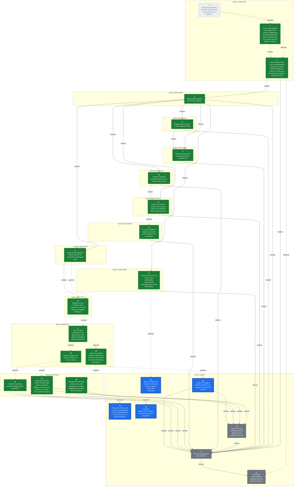

## Destination

`product-pipeline` (PR #6) merged into `migration` with conflicts resolved; the
combined pipeline (patient + product + state management) run for real against
the GCP production bucket, with output landed in BigQuery; every Python/R
difference documented and explicitly decided; CI green; performance
re-profiled against the R baseline now that the merge has landed; the
CLI/TUI's admin/developer UX and error-log observability judged good enough to
operate the pipeline day to day; R retired from the workspace (`r-archive/`,
`tools/LogViewerA4D`, stray R scripts) now that the pipeline is fully verified
Python-only; all dependencies and library versions audited and updated; and
`migration` merged into `dev` (PR #2).
This prevents promoting a merge that looks clean but was never exercised as a
whole, prevents documenting or promoting based on claims ("the intern says it
works") rather than verified fact, and prevents rolling out something that
runs correctly but nobody can operate or debug confidently — the migration is
large enough, and detail-sensitive enough, that things get missed unless
checked cell-by-cell.

**Destination redrawn 2026-08-09** (mid-[ticket 5](tickets/05-production-verification-run.md)
session): performance re-profiling, CLI/UX + observability, retiring R from
the workspace, and a dependency/library audit were added after the user
confirmed each belongs to "are we really ready to roll out", not separate
follow-on efforts. Originally the destination stopped at CI green + a
validated production run + promotion to `dev`.

## The tickets

```mermaid
flowchart TD
  subgraph FRONTIER["Frontier · 4"]
    direction TB
    T16["<b>16</b> · grilling<br/>Build a drill-down log<br/>analyzer for admins to<br/>inspect a specific tracker<br/>file's errors/logs"]
    T23["<b>23</b> · task<br/>Triage every flagged<br/>R/Python difference for<br/>the patient arm (raw and<br/>cleaned)"]
    T24["<b>24</b> · task<br/>Triage the residual produc<br/>t_units_received/product_u<br/>nits_released/product_rece<br/>ived_from raw-stage<br/>mismatches"]
    T25["<b>25</b> · task<br/>Triage the<br/>product_units_released<br/>cleaned-stage column<br/>mismatches"]
  end
  subgraph BLOCKED["Blocked · 3"]
    direction TB
    T6["<b>6</b> · task<br/>Promote migration into dev<br/>via PR #2"]
    T9["<b>9</b> · task<br/>Add golden-master/snapshot<br/>regression tests for<br/>patient and product"]
    T12["<b>12</b> · task<br/>Retire R from the<br/>workspace once the<br/>pipeline is fully verified<br/>Python-only"]
  end
  subgraph DECIDED["Decided · 17"]
    direction TB
    T2["<b>2</b> · grilling<br/>Retire the PDF/notebook<br/>analysis docs for an<br/>automated, script-based<br/>report"]
    T3["<b>3</b> · task<br/>Merge product-pipeline (PR<br/>#6) into migration"]
    T4["<b>4</b> · task<br/>Diagnose and fix why CI is<br/>red at migration HEAD"]
    T5["<b>5</b> · task<br/>Define and execute the<br/>real GCP production<br/>verification run"]
    T7["<b>7</b> · research<br/>Is the product pipeline<br/>(and patient's own claimed<br/>completeness) actually<br/>complete and sound,<br/>audited against R's<br/>product logic and<br/>patient's structure?"]
    T8["<b>8</b> · grilling<br/>Does the pytest suite<br/>reach unit/integration/e2e<br/>/regression parity between<br/>patient and product,<br/>excluding any<br/>R-comparison/USB-drive-<br/>dependent tests?"]
    T10["<b>10</b> · task<br/>Profile the combined<br/>pipeline's performance<br/>against the R baseline<br/>before promoting to dev"]
    T11["<b>11</b> · grilling<br/>Decide what CLI/TUI UX and<br/>error-log observability<br/>improvements<br/>admins/developers need<br/>before rollout"]
    T13["<b>13</b> · task<br/>Audit and update all<br/>dependencies and library<br/>versions before rollout"]
    T14["<b>14</b> · task<br/>Fix product pipeline's<br/>unable to find column<br/>product failures on 4 real<br/>trackers"]
    T15["<b>15</b> · task<br/>Build and run the R/Python<br/>output comparison script,<br/>then triage every flagged<br/>difference"]
    T17["<b>17</b> · task<br/>Fix the product<br/>comparison's row-alignment<br/>key, then triage every<br/>flagged R/Python<br/>difference"]
    T18["<b>18</b> · task<br/>Triage every flagged<br/>R/Python difference for<br/>both arms, and resolve the<br/>189-vs-155-tracker<br/>discrepancy"]
    T19["<b>19</b> · task<br/>Persist comparison run<br/>history and show run-over-<br/>run deltas"]
    T20["<b>20</b> · task<br/>Normalize the raw-stage<br/>product_entry_date<br/>comparison so it stops<br/>flagging near-universal<br/>false mismatches"]
    T21["<b>21</b> · task<br/>Triage the remaining<br/>product cleaned-stage<br/>column mismatches<br/>(balance, received_from,<br/>released_to, remarks,<br/>units_received, product)"]
    T22["<b>22</b> · task<br/>Triage the remaining<br/>product raw-stage column<br/>mismatches"]
  end
  subgraph DROPPED["Out of scope · 1"]
    direction TB
    T1["<b>1</b> · grilling<br/>Does product-pipeline's<br/>test suite meet the same<br/>cell-by-cell rigor as<br/>patient's?"]
  end

  T2 --> T15
  T3 --> T2
  T3 --> T4
  T3 --> T5
  T3 --> T6
  T3 --> T10
  T3 --> T11
  T3 --> T13
  T4 --> T5
  T4 --> T6
  T5 --> T6
  T6 --> T9
  T7 --> T8
  T8 --> T3
  T8 --> T6
  T10 --> T6
  T11 --> T6
  T12 --> T6
  T13 --> T6
  T13 --> T10
  T14 --> T6
  T20 --> T6
  T20 --> T12
  T21 --> T6
  T21 --> T12
  T22 --> T6
  T22 --> T12
  T23 --> T6
  T23 --> T12

  classDef frontier fill:#1f6feb,stroke:#0b3d91,stroke-width:3px,color:#ffffff
  class T16,T23,T24,T25 frontier
  classDef blocked fill:#6e7781,stroke:#424a53,stroke-width:1px,color:#ffffff
  class T6,T9,T12 blocked
  classDef decided fill:#1a7f37,stroke:#116329,stroke-width:1px,color:#ffffff
  class T2,T3,T4,T5,T7,T8,T10,T11,T13,T14,T15,T17,T18,T19,T20,T21,T22 decided
  classDef dropped fill:#eaeef2,stroke:#afb8c1,stroke-width:1px,color:#57606a
  class T1 dropped
```

<!-- graph:start -->

<!-- graph:end -->

## Notes

- **This map carries execution** (overrides wayfinder's plan-only default): once
  a ticket's decision is made — or immediately, for Task-type tickets — the
  same session also implements it, using `tdd` / `systematic-debugging` /
  `executing-plans` (the superpowers skills) where applicable, rather than
  stopping at the decision.
  - Guardrail: commits/pushes to any branch are fine, fully revertable.
  - Guardrail: merging a pull request is a human-only action, never the agent's
    — prepare the merge, stop short of clicking it.
  - Guardrail: triggering the real production GCP run / spending GCP budget is
    the user's job. Read-only GCP access (logs, BigQuery, GCS listings) and
    sandbox/POC runs are fine.
  - Guardrail: the cloud routine's checkout has no GCP credentials and no
    access to the real tracker files (patient/clinic data — sensitive, not
    committed to the repo, not shared with the cloud sandbox). It must work
    only with what's already in the repo (code, fixtures, synthetic test
    data). If a ticket turns out to need real trackers or live GCP auth to
    proceed, it stops and hands that specific piece back to the user to run
    locally — it never fabricates substitute data or asks for real patient
    data to be pasted into the session.
- A daily cloud routine (`a4d-migration-wayfinder-daily`, 9am Europe/Berlin)
  works this map one session at a time — claims the top frontier ticket, does
  what it can autonomously, and posts findings/questions for HITL tickets
  rather than answering them itself. Kept on cloud rather than local
  `launchd` deliberately: it only needs to fetch code and run it, not touch
  sensitive data or production GCP — see guardrails above.
- Domain: A4D medical tracker data pipeline, R-to-Python migration. See
  [CLAUDE.md](../../CLAUDE.md) and [docs/CLAUDE.md](../CLAUDE.md) for the
  codebase map, and [MIGRATION_GUIDE.md](../migration/MIGRATION_GUIDE.md) for
  the migration's own history (note: the copy on `migration` is stale relative
  to `product-pipeline`'s copy, which claims Phases 0-9 complete — that claim
  is unverified, which is exactly what this map exists to check).
- Standing preference: no notebooks for analysis, ever — write scripts.
  Analysis/reports should be automated and stay in sync with the code, not
  hand-written documents (PDFs, notebooks) that go stale.
- Standing preference: verification means cell-by-cell (shape, columns, exact
  values), not spot-checks — this is why the patient pipeline validation took
  as long as it did (174 trackers), and the product pipeline is held to the
  same bar.
- Standing preference (decided in the [test-rigor](tickets/01-product-pipeline-test-rigor.md)
  session): the migration is not 1:1 R-parity. Python may correctly diverge
  from R — R can be wrong. Judge divergence against the original source Excel
  trackers (`a4dphase2_upload` on the test-data drive), not against R's output
  alone. R-vs-Python comparison is *analysis* (a judgment call), not a pytest
  concern — pytest covers unit/integration/e2e/regression only.
- User sequencing preference: make `product-pipeline` ready first, then merge,
  then make `migration` ready, then promote. Tickets are blocked accordingly
  even where the underlying dependency is looser than the sequencing implies.
  "Ready" for the merge means tests green (ticket 8) plus ordinary pre-merge
  hygiene (code style, an implementation review confirming R's steps are
  actually migrated, doc alignment with patient) — **not** R/Python output
  parity. The comparison script (ticket 2) is explicitly post-merge: it only
  makes sense once patient and product share one branch, and the user judges
  green tests + a clean review sufficient grounds to merge without it
  (corrected mid-session on 2026-08-08, after ticket 2 had originally been
  wired as a merge blocker).
- Redraw command: `~/.claude/skills/wayfinder/scripts/render-map.sh docs/wayfinder`

## Where this map stands

Three tickets resolved. [Does product-pipeline's test suite meet the same
cell-by-cell rigor as patient's?](tickets/01-product-pipeline-test-rigor.md)
was superseded — it presupposed R-parity was the goal and that patient's
exception-dict pytest pattern was the bar to replicate for product; the user
rejected both, and it split into tickets 7 and 8. [Is the product pipeline
(and patient's own claimed completeness) actually complete and sound, audited
against R's product logic and patient's structure?](tickets/07-pipeline-completeness-audit.md)
is decided (research, read-only): R-logic coverage is essentially
complete on both pipelines, but product has real structural test gaps
(no integration/e2e tests, no coverage of `wide_format.py`, no
`test_tables/test_product.py`) and patient's "174 trackers validated" claim
has no committed record of an actual passing run. Full detail:
[research/07-pipeline-completeness-audit.md](research/07-pipeline-completeness-audit.md).
[Does the pytest suite reach unit/integration/e2e/regression parity between
patient and product, excluding any R-comparison/USB-drive-dependent
tests?](tickets/08-pytest-suite-parity.md) is now decided: parity means an
85%+ coverage floor enforced in CI plus product gaining the three
integration/e2e files it's missing (mirroring patient's existing
fixture/skip-if-missing convention) and `test_tables/test_product.py`;
`test_r_validation.py` leaves pytest entirely, with no product equivalent.
Mid-session the user clarified "regression test" means golden-master/snapshot
testing (fixed input, output snapshotted per stage, diffed on future
changes) rather than R-comparison or edge-case testing — that work doesn't
need real/sensitive data and was split off into [Add golden-master/snapshot
regression tests for patient and product](tickets/09-snapshot-regression-tests.md),
which the user wants deferred until both pipelines' other test suites are in
place and green.

**Four tickets resolved.** [Merge product-pipeline (PR #6) into
migration](tickets/03-merge-product-pipeline.md) is done: ticket 8's test
files, the product-only coverage gate, `test_r_validation.py` removal, a
repo-wide ruff/ty cleanup, an implementation review that found and fixed two
real logging-parity gaps (product never populated `TrackerResult.data_errors`
or created a logs/errors table, unlike patient), and doc alignment (verified,
no changes needed) are all implemented and pushed to `product-pipeline`. PR
#6's conflicts (`gcp/bigquery.py`, `cli.py`) are resolved — it is now
`mergeable: MERGEABLE`. Landing it is left to the user (human-only merge
guardrail). Full detail: [ticket 3](tickets/03-merge-product-pipeline.md).

**Ticket 2 was re-sequenced** (same session ticket 3 closed in — the user
corrected this): it no longer blocks the merge, since the comparison script
only makes sense once patient and product share a branch, and green tests +
a clean review is judged sufficient trust to merge without it first. Ticket 2
is blocked on ticket 3 instead of the reverse (`blocked_by: [3]`) — and since
ticket 3 is now closed, ticket 2 is unblocked.

**Five tickets resolved.** [Diagnose and fix why CI is red at migration
HEAD](tickets/04-fix-migration-ci.md) is done: root cause was Typer's
`FORCE_TERMINAL` freezing to `True` at import time because GitHub Actions
always sets `GITHUB_ACTIONS=true`, which forces colorized `--help` output
that splits options like `--file` into separate ANSI spans and breaks
plain substring assertions — independent of the `NO_COLOR`/`COLUMNS`
overrides already in place. `tests/conftest.py` on `product-pipeline` now
sets Typer's own `_TYPER_FORCE_DISABLE_TERMINAL` escape hatch before
`typer.rich_utils` is first imported. Pushed as `b970cf6`; PR #6's CI is
green (428 tests), and PR #6 is `mergeable: MERGEABLE`. Full detail:
[ticket 4](tickets/04-fix-migration-ci.md).

**PR #6 was merged by the user** (2026-08-09, merge commit `7713fea`,
human-only action per this map's guardrails). `migration` now contains the
combined patient + product pipeline; CI on the merge commit is green
(`gh run list --branch migration` — run `31286057254`, `conclusion:
success`). PR #2 (`migration` -> `dev`) is `mergeable: MERGEABLE`. This
closes out the "make `product-pipeline` ready, then merge" half of the
user's sequencing preference; what remains before ticket 6 (promotion) is
"make `migration` ready" — tickets 2 and 5.

Key facts already gathered while charting (verified via `git`/`gh`, not
assumed): PR #2 (`migration` -> `dev`) is open and mergeable, but CI has
failed on `migration` HEAD for its last 3 runs (ticket 4's target).
`source_vs_output_product.py` is deliberately group-granularity only ("v1"),
not cell-by-cell, per its own docstring. `PYTHON_IMPROVEMENTS.md`'s parity
claims cite a notebook (`Ali_internship/residual_dig.ipynb`, not in the
tracked tree) and a patient-only comparison script — i.e. one-off analysis,
not a repeatable test. Its two PDF reports haven't been read yet — ticket 2's
remit.

**Six tickets resolved.** [Define and execute the real GCP production
verification run](tickets/05-production-verification-run.md) is done: the
combined patient + product pipeline ran for the first time as one execution
via the existing `a4d-pipeline` Cloud Run Job against real production
GCS/BigQuery, preceded by a `just backup-bq` snapshot, and verified clean
against that snapshot (row counts, distinct clinics, schema — not R, which
the user decided is out of this ticket's scope). Full detail: [ticket
5](tickets/05-production-verification-run.md).

**Four tickets were added mid-session, none resolved**: [Profile the
combined pipeline's performance against the R baseline before promoting to
dev](tickets/10-performance-profiling.md) — the user's standing understanding
that Python is much faster than R predates this merge's additions and hasn't
been re-checked; [Decide what CLI/TUI UX and error-log observability
improvements admins/developers need before rollout](tickets/11-cli-ux-observability.md),
graduated from fog once the user confirmed it's in this map's scope; [Retire
R from the workspace once the pipeline is fully verified
Python-only](tickets/12-retire-r-workspace.md) — `r-archive/`,
`tools/LogViewerA4D` (an R Shiny log viewer another developer wrote, now
confirmed removable outright with no Python replacement needed), and a stray
root `test_full_pipeline_debug.R`, gated on tickets 2 and 10 since both still
need R as a live reference; and [Audit and update all dependencies and
library versions before rollout](tickets/13-dependency-audit.md), wired ahead
of ticket 10 so profiling doesn't run against a soon-to-change dependency
set. All four are new blockers on ticket 6. **The destination itself was
redrawn** to name all four concerns explicitly (see Destination section) —
this map now covers operational rollout readiness, not just "merge, verify,
promote."

**Seven tickets resolved.** [Audit and update all dependencies and library
versions before rollout](tickets/13-dependency-audit.md) is done: see the
Decisions-so-far entry above for detail. This unblocks [ticket
10](tickets/10-performance-profiling.md) (performance re-profiling against
the R baseline), since its other blocker (ticket 3) was already closed.

**Eight tickets resolved.** [Profile the combined pipeline's performance
against the R baseline before promoting to dev](tickets/10-performance-profiling.md)
is done — retitled in substance mid-session: the user dropped the R-baseline
comparison entirely (R's already known to be slower; re-confirming that
teaches nothing) and reframed it as a function-level performance/robustness
profile of the Python pipeline itself, run with `pyinstrument` against the
full 177-tracker real dataset (from the USB drive, at the user's suggestion,
since current production trackers aren't available locally). That profile
found `find_data_start_row` (`src/a4d/extract/patient.py`) was O(n^2) on
read-only worksheets — each `.cell()` call re-parses a sheet's XML from row
1 — and fixed it with a single sequential scan: 6.6x speedup on the full
patient arm (145.8s -> 22.0s, 171 real trackers, 4 workers, identical
output), pushed as `97479f8` with a regression test. Full combined
patient+product run: 73.86s wall, ~556MB peak RSS (rough floor, not
exhaustive). Also surfaced 4 product trackers failing outright
("unable to find column \"product\"") — unrelated to the performance fix,
not previously documented anywhere on this map — spawned as [ticket
14](tickets/14-product-column-detection-failures.md) rather than fixed
inline, now also blocking ticket 6. Full detail: [ticket
10](tickets/10-performance-profiling.md).

**Nine tickets resolved.** [Fix product pipeline's "unable to find column
product" failures on 4 real trackers](tickets/14-product-column-detection-failures.md)
is done: confirmed legitimate (2018-2020 KBH and 2020 JVM trackers predate
product/stock tracking entirely — no "product" keyword and no `INV` sheet
anywhere in any of their month sheets, verified directly against the real
files on the USB drive; product tracking starts with KBH's 2021 `INV`
sheet), not a synonym gap or regression. The actual bug was in
`clean_product_data` (`src/a4d/clean/product.py`): it assumed a `"product"`
column always exists and crashed on the fully columnless frame extraction
correctly hands back for these trackers, because `apply_schema` invents a
spurious 1-row output from a columnless input instead of preserving 0 rows.
Fixed with an early return to an empty, schema-conformant (0, 20) DataFrame
when the raw frame has no columns. Reproduced the original crash and the fix
against the real files; all 4 now process successfully with 0-row output.
One regression test added; full suite (490 tests), ruff, `ty check` all
pass. Full detail: [ticket 14](tickets/14-product-column-detection-failures.md).

**Ten tickets resolved.** [Retire the PDF/notebook analysis docs for an
automated, script-based report](tickets/02-documentation-strategy.md) is
decided (design only, not built): the R baseline is the already-frozen
`/Volumes/USB SanDisk 3.2Gen1 Media/a4d/output_r/` (dated 2025-11-14, same
still-unchanged trackers, covers both patient and product) — no R re-run,
ever. The comparison script (`scripts/compare_outputs.py` + `just
compare-outputs`, not `a4d.cli`, since it's migration-only tooling that dies
with R's retirement) is decoupled from pipeline execution — it diffs two
existing output directories — and runs four layered checks (shape, totals,
columns, cell-by-cell), with an extensible cause-classifier registry seeded
from the four causes already known from the parity-presentation PDF, output
as an HTML report. Docs cleanup done inline: the unrelated dashboarding PDF
deleted, the parity-presentation PDF kept (holds the real numbers needed to
validate the new script; removed only once superseded), and
`PYTHON_IMPROVEMENTS.md`'s dead notebook citation fixed to point at that PDF.
`test_r_validation.py` was confirmed already gone from pytest (removed in the
ticket 3/8 merge). Actually building the script and triaging the flagged
differences (the bulk of the real work — most causes aren't known ahead of
time) was explicitly deferred, spawning [ticket
15](tickets/15-build-and-run-comparison-script.md). Full detail: [ticket
2](tickets/02-documentation-strategy.md).

Closing ticket 2 also required correcting two other tickets whose premises
assumed R needed to stay live in this repo for ticket 2's work: [ticket
12](tickets/12-retire-r-workspace.md) is now `blocked_by: [15]` instead of
`[2, 10]` (retiring `r-archive/` was never going to touch the frozen
USB-drive baseline, so the real remaining reason to wait is ticket 15's
investigative work possibly needing one more look at R's behavior, not the
archive itself), and [ticket 6](tickets/06-promote-migration-to-dev.md)'s
`blocked_by` swaps `2` for `15`, since the destination's requirement that
"every Python/R difference [be] documented and explicitly decided" isn't met
until ticket 15 actually runs the comparison, not just designs it.

**Eleven tickets resolved.** [Decide what CLI/TUI UX and error-log
observability improvements admins/developers need before
rollout](tickets/11-cli-ux-observability.md) is decided and implemented, for
its CLI/UX half: `run-pipeline` (the actual production entry point behind
the Cloud Run Job) was found to never render any of the rich per-arm summary
tables `process-patient`/`process-product` already have — it only printed a
one-line count per arm, with no cross-arm view. Demonstrated the gap with a
real synthetic-data run rather than reasoning about it, then built and
shipped `_render_combined_run_summary()`: a combined patient+product view
crossing each file's outcome into four buckets (both ok / patient failed
only / product failed only / lost entirely) plus a merged per-file error
count. That exposed a real behavior bug — `run-pipeline` aborted the entire
run on any single patient tracker failure, before the product arm even ran,
which made "patient-only failed" structurally unobservable — fixed by
switching the patient arm to the same soft-fail-and-continue posture the
product arm already used. Fixing that in turn exposed a real test-isolation
bug: two `run-pipeline` CLI tests mocked only `run_patient_pipeline`, so
`run_product_pipeline` silently processed 185 real local tracker files as a
side effect once soft-fail let execution reach it; fixed by mocking both
arms in every `run-pipeline` test. Full suite (494 tests), ruff, `ty check
src/` all pass; pushed as `33694b4`. The error-log observability half (a
drill-down view into one specific file's full detail, replacing
`LogViewerA4D`'s job) was explicitly split off rather than answered here —
spawned as [ticket 16](tickets/16-log-analyzer-drill-down.md), including its
own open question of whether it's needed before promotion or is a
nice-to-have outside the promotion path. Full detail: [ticket
11](tickets/11-cli-ux-observability.md).

**Twelve tickets resolved.** [Build and run the R/Python output comparison
script, then triage every flagged difference](tickets/15-build-and-run-comparison-script.md)
is done for its infrastructure half: `src/a4d/migration/compare.py` (four
pure, unit-tested layers — shape, totals, columns, cell-by-cell — plus the
seeded cause classifier and HTML report renderer, 23 tests, TDD'd) and
`scripts/compare_outputs.py` + `just compare-outputs` were built per ticket
2's design. A fresh Python pipeline pass ran against `a4dphase2_upload`
(both arms), landing on the USB drive next to the frozen `output_r/`
(replacing a stale 2025-11-15 copy) — 174/174 patient and 174/174 product
trackers succeeded. Running the comparison found the **patient row-alignment
key is sound** (`patient_id` + `sheet_name`, duplicate keys in only 5/172
files) but the **product row-alignment key is broken**: `product_entry_date`
being null on many rows collapses the key onto far fewer distinct values
than rows exist (one file: 154 distinct keys for 1,194 rows, up to 35-way
duplication), which both inflates reported mismatches by orders of magnitude
via join fan-out and silently excludes `product_entry_date` — the PDF's
largest single divergence column — from classification entirely, since it's
one of the join keys. Building a corrected alignment strategy and actually
triaging the flagged differences (for both arms) was split off into [ticket
17](tickets/17-fix-product-row-alignment-and-triage.md), per ticket 15's own
pre-authorization to split if triage didn't converge in one session. Full
detail: [ticket 15](tickets/15-build-and-run-comparison-script.md).

**Same session, continued past ticket 15's closure** (recorded in its
[addendum](tickets/15-build-and-run-comparison-script.md#addendum-same-session-after-closure)
rather than as a new ticket, since it's the same deliverable maturing, not a
new decision): the comparison tool was substantially hardened at the user's
direction. HTML output was dropped entirely in favor of Excel (triage means
loading results as a dataframe, filtering, sorting, adding columns — a
static HTML page doesn't support that); `compare_id_overlap` and
`compare_categorical_overlap` were added (identity/label-set checks
independent of the row-alignment key, which confirmed product *names* match
100% between R and Python even where cell comparison is meaningless);
`compare_row_key_overlap` was added after the user noticed cell-mismatch
counts near 0 for raw product files didn't add up — it measures, per file,
how many rows found *no partner at all* via the full row-alignment key, and
confirmed those near-0 cell counts meant "nothing was paired to compare,"
not agreement (one file: 560/560 rows unmatched). Raw pipeline output
(`patient_data_raw`/`product_data_raw`) is now compared alongside cleaned,
one report per stage, so a divergence can be localized to extraction vs.
cleaning. All display names were made consistent ("X divergence" for every
count-based check). [Ticket 17](tickets/17-fix-product-row-alignment-and-triage.md)
inherits this more capable tool — its premise was updated to note
`RowKeyOverlap.matched` can validate a proposed alignment fix directly.

**Thirteen tickets resolved.** [Fix the product comparison's row-alignment
key, then triage every flagged R/Python difference](tickets/17-fix-product-row-alignment-and-triage.md)
is done for its row-alignment-key half: the old equi-join key (`clinic_id`,
`product`, `product_sheet_name`, `product_entry_date`) is replaced by
`add_row_ordinal()` (`src/a4d/migration/compare.py`) — ordinal position
within `(clinic_id, product_sheet_name)`, computed at comparison time
(never stored, since R's frozen baseline can't be re-run to pick up a new
column), with whitespace-normalized group keys so a divergence like R's
un-trimmed sheet names still surfaces as an ordinary cell mismatch instead
of breaking alignment. Along the way, found R's own `index` helper
(`clean/product.py` step 2.5) resets per-sheet while Python's is a single
global counter across the whole file — a real, previously undocumented
divergence between the two pipelines, though not one this ticket needed to
fix in the pipeline itself. Validated directly against the real R/Python
output pair on the USB drive: row-key match on cleaned product jumped from
near-0% to 97.2% (46,314/47,644), with the remaining 2.8% isolated entirely
to one clinic — R's frozen output has `clinic_id = "NGH"` for North
Okkalapa General Hospital across all three of its tracker years, where
Python (matching the tracker's actual folder name) correctly has `"NOH"`.
`product_sheet_name`'s mismatch count (201) now reproduces the
parity-presentation PDF's number exactly, the strongest available
confirmation the new key is sound. Actually triaging the flagged
differences did not converge in this session — initial per-column counts
are still far larger than the PDF's even with alignment fixed
(`product_category`: 13,638 vs 214; `product_entry_date`: 10,424 vs 559),
and a first look found `product_category` mismatches are systematically
`r_value=None` where Python has a real value, an unexplained pattern rather
than a diagnosis — so that work, plus patient-arm triage and the
still-unreconciled 189-vs-155-tracker discrepancy (confirmed unchanged by
this ticket's fix — the currently-frozen `output_r/` genuinely has 155
files/47,644 rows), split into [ticket
18](tickets/18-triage-comparison-flagged-differences.md). Full detail:
[ticket 17](tickets/17-fix-product-row-alignment-and-triage.md).

**Fourteen tickets resolved.** [Persist comparison run history and show
run-over-run deltas](tickets/19-compare-run-history-deltas.md) is done,
spawned and closed in the same session as ticket 17: a same-session
conversation about how to work ticket 18 settled that cell-mismatch causes
should be classified opportunistically (start `unclassified`, name a cause
the moment a real pattern is noticed, drop it if it doesn't earn its keep)
rather than pre-built into a taxonomy, and that a fix's actual effect should
be visible by count rather than needing classification to prove it worked —
which needed run-over-run tracking that didn't exist yet.
`snapshot_from_summary()`/`compute_deltas()` (`src/a4d/migration/compare.py`)
reduce/diff `build_summary_rows()`'s per-column/per-cause counts. Refined
twice more in the same session after user review: `--report-out` (a single
misleadingly-named filename the tool derived four sibling files from) was
renamed to `--output-dir`, and — on explicit request — every stage of one
`just compare-outputs` run now writes into a shared subfolder named by that
run's own UTC timestamp (`output/comparison/<run-timestamp>/`), so a run is
a self-contained unit on disk (its four Excel reports and four JSON
snapshots together) rather than scattering same-named files across the cwd
every time. The CLI prints + writes a delta (previous vs. current,
red/green) against the most recent prior *run folder's* snapshot for that
stage. Same review also prompted a `scripts/` cleanup: ten stale one-off
debug scripts predating this map's work (hardcoded to a drive layout that
no longer exists) were removed, superseded by the pytest suite, ticket 10's
profiling approach, or this comparison tool. Validated end-to-end against
the real drive data across both layouts (no-previous-run, no-change, and a
synthetic-edit check that the delta table and Excel sheets render
correctly) — not just unit-tested. This is tooling ticket 18 will use, not
part of ticket 18's own triage scope. Full detail: [ticket
19](tickets/19-compare-run-history-deltas.md).

**Fifteen tickets resolved.** [Triage every flagged R/Python difference for
both arms, and resolve the 189-vs-155-tracker discrepancy](tickets/18-triage-comparison-flagged-differences.md)
is done for its diagnostic half: the 189-vs-155-tracker gap is resolved as
unreconcilable — every product-output snapshot that exists anywhere on the
USB drive (`output_r/`, `output_vm/`, `output.zip`,
`a4dphase2_upload/output/`, `a4dphase2_upload.zip`) tops out at 174 files;
none reach 189, so the parity-presentation PDF's baseline predates
everything now on the drive and per-column counts should be judged by
pattern, not by exact reproduction of the PDF's numbers. `product_category`
(13,638 mismatches) is 100% `r_value=None`-with-Python-present, root-caused
to `read_product_data.R`'s `add_product_categories()` doing a case/whitespace-
sensitive left-join with no normalization (`src/a4d/reference/products.py`
normalizes both sides) — a genuine, verified R limitation, not a Python
defect. The dominant share of `product_entry_date` mismatches (10,211 of
10,424) share the same R-null pattern; a concrete spot-check against the
real source Excel (`2018_Mahosot Hospital A4D Tracker`, sheet `Jan18`) found
R nulling out a perfectly clean, unambiguous date present on every row — a
plain R extraction gap, not a typo, so the seeded `typo_rescue` classifier
(which just matched any R-null case) was renamed `r_value_missing` to stop
mislabeling it. A new `PRODUCT_CATEGORY_CLASSIFIERS` registry
(`r_category_lookup_miss`) was added to `src/a4d/migration/compare.py`;
`tests/test_migration/test_compare.py` updated and passing (60 tests). Also
found the raw-stage `product_entry_date` report is ~99% a representation
artifact (R stores unparsed Excel serials as strings, Python stores already-
parsed dates) rather than real divergence — not fixed this session. The
remaining product columns (`product_balance`, `product_received_from`,
`product_released_to`, `product_remarks`, `product_units_received`,
`product`, both stages) and the entire patient arm (never triaged since
ticket 15 ran it) didn't converge in this session either — split into
[ticket 20](tickets/20-fix-raw-entry-date-representation.md) (raw-stage
entry_date representation fix), [ticket
21](tickets/21-triage-remaining-product-columns.md) (remaining product
cleaned-stage columns), [ticket
22](tickets/22-triage-product-raw-columns.md) (remaining product raw-stage
columns), and [ticket 23](tickets/23-triage-patient-arm.md) (patient arm,
both stages). Full detail: [ticket
18](tickets/18-triage-comparison-flagged-differences.md).

**The frontier was tickets 16, 20, 21, 22, and 23**; ticket 20 is now closed
(see above), leaving [Build a drill-down log analyzer for admins to inspect
a specific tracker file's errors/logs](tickets/16-log-analyzer-drill-down.md),
[Triage the remaining product cleaned-stage column mismatches](tickets/21-triage-remaining-product-columns.md),
[Triage the remaining product raw-stage column mismatches](tickets/22-triage-product-raw-columns.md),
and [Triage every flagged R/Python difference for the patient arm](tickets/23-triage-patient-arm.md)
as the frontier. Ticket 12 is blocked_by `[20, 21, 22, 23]`, so ticket 20's
closure doesn't unblock it yet — tickets 21-23 still remain. Ticket 6
(promote to `dev`) is `blocked_by: [8, 3, 4, 5, 10, 11, 12, 13, 14, 20, 21,
22, 23]` — tickets 3, 4, 5, 8, 10, 11, 13, 14, and now 20 are closed; ticket
12 and tickets 21-23 are what remain (ticket 16 isn't wired as a blocker
yet — its own question 4 is whether it should be). The user has said they
intend to keep working this map session by session on `migration` until
confident enough to roll out, rather than promoting early.

Also noted, not yet acted on: a local, untracked `a4d-python/` directory at
the repo root (stale leftover copy predating the current `src/` layout, not
in git) — the user hasn't yet said whether to delete it; separate from
ticket 12's git-tracked R cleanup.

**Same day, after ticket 18 closed:** production tracker uploads grew from
177 to 248 files (confirmed via `a4d download trackers` against live GCS,
read-only). The user directed a one-time R re-run against the current
tracker set to get comparable numbers — R code unchanged, framed
explicitly as the final capture before ticket 12 removes R, not a reversal
of ticket 2's "no R re-run, ever" decision. `output_r/` now holds fresh R
output (229 product-cleaned files/66,020 rows, 243 patient-cleaned
files/81,859 rows) with the old 155-file baseline preserved at
`output_r_155_frozen_backup_2025-11-14`. This substantially changed
ticket 18's picture: `product_category` mismatches dropped from 13,638 to
866 (most of the original count was baseline staleness, not the
case-sensitive-join bug itself, which is still real for what remains), the
row-alignment key now matches 100% (up from 97.2%), and the 189-vs-155
question is now much closer to reconciled (229/66,020 vs the PDF's
189/61,077) though not re-verified as exactly resolved. Tickets 20, 21, 22,
and 23 all had their premise numbers refreshed against the new baseline
(none needed re-scoping — the columns/questions they ask are unchanged).
Full detail: [ticket 18's addendum](tickets/18-triage-comparison-flagged-differences.md#addendum-same-day-after-closure-r-re-run-against-the-current-tracker-set).
Also fixed in passing: `justfile`'s `compare-outputs` recipe default was
out of sync with the script's own documented default, a leftover from
ticket 19 — now both say `output/comparison`.

**Sixteen tickets resolved.** [Normalize the raw-stage product_entry_date
comparison so it stops flagging near-universal false mismatches](tickets/20-fix-raw-entry-date-representation.md)
is done: `normalize_date_column()` (`src/a4d/migration/compare.py`) reuses
the cleaning stage's own flexible date parser (`a4d.clean.date_parser.parse_date_flexible`,
Excel-serial and typo-rescue handling included) to parse both sides'
raw `product_entry_date` strings to a common `date` before diffing, wired
in for the `Product (raw)` stage only via a new `date_normalize_cols` field
on `scripts/compare_outputs.py`'s `STAGES` table. Verified against the real
`output_r`/`output_python` on the USB drive: raw-stage `product_entry_date`
mismatches dropped from 65,743 to 91 (99.86% was the representation
artifact). Triaged the remaining 91: 46 already land in the existing seeded
classifiers, and the other 50 — spread across 14 files, including a
confirmed real bug (a stray `"\n"`-dated row in Python's raw extraction for
`2020_Sarawak General Hospital..._May20`) and several files showing a
similar single-row insertion/shift pattern — were folded into [ticket
22](tickets/22-triage-product-raw-columns.md)'s scope rather than left
untracked in this closed ticket, per the destination's "every difference
explicitly decided" bar. Full detail: [ticket
20](tickets/20-fix-raw-entry-date-representation.md).

**Seventeen tickets resolved.** [Triage the remaining product raw-stage
column mismatches](tickets/22-triage-product-raw-columns.md) is done: found
and fixed a real Python bug (`remove_header_rows` in
`src/a4d/extract/product.py` missed rows where every cell was blank except
one stray empty string from a formula-emptied Excel cell -- R's `is.na()`
check drops these, Python's `is_null()` check didn't), which turned out to
be the root cause of the "single-row insertion/shift pattern" ticket 20 had
flagged but not chased (confirmed: the Sarawak `"\n"`-dated row is gone
too, 191/191 rows). Added two more comparison-tool normalizations
mirroring ticket 20's `normalize_date_column` precedent:
`normalize_numeric_column()` (R's and Python's own float-to-string
conversions round a raw float's trailing digits differently -- parse both
back to `float` so the existing tolerance applies) and
`normalize_whitespace_column()` (readxl's `trim_ws=TRUE` default strips
whitespace R-side that openpyxl preserves, and readxl represents an
embedded line break as `\r\n` where openpyxl normalizes to `\n`). Verified
end-to-end against the real drive data (248-tracker set): raw-stage product
mismatches across all 9 columns dropped from 2,007 to 105 (95%), fully
resolving `product`, `product_balance`, `product_entry_date` (now 0
`unclassified`), `product_remarks`, `product_released_to`, and
`product_units_returned`. The 105-row residual across
`product_units_received`, `product_units_released`, and
`product_received_from` didn't converge to a single cause (at least two
more distinct patterns found, one possibly systemic) -- split into [ticket
24](tickets/24-triage-remaining-raw-column-residual.md) per the map's
"split rather than sprawl" rule. Full suite (571 passed), ruff, `ty check
src/` all pass. Full detail: [ticket
22](tickets/22-triage-product-raw-columns.md).

**Eighteen tickets resolved.** [Triage the remaining product cleaned-stage
column mismatches](tickets/21-triage-remaining-product-columns.md) is done:
five of its six columns (`product_balance`, `product_received_from`,
`product_released_to`, `product_remarks`, `product_units_received`) turned
out to share one root cause, already half-diagnosed by ticket 18 —
R's per-(clinic, sheet, product) row sort falls back to raw input-row order
whenever `product_entry_date` fails to parse, which is *near-universal*
(confirmed 100% of "change"-status rows null for several major clinics,
e.g. 2024/2023/2022 Mahosot) rather than occasional, while Python correctly
parses the same cells and sorts chronologically instead — both sides
implement the identical documented rank algorithm, so this is R's
already-known date-extraction gap resurfacing as a *sort-order* divergence,
not a Python bug. Since the row-alignment key (`add_row_ordinal`) is purely
positional, that legitimate order difference cascades into value-level
mismatches on every column compared through it, even though the underlying
data (e.g. end-of-group balance, confirmed matching in 98.3% of affected
groups) is unaffected. Added a `row_order_divergence` classifier
(`PRODUCT_ROW_ORDER_CLASSIFIERS` in `src/a4d/migration/compare.py`, backed
by a new opt-in `order_group_cols` parameter on `compare_cells`): fully or
almost fully explains four of the five columns (100%, 100%, 100%, 97.4%);
`product_balance`'s cumulative running total under-detects via simple
value-membership (27.9% caught directly) despite sharing the same root
cause, left as future work. The sixth column, `product` (652 mismatches),
had a different, single cause — an embedded `\r\n`-vs-`\n` line break that
ticket 22 already normalizes for the raw stage but that survives cleaning;
extending `normalize_whitespace_column` to the cleaned stage (scoped to
`product` alone) resolved it fully (652 -> 0). `product_units_received`'s
residual 8 mismatches are the same Excel-date-serial-leak pattern [ticket
24](tickets/24-triage-remaining-raw-column-residual.md) already flagged for
the raw stage, now confirmed to reach the cleaned stage too — left for
ticket 24. Discovered `product_units_released` (2,144 cleaned-stage
mismatches) was never assigned to any ticket — spawned [ticket
25](tickets/25-triage-product-units-released-cleaned.md). Full suite (577
tests), ruff, `ty check src/` all pass; verified end-to-end against the real
248-tracker drive data. Full detail: [ticket
21](tickets/21-triage-remaining-product-columns.md).

**The frontier is now [Build a drill-down log analyzer for admins to
inspect a specific tracker file's errors/logs](tickets/16-log-analyzer-drill-down.md),
[Triage every flagged R/Python difference for the patient
arm](tickets/23-triage-patient-arm.md), [Triage the residual
product_units_received/product_units_released/product_received_from
raw-stage mismatches](tickets/24-triage-remaining-raw-column-residual.md),
and [Triage the product_units_released cleaned-stage column
mismatches](tickets/25-triage-product-units-released-cleaned.md).**
Ticket 12 is `blocked_by: [20, 21, 22, 23]` — ticket 21's closure leaves only
23 remaining (ticket 24 and the newly-spawned ticket 25 aren't wired as
blockers of ticket 12, since neither is a prerequisite the destination
named — both are residuals of already-closed ticket scope).

## Decisions so far

- [Diagnose and fix why CI is red at migration HEAD](tickets/04-fix-migration-ci.md)
  — decided and implemented: CI was red because GitHub Actions sets
  `GITHUB_ACTIONS=true` for every job, and Typer reads that at import time
  to force full-color `--help` rendering, which splits options like
  `--file` into separate ANSI spans and breaks the tests' plain substring
  assertions — regardless of the `NO_COLOR`/`COLUMNS` overrides the tests
  already set. The original lead (`cli.py`'s module-level `console` object)
  was investigated and ruled out: Rich re-reads `COLUMNS` live rather than
  caching it, and `--help` is rendered by Typer's own internal console, not
  `cli.py`'s. Fix: `tests/conftest.py` on `product-pipeline` sets Typer's
  own `_TYPER_FORCE_DISABLE_TERMINAL` escape hatch before `typer.rich_utils`
  is first imported. Pushed as `b970cf6`; PR #6's CI is green
  (all 428 tests), coverage gate holds, PR #6 is `mergeable: MERGEABLE`.
  Full detail: [ticket 4](tickets/04-fix-migration-ci.md).

- [Does product-pipeline's test suite meet the same cell-by-cell rigor as
  patient's?](tickets/01-product-pipeline-test-rigor.md) — superseded: R-parity
  isn't the goal (source trackers are the arbiter, not R's output);
  R-vs-Python comparison is analysis, not pytest; neither pipeline's
  completeness has actually been audited yet. Split into tickets 7 and 8;
  ticket 2 now owns the analysis-report side.
- [Is the product pipeline (and patient's own claimed completeness) actually
  complete and sound, audited against R's product logic and patient's
  structure?](tickets/07-pipeline-completeness-audit.md) — decided: R-logic
  coverage is essentially complete function-for-function on both pipelines
  (one diagnostic-only R gap on product); product has real structural test
  gaps (no integration/e2e tests, no `wide_format.py` coverage, no
  `test_tables/test_product.py`, group-granularity-only source-vs-output
  check); patient's "174 trackers validated" claim has genuine test
  infrastructure but no committed record of an actual passing run (CI
  excludes it, USB-drive-gated). Full inventory and gap lists:
  [research/07-pipeline-completeness-audit.md](research/07-pipeline-completeness-audit.md).
- [Does the pytest suite reach unit/integration/e2e/regression parity between
  patient and product, excluding any R-comparison/USB-drive-dependent
  tests?](tickets/08-pytest-suite-parity.md) — decided: parity = 85%+ coverage
  enforced in CI, product gets the three missing integration/e2e files built
  on patient's existing fixture/skip-if-missing convention plus
  `test_tables/test_product.py`; `test_r_validation.py` leaves pytest
  entirely with no product equivalent. "Regression test" was reframed
  mid-session to mean golden-master/snapshot testing (not R-comparison or
  edge-case testing) and split off into
  [Add golden-master/snapshot regression tests for patient and
  product](tickets/09-snapshot-regression-tests.md), deferred until both
  pipelines' other test suites are green.
- [Merge product-pipeline (PR #6) into migration](tickets/03-merge-product-pipeline.md)
  — decided and implemented: ticket 8's tests written (85%+ coverage
  narrowed to product-only code, per a mid-session user correction —
  repo-wide coverage was 73%, not close to 85%, and most of the gap is
  patient/CLI code unrelated to product parity), `test_r_validation.py`
  removed, repo-wide ruff/ty cleanup (blocking, since CI runs both
  unscoped), an implementation review that found and fixed two real
  logging-parity gaps (product never populated `TrackerResult.data_errors`
  or created a logs/errors table, unlike patient — both now mirror patient
  exactly), and doc alignment verified with no changes needed. PR #6's
  merge conflicts resolved; it is now `mergeable: MERGEABLE`. CI still
  fails on 7 `--help`-rendering tests unrelated to product code — handed to
  ticket 4 with a concrete lead rather than fixed here.

- [Define and execute the real GCP production verification run](tickets/05-production-verification-run.md)
  — decided and executed: ran the combined patient + product pipeline for the
  first time as one execution, via the existing `a4d-pipeline` Cloud Run Job
  against real production GCS/BigQuery (execution `a4d-pipeline-8mxls`,
  succeeded). Preceded by a `just backup-bq` snapshot as the rollback point.
  Verified with a new script (`scripts/verify_production_run.py` +
  `src/a4d/gcp/verify.py`, unit-tested) comparing row counts, distinct clinic
  counts, and schema against that snapshot — not against R, which the user
  decided has no role in this ticket's check (R-vs-source comparison stays
  ticket 2's job). All four tables grew cleanly (51 -> 53 clinics), no
  anomalies. Confirmed along the way that Cloud Scheduler isn't enabled on the
  project yet. Full detail: [ticket 5](tickets/05-production-verification-run.md).

- [Audit and update all dependencies and library versions before
  rollout](tickets/13-dependency-audit.md) — decided and implemented:
  `uv lock --upgrade` moved every dependency to current latest (three
  majors — `pandera` 0.26->0.32, `pytest` 8->9, `typer` 0.19->0.27, `rich`
  came along transitively 14->15); resolved all 19 known vulnerabilities
  `pip-audit` found in the prior lock; `Dockerfile`'s `python:3.14-slim`
  floating tag checked and already current, no change needed. `ty` (dev
  type checker) jumped 0.0.1a23 -> 0.0.69 and surfaced two real `src/`
  gaps the old alpha missed — `gcp/storage.py`'s unguarded `blob.name`
  (`str | None` per stubs) and `validate/common.py`'s `emit_finding`
  `error_code` param (typed `str` behind a dead mypy-style ignore `ty`
  never honored) — both fixed. Full suite (488 tests), ruff, `ty check
  src/`, and the product-only coverage gate all pass; pushed as `c4721ad`.
  This unblocks [ticket 10](tickets/10-performance-profiling.md) (its
  other blocker, ticket 3, was already closed). Full detail: [ticket
  13](tickets/13-dependency-audit.md).

- [Profile the combined pipeline's performance against the R baseline before
  rollout](tickets/10-performance-profiling.md) — decided and executed: R
  comparison dropped (already known slower); reframed as a `pyinstrument`
  function-level profile of the Python pipeline against the full 177-tracker
  real dataset. Found and fixed an O(n^2) bug in `find_data_start_row`
  (per-row `.cell()` calls each re-parse a read-only worksheet's XML from
  row 1) — 6.6x speedup on the full patient arm (145.8s -> 22.0s), pushed as
  `97479f8` with a regression test. Full combined run: 73.86s wall, ~556MB
  peak RSS. Also surfaced 4 product trackers failing outright, spawned as
  [ticket 14](tickets/14-product-column-detection-failures.md). Full detail:
  [ticket 10](tickets/10-performance-profiling.md).

- [Fix product pipeline's "unable to find column product" failures on 4 real
  trackers](tickets/14-product-column-detection-failures.md) — decided and
  implemented: confirmed legitimate (pre-product-tracking tracker years for
  2 clinics, verified directly against the real files), not a synonym gap or
  regression; fixed a real bug where `clean_product_data` crashed on the
  columnless raw frame extraction correctly produces for these trackers,
  instead returning an empty schema-conformant result. Full detail: [ticket
  14](tickets/14-product-column-detection-failures.md).

- [Retire the PDF/notebook analysis docs for an automated, script-based
  report](tickets/02-documentation-strategy.md) — decided: comparison baseline
  is the already-frozen `output_r/` on the USB drive (no R re-run needed,
  ever); the comparison script is decoupled from pipeline execution, runs
  four layered checks (shape, totals, columns, cell-by-cell) with an
  extensible cause-classifier registry, outputs an HTML report, and lives at
  `scripts/` + a `just` recipe (not `a4d.cli`, since it's migration-only
  tooling). The unrelated dashboarding PDF was deleted; the parity-
  presentation PDF is kept until the new script supersedes it;
  `PYTHON_IMPROVEMENTS.md`'s dead notebook citation was fixed.
  `test_r_validation.py` is already gone from pytest. Building the script and
  triaging the actual flagged differences was deferred to [ticket
  15](tickets/15-build-and-run-comparison-script.md), which now also carries
  the `blocked_by` role ticket 2 used to hold on [ticket
  6](tickets/06-promote-migration-to-dev.md) and [ticket
  12](tickets/12-retire-r-workspace.md). Full detail: [ticket
  2](tickets/02-documentation-strategy.md).

- [Decide what CLI/TUI UX and error-log observability improvements
  admins/developers need before rollout](tickets/11-cli-ux-observability.md)
  — decided and implemented (CLI/UX half only): `run-pipeline` never rendered
  the rich per-arm summary tables `process-patient`/`process-product` already
  had, and aborted the entire run on any single patient tracker failure
  before the product arm even ran. Fixed by adding a combined patient+product
  run summary (both ok / patient-only failed / product-only failed / lost
  entirely, plus merged per-file error counts) and switching the patient arm
  to soft-fail-and-continue like product already does. Also fixed a
  test-isolation bug the soft-fail change exposed: two tests weren't mocking
  `run_product_pipeline` and were silently processing real local tracker
  files. Pushed as `33694b4`. The observability half (per-file drill-down)
  split off into [ticket 16](tickets/16-log-analyzer-drill-down.md). Full
  detail: [ticket 11](tickets/11-cli-ux-observability.md).

- [Build and run the R/Python output comparison script, then triage every
  flagged difference](tickets/15-build-and-run-comparison-script.md) —
  decided and partially executed: built `src/a4d/migration/compare.py` (four
  unit-tested layers + seeded cause classifier + HTML report renderer) and
  `scripts/compare_outputs.py` + `just compare-outputs` per ticket 2's
  design; ran a fresh Python pipeline pass against `a4dphase2_upload` onto
  the USB drive (174/174 both arms) and diffed it against the frozen
  `output_r/`. Found patient's row-alignment key sound but product's broken
  (null `product_entry_date` collapses the join key, causing fan-out
  inflation and hiding `product_entry_date` from classification entirely).
  Split the fix + actual triage into [ticket
  17](tickets/17-fix-product-row-alignment-and-triage.md). Same session,
  after closure: tool substantially hardened (HTML dropped for Excel,
  `compare_id_overlap`/`compare_categorical_overlap`/`compare_row_key_overlap`
  added, raw-vs-cleaned staging, consistent "X divergence" naming) — see the
  ticket's addendum. Full detail:
  [ticket 15](tickets/15-build-and-run-comparison-script.md).

- [Persist comparison run history and show run-over-run
  deltas](tickets/19-compare-run-history-deltas.md) — decided and
  implemented: `snapshot_from_summary()`/`compute_deltas()` reduce/diff
  `build_summary_rows()`'s counts; the CLI persists a timestamped JSON
  snapshot per stage on every run and prints + writes an Excel delta against
  the most recent prior one. Validated against three live runs on the real
  drive data. Supports ticket 18's triage rather than being part of it. Full
  detail: [ticket 19](tickets/19-compare-run-history-deltas.md).

- [Fix the product comparison's row-alignment key, then triage every flagged
  R/Python difference](tickets/17-fix-product-row-alignment-and-triage.md) —
  decided and implemented (row-alignment-key half only): replaced the broken
  equi-join key with `add_row_ordinal()`'s ordinal-position-within-group key,
  computed at comparison time rather than stored (R's frozen baseline can't
  be re-run). Validated directly: cleaned-product row-key match jumped from
  near-0% to 97.2%; the remaining 2.8% is a single clinic where R's frozen
  output has a `clinic_id` typo (`"NGH"` for North Okkalapa General
  Hospital, correct value `"NOH"`). `product_sheet_name`'s mismatch count
  (201) now reproduces the parity-presentation PDF's number exactly. Actual
  per-column triage (both arms) didn't converge — split into [ticket
  18](tickets/18-triage-comparison-flagged-differences.md), which also
  inherits the still-open 189-vs-155-tracker discrepancy (confirmed
  unaffected by this fix). Full detail: [ticket
  17](tickets/17-fix-product-row-alignment-and-triage.md).

- [Triage every flagged R/Python difference for both arms, and resolve the
  189-vs-155-tracker discrepancy](tickets/18-triage-comparison-flagged-differences.md)
  — decided and partially executed: the 189-vs-155 gap is unreconcilable (no
  drive snapshot, including the current Python run, reaches 189 trackers —
  the PDF's baseline predates everything that exists now), so per-column
  counts are judged by pattern rather than exact reproduction.
  `product_category` (13,638 mismatches) and most of `product_entry_date`
  (10,211 of 10,424) are both root-caused to genuine R limitations — a
  case/whitespace-sensitive category-lookup join in `read_product_data.R`,
  and a plain R date-extraction gap confirmed against real source Excel —
  and classified accordingly in `src/a4d/migration/compare.py`
  (`r_category_lookup_miss` added; `typo_rescue` renamed `r_value_missing`
  since most cases aren't typos). Raw-stage `product_entry_date` was found
  to be ~99% a serial-vs-parsed representation artifact, not real
  divergence. Remaining product columns, remaining raw-stage columns, and
  the entire patient arm didn't converge — split into [ticket
  20](tickets/20-fix-raw-entry-date-representation.md), [ticket
  21](tickets/21-triage-remaining-product-columns.md), [ticket
  22](tickets/22-triage-product-raw-columns.md), and [ticket
  23](tickets/23-triage-patient-arm.md). Full detail: [ticket
  18](tickets/18-triage-comparison-flagged-differences.md).

- [Normalize the raw-stage product_entry_date comparison so it stops
  flagging near-universal false mismatches](tickets/20-fix-raw-entry-date-representation.md)
  — decided and implemented: `normalize_date_column()` reuses the cleaning
  stage's flexible date parser to parse both sides' raw `product_entry_date`
  to a common `date` before diffing, wired in for the `Product (raw)` stage
  only. Verified against the real drive data: raw-stage `product_entry_date`
  mismatches dropped from 65,743 to 91 (99.86% was the representation
  artifact); 46 of the residual land in existing seeded classifiers, and the
  other 50 (including a confirmed real bug — a stray `"\n"`-dated row in
  Python's raw extraction for one Sarawak sheet) were folded into [ticket
  22](tickets/22-triage-product-raw-columns.md)'s scope rather than left
  untracked, since the destination requires every difference explicitly
  decided. Full detail: [ticket
  20](tickets/20-fix-raw-entry-date-representation.md).

- [Triage the remaining product raw-stage column
  mismatches](tickets/22-triage-product-raw-columns.md) — decided and
  implemented: a real Python bug (`remove_header_rows` missing blank rows
  where one cell held `""` instead of `None`) and two comparison-tool
  normalizations (`normalize_numeric_column` for float-string formatting,
  `normalize_whitespace_column` for readxl's whitespace-trim and
  `\r\n`-vs-`\n` defaults) together cut raw-stage product mismatches from
  2,007 to 105 (95%), verified against the real drive data. Fully resolved
  `product`, `product_balance`, `product_entry_date`, `product_remarks`,
  `product_released_to`, `product_units_returned`. Residual split into
  [ticket 24](tickets/24-triage-remaining-raw-column-residual.md). Full
  detail: [ticket 22](tickets/22-triage-product-raw-columns.md).

- [Triage the remaining product cleaned-stage column
  mismatches](tickets/21-triage-remaining-product-columns.md) — decided and
  implemented: five of six columns (`product_balance`,
  `product_received_from`, `product_released_to`, `product_remarks`,
  `product_units_received`) share one root cause — R's per-(clinic, sheet,
  product) row sort falls back to raw input-row order whenever
  `product_entry_date` fails to parse, near-universally so for several
  major clinics; Python correctly sorts chronologically instead, using the
  identical documented rank algorithm. Since the row-alignment key is
  purely positional, this legitimate order difference cascades into
  value-level mismatches on every column compared through it (verified: the
  underlying data is unaffected — 98.3% of affected groups still land on
  the same end-of-group balance). A new `row_order_divergence` classifier
  explains 4 of these 5 columns fully or almost fully (100%, 100%, 100%,
  97.4%); `product_balance` shares the cause but under-detects via simple
  value-membership (27.9% caught), left as future work. `product` (the
  sixth column) had a different, single cause — an embedded `\r\n`-vs-`\n`
  line break surviving cleaning unnoticed — resolved fully (652 -> 0) by
  extending ticket 22's whitespace normalization to the cleaned stage.
  Discovered `product_units_released`'s cleaned-stage mismatches (2,144)
  were never assigned to any ticket; spawned [ticket
  25](tickets/25-triage-product-units-released-cleaned.md). Full detail:
  [ticket 21](tickets/21-triage-remaining-product-columns.md).

- **Destination redrawn**: performance re-profiling, CLI/UX + observability,
  retiring R from the workspace, and a dependency/library version audit are
  all in this map's scope, not a separate effort — the user confirmed each
  belongs to "are we really ready to roll out" (2026-08-09, mid-ticket-5
  session). Spawned [ticket 10](tickets/10-performance-profiling.md), [ticket
  11](tickets/11-cli-ux-observability.md) (graduated from fog), [ticket
  12](tickets/12-retire-r-workspace.md), and [ticket
  13](tickets/13-dependency-audit.md); all four now block [ticket
  6](tickets/06-promote-migration-to-dev.md). `CLAUDE.md`'s current "do not
  modify `r-archive/`" instruction is a known conflict ticket 12 will need to
  resolve, not before. Ticket 13 was also wired ahead of ticket 10
  (`blocked_by: [3, 13]`) since profiling against dependencies that are about
  to change would produce stale numbers.

## Assumptions in force

(none currently — the one assumption this map carried, patient's completeness
being unverified, was confirmed rather than overturned by
[the completeness audit](tickets/07-pipeline-completeness-audit.md) and is now
folded into Decisions so far above.)

## Not yet specified

- Whether the R pipeline (`r-archive/`) gets formally retired/archived-further
  once `migration` reaches `dev`/`main`, and what "official migration"
  communication or cutover steps that implies — out of this map's current
  resolution but likely to surface once the promotion ticket is close.
- Cloud Scheduler / production scheduling cutover (mentioned in the Migration
  Guide's state-management open item) — not yet sharp enough to ticket; may
  turn out to be a separate map entirely once `dev` is reached. Confirmed
  during [ticket 5](tickets/05-production-verification-run.md) (executed:
  `gcloud scheduler jobs list` fails with `SERVICE_DISABLED`) that the Cloud
  Scheduler API isn't even enabled on `a4dphase2` yet — the Migration Guide's
  claim that this is still open is accurate, not stale.
- Patient's own gaps from the completeness audit (no committed record of an
  actual 174-tracker passing run; `PYTHON_IMPROVEMENTS.md` undercounting
  known divergences; no `pipeline/patient.py` unit test) aren't ticketed yet
  — they don't block the merge/promotion path the way product's gaps do, but
  will need a home before the map can call itself done.

## Out of scope

(none yet)

### The route actually walked

Sessions top to bottom, oldest first. `spawned` and `closed` are causal — what a
decision did to the rest of the map — and are where the real structure lives.

<!-- route:start -->

<!-- route:end -->
