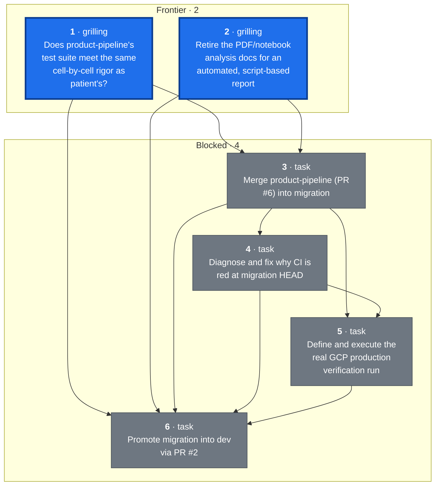
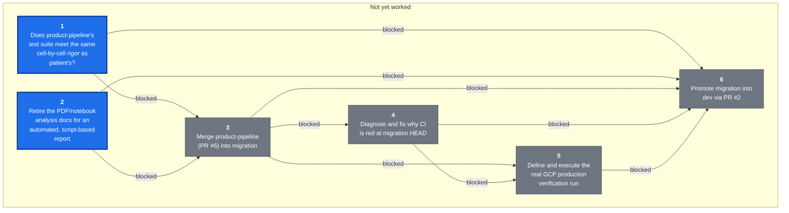

## Destination

`product-pipeline` (PR #6) merged into `migration` with conflicts resolved; the
combined pipeline (patient + product + state management) run for real against
the GCP production bucket, with output landed in BigQuery; every Python/R
difference documented and explicitly decided; CI green; and `migration` merged
into `dev` (PR #2). This prevents promoting a merge that looks clean but was
never exercised as a whole, and prevents documenting or promoting based on
claims ("the intern says it works") rather than verified fact — the migration
is large enough, and detail-sensitive enough, that things get missed unless
checked cell-by-cell.

## The tickets

<!-- graph:start -->

<!-- graph:end -->

## Notes

- Domain: A4D medical tracker data pipeline, R-to-Python migration. See
  [CLAUDE.md](../../CLAUDE.md) and [docs/CLAUDE.md](../CLAUDE.md) for the
  codebase map, and [MIGRATION_GUIDE.md](../migration/MIGRATION_GUIDE.md) for
  the migration's own history (note: the copy on `migration` is stale relative
  to `product-pipeline`'s copy, which claims Phases 0-9 complete — that claim
  is unverified, which is exactly what this map exists to check).
- Standing preference: no notebooks for analysis, ever — write scripts.
  Analysis/reports should be automated and stay in sync with the code, not
  hand-written documents (PDFs, notebooks) that go stale.
- Standing preference: verification means cell-by-cell (shape, columns, exact
  values), not spot-checks — this is why the patient pipeline validation took
  as long as it did (174 trackers), and the product pipeline is held to the
  same bar.
- User sequencing preference: make `product-pipeline` ready first, then merge,
  then make `migration` ready, then promote. Tickets are blocked accordingly
  even where the underlying dependency is looser than the sequencing implies.
- Redraw command: `~/.claude/skills/wayfinder/scripts/render-map.sh docs/wayfinder`

## Where this map stands

Nothing is decided yet — this map was just charted. The frontier is tickets
[Does product-pipeline's test suite meet the same cell-by-cell rigor as
patient's?](tickets/01-product-pipeline-test-rigor.md) and [Retire the
PDF/notebook analysis docs for an automated, script-based report](tickets/02-documentation-strategy.md),
both unblocked. Everything else — the merge, the CI fix, the production run,
and the promotion to `dev` — is blocked behind those two per the user's
sequencing preference.

Key facts already gathered while charting (verified via `git`/`gh`, not
assumed): PR #6 (`product-pipeline` -> `migration`) is open but
`mergeable: CONFLICTING`, with no CI runs and an unchecked test plan. PR #2
(`migration` -> `dev`) is open and mergeable, but CI has failed on `migration`
HEAD for its last 3 runs. `product-pipeline` has a real test suite (41 test
files vs. 26 on `migration`) and detailed, already-written diff documentation
in `PYTHON_IMPROVEMENTS.md` — but that documentation cites an analysis
notebook that isn't in the repo, and its two PDF reports haven't been read yet.

## Decisions so far

(none yet)

## Assumptions in force

(none yet)

## Not yet specified

- Whether the R pipeline (`r-archive/`) gets formally retired/archived-further
  once `migration` reaches `dev`/`main`, and what "official migration"
  communication or cutover steps that implies — out of this map's current
  resolution but likely to surface once the promotion ticket is close.
- Cloud Scheduler / production scheduling cutover (mentioned in the Migration
  Guide's state-management open item) — not yet sharp enough to ticket; may
  turn out to be a separate map entirely once `dev` is reached.

## Out of scope

(none yet)

### The route actually walked

Sessions top to bottom, oldest first. `spawned` and `closed` are causal — what a
decision did to the rest of the map — and are where the real structure lives.

<!-- route:start -->

<!-- route:end -->
