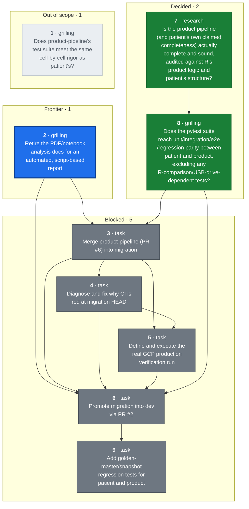
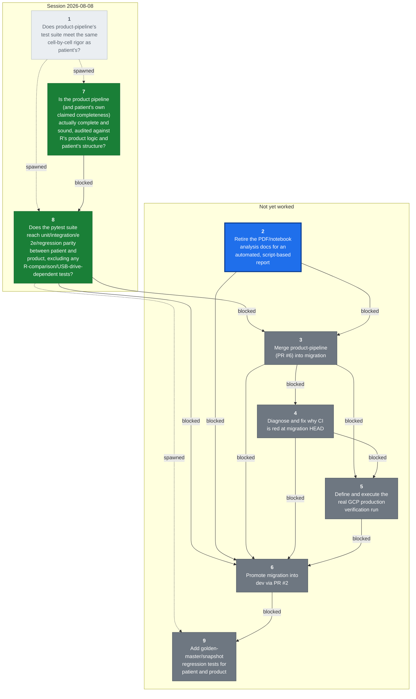

## Destination

`product-pipeline` (PR #6) merged into `migration` with conflicts resolved; the
combined pipeline (patient + product + state management) run for real against
the GCP production bucket, with output landed in BigQuery; every Python/R
difference documented and explicitly decided; CI green; and `migration` merged
into `dev` (PR #2). This prevents promoting a merge that looks clean but was
never exercised as a whole, and prevents documenting or promoting based on
claims ("the intern says it works") rather than verified fact — the migration
is large enough, and detail-sensitive enough, that things get missed unless
checked cell-by-cell.

## The tickets

<!-- graph:start -->

<!-- graph:end -->

## Notes

- **This map carries execution** (overrides wayfinder's plan-only default): once
  a ticket's decision is made — or immediately, for Task-type tickets — the
  same session also implements it, using `tdd` / `systematic-debugging` /
  `executing-plans` (the superpowers skills) where applicable, rather than
  stopping at the decision.
  - Guardrail: commits/pushes to any branch are fine, fully revertable.
  - Guardrail: merging a pull request is a human-only action, never the agent's
    — prepare the merge, stop short of clicking it.
  - Guardrail: triggering the real production GCP run / spending GCP budget is
    the user's job. Read-only GCP access (logs, BigQuery, GCS listings) and
    sandbox/POC runs are fine.
  - Guardrail: the cloud routine's checkout has no GCP credentials and no
    access to the real tracker files (patient/clinic data — sensitive, not
    committed to the repo, not shared with the cloud sandbox). It must work
    only with what's already in the repo (code, fixtures, synthetic test
    data). If a ticket turns out to need real trackers or live GCP auth to
    proceed, it stops and hands that specific piece back to the user to run
    locally — it never fabricates substitute data or asks for real patient
    data to be pasted into the session.
- A daily cloud routine (`a4d-migration-wayfinder-daily`, 9am Europe/Berlin)
  works this map one session at a time — claims the top frontier ticket, does
  what it can autonomously, and posts findings/questions for HITL tickets
  rather than answering them itself. Kept on cloud rather than local
  `launchd` deliberately: it only needs to fetch code and run it, not touch
  sensitive data or production GCP — see guardrails above.
- Domain: A4D medical tracker data pipeline, R-to-Python migration. See
  [CLAUDE.md](../../CLAUDE.md) and [docs/CLAUDE.md](../CLAUDE.md) for the
  codebase map, and [MIGRATION_GUIDE.md](../migration/MIGRATION_GUIDE.md) for
  the migration's own history (note: the copy on `migration` is stale relative
  to `product-pipeline`'s copy, which claims Phases 0-9 complete — that claim
  is unverified, which is exactly what this map exists to check).
- Standing preference: no notebooks for analysis, ever — write scripts.
  Analysis/reports should be automated and stay in sync with the code, not
  hand-written documents (PDFs, notebooks) that go stale.
- Standing preference: verification means cell-by-cell (shape, columns, exact
  values), not spot-checks — this is why the patient pipeline validation took
  as long as it did (174 trackers), and the product pipeline is held to the
  same bar.
- Standing preference (decided in the [test-rigor](tickets/01-product-pipeline-test-rigor.md)
  session): the migration is not 1:1 R-parity. Python may correctly diverge
  from R — R can be wrong. Judge divergence against the original source Excel
  trackers (`a4dphase2_upload` on the test-data drive), not against R's output
  alone. R-vs-Python comparison is *analysis* (a judgment call), not a pytest
  concern — pytest covers unit/integration/e2e/regression only.
- User sequencing preference: make `product-pipeline` ready first, then merge,
  then make `migration` ready, then promote. Tickets are blocked accordingly
  even where the underlying dependency is looser than the sequencing implies.
- Redraw command: `~/.claude/skills/wayfinder/scripts/render-map.sh docs/wayfinder`

## Where this map stands

Three tickets resolved. [Does product-pipeline's test suite meet the same
cell-by-cell rigor as patient's?](tickets/01-product-pipeline-test-rigor.md)
was superseded — it presupposed R-parity was the goal and that patient's
exception-dict pytest pattern was the bar to replicate for product; the user
rejected both, and it split into tickets 7 and 8. [Is the product pipeline
(and patient's own claimed completeness) actually complete and sound, audited
against R's product logic and patient's structure?](tickets/07-pipeline-completeness-audit.md)
is decided (research, read-only): R-logic coverage is essentially
complete on both pipelines, but product has real structural test gaps
(no integration/e2e tests, no coverage of `wide_format.py`, no
`test_tables/test_product.py`) and patient's "174 trackers validated" claim
has no committed record of an actual passing run. Full detail:
[research/07-pipeline-completeness-audit.md](research/07-pipeline-completeness-audit.md).
[Does the pytest suite reach unit/integration/e2e/regression parity between
patient and product, excluding any R-comparison/USB-drive-dependent
tests?](tickets/08-pytest-suite-parity.md) is now decided: parity means an
85%+ coverage floor enforced in CI plus product gaining the three
integration/e2e files it's missing (mirroring patient's existing
fixture/skip-if-missing convention) and `test_tables/test_product.py`;
`test_r_validation.py` leaves pytest entirely, with no product equivalent.
Mid-session the user clarified "regression test" means golden-master/snapshot
testing (fixed input, output snapshotted per stage, diffed on future
changes) rather than R-comparison or edge-case testing — that work doesn't
need real/sensitive data and was split off into [Add golden-master/snapshot
regression tests for patient and product](tickets/09-snapshot-regression-tests.md),
which the user wants deferred until both pipelines' other test suites are in
place and green.

**Ticket 8's decision is not yet implemented** — the actual missing test
files, the CI coverage gate, and removing `test_r_validation.py` from pytest
still need writing. That work effectively is what "make product-pipeline
ready" (the precondition for ticket 3, the merge) requires, so it's the
natural next work whether picked up as this map's next session or folded
into readying the merge.

The frontier is now just [Retire the PDF/notebook analysis docs for an
automated, script-based report](tickets/02-documentation-strategy.md) —
lower priority per the user's own framing on that ticket, but nothing else is
takeable until it closes, since ticket 3 (the merge) is blocked on both
ticket 2 and ticket 8. Ticket 9 (snapshot tests) is blocked on ticket 6
(promotion) by the user's explicit request. Everything else — the merge, the
CI fix, the production run, and the promotion to `dev` — stays blocked per
the user's sequencing preference.

Key facts already gathered while charting (verified via `git`/`gh`, not
assumed): PR #6 (`product-pipeline` -> `migration`) is open but
`mergeable: CONFLICTING`, with no CI runs and an unchecked test plan. PR #2
(`migration` -> `dev`) is open and mergeable, but CI has failed on `migration`
HEAD for its last 3 runs. `product-pipeline` has more test files than
`migration` (41 vs. 26) but no R-comparison pytest for product at all —
`test_r_validation.py` is byte-identical on both branches, patient-only.
`source_vs_output_product.py` is deliberately group-granularity only ("v1"),
not cell-by-cell, per its own docstring. `PYTHON_IMPROVEMENTS.md`'s parity
claims cite a notebook (`Ali_internship/residual_dig.ipynb`, not in the
tracked tree) and a patient-only comparison script — i.e. one-off analysis,
not a repeatable test. Its two PDF reports haven't been read yet.

## Decisions so far

- [Does product-pipeline's test suite meet the same cell-by-cell rigor as
  patient's?](tickets/01-product-pipeline-test-rigor.md) — superseded: R-parity
  isn't the goal (source trackers are the arbiter, not R's output);
  R-vs-Python comparison is analysis, not pytest; neither pipeline's
  completeness has actually been audited yet. Split into tickets 7 and 8;
  ticket 2 now owns the analysis-report side.
- [Is the product pipeline (and patient's own claimed completeness) actually
  complete and sound, audited against R's product logic and patient's
  structure?](tickets/07-pipeline-completeness-audit.md) — decided: R-logic
  coverage is essentially complete function-for-function on both pipelines
  (one diagnostic-only R gap on product); product has real structural test
  gaps (no integration/e2e tests, no `wide_format.py` coverage, no
  `test_tables/test_product.py`, group-granularity-only source-vs-output
  check); patient's "174 trackers validated" claim has genuine test
  infrastructure but no committed record of an actual passing run (CI
  excludes it, USB-drive-gated). Full inventory and gap lists:
  [research/07-pipeline-completeness-audit.md](research/07-pipeline-completeness-audit.md).
- [Does the pytest suite reach unit/integration/e2e/regression parity between
  patient and product, excluding any R-comparison/USB-drive-dependent
  tests?](tickets/08-pytest-suite-parity.md) — decided: parity = 85%+ coverage
  enforced in CI, product gets the three missing integration/e2e files built
  on patient's existing fixture/skip-if-missing convention plus
  `test_tables/test_product.py`; `test_r_validation.py` leaves pytest
  entirely with no product equivalent. "Regression test" was reframed
  mid-session to mean golden-master/snapshot testing (not R-comparison or
  edge-case testing) and split off into
  [Add golden-master/snapshot regression tests for patient and
  product](tickets/09-snapshot-regression-tests.md), deferred until both
  pipelines' other test suites are green.

## Assumptions in force

(none currently — the one assumption this map carried, patient's completeness
being unverified, was confirmed rather than overturned by
[the completeness audit](tickets/07-pipeline-completeness-audit.md) and is now
folded into Decisions so far above.)

## Not yet specified

- Whether the R pipeline (`r-archive/`) gets formally retired/archived-further
  once `migration` reaches `dev`/`main`, and what "official migration"
  communication or cutover steps that implies — out of this map's current
  resolution but likely to surface once the promotion ticket is close.
- Cloud Scheduler / production scheduling cutover (mentioned in the Migration
  Guide's state-management open item) — not yet sharp enough to ticket; may
  turn out to be a separate map entirely once `dev` is reached.
- Patient's own gaps from the completeness audit (no committed record of an
  actual 174-tracker passing run; `PYTHON_IMPROVEMENTS.md` undercounting
  known divergences; no `pipeline/patient.py` unit test) aren't ticketed yet
  — they don't block the merge/promotion path the way product's gaps do, but
  will need a home before the map can call itself done.

## Out of scope

(none yet)

### The route actually walked

Sessions top to bottom, oldest first. `spawned` and `closed` are causal — what a
decision did to the rest of the map — and are where the real structure lives.

<!-- route:start -->

<!-- route:end -->
